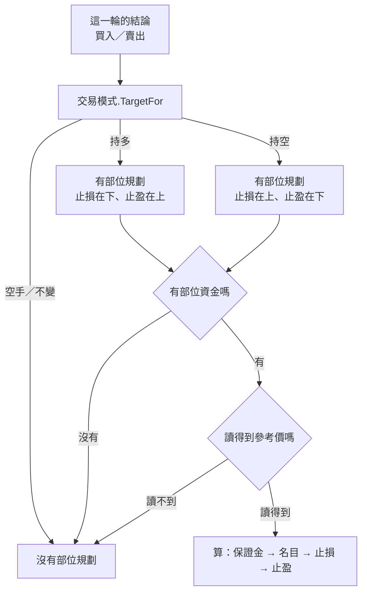

# Product Requirements Document (PRD)

**Status:** Finalized
**Version:** v1.0
**Owner:** James Hsueh
**Stakeholders:** Engineering

---

## 1. Background & Goal (Why & Goal)

### Problem Statement

機器人的訊息講得出**方向**（做多／做空），講不出**多少**。使用者在手機上讀到

> 🔴【做空】早盤突破 · BTCUSDT
> 💰 參考價 64180.5

然後開計算機：我有五萬、想押一成、開三倍、停損放三個百分點。
**那四個乘法他每一次都要重算一遍，而算錯的那一次是真的會虧錢的那一次。**

而他每一次算的**都是同一組數字**——可用資金沒變、押多少的規矩沒變、
槓桿沒變、能忍多少也沒變。變的只有參考價。

### Expected Outcome

- 一台機器人記得一組**部位規劃**：部位資金、倉位大小模式與數值、槓桿倍數、
  停損距離、停利距離。**整組選填。**
- 一輪送出的訊息**自己算完**：開倉金額、名目部位、止損價、止盈價、以及會虧／會賺多少。
- **只有「要開倉」的那一輪才有**——現貨的賣出是出清，沒有東西要押。
- **做空的止損在上面。**
- **沒填部位資金的機器人，訊息與這一刀之前逐字相同。**
- 訊息說得出**這個系統不下單**，也說得出**回測沒把止損止盈算進去**。
- 那一輪的執行紀錄記得住那三個數字。

### Out of Scope

- **讓回測模擬止損止盈**——會改掉每一張既有成績單的數字，另外一整刀。
- **追蹤部位**——這個系統不下單也不知道他開了沒有；每一輪講的是「若現在開」。
- **多台機器人共用一筆錢**——部位資金是每一台各自的。
- **停損距離由策略腳本算**——要開新的算式產出種類，單獨一刀。
- **手續費與滑點**——一概不計，與回測一致。
- **把部位規劃存進交易策略**——它不是規則。

---

## 2. User Personas

**Primary Role:** 機器人的擁有者。他有兩種帳戶（做得了空的、做不了空的），
兩種帳戶裡的錢與能忍的幅度都不同。

**Usage Context:** **在手機上、在做別的事的時候讀這則訊息。**
這是整個切片的設計前提：他不會在那個當下開計算機驗算，
所以**算錯的數字會被照著用**，而**算對的數字會替他省掉每一輪的四個乘法**。

**Tertiary Role:** **時鐘**。每一輪沒有人在場，它讀出那一組設定、算完、送出。

---

## 3. User Stories & Acceptance Criteria

### US-01 — 一台機器人記得一組部位規劃 [priority: P0]

**As a** 機器人的擁有者，**I want** 把資金、押多少、槓桿、停損停利填一次就好，
**so that** 之後每一輪都不必我自己乘。

```gherkin
Scenario: 填完整一組
  Given 我要建一台機器人
  When 我填部位資金 50000、押百分比 10、槓桿 3、停損 3%、停利 5%
  Then 那五樣都跟著這台機器人存起來

Scenario: 整組都不填
  Given 我要建一台機器人
  When 我完全不提部位規劃
  Then 這台機器人存得起來
  And 它沒有部位規劃

Scenario: 只填部位資金
  Given 我要建一台機器人
  When 我只填部位資金 50000
  Then 存得起來,押多少讀作全押——與回測的預設值一字不差

Scenario: 押多少的百分比超過一百
  Given 我要建一台機器人,部位資金 50000
  When 我把押百分比填成 150
  Then 整台被拒絕,措辭與回測那一條一字不差

Scenario: 押多少的固定金額是零
  Given 我要建一台機器人,部位資金 50000
  When 我把固定金額填成 0
  Then 整台被拒絕,措辭與回測一字不差

Scenario: 押多少填了認不得的值
  Given 我要建一台機器人,部位資金 50000
  When 我把押多少填成「當沖」
  Then 整台被拒絕並說出有哪三種,措辭與回測一字不差

Scenario: 槓桿小於一倍
  Given 我要建一台機器人,部位資金 50000
  When 我把槓桿填成 0.5
  Then 整台被拒絕,理由是槓桿不得小於一倍

Scenario: 停損距離是負的
  Given 我要建一台機器人,部位資金 50000
  When 我把停損距離填成 -3
  Then 整台被拒絕,理由是距離不得為負

Scenario: 停損距離超過一百個百分點
  Given 我要建一台機器人,部位資金 50000
  When 我把停損距離填成 120
  Then 整台被拒絕,理由是那會讓止損價變成負數

Scenario: 這一刀之前就存在的機器人
  Given 一台在這個切片之前就建好的機器人
  When 我讀它
  Then 它沒有部位規劃

Scenario: 正在跑的時候改不動
  Given 一台正在執行中的機器人
  When 我只想改它的部位規劃
  Then 修改被拒絕,與改它任何其他欄位一字不差
```

### US-02 — 訊息自己算完要押多少、停在哪裡 [priority: P0]

**As a** 在手機上讀這則訊息的人，**I want** 數字已經算好在上面，
**so that** 我不必在做別的事的時候開計算機。

```gherkin
Scenario: 做多那一輪的四個數字
  Given 部位資金 50000、押百分比 10、槓桿 3、停損 3%、停利 5%
  And 參考價是 64180.5
  When 這一輪判出要做多並送出訊息
  Then 保證金是 5000
  And 名目部位是 15000
  And 止損價是 62255.085
  And 止盈價是 67389.525

Scenario: 做空那一輪,止損在上面
  Given 部位資金 50000、押百分比 10、槓桿 3、停損 3%、停利 5%
  And 參考價是 64180.5
  When 這一輪判出要做空並送出訊息
  Then 保證金是 5000
  And 名目部位是 15000
  And 止損價是 66105.915
  And 止盈價是 60971.475

Scenario: 會虧多少、會賺多少算的是名目
  Given 名目部位 15000、停損 3%、停利 5%
  When 送出訊息
  Then 訊息說會虧 450
  And 訊息說會賺 750

Scenario: 不上槓桿
  Given 部位資金 50000、全押、槓桿沒填、停損 2%
  And 參考價是 100
  When 這一輪判出要做多並送出訊息
  Then 保證金是 50000
  And 訊息裡沒有槓桿那一行,也沒有名目部位那一行
  And 止損價是 98

Scenario: 固定金額就是那個數字
  Given 部位資金 50000、固定金額 8000
  When 這一輪判出要做多並送出訊息
  Then 保證金是 8000

Scenario: 部位資金不夠押下那個固定金額
  Given 部位資金 5000、固定金額 8000
  When 這一輪判出要做多並送出訊息
  Then 訊息說部位資金不足
  And 訊息裡沒有一個算出來的保證金

Scenario: 只填停損
  Given 部位資金 50000、只填停損 3%
  When 送出訊息
  Then 訊息有止損那一行
  And 訊息沒有止盈那一行

Scenario: 只填停利
  Given 部位資金 50000、只填停利 5%
  When 送出訊息
  Then 訊息有止盈那一行
  And 訊息沒有止損那一行
```

### US-03 — 只有要開倉的那一輪才有部位規劃 [priority: P0]

**As a** 使用者，**I want** 出清的那一輪不要跟我講押多少，
**so that** 我不會照著一個沒有意義的數字動作。

```gherkin
Scenario: 現貨的買入要開倉
  Given 一台引用現貨交易策略的機器人,填了部位規劃
  When 這一輪判出買入並送出訊息
  Then 訊息有建議部位
  And 止損價低於參考價

Scenario: 現貨的賣出是出清
  Given 一台引用現貨交易策略的機器人,填了部位規劃
  When 這一輪判出賣出並送出訊息
  Then 訊息沒有建議部位——那是出清,沒有東西要押
  And 訊息其餘每一段照舊

Scenario: 多空反手的賣出要開空倉
  Given 一台引用多空反手交易策略的機器人,填了部位規劃
  When 這一輪判出賣出並送出訊息
  Then 訊息有建議部位
  And 止損價高於參考價

Scenario: 讀不到參考價
  Given 一台填了部位規劃的機器人
  And 系統讀不到這個交易標的的最新 K 線
  When 送出訊息
  Then 訊息沒有建議部位
  And 訊息照現在的做法說讀不到最新 K 線

Scenario: 交易模式讀不出來
  Given 一台機器人引用的交易策略,它的交易模式是一個認不得的值
  When 送出訊息
  Then 訊息沒有建議部位——認不出方向就不替任何人算金額
```

### US-04 — 沒填的那幾台一個字都沒變 [priority: P0]

**As a** 已經在用機器人的使用者，**I want** 我沒動手的那幾台照舊，
**so that** 我不必重新習慣一則我每天都在讀的訊息。

```gherkin
Scenario: 沒有部位規劃的機器人
  Given 一台沒有填部位規劃的機器人
  When 這一輪送出訊息
  Then 整則訊息與這個切片之前逐字相同

Scenario: 現貨機器人填了才看得到金額
  Given 一台引用現貨交易策略的機器人,填了部位資金 50000、全押
  When 這一輪判出買入並送出訊息
  Then 訊息說保證金 50000
  And 訊息裡沒有槓桿那一行
```

### US-05 — 訊息說得出它自己的兩個限制 [priority: P0]

**As a** 照著這則訊息動作的人，**I want** 它把自己沒做到的事講出來，
**so that** 我不會以為系統替我下單了,也不會以為那張成績單驗證過這個停損。

```gherkin
Scenario: 講出這個系統不下單
  Given 一輪有建議部位的訊息
  When 我讀它
  Then 有一行講出這個系統不下單

Scenario: 講出回測沒把止損止盈算進去
  Given 一輪有建議部位的訊息
  When 我讀它
  Then 有一行講出回測沒有把止損止盈算進去

Scenario: 沒有建議部位時不講那兩句
  Given 一輪沒有建議部位的訊息
  When 我讀它
  Then 那兩句都不出現——沒有建議,就沒有要提醒的限制
```

### US-06 — 那一輪的歷史記得住那幾個數字 [priority: P1]

**As a** 三天後回頭看的人，**I want** 那一輪存著當時算出來的數字，
**so that** 我看得懂當時那則為什麼是那個價位——即使我後來改過設定。

```gherkin
Scenario: 有建議部位的一輪
  Given 一輪算出保證金 5000、止損 66105.915、止盈 60971.475
  When 我讀那一輪的執行紀錄
  Then 它記著那三個數字

Scenario: 沒有建議部位的一輪
  Given 一輪沒有建議部位
  When 我讀那一輪的執行紀錄
  Then 那三欄是空的
  And 其餘每一欄與這個切片之前讀起來一樣
```

---

## 4. Business Flow & Logic

### 一輪怎麼算出那幾個數字



### 那四個乘法

以**參考價 `P`**、**部位資金 `C`**、**槓桿 `L`**、**停損距離 `S`%**、**停利距離 `T`%**：

| 要算的 | 怎麼算 |
| :--- | :--- |
| 保證金 | 倉位大小模式套在 `C` 上（全押＝`C`；百分比＝`C × %`；固定金額＝那個數字） |
| 名目部位 | 保證金 × `L`（`L` 沒填即 1） |
| 止損價（持多） | `P × (1 − S%)` |
| 止損價（持空） | `P × (1 + S%)` |
| 止盈價（持多） | `P × (1 + T%)` |
| 止盈價（持空） | `P × (1 − T%)` |
| 會虧多少 | 名目 × `S%` |
| 會賺多少 | 名目 × `T%` |

**每一個數字都用精確小數。** 停損距離與槓桿都乘進金額，所以它們也是精確小數——
用浮點數會讓止損價在第十位上開始飄，而那是一個要拿去掛單的價格。

### Core Business Rules

1. **部位規劃有五樣**：部位資金、倉位大小模式與數值、槓桿倍數、停損距離、停利距離。
2. **部位資金是整組的開關。** 沒填（或零）就是沒有部位規劃，其餘四樣填了也不算。
3. **倉位大小模式沿用回測既有的三種**，取值、預設值（沒填即全押）、
   驗證規則、拒絕的措辭**全部一字不差**，不造第二份。
4. **槓桿不得小於一倍**；沒填即一倍，而一倍時不印槓桿與名目那兩行。
5. **停損／停利距離不得為負，也不得超過一百**（超過會讓價格變成負數）；
   各自沒填就不印那一行。
6. **只有目標倉位是持多或持空的那一輪才有部位規劃。**
   空手（現貨的賣出）與不變（持有）都沒有。
7. **方向決定止損在哪一邊**：持多在下、持空在上。止盈對稱。
8. **讀不到參考價就沒有部位規劃**，不用別的價替代。
9. **交易模式讀不出來就沒有部位規劃**——認不出方向就不算金額。
10. **有建議部位的訊息必須講出兩件事**：這個系統不下單、回測沒把止損止盈算進去。
11. **沒填的機器人，訊息逐字等於這個切片之前。**
12. **執行紀錄存下那一輪算出的三個數字**，沒有建議部位時那三欄是空的。
13. **每一個金額與價格都用精確小數。**

### 沿用的既有規則（不生第二套說法）

| 規則 | 與誰相同 |
| :--- | :--- |
| 倉位大小模式的三種取值、預設值、驗證與拒絕措辭 | 回測的每次開倉押多少 |
| 「押不下去」不是錯誤，是說出來的一種結果 | 回測的 `StakeFor` |
| 這一輪的意見要讓手上變成什麼樣子 | 交易模式的 `TargetFor` |
| 參考價不得稱為成交價或進場價 | 機器人訊息既有規則 |
| 正在跑就改不動 | 機器人既有的修改關卡 |
| 整台拒絕、不部分存檔 | 機器人既有的每一條驗證 |

### Edge Cases

| 情況 | 行為 |
| :--- | :--- |
| 部位資金填了、押多少的固定金額大於它 | 說出「部位資金不足」，**不印一個算出來的保證金**。不是錯誤，不中斷那一輪 |
| 停損距離填 100 | 止損價正好是零（持多）。**允許**——它荒謬但算得出來，而畫一條線在 99 與 100 之間需要一個沒有人給的理由 |
| 停損與停利都沒填 | 只印保證金（與名目）那幾行；那一輪仍然有建議部位 |
| 槓桿填 1 | 不印槓桿與名目——與沒填一字不差 |
| 這一輪判出「打架」 | 不送訊息，與既有一字不差。部位規劃與它無關 |
| 同一份交易策略被三台機器人引用，三台各自填不同的部位規劃 | 三台各算各的——那正是把它放在機器人身上的理由 |
| 改了部位資金之後回頭看三天前那一輪 | 讀到的是**當時**算出來的數字，因為它存在執行紀錄裡 |

---

## 5. UI/UX Design & Interaction

畫面由 `go-trading-frontend` 的對應切片負責。後端只保證：

- 機器人讀回來時**帶著那五樣**，畫面才填得出現值。
- **整組選填**，所以畫面可以把它收在一個「要不要算部位」的區塊裡，
  而不必替每一格想一個預設值。
- 拒絕時**措辭與回測那幾條一字不差**，畫面不必為押多少寫第二套文案。

---

## 6. Non-Functional Requirements

- **相容**：沒填部位規劃的每一台機器人，訊息**逐字相同**、執行紀錄讀起來一樣。
- **相容**：回測的每一條算法一行不改，既有成績單一個數字不變。
- **精確**：金額與價格一律精確小數，不出現浮點數。
- **效能**：一輪不因此多讀任何東西——那五樣跟著機器人本來就讀回來了。
- **安全**：不改變任何既有的可見性規則；別人的機器人仍然回覆「找不到」。

---

## 7. Dependencies & Risks

- **依賴**：`TradingModeDomain.TargetFor` 與 `PositionSizingDomain.StakeFor`
  原樣沿用，不複製第二份。
- **依賴**：交易模式已經是一份交易策略的欄位
  （`2026-09-18-trading-strategy-trading-mode`）。
- **風險（最大的一個）**：**訊息建議的停損，回測從來沒模擬過。**
  使用者會拿著一張「賺 25%」的成績單配一個沒被驗證的停損去跑，
  而那張成績單模擬的是一個沒有停損的策略。
  緩解——**把那一行警告列為驗收項**（US-05），並把「讓回測模擬止損止盈」
  明列為下一刀。
- **風險**：做空的止損寫反了看起來完全正常。
  緩解——做多與做空各一條獨立驗收項，且**寫出實際數字**（US-02）。
- **風險**：改動的是每一則機器人訊息都會走到的那條路。
  緩解——「沒填的那幾台逐字不變」列為獨立驗收項（US-04）。

---

## 8. Appendix

- `.sdd/2026-09-18-strategy-bot-position-plan/BRIEF.md`
- `.sdd/2026-09-18-trading-strategy-trading-mode/PRD.md`——交易模式與訊息措辭的出處
- `.sdd/2026-09-17-backtest-trading-mode/PRD.md`——`TargetFor` 與那張目標倉位表的出處
- `.sdd/2026-09-05-strategy-script-backtest/PRD.md`——倉位大小模式三種取值的出處
- `.sdd/2026-09-16-strategy-bot/PRD.md`——機器人訊息與執行紀錄的出處
- `.sdd/UL-MAP.md`——新增七個詞彙的定義
