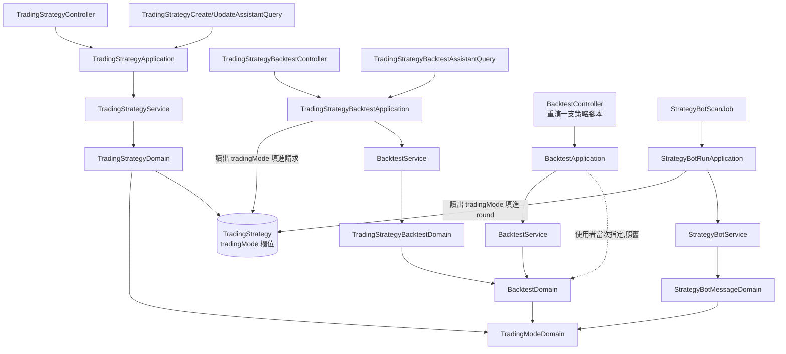

# 交易策略的交易模式 — Architecture Design

**Status:** Confirmed
**Source PRD:** `.sdd/2026-09-18-trading-strategy-trading-mode/PRD.md`
**Tech context:** Go · Clean / Onion Architecture · Gin · GORM（code-first）· PostgreSQL

---

## 1. Design Goal & Guiding Principle

**In one sentence：** 把交易模式從「一次回測的參數」變成「一份交易策略的欄位」，
而讀出一個交易模式的規則、以及它對倉位的那個答案，一行都不複製。

**Guiding principle：** `TradingModeDomain` 已經是那個概念的唯一所在地，
這一刀**只多給它一個提問者、再多問它兩個問題**。

它今天回答的是「這一棒的意見要讓帳戶變成什麼」（`TargetFor`）。
這一刀多問兩個：**「你能做空嗎」**（`CanGoShort`）與**「你叫什麼」**（`InWords`）。
兩個都是關於交易模式本身的事實，所以都住在它身上；
而「一則訊息要怎麼措辭」仍然是訊息的事，留在 `StrategyBotMessageDomain`。

**為什麼不是給訊息開兩個實作／一個介面。**
`.claude/rules/architecture.md` 明訂「不為 Domain Model 定義介面，也不用介面做繼承」。
而 `TradingModeDomain` 與 `PositionSizingDomain` 已經替同類問題定了型：
**一個 enum ＋ 一個模型，內部依取值分流**。訊息照同一個形狀寫。

**唯一的結構性決定：請求裡不留那個欄位。**
重演一份交易策略的請求（HTTP 與助手）**刪掉** `tradingMode`，
不是留著它然後拒絕。這與交易策略請求「沒有擁有者欄位」是同一個做法，
理由也一字不差：一個形狀說不出的謊，不必每個讀程式的人都記得那裡有一道檢查。
助手那條路因為 `additionalProperties:false` 甚至變成硬拒絕，不必額外做事。

---

## 2. Change Scope

| Area | Action | What / Why |
| :--- | :--- | :--- |
| `entities.TradingStrategy` | **Modify** | 多一個 `TradingMode string`，`default:'longShort'`。**既有的每一列因此自動讀作多空反手**，不必寫任何搬遷程式 |
| `domains.TradingModeDomain` | **Modify** | 多兩個問題：`CanGoShort()`（能不能做空——兩種模式差別的本體）、`InWords()`（這個模式的中文名）。建構子的**錯誤改為只帶那句話**，不再自己包成回測的拒絕 |
| `domains.BacktestDomain` | **Modify** | 收到那句話之後自己包成 `BacktestValidationFailure(BacktestTradingModeField, …)`。**對外措辭一字不差** |
| `domains.TradingStrategyDomain` | **Modify** | 多持有一個 `TradingModeDomain`，建構時驗證；拒絕包成 `ErrTradingStrategyValidation`，與它既有的每一條驗證同一個沿襲 |
| `dto.TradingStrategyWriteDto` | **Modify** | 多一個 `TradingMode string`（照宣告原樣傳，讀它是 domain 的事） |
| `dto.TradingStrategyDto` | **Modify** | 多一個 `TradingMode string`（`json:"tradingMode"`），畫面才填得出現值 |
| `models.TradingStrategyRequest` | **Modify** | 多一個 `tradingMode` JSON 欄位，`ToWriteDto` 帶下去 |
| `assistantqueries.tradingStrategyWriteAssistantArguments` | **Modify** | 同上；`tradingStrategyWriteArgumentSchema` 多一筆 enum 與說明（**不列入 required**——不給就是預設） |
| `dto.TradingStrategyBacktestRequestDto` | **Keep** | `TradingMode` 留著，但**改由 application 從那份交易策略填**，不再從請求來 |
| `models.TradingStrategyBacktestRequest` | **Modify** | **刪掉** `tradingMode`。形狀本身說不出那句話 |
| `assistantqueries.tradingStrategyBacktestAssistantArguments` | **Modify** | **刪掉** `TradingMode`、schema 刪掉那一筆、說明改成「由那份交易策略決定，這裡給不了」 |
| `application.TradingStrategyBacktestApplication` | **Modify** | `requestDto.TradingMode = tradingStrategyDto.TradingMode`，緊接在它已經在抄的兩棵條件樹旁邊 |
| `dto.StrategyBotRoundDto` | **Modify** | 多一個 `TradingMode string`：一輪要被寫成訊息，訊息的措辭取決於它 |
| `application.StrategyBotRunApplication` | **Modify** | 組 round 時多抄一行 `TradingMode: tradingStrategyDto.TradingMode`——它手上本來就有那份交易策略 |
| `domains.StrategyBotMessageDomain` | **Modify** | 建構時讀出交易模式；標題的動詞依「能不能做空」二選一，能做空時多一行講出模式。**現貨那一條路逐字不變** |
| `models.BacktestRequest`／`domains.BacktestDomain` 的腳本回測路徑 | **Not touched** | 那條路沒有交易策略可問，照舊由使用者當次指定 |
| `vo.TradingModeVo`／`vo.TargetPositionVo` | **Not touched** | 取值一個都不加 |
| `vo.SignalVo`／`domains.SignalDomain` | **Not touched** | 信號仍然只有三種。做多／做空是**訊息的措辭**，不是第四、第五種信號 |
| `domains.BacktestAccountDomain`／`BacktestSimulationDomain` | **Not touched** | 拿到模式之後做什麼，一行不改 |
| `domains.StrategyBotVerdictDomain` | **Not touched** | 怎麼判出結論與模式無關 |
| `entities.StrategyBotRunRecord` | **Not touched** | 這一刀不產生金額與停損價，沒有東西要記 |
| 交易策略的修改關卡（有機器人在跑就改不動）、可見性、名稱唯一 | **Not touched** | 新欄位自動被既有關卡涵蓋——它們擋的是整份寫入 |

---

## 3. New Classes / Modules

**沒有新型別。** 這一刀全部落在既有模型上，而那正是它該有的樣子：
交易模式這個概念早就有一個家，新增一個同義的型別只會製造第二個答案。

### `TradingModeDomain` 新增的兩個問題

```go
// CanGoShort 是兩種模式差別的本體：這一套規矩做不做得了空。
// 零值（沒有經過建構子的）答不能——與 TargetFor 對零值答「不變」同一條規矩：
// 認不出來時不要替任何人猜方向。
func (tradingModeDomain TradingModeDomain) CanGoShort() bool

// InWords 是這個模式給人讀的名字。
func (tradingModeDomain TradingModeDomain) InWords() string
```

> **為什麼是 `CanGoShort` 而不是 `RestatesVerdicts`／`NeedsDirectionWording`。**
> 後兩個名字描述的是**訊息想拿它來做什麼**，而不是**交易模式是什麼**。
> 訊息會換、會多一種寫法、會改措辭；「這套規矩能不能做空」不會。
> 把提問者的用途寫進被問者的方法名，是下一個用途出現時必須改名的那種設計。

### 建構子的錯誤改為「只帶那句話」

```go
// 之前：return TradingModeDomain{}, BacktestValidationFailure(BacktestTradingModeField, "交易模式只能是…")
// 之後：return TradingModeDomain{}, fmt.Errorf("交易模式只能是 %s 其中之一", …)
```

交易模式現在有**兩個**提問者，而兩者的拒絕各有自己的沿襲：
回測包成 `BacktestValidationFailure`（帶得出欄位名，控制器據此分流 400），
交易策略包成 `ErrTradingStrategyValidation`（它既有的每一條驗證都是這個）。
**那句話本身只寫一次**，包裝由各自的世界負責：

```go
// BacktestDomain
tradingMode, tradingModeError := NewTradingModeDomain(requestDto.TradingMode)
if tradingModeError != nil {
    return BacktestDomain{}, BacktestValidationFailure(
        BacktestTradingModeField, tradingModeError.Error())
}
```

`backtestFieldError.Error()` 印的是 `"backtest validation failed: <reason>"`，
而 reason 正是那句話原文——**對外措辭與這一刀之前逐字相同**。

---

## 4. Modified Components

| Component | Current role | Change needed |
| :--- | :--- | :--- |
| `entities.TradingStrategy` | 乾淨的資料模型 | 多一欄＋帶 DB 預設值。`ToDto` 多抄一行 |
| `TradingStrategyDomain` | 一份交易策略的全部不變量 | 多持有一個 `TradingModeDomain`，`ToEntity` 多抄一行。驗證位置放在**名稱之後、信號來源之前**：它與名稱同屬「這份交易策略是什麼」，而來源與條件是「它由什麼組成」 |
| `StrategyBotMessageDomain` | 把一輪寫成一則訊息 | 建構時讀出模式；`Text()` 的標題動詞二選一，能做空時多一行。多一個 `directionInWords`，與既有的 `signalInWords` 並排 |
| `TradingStrategyBacktestApplication` | 編排一次交易策略回測 | 多抄一行交易模式，與它已經在抄的兩棵條件樹並排 |
| `StrategyBotRunApplication` | 跑一輪 | 組 round 時多抄一行 |
| `TradingStrategyBacktestAssistantQuery` | 助手的回測能力 | 參數、schema 各刪一處，說明改一句 |
| `tradingStrategyWriteArgumentSchema` | 助手的建策略參數表 | 多一筆 enum 與說明 |

### `StrategyBotMessageDomain` 改寫後的形狀

```go
type StrategyBotMessageDomain struct {
    round       dto.StrategyBotRoundDto
    tradingMode TradingModeDomain
}

// 讀不出來的模式讀作「沒有模式」——零值答不能做空，
// 於是訊息退回引述信號自己的話、且不指名任何模式。
// 這與標題那個顏色記號對認不得的結論給中性色是同一條規矩：
// 訊息是最後一個該替人猜方向的地方。
func NewStrategyBotMessageDomain(round dto.StrategyBotRoundDto) StrategyBotMessageDomain
```

`Text()` 只有兩處分叉：

```
標題動詞 := 能做空 ? directionInWords(結論) : signalInWords(結論)
…參考價兩行（兩種模式一字不差）…
能做空 → 多一行「⚙️ 交易模式 <InWords()>」
…「各來源怎麼說」整段（兩種模式一字不差，永遠寫信號）…
```

**現貨走的是「都不成立」那一條路**，於是它產出的字串與這一刀之前**逐字相同**——
US-05 因此不是一個要另外維護的相容性承諾，而是這個形狀的必然結果。

---

## 5. Component Relationships



**四個提問者，一個答案的所在地。** 建立／修改、重演一份交易策略、機器人的一輪
都從那一個欄位取值；重演一支策略腳本仍然由使用者當次指定。
四條路最後都問同一個 `TradingModeDomain`，所以取值、預設值、
大小寫寬容度與那句拒絕的話**只有一份**。

---

## 6. Traceability

| PRD Scenario | Component |
| :--- | :--- |
| 建立現貨／多空反手交易策略 | `TradingStrategyDomain` → `NewTradingModeDomain` → `entities.TradingStrategy.TradingMode` |
| 完全沒填／留白 → 多空反手 | `NewTradingModeDomain`（空字串分支，未改動） |
| 大寫 `SPOT` → 現貨 | `NewTradingModeDomain`（`EqualFold`，未改動） |
| 認不得的值 → 整份拒絕並列出兩種 | `NewTradingModeDomain` 那句話 ＋ `TradingStrategyDomain` 包成 `ErrTradingStrategyValidation` |
| 改掉交易模式 | 同一個建構子（建立與修改同一條路，未改動） |
| 修改時填錯，措辭與建立一字不差 | 同上——同一個建構子，不是第二套規則 |
| 有機器人在跑時改不動 | 交易策略既有的修改關卡（未改動） |
| 切片前建立的交易策略讀作多空反手 | `entities.TradingStrategy` 的 `default:'longShort'` |
| 切片前建立的交易策略重演結果不變 | 同上 → `TradingStrategyBacktestApplication` 填進請求 |
| 現貨交易策略自動照現貨重演 | `TradingStrategyBacktestApplication` 多抄的那一行 |
| 請求裡硬塞交易模式等於沒塞 | `models.TradingStrategyBacktestRequest` 已無該欄位 |
| 助手不必也不能指定交易模式 | `tradingStrategyBacktestAssistantArguments` 已無該欄位 |
| 助手硬給會被自己的參數關卡擋下 | `ArgumentSchema()` 的 `additionalProperties:false`（未改動） |
| 助手看得懂交易模式現在從哪裡來 | `TradingStrategyBacktestAssistantQuery.Description()` |
| 改掉模式後重演數字跟著變（12,000／15,000） | 同一個 `BacktestAccountDomain`（未改動）＋不同的來源 |
| 重演一支策略腳本：指定／沒講／講錯 | `models.BacktestRequest` ＋ `NewBacktestDomain`（皆未改動語意） |
| 現貨機器人訊息逐字不變 | `StrategyBotMessageDomain` 的「都不成立」那條路 |
| 多空反手機器人寫做多／做空 | `TradingModeDomain.CanGoShort()` → `directionInWords` |
| 訊息講得出交易模式 | `TradingModeDomain.InWords()` |
| 各來源怎麼說仍然寫信號 | `signalInWords`（未改動，且兩種模式共用） |
| 讀不到參考價時兩種模式一字不差 | 參考價那兩行不在任何分叉裡 |

---

## 7. Extensibility & Handoff Notes

- **Most likely next requirement：合約的開倉金額與止盈止損。**
  **Where it lands：** `dto.StrategyBotRoundDto` 多幾個欄位、
  `StrategyBotMessageDomain` 在「能做空」那條路上多幾行、
  以及一個新的模型負責把資金與百分比算成價位。
  **關鍵：那些數字的原料不屬於交易策略**——交易策略是規則，不是某個人的錢包。
  它們該落在機器人身上，或落在一個新的「帳戶設定」上。
  這一刀刻意沒有在交易策略上開那些欄位，就是為了不替下一刀先做錯決定。

- **第二可能：第三種交易模式（只做空）。**
  **Where it lands：** `vo.TradingModeVo` 多一個取值、
  `TargetFor`／`CanGoShort`／`InWords` 各多一列。訊息、回測、控制器一個字都不必動。
  三個方法都**逐一列出每一種模式、沒有 fall-through**，
  所以漏掉一個的後果是「什麼都不做」而不是「悄悄照另一種算」。

- **第三可能：機器人的輪次記錄要記下當時的交易模式。**
  **Where it lands：** `entities.StrategyBotRunRecord` 多一欄。
  值得做的時機是「使用者改了交易策略的模式，回頭看不懂三天前那則訊息為什麼那樣寫」。

- **刻意不做的事：讓機器人自己覆寫交易模式。**
  一台機器人若能改寫它引用的那份交易策略的模式，那個模式就有兩個答案，
  而「上一輪用的是哪一個」沒有人說得出來——與「執行中的機器人改不動規則」同一條理由。

- **給下一位的提醒：** `directionInWords` 與 `signalInWords` 看起來像同一個函式的兩種語言，
  其實不是。`signalInWords` 翻譯的是**策略腳本講的話**（永遠三種），
  `directionInWords` 翻譯的是**使用者要做的動作**。
  把它們合成一個，「各來源怎麼說」那一段就會跟著標題一起改寫成做多／做空——
  而那等於謊稱那幾支腳本講了它們沒講的話，也讓讀訊息的人再也無法回推結論是怎麼來的。

---

## 8. Appendix

- `.sdd/2026-09-18-trading-strategy-trading-mode/PRD.md`
- `.sdd/2026-09-17-backtest-trading-mode/ARCH.md`——`TradingModeDomain` 的出處與形狀
- `.sdd/2026-09-17-trading-strategy/ARCH.md`——交易策略的寫入路徑
- `.sdd/2026-09-16-strategy-bot/ARCH.md`——機器人訊息的出處
- `.claude/rules/architecture.md`——「Domain Model 不是介面抽象」、「行為住在它操作的資料旁邊」
