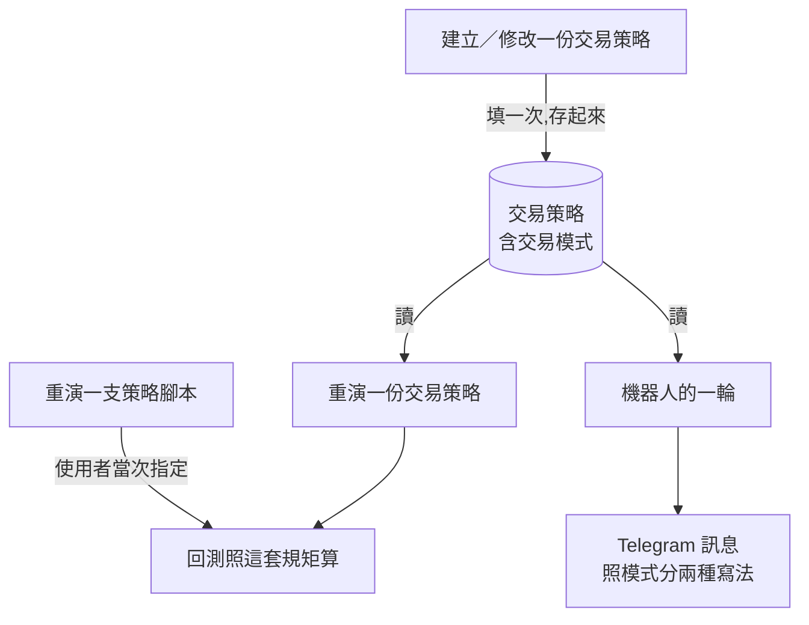

# Product Requirements Document (PRD)

**Status:** Finalized
**Version:** v1.0
**Owner:** James Hsueh
**Stakeholders:** Engineering

---

## 1. Background & Goal (Why & Goal)

### Problem Statement

回測認得兩套操作規矩——**多空反手**（永遠在市場裡，賣出就反手做空）與
**現貨**（只做多，賣出就平倉回現金）。但那個選擇**只跟著一次回測走**，
不寫回任何地方。於是留下兩個洞。

**洞一：每一次都要問，而答案每一次都一樣。**
一套規則是寫給**哪一種帳戶**的，是它被寫下來的那一刻就決定的事。
台股現貨帳戶不能放空，昨天不能、今天不能、下個月也不能。
可是每一次重演，系統都要使用者再回答一次，而**預設值還是他答不對的那一個**——
忘了挑，就拿到一張照著他做不到的操作算出來的成績單，而且沒有任何東西會告訴他。

**洞二：機器人不知道有這件事。**
機器人判出結論後送出的訊息永遠只有一種寫法：`【賣出】`。
但「賣出」在兩種帳戶裡是兩個不同的動作——現貨帳戶是「賣掉，錢收回來」，
可做空的帳戶是「開一個空倉」。使用者得在腦子裡自己換算，
而換算錯的那一次，是真的會虧錢的那一次。

### Expected Outcome

- 一份交易策略**記得自己的交易模式**：現貨或多空反手，二選一，建立時給、修改時可改。
- **沒填即多空反手**，與回測既有的預設值一字不差；**認不得的值整份拒絕**並列出兩種。
- **既有的每一份交易策略一律讀作多空反手**，既有的成績單一個數字都不變。
- **重演一份交易策略時不必也不能給交易模式**——它由那份交易策略決定。
- **重演一支策略腳本那條路一個字都不改**：沒有交易策略可問，使用者自己講。
- 機器人的訊息按模式分兩種：**現貨逐字不變**；
  **多空反手把結論寫成做多／做空**，並講出這份交易策略的交易模式。
- **「各來源怎麼說」那一段兩種模式都不變**——那是腳本的證詞，信號仍然只有三種。

### Out of Scope

- **要多少錢開合約**——需要資金、倉位大小模式與槓桿，那是帳戶的事，不是規則的事。
- **止盈止損**——同上，且還缺一個更根本的答案（人填的百分比，還是腳本算出來的輸出）。
- **加寬機器人的輪次記錄**——這一刀不產生金額與停損價，沒有東西要記。
- **第三種交易模式**（只做空）——沒有人開口要。
- **把交易模式存進策略腳本**——一支腳本吐一個信號就結束，怎麼解讀是規則的事。
- **改變回測的任何一條算法**——只改「交易模式從哪裡來」。
- **替既有的交易策略猜它其實是現貨**——一律多空反手，不猜。

---

## 2. User Personas

**Primary Role:** 已登入的使用者，自己每一份交易策略、每一台機器人的擁有者。
其中相當一部分**手上的帳戶不能放空**——這正是洞一存在的理由。

**Secondary Role:** **助手**。它替使用者建交易策略、發動回測、讀成績單再調整。
它做的每一件事都以**委託它的那位使用者**的身分進行。

**Tertiary Role:** **時鐘**。機器人的每一輪沒有人在場，
它讀出這份交易策略的交易模式，決定訊息要怎麼寫。

**Usage Context:** 建交易策略是「坐下來想清楚」的動作，交易模式在那時候填一次；
讀機器人訊息是**在手機上、在做別的事的時候**——所以訊息的第一行必須直接是他要做的動作，
不能是一個需要換算的詞。

---

## 3. User Stories & Acceptance Criteria

### US-01 — 一份交易策略記得它是寫給哪一種帳戶的 [priority: P0]

**As a** 使用者，**I want** 把交易模式存在交易策略身上，
**so that** 我不必每次重演都重講一次同一個答案。

```gherkin
Scenario: 建立一份現貨交易策略
  Given 我要建立一份交易策略
  When 我把交易模式填成現貨
  Then 這份交易策略存起來了
  And 我讀回它時交易模式是現貨

Scenario: 建立一份多空反手交易策略
  Given 我要建立一份交易策略
  When 我把交易模式填成多空反手
  Then 我讀回它時交易模式是多空反手

Scenario: 完全沒填交易模式
  Given 我要建立一份交易策略
  When 我沒有提到交易模式
  Then 這份交易策略存成多空反手,與回測既有的預設值一字不差

Scenario: 交易模式留白
  Given 我要建立一份交易策略
  When 我把交易模式填成空白
  Then 這份交易策略存成多空反手

Scenario: 交易模式大小寫與系統寫法不同
  Given 我要建立一份交易策略
  When 我把交易模式填成大寫的 SPOT
  Then 這份交易策略存成現貨

Scenario: 交易模式是一個認不得的值
  Given 我要建立一份交易策略
  When 我把交易模式填成「當沖」
  Then 整份交易策略被拒絕,理由說出交易模式只能是多空反手或現貨
  And 什麼都沒有被存下來

Scenario: 改掉一份交易策略的交易模式
  Given 我有一份現貨交易策略
  When 我把它改成多空反手
  Then 我讀回它時交易模式是多空反手

Scenario: 修改時填了認不得的值
  Given 我有一份現貨交易策略
  When 我把它的交易模式改成「當沖」
  Then 整份修改被拒絕,措辭與建立時一字不差
  And 原本存著的那一份一個欄位都沒有變

Scenario: 有機器人正在跑時改不動
  Given 我有一份交易策略,並且有一台機器人正在用它跑
  When 我只想改它的交易模式
  Then 修改被拒絕並說出是哪幾台在跑,與改它任何其他欄位一字不差
```

### US-02 — 這一刀之前存在的交易策略讀作多空反手 [priority: P0]

**As a** 已經在用這個系統的使用者，**I want** 我手上那幾份交易策略的行為不變，
**so that** 我既有的成績單不會在我沒動手的情況下變樣。

```gherkin
Scenario: 讀一份切片前建立的交易策略
  Given 我有一份在這個切片之前就建立的交易策略
  When 我讀它
  Then 它的交易模式是多空反手

Scenario: 重演一份切片前建立的交易策略
  Given 我有一份在這個切片之前就建立的交易策略
  When 我重演它
  Then 照多空反手重演,成績單與這個切片之前完全相同
```

### US-03 — 重演一份交易策略時不必再講交易模式 [priority: P0]

**As a** 帳戶不能放空的使用者，**I want** 重演我的交易策略時自動照現貨算，
**so that** 我不會因為忘記挑而拿到一張我做不到的成績單。

```gherkin
Scenario: 現貨交易策略自動照現貨重演
  Given 我有一份現貨交易策略
  When 我重演它,完全沒有提到交易模式
  Then 照現貨重演,不是照預設的多空反手

Scenario: 多空反手交易策略照多空反手重演
  Given 我有一份多空反手交易策略
  When 我重演它
  Then 照多空反手重演

Scenario: 請求裡沒有交易模式這個欄位
  Given 我有一份現貨交易策略
  When 我重演它,並在請求裡硬塞一個交易模式說要多空反手
  Then 照現貨重演——那個欄位不存在,塞了等於沒塞

Scenario: 助手也不必講交易模式
  Given 我有一份現貨交易策略
  When 助手替我重演它
  Then 照現貨重演,助手不必也不能指定交易模式

Scenario: 助手硬要給交易模式會被自己的參數關卡擋下
  Given 助手手上有重演一份交易策略這件能力
  When 它在參數裡放進一個交易模式
  Then 那個參數不在這件能力的參數表裡,而參數表不收多餘欄位

Scenario: 助手看得懂交易模式現在從哪裡來
  Given 助手手上有重演一份交易策略這件能力
  When 它讀這件能力的說明
  Then 說明講得出交易模式由那份交易策略決定,這裡給不了
  And 說明講得出使用者說他的帳戶不能放空時,該去改那份交易策略

Scenario: 改掉交易模式之後重演的數字跟著變
  Given 一份交易策略,初始資金 10,000、每次全押
  And 這段歷史第 1 棒收盤 100 說買入、第 2 棒收盤 120 說賣出、第 3 棒收盤 90 說持平
  When 我把它設成現貨並重演
  Then 最後剩下 12,000
  When 我把它改成多空反手並重演同一段
  Then 最後剩下 15,000
```

### US-04 — 重演一支策略腳本那條路一個字都沒變 [priority: P0]

**As a** 正在試一段剛寫好的算式的使用者，**I want** 那條路照舊，
**so that** 沒有交易策略可以問的時候,我仍然講得出這一次要怎麼算。

```gherkin
Scenario: 重演一支策略腳本仍然自己講交易模式
  Given 我要重演一支策略腳本
  When 我把交易模式指定為現貨
  Then 照現貨重演

Scenario: 重演一支策略腳本沒講交易模式
  Given 我要重演一支策略腳本
  When 我沒有提到交易模式
  Then 照多空反手重演

Scenario: 重演一支策略腳本講了認不得的值
  Given 我要重演一支策略腳本
  When 我把交易模式指定為「當沖」
  Then 整次回測被拒絕,措辭與這個切片之前一字不差
```

### US-05 — 現貨機器人的訊息一個字都沒變 [priority: P0]

**As a** 現貨帳戶的使用者，**I want** 我的機器人訊息照舊，
**so that** 我不必重新習慣一則我每天都在讀的訊息。

```gherkin
Scenario: 現貨機器人判出買入
  Given 我的機器人引用一份現貨交易策略
  When 這一輪判出買入並送出訊息
  Then 標題寫「買入」
  And 整則訊息與這個切片之前逐字相同

Scenario: 現貨機器人判出賣出
  Given 我的機器人引用一份現貨交易策略
  When 這一輪判出賣出並送出訊息
  Then 標題寫「賣出」
  And 整則訊息與這個切片之前逐字相同
```

### US-06 — 多空反手機器人的訊息講我真正要做的動作 [priority: P0]

**As a** 做得了空的使用者，**I want** 訊息直接告訴我開多還是開空，
**so that** 我在手機上讀到它的時候不必自己換算。

```gherkin
Scenario: 多空反手機器人判出買入
  Given 我的機器人引用一份多空反手交易策略
  When 這一輪判出買入並送出訊息
  Then 標題寫「做多」,不是「買入」

Scenario: 多空反手機器人判出賣出
  Given 我的機器人引用一份多空反手交易策略
  When 這一輪判出賣出並送出訊息
  Then 標題寫「做空」,不是「賣出」

Scenario: 訊息講得出這份交易策略的交易模式
  Given 我的機器人引用一份多空反手交易策略
  When 這一輪送出訊息
  Then 訊息裡有一行講出交易模式是多空反手

Scenario: 各來源怎麼說那一段仍然是信號
  Given 我的機器人引用一份多空反手交易策略
  And 來源 A 說買入、來源 B 說持有,結論是買入
  When 這一輪送出訊息
  Then 那兩行仍然寫「買入」與「持有」
  And 標題寫「做多」

Scenario: 讀不到參考價時兩種模式說法一樣
  Given 我的機器人引用一份多空反手交易策略
  And 系統讀不到這個交易標的的最新 K 線
  When 這一輪送出訊息
  Then 那一行的說法與現貨模式一字不差

Scenario: 切片前建立的交易策略走多空反手那一種寫法
  Given 我的機器人引用一份在這個切片之前就建立的交易策略
  When 這一輪判出賣出並送出訊息
  Then 標題寫「做空」
```

---

## 4. Business Flow & Logic

### 交易模式從哪裡來



**兩個來源，各管一條路。** 有交易策略可問的就問它（重演一份交易策略、機器人），
沒有交易策略的那條路（重演一支策略腳本）維持由使用者當次指定。
兩條路**共用同一組取值、同一個預設值、同一句拒絕的話**，
因為讀出一個交易模式的規則只寫在一個地方。

### 訊息的兩種寫法

| 訊息的部位 | 現貨 | 多空反手 |
| :--- | :--- | :--- |
| 標題的動詞（結論是買入） | `買入` | **`做多`** |
| 標題的動詞（結論是賣出） | `賣出` | **`做空`** |
| 標題的顏色記號 | 🟢／🔴，照結論 | **一字不差** |
| 機器人名稱與交易標的 | 照舊 | **一字不差** |
| 參考價那兩行（含讀不到時的說法） | 照舊 | **一字不差** |
| 交易模式那一行 | **沒有這一行** | **多一行,講出交易模式** |
| 「各來源怎麼說」整段 | 照舊，寫信號 | **一字不差，仍然寫信號** |

### Core Business Rules

1. **交易模式是交易策略的一個欄位**，與名稱、信號來源、兩棵條件樹同一個層級：
   建立時給、修改時可改、跟著它存起來。
2. **取值二選一：多空反手、現貨。** 沒有第三種，與回測的取值**完全同一組**。
3. **沒填即多空反手。** 留白、未填一律讀作多空反手。
   預設值的職責是讓舊的東西繼續成立。
4. **認不得的值整份拒絕**，並說出有哪兩種。**不默默退回預設**——
   退回去的話，使用者會拿著一份性質與他以為的不一樣的交易策略去上線。
   這與回測認不得時的做法是同一條理由。
5. **大小寫寬容度沿用回測既有的那一套**，不另立一種。
6. **既有的交易策略一律讀作多空反手**——它們當初就是照那一套被回測的。
7. **重演一份交易策略時，交易模式來自那份交易策略。**
   請求（HTTP 與助手）**沒有這個欄位**，與請求沒有擁有者同一個做法。
8. **重演一支策略腳本那條路完全不變**：使用者當次指定，沒講就是多空反手，
   認不得就整次拒絕。
9. **機器人的訊息照它引用的那份交易策略的交易模式分兩種寫法**，
   現貨那一種**逐字等於這個切片之前**。
10. **「各來源怎麼說」永遠寫信號**（買入／賣出／持有），兩種模式都一樣。
    那是腳本的證詞，不是使用者的動作。
11. **信號仍然只有三種取值。** 做多／做空是**訊息的措辭**，不是第四、第五種信號。

### 沿用的既有規則（不生第二套說法）

| 規則 | 與誰相同 |
| :--- | :--- |
| 取值、預設值、大小寫寬容度、拒絕時列出選項 | 回測的交易模式 |
| 認不得的值就整份拒絕 | 交易策略既有的每一條驗證 |
| 有機器人在跑就改不動 | 交易策略既有的修改關卡 |
| 請求裡沒有這個欄位 | 交易策略請求沒有擁有者 |
| 看不到的交易策略回覆「找不到」 | 交易策略既有的可見性規則 |

### Edge Cases

| 情況 | 行為 |
| :--- | :--- |
| 同一份交易策略被三台機器人引用，改掉它的交易模式 | 三台下次醒來的訊息都換成新的寫法——那正是共用的用處 |
| 交易模式填的是認不得的值，同時名稱也空白 | 照交易策略既有的驗證順序報出第一個撞到的；兩者都整份拒絕，沒有部分存檔 |
| 機器人這一輪判出的結論是「打架」（買賣同時成立） | 不送訊息，與這個切片之前一字不差；交易模式與它無關 |
| 多空反手機器人這一輪讀不到參考價 | 照實說讀不到，那一行與現貨一字不差 |
| 重演一份交易策略，而那份的交易模式在資料庫裡是個認不得的值 | 不可能發生——存的時候已經擋掉了。真的發生時照回測既有的拒絕處理，不另生一套 |
| 一份交易策略設成現貨，但它的機器人盯的是可做空的市場 | 系統不管市場做不做得到；交易模式講的是**這套規則的意思**，不是市場的能力 |

---

## 5. UI/UX Design & Interaction

畫面由 `go-trading-frontend` 的對應切片負責。後端只保證：

- 交易策略讀回來時**帶著它的交易模式**，畫面才填得出那個選項的現值。
- 重演一份交易策略的請求**沒有交易模式這個欄位**，
  畫面因此不必畫那個選項，也不必決定預設選哪一個。
- 重演一支策略腳本的請求**照舊有這個欄位**，那個畫面一個字都不必改。
- 拒絕時**說得出現在有哪兩種**，畫面不必自己維護一份選項清單。

---

## 6. Non-Functional Requirements

- **相容**：這個切片之前建立的每一份交易策略，重演的結果與之前**完全相同**——
  同樣的成績單、同樣的交易明細、同樣的資金曲線。
- **相容**：引用現貨交易策略的機器人，訊息**逐字相同**。
- **效能**：機器人的一輪不因此多讀任何東西——交易策略本來就每一輪都讀。
- **安全**：不改變任何既有的可見性規則。看不到的交易策略仍然回覆「找不到」。

---

## 7. Dependencies & Risks

- **依賴**：回測既有的交易模式取值與讀法，原樣沿用、不複製第二份。
- **依賴**：信號仍然只有買入／賣出／持平三種，**不新增取值**。
- **依賴**：交易策略既有的修改關卡（有機器人在跑就改不動）自動涵蓋新欄位。
- **風險**：改動的是每一則機器人訊息都會走到的那條路。
  緩解——把「現貨訊息逐字不變」列為驗收項（US-05），當作另一半改動的對照組。
- **風險**：既有交易策略的欄位若沒有正確落在多空反手，
  使用者的成績單會在沒有人動手的情況下變樣。
  緩解——以「切片前建立的交易策略」為獨立驗收項（US-02）。
- **風險**：回測的請求形狀縮小（少一個欄位）是破壞性改動，
  畫面與 MCP 若沒跟上會送出一個被忽略的欄位。
  緩解——那個欄位被忽略而非報錯，行為仍然正確（照交易策略算）；
  兩端各自的切片負責把它拿掉。

---

## 8. Appendix

- `.sdd/2026-09-18-trading-strategy-trading-mode/BRIEF.md`
- `.sdd/2026-09-17-backtest-trading-mode/PRD.md`——交易模式的兩個取值與讀法的出處
- `.sdd/2026-09-17-trading-strategy/PRD.md`——交易策略記什麼、不記什麼的出處
- `.sdd/2026-09-16-strategy-bot/PRD.md`——機器人訊息的出處
- `.sdd/2026-09-17-trading-strategy-backtest/PRD.md`——重演一份交易策略的出處
- `.sdd/2026-09-17-assistant-trading-strategy-authoring/PRD.md`——助手能力的出處
- `.sdd/UL-MAP.md`——交易模式、多空反手、現貨的詞彙定義
