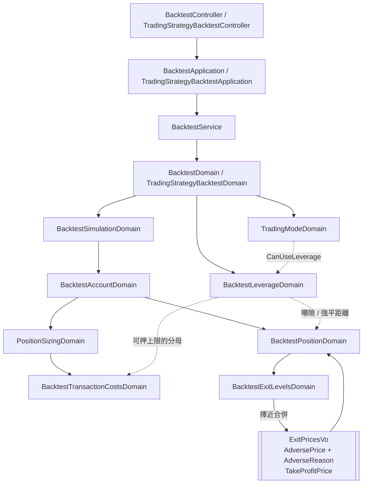

# 回測的槓桿與強制平倉 — Architecture Design

**Status:** Confirmed
**Source PRD:** `.sdd/2026-09-20-leveraged-backtest-liquidation/PRD.md`
**Tech context:** Go 1.26 · Gin · Clean / Onion Architecture · `shopspring/decimal` · 全部改動落在 domain 與其上的薄薄兩層

---

## 1. Design Goal & Guiding Principle

**In one sentence:** 讓一次重演能以放大過的曝險金額計算損益與成本，並在價格走到撐不住的價位時把那一注打掉，而沒有宣告槓桿的每一次重演輸出逐字不變。

**Guiding principle — 把「逆向出場」收斂成一個價位。**

止損與強制平倉**在同一邊**（都是價格逆著這一注走），而且**兩者都在開倉當下就算得出來**。
所以「誰先到」不是逐棒才知道的事，是**開倉當下就已經決定好的事**——近的那個贏，遠的那個永遠輪不到。

於是設計把它們在**開倉當下就合併成單一個「逆向出場價位」**，連同它是哪一種出場原因一起記下來。
`BacktestPositionDomain.ExitOn` 因此**比現在更簡單**：它問一個逆向價位、再問一個止盈價位，而不是排一串 if。

這是整份設計最重要的一個決定，因為**最可能的下一個需求正是「第三種逆向出場」**（資金費率把保證金耗光）。
在這個形狀下，那是 `PricesFrom` 裡多一個候選者，不是 `ExitOn` 裡多一個分支——而 `ExitOn` 正是這份程式碼裡
順序語意最微妙、最不該被反覆動刀的地方。

---

## 2. Change Scope

| Area | Action | What / Why |
| :--- | :--- | :--- |
| `domains.BacktestLeverageDomain` | **Add** | 槓桿設定這個概念本身：倍數、維持保證金率，以及它們全部的規則（開關、拒絕、曝險、強平距離）。 |
| `vo.ExitPricesVo` | **Modify** | 兩個止損／止盈欄位換成**逆向出場價位 + 它的出場原因**，加上原本的止盈。合併發生在建構當下。 |
| `domains.BacktestExitLevelsDomain` | **Modify** | `PricesFrom` 多收一個槓桿設定，負責把止損與強平**擇近**成單一逆向價位。它本來就是「把出場價位擺在進場價周圍」的那個模型，多一個候選者是同一件事的加寬。 |
| `domains.BacktestPositionDomain` | **Modify** | 記住槓桿；單位數改由曝險金額算；`ExitOn` 改讀合併後的逆向價位；新增「這一注平倉後回收多少現金」這個唯一出口。 |
| `domains.BacktestAccountDomain` | **Modify** | 開倉把槓桿傳給倉位；平倉改成向倉位要「回收多少現金」，不再自己做 `ValueAt − ExitCost`。 |
| `domains.BacktestTransactionCostsDomain` | **Modify** | 可押上限的分母把槓桿算進去（成本收的是曝險金額）。 |
| `domains.PositionSizingDomain` | **Modify** | `StakeFor` / `NeverStakesUnder` 轉傳槓桿給可押上限。 |
| `domains.TradingModeDomain` | **Modify** | 新增一個「這個模式開得了槓桿嗎」的問句，現貨答不行。 |
| `domains.BacktestSimulationDomain` / `BacktestDomain` / `TradingStrategyBacktestDomain` | **Modify** | 轉傳槓桿設定；成績單多一格強平出場筆數。 |
| `vo.TradeExitReasonVo` | **Modify** | 多一個強平出場。 |
| `dto.*RequestDto` / `dto.BacktestSummaryDto` | **Modify** | 多兩個輸入、多一格輸出。 |
| Controller request structs · 助手工具宣告 | **Modify** | 兩支重演入口與助手各多兩格，措辭一字不差。 |
| **`PositionPlanDomain`（機器人的建議部位）** | **Not touched** | 它早有槓桿倍數，但那是「每一輪建議押多少」、存在機器人身上；這裡是「這一次怎麼模擬」、不留存。UL-MAP 已記明兩者同名不同事，共用只會讓其中一邊的規則被另一邊的需求拖著走。 |
| **資金費率** | **Not touched** | 見第 6 節，它是下一刀，而且座位已經留好。 |
| **`BacktestEquityCurveDomain`** | **Not touched** | 它吃的是每一棒的權益數字，槓桿只改那個數字怎麼算出來，不改它怎麼被記錄。 |

---

## 3. New Classes / Modules

| Name | Kind | Responsibility (purpose) | Collaborators | Satisfies (PRD scenario) |
| :--- | :--- | :--- | :--- | :--- |
| `BacktestPositionTermsDomain` | Domain Model | **一次重演開一注的全部條件**：倉位大小模式、出場價位、槓桿設定、交易成本。它只回答一個問題——「手上有這麼多現金，在這個價位開一注」——所以押多大、付不付得起、收多少費、停在哪裡是一次回答。零值＝四樣都沒說。 | `PositionSizingDomain`、`BacktestExitLevelsDomain`、`BacktestLeverageDomain`、`BacktestTransactionCostsDomain` | US-03、US-06 全部（並讓其餘每一條都少經過一層） |
| `BacktestLeverageDomain` | Domain Model | 一次重演的槓桿設定與它的全部規則：讀宣告（留白／零／一＝沒有槓桿）、拒絕（小於一、現貨、維持保證金率為負或大到強平距離不為正）、算曝險金額、算強平距離。**零值＝沒有槓桿**，與出場價位、交易成本兩個既有模型同一個慣例。 | `TradingModeDomain` | US-01 全部、US-02 全部、US-03「開倉時扣的是保證金」、US-04 強平價四則 |

**為什麼會有 `BacktestPositionTermsDomain`（實作階段加的）。** 這一刀讓三個建構子各長出一個參數：
`NewBacktestPositionDomain` 變 7 個、`NewBacktestAccountDomain` 6 個、`NewBacktestSimulationDomain` 8 個，
而下一刀（資金費率）會讓三個再各加一個——這正是淺介面的典型徵狀。
但那幾個參數其實是同一件事：**一注是用什麼條件開的**。合成一個模型之後：

| | 之前 | 之後 |
| :--- | ---: | ---: |
| `NewBacktestSimulationDomain` | 8 個參數 | 5 |
| `NewBacktestAccountDomain` | 6 | 3 |
| 開一注 | 帳戶先問 `StakeFor`、再呼叫 `NewBacktestPositionDomain` | `terms.OpenFor(方向, 時間, 價格, 現金)` 一次 |
| 「這組設定永遠開不了倉嗎」 | `NeverStakesUnder(成本, 槓桿)` | `NeverOpensAnything()`，零參數 |

`NewBacktestPositionDomain` 因此**收成未匯出**：`OpenFor` 是一注唯一的出生入口。
留一扇收現成押注金額的後門，等於邀請呼叫端自己去算押注金額——而這組條件的重點正是
**外面沒有人知道「押注金額」是一個要被算出來的東西**。
交易模式**沒有**被收進去：它管的是「賣出是什麼意思」，與「一注怎麼開」是兩件事，合併會弄丟這個區別。

**Depth check（`BacktestLeverageDomain`）.** 它的對外面貌只有四件事：`IsEngaged()`、`ExposureFrom(stake)`、`AdverseDistance()`、`Multiplier()`。
呼叫端從來不需要自己乘、自己減、自己判斷「一倍要不要特別處理」——`ExposureFrom` 在沒有槓桿時回傳原值，
`AdverseDistance` 在沒有槓桿時回答「沒有這個距離」。沒有任何一個呼叫端要排步驟，也沒有 `AndThen` 式的命名。

**為什麼交易模式要傳進建構子。** 「現貨開不了槓桿」是一條**關於槓桿的規則**，不是關於交易模式的規則；
把它放在別處，槓桿這個模型就會有一條在別人身上的規則。`TradingModeDomain` 只多一個**以自己命名**的問句
（`CanUseLeverage()`，比照既有的 `CanGoShort()`——那段註解已經寫明「以模式自己命名，而不是以呼叫端拿它去做什麼命名」）。

---

## 4. Modified Components

| Component | Current role | Change needed |
| :--- | :--- | :--- |
| `vo.ExitPricesVo` | 一注開倉當下settle 好的止損價與止盈價 | 止損那一格升格為 **`AdversePrice` / `HasAdverse` / `AdverseReason`**：逆著這一注的那一個出場價，以及它是止損還是強平。止盈那兩格不動。**理由**：兩者同邊，近的必先到，這在開倉當下就知道，沒有理由拖到逐棒再判。 |
| `BacktestExitLevelsDomain` | 讀兩個距離、把它們擺在進場價周圍 | `PricesFrom(direction, entryPrice, leverage)` 多收槓桿設定，內部把止損距離與強平距離**擇近**（平手時算止損——使用者自己下的指令優先，而且結果不會更糟），產出合併後的逆向價位與原因。建構子的兩個距離驗證不動。 |
| `BacktestPositionDomain` | 一注：方向、進場時間、進場價、押注金額、單位數、出場價位、成本 | ① 多記槓桿；② `unitCount = leverage.ExposureFrom(stake) / entryPrice`；③ `entryCost = costs.EntryCostFor(leverage.ExposureFrom(stake))`；④ `ExitOn` 改問 `HasAdverse` 一次（原本兩次 if），出場原因直接取自 `AdverseReason`；⑤ **新增 `CashReturnedFor(closedTrade)`**——這一注平掉之後回收多少現金。 |
| `BacktestAccountDomain` | 現金、那一注、已平倉清單 | 開倉時把槓桿交給倉位；`settleOpenPosition` 從 `ValueAt(...) − ExitCost` 改成 `openPosition.CashReturnedFor(closedTrade)`；`ExitCountFor` 不必改（強平原因自動被數到）。 |
| `BacktestTransactionCostsDomain` | 兩個費率、可押上限、進出場成本 | `MaximumStakeFrom(cash, leverage)` 分母改為 `100 + 槓桿倍數 × 進場成本率`。沒有槓桿時倍數為一，算式與今天逐字相同。`EntryCostFor` / `ExitCostFor` **不動**——它們收的本來就是「交給我的那個金額」，呼叫端改成交曝險金額即可。 |
| `PositionSizingDomain` | 三種押注模式、付不付得起 | `StakeFor` 與 `NeverStakesUnder` 多收槓桿並原樣轉給可押上限。三種模式的語意一個字不改。 |
| `TradingModeDomain` | 兩種模式、賣出是什麼意思 | 多一個 `CanUseLeverage()`：多空反手可以，現貨不行，零值答不行（與 `CanGoShort()` 同一個保守慣例）。 |
| `BacktestSimulationDomain` | 逐棒走一遍、產出三份結果 | 多收槓桿並轉給帳戶；成績單多填 `LiquidationExitCount`。 |
| `BacktestDomain` | 驗證一次重演的每一條規則 | 在交易模式之後、出場價位之前建構槓桿設定（它要交易模式當原料），失敗時以新的欄位名 `leverage` 回報。 |
| `TradingStrategyBacktestDomain` | 同上，但交易模式來自那一份交易策略 | 同上；槓桿仍由這一次呼叫給。 |
| `vo.TradeExitReasonVo` | 三種出場原因 | 多 `TradeExitReasonLiquidation`。 |
| `dto.BacktestRequestDto` · `dto.TradingStrategyBacktestRequestDto` | 一次重演的輸入 | 各多 `Leverage`、`MaintenanceMarginRate`。 |
| `dto.BacktestSummaryDto` | 成績單 | 多 `LiquidationExitCount`。 |
| `models.BacktestRequest` · `models.TradingStrategyBacktestRequest` | 兩支入口的 body | 各多兩格，措辭一字不差。 |
| `TradingStrategyBacktestAssistantQuery` | 助手的重演能力宣告 | 工具參數多兩格，說明與使用者看到的一字不差。 |
| `domains.BacktestLeverageField` | — | 新常數 `"leverage"`，兩格共用一個欄位名，比照 `exitLevels` 與 `transactionCosts`。 |

### 關鍵取捨：`CashReturnedFor` 為什麼要存在

今天帳戶自己做 `可用資金 += 那一注值多少 − 出場成本`。強平之後這句話會**多出兩個例外**：
回收的是零（不是帳面價值），而且不再收出場成本（拿不出來的錢收不了）。

把這兩個例外留在帳戶裡，等於讓「一注怎麼結算」這件事分住兩個地方。
交給倉位一個入口回答**「這一注平掉，回收多少現金」**，帳戶就退回只做加法，
而下一刀（資金費率要在結算時扣掉累計的費用）也只會動這一個方法。

---

## 5. Component Relationships

---

## 6. Extensibility & Handoff Notes

- **Most likely next requirement：資金費率。** 永續合約每隔幾小時付或收的那筆錢。
  它會做兩件事：**每隔一段時間從那一注身上扣一筆**，以及**扣到撐不住時把它打掉**。

- **Where it lands：兩個座位都已經留好。**
  1. 「又一種逆向出場」→ `BacktestExitLevelsDomain.PricesFrom` 裡多一個候選者，**擇近**那段邏輯一個字不用改。
     `ExitOn` 完全不會被動到——那正是這份設計把合併提前到開倉當下的理由。
  2. 「結算時多扣一筆」→ `BacktestPositionDomain.CashReturnedFor` 這一個方法，帳戶不會知道有這回事。
  3. 「多一個開倉條件」→ `BacktestPositionTermsDomain` 多一個欄位加 `OpenFor` 裡一行。
     **三個建構子的簽名一個都不會動**，帳戶與逐棒的走法也不會。

- **How to add it：** 新增 `BacktestFundingRateDomain`（比照 `BacktestLeverageDomain`：零值＝不模擬、
  建構子收完宣告就把規則全部結清），在 `PricesFrom` 加它的候選價位、在 `CashReturnedFor` 加它的累計扣款。
  **不要**在 `ExitOn` 加第三個 if，也**不要**讓帳戶重新自己算現金。

- **Patterns applied & why：**
  - **零值即「不模擬」**（`BacktestLeverageDomain`）——沿用出場價位與交易成本兩個既有模型的慣例。
    它不是裝飾，而是「逐字相容」這條上位約束唯一不會出錯的實作方式：不是靠每個呼叫點寫 if，
    而是靠算術本身（乘一、加零）自然退化。
  - **在建構當下收斂決策**（逆向價位擇近）——把一個「其實開倉就知道」的問題從逐棒迴圈裡移走。

- **Do not hardcode：**
  - **不要在任何呼叫點寫 `if leverage == 1`。** 沒有槓桿是靠 `ExposureFrom` 回傳原值、`AdverseDistance` 回答「沒有」達成的。
  - **不要把維持保證金率的預設值（0.5%）散在兩支入口。** 它只屬於 `BacktestLeverageDomain` 的建構子。
  - **不要把強平價當成「另一種止損」塞進出場價位的建構子驗證。** 它是算出來的，不是使用者填的，
    不受「不得為負、不得超過 100」那兩句話管。

- **Known debt / deferred：**
  - 強平出場**回收零**，也就是剩下的維持保證金被視為清算本身吃掉。這與真實交易所的行為一致（清算費），
    但它是一個**決定**而不是一個推導。要改成「回收維持保證金」時，只有 `ClosedAt` 一個地方要動。
  - **強平距離沒有把出場成本算進去。** 所以高槓桿配一個比強平近的止損時，
    出場成本可能吃掉剩下的保證金——`ClosedAt` 把成本收到那一注還剩多少為止來收尾。
    要讓強平價本身把成本算進去是另一件事，做了之後這個收尾就再也不會發生（但仍該留著）。
  - 這一版同一時間只有一注，所以沒有全倉／逐倉之分，也沒有分批強平。
    要支援多注時，「撐不住」會從一注的問題升級成帳戶的問題，那時 `AdversePrice` 這個形狀會需要重新檢視。

---

## 7. Traceability

| PRD Scenario | Fulfilled by |
| :--- | :--- |
| US-01 說出槓桿倍數就會模擬強制平倉 | `BacktestLeverageDomain` |
| US-01 留白／零／一都當作沒有槓桿（三則） | `BacktestLeverageDomain` 零值慣例 + `ExposureFrom` 回傳原值 |
| US-01 槓桿倍數小於一整份拒絕 | `BacktestLeverageDomain` 建構子 + `BacktestLeverageField` |
| US-01 現貨開不了槓桿 | `BacktestLeverageDomain` 建構子 + `TradingModeDomain.CanUseLeverage` |
| US-01 現貨不說槓桿照常 | `BacktestLeverageDomain` 零值 |
| US-01 重演一份交易策略也說得出槓桿 | `TradingStrategyBacktestDomain` + `dto.TradingStrategyBacktestRequestDto` |
| US-01 助手也說得出槓桿 | `TradingStrategyBacktestAssistantQuery` |
| US-02 維持保證金率四則（接受／預設／負／太大） | `BacktestLeverageDomain` 建構子 |
| US-02 剛好還開得成（強平距離 1%） | `BacktestLeverageDomain.AdverseDistance` |
| US-02 沒有槓桿時不影響結果 | `BacktestLeverageDomain` 零值 |
| US-03 開倉扣保證金、承擔曝險 | `BacktestAccountDomain.Apply` + `BacktestPositionDomain` 單位數 |
| US-03 賺賠照曝險（順／逆／無槓桿三則） | `BacktestPositionDomain.ProfitAt` / `ValueAt` |
| US-04 多倉／空倉／低槓桿／高槓桿強平價（四則） | `BacktestLeverageDomain.AdverseDistance` + `BacktestExitLevelsDomain.PricesFrom` |
| US-04 沒有槓桿就沒有強制平倉價 | `BacktestExitLevelsDomain.PricesFrom` |
| US-04 碰到／正好碰到／差一點（三則） | `BacktestPositionDomain.ExitOn` |
| US-04 跳空崩跌也賠不過押下去的錢 | `BacktestPositionDomain.CashReturnedFor` |
| US-05 止損比強平近／遠／沒設止損（三則） | `BacktestExitLevelsDomain.PricesFrom` 擇近 |
| US-05 同一根同時碰到兩邊時逆向先算 | `BacktestPositionDomain.ExitOn` 既有順序 |
| US-05 沒有槓桿時止損行為不變 | `BacktestExitLevelsDomain.PricesFrom` 零值路徑 |
| US-06 進場成本收曝險（有／無槓桿兩則） | `BacktestPositionDomain` 進場成本 + `BacktestLeverageDomain.ExposureFrom` |
| US-06 全押縮到付得起 | `BacktestTransactionCostsDomain.MaximumStakeFrom` |
| US-06 固定金額付不起就跳過 | `PositionSizingDomain.StakeFor` |
| US-06 出場成本收放大後的成交金額 | `BacktestPositionDomain.ClosedAt`（單位數已含槓桿） |
| US-07 成績單數得出強平筆數 | `BacktestSimulationDomain` + `BacktestAccountDomain.ExitCountFor` |
| US-07 沒開槓桿恆為零 | 同上（沒有強平原因的交易） |
| US-07 交易明細指得出是哪一筆 | `vo.TradeExitReasonLiquidation` |

---

## 8. Risks & Open Decisions

### Risks / trade-offs

| 風險 | 取捨 |
| :--- | :--- |
| **`ExitPricesVo` 改形狀，既有測試會一起紅。** | 接受。這個 VO 只被倉位與出場價位兩個模型碰到，改動面窄；而它換來的是 `ExitOn` 不必隨每一種新出場原因長大——那才是會被反覆動刀的地方。 |
| **合併之後，使用者看不到「止損救了我」這件事的設定面。** | 接受。每一筆交易的**出場原因**已經回答了同一個問題，而且回答的是真的發生過什麼，不是設定了什麼。成績單上的強平出場筆數為零，本身就是「停損一直在擋」的證據。 |
| **成本基準從押注金額改成曝險金額，是一個會無聲改掉舊數字的地方。** | 以「沒說槓桿時逐字相同」的測試守住。沒有槓桿時曝險等於押注，乘一不改值。 |
| **可押上限的分母改了。** | 同上：倍數為一時分母退回原式，`MaximumStakeFrom` 的「不計成本就原樣回傳」那條早退路徑也不受影響。 |

### Open decisions for implementation

- 維持保證金率的拒絕句子要說出「這個槓桿下最多能填多少」，也就是 `1 ÷ 槓桿倍數` 化成百分比。
  小數位數怎麼呈現由實作決定，只要**說得出一個使用者照著填就會過的數字**即可。
- 逆向價位平手（止損價正好等於強平價）時算**止損**。理由寫在程式碼裡：使用者自己下的指令優先，
  而且兩者價格相同，這個選擇不會讓成績單變好看。
