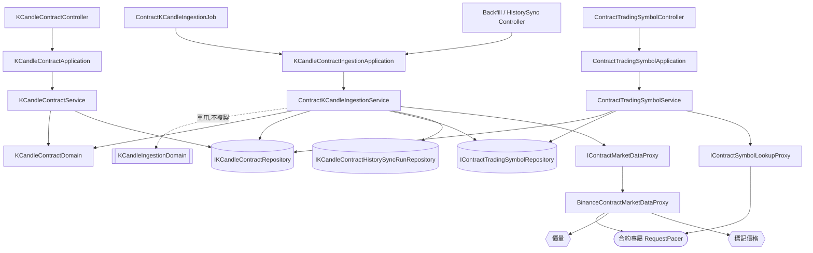

# 合約 K 線資料抓取 — Architecture Design

**Status:** Confirmed
**Source PRD:** `.sdd/2026-09-22-contract-k-candle-ingestion/PRD.md`
**Tech context:** Go 1.26 · Gin · GORM（Code First）· PostgreSQL · Clean / Onion Architecture · 手動 DI 於 `cmd/server/dependencies.go`

---

## 1. Design Goal & Guiding Principle

**In one sentence:** 讓永續合約的 K 線（含標記價格與成交筆數）自成一條由來源到儲存的完整路徑，與現貨那條**零交集**，而且下游（回測、指標計算、交易策略、機器人）完全不知道這件事發生過。

**Guiding principle:** **把「兩次來源呼叫合成一根」整個藏進 proxy，讓「缺一不存」退化成一條普通的驗證規則。**

呼叫端只發一次請求，不知道背後問了兩次、不知道對齊、不知道標記價格那一份附帶的零是佔位。缺標記價格的那一根，則走既有「違反規則的逐根跳過並留下紀錄」那條路——**抓取流程一個新分支都不長**。

### 讓這一刀小下來的關鍵發現

`internal/domain/models/domains/k_candle_ingestion_domain.go`（253 行）**已經是型別無關的**。它擁有抓取的每一個決策：

| 方法 | 決定什麼 | 認識 entity 型別嗎 |
| :--- | :--- | :--- |
| `ScheduledWindow(...)` | 這一輪要抓哪一段 | ❌ |
| `BackfillWindow(...)` | 回補起點（上限往回＋對齊，與「已存最新那根之後」取較晚） | ❌ |
| `HistoryWindow(...)` | 歷史同步的整段 | ❌ |
| `HistoryChunks(...)` | 一天一段怎麼切 | ❌ |
| `SelectClosed(...)` | 排除還在走的那一格 | ❌ |
| `LatestClosedOpenTime()` / `RoundCoverage()` | 時間基準 | ❌ |

它們只處理時間與窗口。所以 `ContractKCandleIngestionService` **原封不動重用整個 `KCandleIngestionDomain`**，一行決策邏輯都不複製。`KCandleIngestionService` 那 699 行裡真正型別相關的，只有「抓 → 建 → 存」與輪次記帳。

---

## 2. Change Scope

| Area | Action | What / Why |
| :--- | :--- | :--- |
| `internal/domain/models/entities/` | **Add** | `KCandleContract`、`ContractTradingSymbol`、`KCandleContractHistorySyncRun` 三個 entity |
| `internal/domain/models/domains/` | **Add** | `KCandleContractDomain`（不變量）、`ContractWatchlistEntryDomain` |
| `internal/domain/models/vo/` | **Add** | `ContractMarketKCandleVo`（標記價格為 optional，讓「缺」表達得出來） |
| `internal/domain/models/dto/` | **Add** | `KCandleContractDto`、`KCandleContractWriteDto`、`ContractTradingSymbolDto`、`KCandleContractHistorySyncRunDto` |
| `internal/domain/interface/` | **Add** | 三個 repository 介面 ＋ `IContractMarketDataProxy` ＋ `IContractSymbolLookupProxy` |
| `internal/domain/service/` | **Add** | `KCandleContractService`、`ContractTradingSymbolService`、`ContractKCandleIngestionService`、`contractKCandleHistorySyncRunner` |
| `internal/application/` | **Add** | `KCandleContractApplication`、`ContractTradingSymbolApplication`、`KCandleContractIngestionApplication` |
| `internal/controller/` | **Add** | `KCandleContractController`、`ContractTradingSymbolController`、`KCandleContractBackfillController`、`KCandleContractHistorySyncController` |
| `internal/infrastructure/persistence/` | **Add** | 三個 repository 實作 |
| `internal/infrastructure/persistence/schema_migrator.go` | **Modify** | `migratedEntities` 補上三個新 entity |
| `internal/infrastructure/marketdata/` | **Add** | `BinanceContractMarketDataProxy`、`binance_contract_wire.go`、`BinanceContractSymbolLookupProxy` |
| `internal/job/` | **Add** | `ContractKCandleIngestionJob` |
| `internal/config/` | **Modify** | 合約自己那組設定（來源位址、逾時、額度、回補上限、回溯天數上限、每輪根數） |
| `cmd/server/dependencies.go` | **Modify** | 組裝新元件、註冊路由、把新 job 加進 `[]IBackgroundJob`、啟動時掃合約殘留輪次 |
| `postman/` | **Modify** | 新增合約那一組請求與斷言 |
| **`KCandle` / `IKCandleRepository` / `KCandleService` / `KCandleIngestionService`** | **Not touched** | 現貨那條路一個字都不動——這是分開的全部理由 |
| **`TradingSymbol` / `ITradingSymbolRepository` / `TradingSymbolService`** | **Not touched** | 合約有自己的追蹤名單；既有那份的「一個代號只登錄得了一次」保持原樣 |
| **`BacktestService` / `IndicatorCalculationService` / 策略 / 機器人 / 助手** | **Not touched** | 消費端不該有兩份；它們要吃合約 K 線是另一刀的事 |
| **`market_routed_*` 三個 proxy** | **Not touched** | 合約不加入既有路由表，它有自己的一套 |
| **`MarketVo` / `MarketCatalogDomain`** | **Not touched** | **永續合約刻意不成為新的市場值**——見下方 §8 |
| **`KCandleFollowService` / 即時跟盤** | **Not touched** | 下一刀 |

---

## 3. New Classes / Modules

| Name | Kind | Responsibility (purpose) | Collaborators | Satisfies |
| :--- | :--- | :--- | :--- | :--- |
| `KCandleContract` | Entity | 一根合約 K 線的一列。**每一欄 NOT NULL**：價量八項 ＋ 成交筆數 ＋ 標記開高低收。唯一索引 `(Symbol, OpenTime)`，與 `KCandles` 分屬兩張表故不相衝 | — | US-01、US-02、US-06 |
| `ContractTradingSymbol` | Entity | 合約追蹤名單的一列：`Symbol`（主鍵）＋ `IsWatched`。**刻意沒有 `DisplayName` 與 `Market`**——合約來源不替代號取名，而這張表只服務一個市場 | — | US-03 |
| `KCandleContractHistorySyncRun` | Entity | 一趟合約歷史同步本身：狀態、段數、存了幾根、跳過幾根、失敗原因。**編號自己一串** | — | US-05 |
| `ContractMarketKCandleVo` | VO | 來源正規化後的一根合約 K 線。**標記四價是 `decimal.NullDecimal`**——這是整個設計裡唯一讓「缺標記價格」表達得出來的地方，也因此讓它變成一條可驗證的規則而不是一個流程分支 | — | US-01 #2 |
| `IContractMarketDataProxy` | Interface | **一次呼叫拿回合成好的合約 K 線。** `FetchKCandles(ctx, window) ([]ContractMarketKCandleVo, error)`——與 `IMarketDataProxy` 同形狀（一方法、兩參數） | — | US-01 全部 |
| `BinanceContractMarketDataProxy` | Proxy | 上面那個介面的實作，**所有複雜度的所在地**：問價量、問標記價格、依起始時間對齊、丟掉標記那份附帶的佔位零、依合約自己的 `RequestPacer` 節流 | `RequestPacer` | US-01 #1 #3 #4 |
| `IContractSymbolLookupProxy` | Interface | 合約代號存不存在。`LookUpSymbol(ctx, symbol) (SymbolListingVo, error)`——**不收 `market` 參數**，它只服務一個市場，比既有那支更窄 | — | US-03 #4 |
| `BinanceContractSymbolLookupProxy` | Proxy | 實作。合約目錄**不接受只問一個代號**，所以整份取回後逐一比對；不靠「被拒絕」判斷查無此代號 | `RequestPacer` | US-03 #4 #5 |
| `KCandleContractDomain` | Domain Model | 一根合約 K 線的不變量。**「必須帶標記價格」「必須帶成交筆數」與既有 K 線規則並列成同一組**；標記高不得低於標記低、與最新價**各自成立不比大小**；成交筆數零合法、負數不合法 | — | US-01 #2、US-06 全部 |
| `ContractWatchlistEntryDomain` | Domain Model | 一次加入合約追蹤名單這件事：代號正規化、與既有那一筆的關係（重複加不算失敗） | — | US-03 |
| `ContractKCandleIngestionService` | Service | 合約 K 線的定時輪、回補、歷史同步。**重用 `KCandleIngestionDomain` 的每一個決策**；**不推定休市**（永續全天候，所以完全不需要 `KCandleIngestionMarketClosureLedger`） | `IContractMarketDataProxy`、`IKCandleContractRepository`、`IContractTradingSymbolRepository`、`IKCandleContractHistorySyncRunRepository`、`IClockProxy`、`KCandleIngestionDomain` | US-01、US-05 |
| `contractKCandleHistorySyncRunner` | (goroutine 生命週期物件) | 一趟合約歷史同步的執行與記帳，活得比請求久 | `ContractKCandleIngestionService` | US-05 #1 |
| `KCandleContractService` | Service | 合約 K 線的新增、修改、刪除、單筆讀取、區間查詢 | `IKCandleContractRepository`、`IClockProxy` | US-04、US-06、US-07 |
| `ContractTradingSymbolService` | Service | 合約追蹤名單的加入、移除，以及「系統認得哪些合約標的」＝已登錄 ∪ 實際有合約 K 線的 | `IContractTradingSymbolRepository`、`IKCandleContractRepository`、`IContractSymbolLookupProxy` | US-02 #3、US-03 |
| `ContractKCandleIngestionJob` | Job | 每分鐘一輪，實作 `IBackgroundJob`，掛進既有 `[]IBackgroundJob` | `KCandleContractIngestionApplication` | US-01 #5 #6 |

### 深度檢查（`IContractMarketDataProxy`）

| 診斷問題 | 答案 |
| :--- | :--- |
| 呼叫端要依序呼叫多個方法才完成一件業務嗎？ | 否——一次 `FetchKCandles` |
| 呼叫端需要知道是哪個子步驟失敗才能正確恢復嗎？ | 否——任一份問不到即整個回錯，走既有「該標的這一輪失敗」那條路 |
| 加一種實作要改呼叫端嗎？ | 否——換來源就換實作 |
| 公開介面比實作大嗎？ | 否——一個方法，內部含兩次請求、對齊、丟佔位零、節流 |

---

## 4. Modified Components

| Component | Current role | Change needed |
| :--- | :--- | :--- |
| `internal/infrastructure/persistence/schema_migrator.go` | `migratedEntities` 列出要同步的 entity | 補上三個新 entity |
| `internal/config` | 讀環境變數、組 DSN | 新增合約那一組設定（見 §6「Do not hardcode」） |
| `cmd/server/dependencies.go` | 手動 DI ＋ 路由註冊 ＋ 背景 job 註冊 | 組裝新元件；註冊十一條新路由；把 `ContractKCandleIngestionJob` 加進 `[]IBackgroundJob`；啟動時另外掃一次合約殘留的 `running` 輪次 |
| `postman/` | 既有 collection | 新增合約那一組；CRUD 比照現貨用獨立的測試代號，避開追蹤名單 |

### 新增路由

| Method | Path |
| :--- | :--- |
| `GET` | `/contract-k-candles?symbol=&startTime=&endTime=` |
| `POST` | `/contract-k-candles` |
| `GET` `PUT` `DELETE` | `/contract-k-candles/{symbol}/{openTime}` |
| `POST` | `/contract-k-candles/backfill` |
| `POST` | `/contract-k-candles/history` |
| `GET` | `/contract-k-candles/history/{id}` |
| `GET` | `/contract-trading-symbols` |
| `POST` | `/contract-watchlist` |
| `DELETE` | `/contract-watchlist/{symbol}` |

---

## 5. Component Relationships



一根合約 K 線的一生：

```
兩次來源呼叫  →  依起始時間對齊、丟掉佔位的零   （BinanceContractMarketDataProxy 內部）
              →  ContractMarketKCandleVo（標記價格可為缺）
              →  KCandleContractDomain 驗證（缺標記價格 = 不合規）
              →  合規的存入 / 不合規的逐根跳過並留下紀錄
```

---

## 6. Extensibility & Handoff Notes

### Most likely next requirement：資金費率，其次是未平倉量

**它們不是 K 線形狀。** 資金費率是每 8 小時一筆的**事件**（而且間隔是逐標的的，不是常數）；未平倉量是 5 分鐘一筆的序列。兩者都**不會變成合約 K 線的欄位**——硬塞進一分鐘一根會讓 1440 根裡絕大多數是空的，而那個空又與「這一項不適用」混為一談。

### Where it lands：接縫已經存在，這個設計的責任是不破壞它

| 接縫 | 為什麼它吸收得了 | 這一刀要守的事 |
| :--- | :--- | :--- |
| `BackgroundJobManager` 吃 `[]IBackgroundJob` | 加一條序列 ＝ **加一行註冊** | 合約 job 照既有介面實作，不在既有 job 裡塞第二件事 |
| `KCandleIngestionDomain` 型別無關 | 窗口與一天一段的切分直接重用 | **不得為了合約把任何 entity 型別滲進它** |
| `RequestPacer` 是「一個來源一份額度」 | 新序列自動共用同一份合約額度 | **合約的 pacer 獨立注入、不藏在 candle proxy 裡**——藏起來的話下一條序列就得自己再開一份，兩份各打各的正好打爆額度 |

### How to add it（add-only path）

1. 新增 `FundingRate` entity ＋ 它的 repository 介面與實作
2. 新增 `IContractFundingRateProxy`，實作時**注入同一個合約 `RequestPacer` 實例**
3. 新增 `ContractFundingRateIngestionService`，時間窗與切段重用 `KCandleIngestionDomain`
4. 新增 `ContractFundingRateIngestionJob`，在 `buildBackgroundJobManager` **加一行**

不需要動合約 K 線的任何一個型別、不需要動輪次的走法、不需要動任何既有簽名。

### Patterns applied & why

- **Adapter（`BinanceContractMarketDataProxy`）**——來源的電報格式（12 欄位置陣列、佔位的零、兩支不同位址）止步於此，domain 只看得到 `ContractMarketKCandleVo`。
- **不使用 Strategy 於「哪一種 K 線」**——合約與現貨是兩條各自完整的路，不是同一條路的兩個分支。加一層多型只會讓兩邊都得遷就對方。

### Do not hardcode

| 設定 | 為什麼必須各自一份 |
| :--- | :--- |
| `CONTRACT_MARKET_DATA_BASE_URL` | 價量位址 |
| `CONTRACT_MARKET_DATA_MARK_PRICE_URL` | 標記價格是**另一支位址**，不是同一支的參數 |
| `CONTRACT_MARKET_DATA_SYMBOL_CATALOG_URL` | 合約目錄 |
| `CONTRACT_MARKET_DATA_REQUEST_TIMEOUT_SECONDS` | — |
| `CONTRACT_MARKET_DATA_REQUESTS_PER_MINUTE` | **合約與現貨的額度是分開計算的**，共用一份等於只用到一半；而且合約每一根要問兩次，請求數本來就是兩倍 |
| `CONTRACT_KCANDLE_INGESTION_ROUND_CANDLE_COUNT` | — |
| `CONTRACT_KCANDLE_INGESTION_BACKFILL_LOOKBACK_HOURS` | 合約自己一份（PRD 決定） |
| `CONTRACT_KCANDLE_HISTORY_SYNC_MAX_LOOKBACK_DAYS` | 合約自己一份（PRD 決定）；永續歷史比現貨短 |

### Known debt / deferred

| 債 | 為什麼現在不還 | 該還的訊號 |
| :--- | :--- | :--- |
| `contractKCandleHistorySyncRunner` 與 `kCandleHistorySyncRunner`（190 行）記帳邏輯相近 | 兩個還不成模式；抽它要把輪次記錄變成行為介面，代價大於重複 | **第三種序列（資金費率歷史）也需要輪次記錄時**，抽一個共用的記帳行為介面 |
| `/trading-symbols` 與 `/contract-trading-symbols` 是兩個端點，呼叫端自己併 | PRD 已決定（1A）；既有那份零風險 | 出現真的畫面、而它需要一份合併清單時 |
| 合約代號目錄每次整份取回（約 1.1 MB） | 加入追蹤名單是低頻操作，答案仍然正確 | 若有高頻確認代號的用途出現 |

---

## 7. Traceability

| PRD Scenario | Fulfilled by |
| :--- | :--- |
| **US-01** 兩份資料都齊,存成一根完整的合約 K 線 | `BinanceContractMarketDataProxy`（合成）＋ `KCandleContractDomain` ＋ `IKCandleContractRepository` |
| **US-01** 標記價格獨缺那一根,那一根整根不存 | `ContractMarketKCandleVo`（標記可缺）＋ `KCandleContractDomain` 不變量 ＋ `ContractKCandleIngestionService` 的既有逐根跳過路徑 |
| **US-01** 標記價格整份問不到,這一輪一根都不存 | `BinanceContractMarketDataProxy`（任一份失敗即整個回錯）＋ `ContractKCandleIngestionService` 的每標的獨立失敗處理 |
| **US-01** 標記價格附帶的零是佔位,不是成交量 | `BinanceContractMarketDataProxy` ＋ `binance_contract_wire.go` |
| **US-01** 進行中那一根兩份都不存 | `KCandleIngestionDomain.SelectClosed`（重用） |
| **US-01** 永續全天候,凌晨照抓 | `ContractKCandleIngestionService`（不注入休市推定） |
| **US-01** 來源回覆卻沒東西,不推定休市 | 同上——刻意不使用 `KCandleIngestionMarketClosureLedger` |
| **US-02** 同代號同起始時間,兩邊各存一根 | `KCandleContract`（獨立表與獨立唯一索引） |
| **US-02** 查現貨只拿得到現貨 | `KCandleService` 不變 ＋ `IKCandleContractRepository` 各自獨立 |
| **US-02** 只有合約才有的代號加得進去 | `ContractTradingSymbolService` ＋ `IContractSymbolLookupProxy` |
| **US-02** 名字相近的兩個代號是兩個毫不相干的標的 | 兩張表、兩份追蹤名單；設計中無任何換算或關聯元件 |
| **US-03** 同一個代號兩邊各自追蹤 | `ContractTradingSymbol`（獨立表）＋ `ContractTradingSymbolService` |
| **US-03** 加進去就立刻回補那一檔 | `ContractTradingSymbolService` → `ContractKCandleIngestionService.RunBackfillFor` |
| **US-03** 移除只停止追蹤,一根都不刪 | `ContractTradingSymbolService`（只改 `IsWatched`） |
| **US-03** 合約不認得的代號加不進去 | `BinanceContractSymbolLookupProxy`（整份目錄逐一比對） |
| **US-03** 來源不可用時不先加了再說 | `ContractTradingSymbolService`（先確認後登錄的順序） |
| **US-04** 讀一段合約 K 線 | `KCandleContractService` ＋ `IKCandleContractRepository.FindInRange` |
| **US-04** 那段沒有資料就是沒有,不是錯誤 | 同上 |
| **US-05** 先拿到一筆輪次,不等抓完 | `KCandleContractHistorySyncRun` ＋ `contractKCandleHistorySyncRunner` |
| **US-05** 已經齊全的那幾天連問都不問 | `KCandleIngestionDomain.HistoryChunks`（重用）＋ `IKCandleContractRepository.CountInRange` |
| **US-05** 只存了一半的那天,兩份資料都重問 | 同上 ＋ `SaveAllIfAbsent`（不覆蓋） |
| **US-05** 同一個代號同時只跑一趟 | `ContractKCandleIngestionService`（合約自己一份進行中名冊） |
| **US-05** 回溯天數說不通就拒絕,超過上限要說出上限 | `KCandleHistoryLookbackDomain`（重用）＋ 合約自己的上限設定 |
| **US-05** 起點比這個合約存在的時間還早 | `ContractKCandleIngestionService`（回幾根存幾根，不算失敗） |
| **US-05** 整段期間這個合約還沒上市 | 同上 ＋ `KCandleContractHistorySyncRun.FetchFailureReason` |
| **US-06** 給齊了就存進去 | `KCandleContractService` ＋ `KCandleContractDomain` |
| **US-06** 同代號同起始時間即覆蓋 | `IKCandleContractRepository.Save`（upsert 語意） |
| **US-06** 沒被追蹤的代號一樣塞得進去 | `KCandleContractService`（不查追蹤名單） |
| **US-06** 沒給標記價格就不是一根合約 K 線 | `KCandleContractDomain` 不變量 |
| **US-06** 沒給成交筆數也拒絕,留白不能當成零 | `KCandleContractDomain` 不變量 |
| **US-06** 全部合規就收下 | `KCandleContractDomain` |
| **US-06** 標記價格自己的高低關係要成立 | `KCandleContractDomain` |
| **US-06** 標記價格不得為負 | `KCandleContractDomain` |
| **US-06** 成交筆數不得為負 | `KCandleContractDomain` |
| **US-06** 成交筆數為零是合法的 | `KCandleContractDomain` |
| **US-06** 起始時間說不通就拒絕 | `KCandleContractDomain` ＋ `IClockProxy` |
| **US-06** 最新價與標記價格差很遠照收 | `KCandleContractDomain`（刻意**沒有**跨組比較的規則） |
| **US-07** 改掉那一根的數字 | `KCandleContractService.Update` |
| **US-07** 改的是哪一根由指名決定 | `KCandleContractController` ＋ `KCandleContractService`（路徑與內文不符即拒絕） |
| **US-07** 改一根不存在的 | `KCandleContractService` ＋ `IKCandleContractRepository.FindOne` |
| **US-07** 刪掉合約那根,現貨那根不受影響 | `IKCandleContractRepository.Delete`（兩張表天然隔離） |
| **US-07** 刪一根不存在的 | 同上 |

**覆蓋率：42 / 42。**

---

## 8. Risks & Open Decisions

### Risks / trade-offs

- **`MarketVo` 刻意不增值。** 加一個「永續合約」的市場值看起來更統一，但 `MarketVo` 驅動的是交易時段、跟盤名額、proxy 路由、哪幾項沒有值——合約這四件事全都自己有一套。加下去會逼 `MarketCatalogDomain`、三個 `market_routed_*` proxy 與 `TradingSymbolService` 一起改，而它們全都在「不動」清單上。**代價**：`ContractTradingSymbol` 沒有 `Market` 欄位，將來若真要支援幣本位合約，得再做一次這個決定。
- **與現貨的相似邏輯有兩份。** 輪次記帳與部分流程骨架會重複。**接受它**，因為抽象的代價（把輪次記錄變成行為介面）現在大於重複的代價；訊號寫在 §6。
- **合約 K 線每一欄 NOT NULL。** 換掉來源時若新來源不提供成交筆數，這張表擋得住——那是刻意的：它保證「存進去的一定是完整的一根」。**代價**：未來若要接不提供成交筆數的合約來源，得改 schema 而不是塞個空值。
- **請求數是現貨的兩倍。** 每一根要問兩份資料，長區間的耗時與額度消耗都翻倍。合約 pacer 獨立是必要條件，不是優化。

### Open decisions（留給 `/tdd` 與實作）

- **兩份資料同時問還是先後問。** 同時省時間，先後省額度（價量先失敗就不必問標記價格）。兩者都滿足 PRD，由實作衡量；**無論哪一種，都不得洩漏到 `IContractMarketDataProxy` 的介面上**。
- **失敗紀錄與跳過紀錄的粒度**：只記一句，或記下是哪一根、缺的是哪一份資料。PRD 的 US-01 #2 要求「說明缺的是標記價格」，所以至少要分得出「缺標記價格」與「其他規則不合」。
- **每一輪取回幾根**（現貨是 25）、**同一輪內多個標的同時還是逐一**（現貨是同時）。沿用現貨的做法是安全的預設，但合約請求數翻倍，同時併發的標的數可能要保守一些。
- **合約代號目錄是否留一份在手邊**，以及若要留，多久失效。
