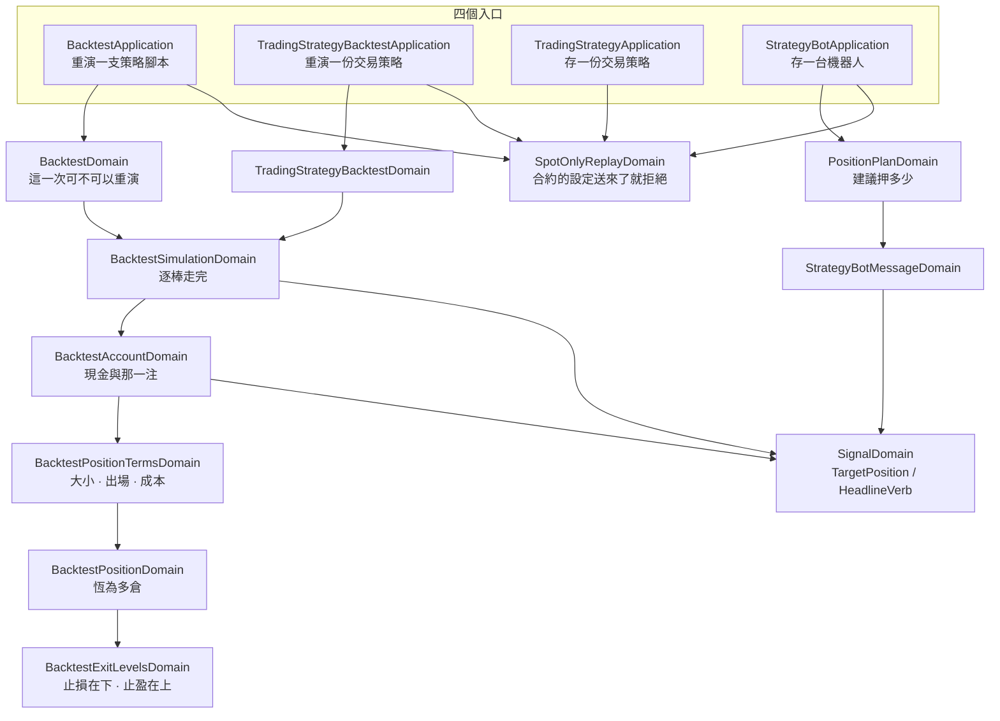

# 重演只做現貨 — Architecture Design

**Status:** Confirmed
**Source PRD:** `.sdd/2026-09-22-spot-only-backtest/PRD.md`
**Tech context:** Go · Gin · GORM · Clean / Onion Architecture（依賴一律指向 domain）

---

## 1. Design Goal & Guiding Principle

- **In one sentence:** 把「這一次重演照哪一套規則走」這個**選擇**從系統裡整個拿掉，
  讓重演只剩現貨那一套；同時讓「送來一件只有合約帳戶才講得出的設定」**發得出聲音**，
  而不是被安靜地讀成現貨。

- **Guiding principle:** **把交易模式留下的兩件行為交還給信號自己，把它留下的兩句拒絕收攏成一個模型。**

  `TradingModeDomain` 一直在做兩類完全不同的事：
  **(a)** 這一棒的信號要讓倉位變成什麼樣子、訊息的結論要寫成什麼動作；
  **(b)** 借不借得到錢，借得到就放行、借不到就拒絕。

  只剩一種模式之後，**(a) 不再是一個選擇，而是信號本身的意思**——
  「買入」就是「我要持有這個東西」，這句話不需要先問是哪一種帳戶。
  所以它掛回 `SignalDomain`：行為住在它操作的資料旁邊。

  而 **(b) 變成一句純粹的拒絕**，它唯一的價值是**只有一份**。
  四個入口會問同一件事，四份措辭遲早會分岔——這正是 `BorrowingRefusal()`
  當初被抽出來的理由，這一刀只是換一個名字繼續守著它。

---

## 2. Change Scope

| Area | Action | What / Why |
| :--- | :--- | :--- |
| `domains/trading_mode_domain.go` · `vo/trading_mode_vo.go` | **Delete** | 交易模式這個概念整個消失。只剩一種取值的列舉不是列舉 |
| `domains/backtest_leverage_domain.go` | **Delete** | 借錢與強制平倉整組移出重演 |
| `domains/leverage_multiplier_domain.go` | **Delete** | 它唯一的用處是判定「這個倍數算不算借錢」；現在答案恆為「不算，否則拒絕」 |
| `domains/spot_only_replay_domain.go` | **Add** | 收攏兩句拒絕：宣告了交易模式、或槓桿倍數大於一 |
| `domains/signal_domain.go` | **Modify** | 接手 `TargetPosition()` 與 `HeadlineVerb()` |
| `domains/backtest_position_domain.go` | **Modify** | 去掉方向、槓桿、強平與穿倉三段例外 |
| `domains/backtest_exit_levels_domain.go` | **Modify** | 逆向出場只剩止損；`PricesFrom` 不再收方向與槓桿 |
| `domains/backtest_position_terms_domain.go` | **Modify** | 四樣變三樣 |
| `domains/backtest_account_domain.go` · `backtest_simulation_domain.go` · `backtest_domain.go` · `trading_strategy_backtest_domain.go` | **Modify** | 不再持有交易模式；成績單不再有強平那一格 |
| `domains/position_sizing_domain.go` · `backtest_transaction_costs_domain.go` | **Modify** | 押注金額即曝險金額，兩者不再收槓桿 |
| `domains/position_plan_domain.go` · `dto/position_plan_dto.go` | **Modify** | 建議部位去掉槓桿、名目與做空那一半 |
| `domains/strategy_bot_domain.go` · `strategy_bot_message_domain.go` | **Modify** | 訊息不再有交易模式那一行；結論措辭問信號 |
| `domains/trading_strategy_domain.go` · `entities/trading_strategy.go` | **Modify** | 一份交易策略不再記著交易模式 |
| `entities/strategy_bot.go` | **Modify** | 建議部位不再記著槓桿倍數 |
| `vo/position_direction_vo.go` · `target_position_vo.go` · `trade_exit_reason_vo.go` · `exit_prices_vo.go` | **Modify** | 去掉空倉、去掉強平出場 |
| `dto/*` · `controller/models/*` | **Modify** | 兩個重演請求與交易策略請求去掉相應欄位 |
| `application/*` · `assistantqueries/*` · `infrastructure/assistant/*` | **Modify** | 助手工具目錄與說明不再描述四種模式與槓桿 |
| `postman/go-trading.postman_collection.json` | **Modify** | 同步移除那幾個欄位 |
| **合約那條線**（`k_candle_contract_*`、合約 proxy／repository／job／controller、合約追蹤名單） | **Not touched** | **一行都不動。** 它是合約重演將來要站的地基，而且與這一刀完全正交——這一刀只動「重演怎麼算」，不動「行情怎麼來」 |
| 止損／止盈、交易成本、倉位大小模式 | **Not touched**（只去掉槓桿那個參數） | 現貨一樣用得到，行為逐格不變 |
| 已存下的**每一列** | **Not touched** | 沒有一份交易策略、沒有一台機器人被改寫，也沒有一列被刪 |
| 兩欄沒有人讀的欄位（`trading_mode`、`position_plan_leverage`） | **Dropped** | 走 repo 既有的 `retiredColumns`：宣告式、冪等，啟動時清掉。**設計期原本判斷「留著」，實作期改判**——理由見下方 Known debt |

---

## 3. New Classes / Modules

| Name | Kind | Responsibility (purpose) | Collaborators | Satisfies (PRD scenario) |
| :--- | :--- | :--- | :--- | :--- |
| `SpotOnlyReplayDomain` | Domain Model | **守住「這個系統只重演現貨」這一句話**：讀掉呼叫端宣告的交易模式與槓桿倍數，會改變答案的整份拒絕，本來就等於現貨的照舊放行 | — | 宣告多空反手／槓桿做多／只做空／認不得的詞被整份拒絕；宣告現貨等於什麼都沒說；槓桿留白／零／一放行；大於一與小於一被拒絕；建立交易策略送來交易模式被拒絕；建立機器人送來大於一的槓桿被拒絕 |

**它為什麼是一個模型而不是四處各寫兩行。**
四個入口問的是同一件事，而**拒絕的那一句話是這一刀真正的產出**——
功能是被拿掉的，使用者唯一會碰到的新行為就是那兩句話。
四份拷貝會在第一次有人改善措辭時分岔，而分岔之後沒有任何測試會紅。
這也正是它前身 `TradingModeDomain.BorrowingRefusal()` 存在的理由，一字不改地繼承過來。

**它為什麼什麼都不回傳。**
建構子過了就沒有東西留下來——**這正是重點**：這一刀之後，
「這一次照哪一套規則走」不再是一個會被下游讀到的值。
一個回傳了什麼的版本，會引誘下游去問它，而下游一旦問了，
這個選擇就沒有真的消失。

```go
// 建構子即全部。過了就什麼都不剩——那正是「只有一種規則」的意思。
func NewSpotOnlyReplayDomain(
    declaredTradingMode string,
    declaredLeverageMultiplier decimal.Decimal,
) (SpotOnlyReplayDomain, error)
```

沒有宣告交易模式的入口傳空字串，沒有槓桿的入口傳零——
兩者都是「沒說」，而「沒說」本來就是它最常收到的東西。

---

## 4. Modified Components

| Component | Current role | Change needed |
| :--- | :--- | :--- |
| `SignalDomain` | 一棒的意見：買入／賣出／持平，會說出自己的字 | **接手交易模式留下的兩件行為**：`TargetPosition()`（買入→持有多倉、賣出→回到現金、持平→不變）與 `HeadlineVerb()`（買入→`買入`、賣出→`出場`、其餘→信號自己的字） |
| `BacktestPositionDomain` | 手上那一注 | 去掉 `direction` 與 `leverage` 欄位；`ProfitAt` 不再有做空那一支；`ClosedAt` 去掉強平與穿倉兩段例外；`CashReturnedFor` 回到「這一注值多少，減掉出場成本」 |
| `BacktestExitLevelsDomain` | 兩個出場距離 | `PricesFrom(entryPrice)`——不再收方向與槓桿。逆向出場恆為止損，止盈恆在上方 |
| `BacktestPositionTermsDomain` | 開一注的全部條件（四樣） | 變三樣：倉位大小、出場價位、交易成本。`OpenFor` 不再收方向 |
| `BacktestAccountDomain` | 手上的現金、那一注、已走完的交易 | 去掉 `tradingMode` 欄位；`Apply` 改問信號自己要什麼；平倉分支只剩「要現金」一種 |
| `BacktestTransactionCostsDomain` | 兩端的費率 | `MaximumStakeFrom(availableCash)`——去掉槓桿參數，分母退回 `(1 + 進場成本率)` |
| `PositionSizingDomain` | 每次開倉押多少 | `StakeFor` 與 `NeverStakesUnder` 去掉槓桿參數 |
| `BacktestDomain` · `TradingStrategyBacktestDomain` | 一次重演的條件與每一條規則 | 去掉交易模式與槓桿的建構；改為先過 `SpotOnlyReplayDomain` |
| `BacktestSimulationDomain` | 逐棒走完 | 去掉 `tradingMode`；成績單去掉 `LiquidationExitCount` |
| `PositionPlanDomain` | 機器人每一輪建議押多少 | 去掉 `leverage`；`PlanFor` 只剩「要持有」與「不建議」兩條路 |
| `StrategyBotMessageDomain` | 一輪的訊息 | 結論那一句問 `SignalDomain`；**刪掉交易模式那一行**；建議部位不印槓桿與名目 |
| `TradingStrategyDomain` · `TradingStrategy` | 一份規則 | 去掉 `tradingMode`；欄位由 `retiredColumns` 清掉 |
| `StrategyBotDomain` · `StrategyBot` | 一台機器人 | 去掉 `tradingMode` 與 `PositionPlanLeverage`；建議部位的槓桿改由 `SpotOnlyReplayDomain` 擋 |
| `StrategyBotApplication` | 建立／修改機器人 | **不再為了讀交易模式而多取一次交易策略**——擁有權那一關照舊，少掉的只是那個欄位 |
| `TradingStrategyBacktestApplication` | 重演一份交易策略 | 不再把交易策略的交易模式灌進請求 |
| `TradingStrategyBacktestAssistantQuery` · `TradingStrategyWriteAssistantArguments` · `ClaudeAssistantProxy` | 助手的工具目錄與說明 | 拿掉 `tradingMode`／`leverage`／`maintenanceMarginRate` 三個欄位與描述它們的整段文字 |
| `TradeExitReasonVo` | 出場原因 | 四種變三種，`liquidation` 刪除 |
| `PositionDirectionVo` | 倉位方向 | 只剩 `long`。**保留這個型別**——交易明細每一筆仍然說得出自己的方向，那是輸出形狀，不是一個選擇 |
| `TargetPositionVo` | 這一棒要讓帳戶持有什麼 | 三種：持有多倉、回到現金、不變。`short` 刪除 |
| `ExitPricesVo` | 開倉當下算好的出場價位 | `AdverseReason` 刪除——逆向那一個恆為止損 |

---

## 5. Component Relationships



---

## 6. Extensibility & Handoff Notes

- **Most likely next requirement:** **合約的重演。**
  借錢、開空、照**標記價格**判定強制平倉、資金費率。

- **Where it lands:** 三個接縫，全部是**新增**而不是改寫：

  1. **`SignalDomain.TargetPosition()`** ——「這一棒的意見要讓帳戶持有什麼」。
     合約的答案與現貨不同（賣出會開空倉，而不是回到現金）。
     那一刀新增一個**自己的**模型來回答同一個問題，
     而不是在這裡加一個 `if`。現貨這一支從此不必再被讀一次。
  2. **`BacktestPositionTermsDomain`** ——「一注是照什麼條件開的」。
     資金費率、借款利息都是**再加一樣**，加進來不動帳戶、不動逐棒前進、不動任何簽名。
     這一刀把它從四樣縮成三樣，縮的正是不屬於現貨的那一樣。
  3. **`SpotOnlyReplayDomain`** ——今天它說「這裡只做現貨」，
     明天它是「這一次是哪一種重演」開始有第二個答案的地方。**它的四個呼叫端已經在問了**。

- **How to add it:** 合約重演走它自己的入口與自己的模型，
  與現貨重演**並排**（正如合約 K 線與現貨 K 線並排）；
  共用的是逐棒前進、資金曲線、成績單這些與規則無關的東西。
  **不要**把交易模式加回來當開關——那正是這一刀拆掉的東西，
  而它拆掉的理由不是「模式太多」，是**現貨的行情判不了合約的強平**。

- **Patterns applied & why:**
  - **行為交還給資料**（`SignalDomain`）：只剩一種規則時，「買入是什麼意思」就是信號自己的意思。
  - **單一拒絕來源**（`SpotOnlyReplayDomain`）：四個入口、兩句話、一份。
  - **零值即「沒有」**（沿用既有慣例）：出場價位、交易成本的零值都是「不模擬這件事」，
    這一刀讓槓桿的「沒有」從「一倍」變成「不存在」，少一個要記的例外。

- **Do not hardcode:**
  - 兩句拒絕的措辭只能有一份，寫在 `SpotOnlyReplayDomain` 裡。
  - 「押注金額即曝險金額」是**現貨的事實**，不是一個常數一。
    合約重演要的是自己的一套算式，不是把 `1` 換成別的數字。

- **Known debt / deferred:**
  - **`SpotOnlyReplayDomain` 是過渡期的守門員。** 它存在的唯一理由是舊呼叫端可能還在送那些欄位。
    **撤掉它的訊號**：合約重演那一刀落地，屆時那些詞在合約的世界裡各自有了意思，
    由那一刀決定它們怎麼被讀，而不是被拒絕。
  - **`PositionDirectionVo` 只剩一個取值。** 保留是因為交易明細的輸出形狀不該為了這一刀而改。
    它是一個「現在只有一種、日後會有第二種」的列舉，不是壞味道。
  - **兩個沒有人讀的欄位：設計期說留著，實作期改成清掉。**
    原本的判斷建立在一個錯的前提上——「清掉欄位需要一支會動到資料的 migration」。
    這個 repo 有 `retiredColumns`：一份宣告式、冪等的清單，drop 一個沒有人讀的欄位
    不會碰到任何一台正在跑的機器人，也不需要有人去改自己存下的東西。
    它自己的註解早就寫下了留著的代價：
    「一個讀到 `trading_mode` 還在的人，有充分理由相信一份交易策略仍然記得它。」
    兩欄記的又都是預設值（四份交易策略全是 `spot`、五台機器人全是一倍），
    所以清掉不會拿走合約重演那一刀日後要用的任何資訊。**兩個欄位已加入該清單。**

---

## 7. Traceability

| PRD Scenario | Fulfilled by |
| :--- | :--- |
| US-01 空手時聽到買入就開倉 | `SignalDomain.TargetPosition` + `BacktestAccountDomain.Apply` |
| US-01 已經有倉位時再聽到買入不加碼 | `BacktestAccountDomain.Apply`（要的與手上的相同就什麼都不做） |
| US-01 有倉位時聽到賣出就平回現金 | `SignalDomain.TargetPosition` + `BacktestAccountDomain.settleOpenPosition` |
| US-01 空手時聽到賣出什麼都不發生 | `BacktestAccountDomain.Apply`（要現金、手上也沒有倉位 → 不開倉） |
| US-01 持平那一棒不動作 | `SignalDomain.TargetPosition`（不變） |
| US-01 整段重演的交易明細方向一致 | `BacktestPositionDomain`（恆為多倉）+ `ClosedTradeVo.Direction` |
| US-02 什麼都不宣告就照現貨跑 | `SpotOnlyReplayDomain`（空字串放行） |
| US-02 宣告現貨等於什麼都沒說 | `SpotOnlyReplayDomain`（`spot` 放行） |
| US-02 宣告多空反手／槓桿做多／只做空／認不得的詞被整份拒絕 | `SpotOnlyReplayDomain` + `BacktestValidationFailure(BacktestTradingModeField, …)` |
| US-02 建立交易策略時沒有交易模式可填 | `TradingStrategyWriteDto`／`TradingStrategyRequest`（欄位移除） |
| US-02 建立交易策略時送來交易模式被整份拒絕 | `SpotOnlyReplayDomain` + `ErrTradingStrategyValidation` |
| US-02 這一刀之前存下的交易策略照舊跑得動 | `TradingStrategy`（列不動，欄位交給 `SchemaMigrator` 清） |
| US-03 不提槓桿的重演跑得完 · 成績單沒有強平那一格 | `BacktestSimulationDomain.ToDto` + `BacktestSummaryDto`（欄位移除） |
| US-03 槓桿倍數填一／填零等於沒有借錢 | `SpotOnlyReplayDomain`（零與一放行） |
| US-03 槓桿倍數大於一被整份拒絕 | `SpotOnlyReplayDomain` |
| US-03 槓桿倍數小於一但不是零，同樣被整份拒絕 | `SpotOnlyReplayDomain`（沿用既有措辭） |
| US-03 一注承擔的就是押下去的錢 | `BacktestPositionDomain`（單位數由押注金額除以進場價） |
| US-03 出場原因只剩三種 | `TradeExitReasonVo` + `BacktestExitLevelsDomain.PricesFrom` |
| US-03 止損與止盈照舊生效 | `BacktestExitLevelsDomain` + `BacktestPositionDomain.ExitOn`（逐格不變） |
| US-03 交易成本照舊收 | `BacktestTransactionCostsDomain`（去掉槓桿參數，數值不變） |
| US-04 買入那一側寫買入 · 賣出那一側寫出場 | `SignalDomain.HeadlineVerb` |
| US-04 訊息裡沒有交易模式那一行 | `StrategyBotMessageDomain`（該段刪除） |
| US-04 各來源怎麼說照舊抄信號的字 | `StrategyBotMessageDomain`（既有 `SignalDomain.InWords`，不動） |
| US-04 建議部位不再印槓桿與名目 | `PositionPlanDto`（欄位移除）+ `StrategyBotMessageDomain` |
| US-04 建議部位的止損在參考價下方 | `PositionPlanDomain.PlanFor`（做空那一半移除） |
| US-04 建立機器人時送來大於一的槓桿被整台拒絕 | `SpotOnlyReplayDomain` + `ErrStrategyBotValidation` |
| US-04 這一刀之前建立的機器人照舊跑 | `StrategyBot`（列不動，欄位交給 `SchemaMigrator` 清） |
| US-05 助手說不出交易模式與槓桿 | `TradingStrategyWriteAssistantArguments` · `TradingStrategyBacktestAssistantQuery` · `ClaudeAssistantProxy`（工具目錄與說明移除） |
| US-06 合約追蹤名單／行情／背景抓取原封不動 | **無元件**——這一刀不碰合約那條線的任何檔案 |

---

## 8. Risks & Open Decisions

### Risks / trade-offs

- **`SpotOnlyReplayDomain` 建構完不留下任何東西**，看起來像一個「只會丟錯誤的類別」。
  這是刻意的：它留下東西就等於下游還問得到「這一次是哪一種規則」，
  而這一刀的目的正是讓那個問題消失。**替代方案**是把兩句拒絕各自寫回四個入口，
  代價是四份措辭遲早分岔——而這一刀對使用者唯一可見的新行為，就是那兩句話。

- **刪除的量很大（約 2,000 行含測試）。** 風險不在刪，在**刪漏**：
  留下一個沒有人用、卻仍然編得過的分支。
  對策是**由內而外**刪（先 vo，再 domain model，再 dto／controller／assistant），
  每一步都讓編譯器指出下一處；編譯器沉默即代表這一層乾淨。

- **五台正在跑的機器人。** 它們的建議部位都記著槓桿一倍。
  沒有一列被改寫，欄位本身被 `retiredColumns` 清掉，而那一欄記的正是「等於沒填」，
  所以它們讀得動、跑得動，建議的每一個數字逐格相同。
  **驗收方式**：訊息逐行比對這一刀前後——唯一該不同的是「保證金」改稱「開倉金額」。

### Open decisions (for implementation)

- **`BacktestLeverageField` 這個欄位名要不要留。**
  建議**留**：槓桿被拒絕時仍然要指得出是哪一格，而那一格在呼叫端的畫面上還在。
  同理 `BacktestTradingModeField`。兩者都在合約重演那一刀重新決定去留。

- **`PositionPlanDomain.PlanFor` 還要不要收 `TargetPositionVo`。**
  建議**留**：它仍然要分辨「這一輪要開倉」與「這一輪叫他出場」，
  而那個分辨正是 `TargetPositionVo` 在答的。收一個布林會把同一件事講第二次。
