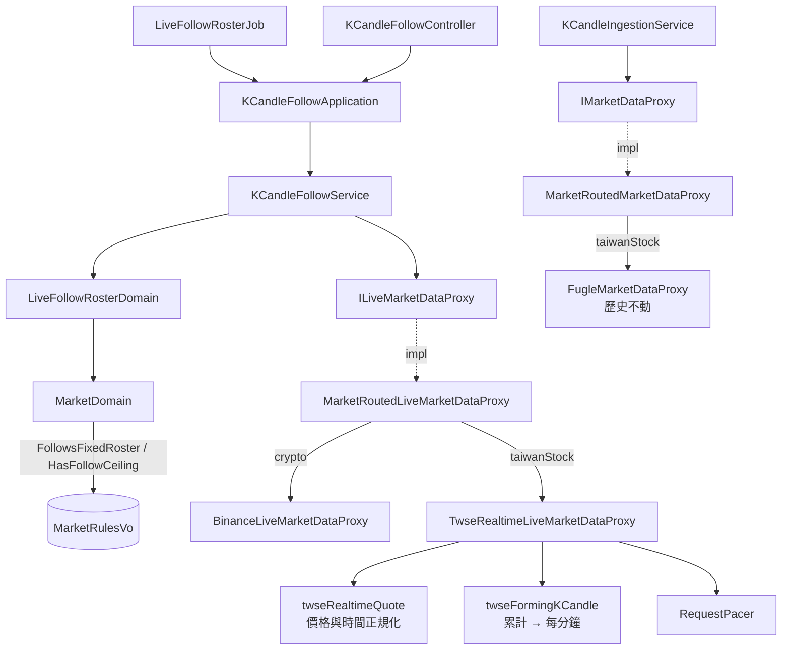

# 台股即時行情改由證交所提供 — Architecture Design

**Status:** Confirmed
**Source PRD:** `.sdd/2026-09-22-taiwan-stock-live-quote-source/PRD.md`
**Tech context:** Go · Clean/Onion Architecture · Gin · GORM/PostgreSQL · 手動 DI（`cmd/server/dependencies.go`）

---

## 1. Design Goal & Guiding Principle

- **In one sentence:**
  讓台股的即時行情換一家來源、並且拿掉它的檔數天花板，而「誰在跟、怎麼切通道、中斷了怎麼辦」**一行都不必改**。

- **Guiding principle 1：把「有沒有天花板」與「跟不跟固定名單」分成兩件事。**

  今天 `MarketDomain.HasFollowCeiling()` 一個人回答了三個問題：這個市場要不要發名額、觀看者該不該被擋在名額外、以及**這個市場是照名單跟還是有人看才跟**。三者在今天永遠同進同出，因為唯一有天花板的市場剛好也是唯一照名單跟的市場。

  本次把台股的天花板拿掉，那個巧合就散了——台股**仍然照名單跟**（沒人看也跟），但**不再有名額**。若沿用同一個問題，台股會在拿掉天花板的瞬間變成「有人看才跟」，而且不在觀察清單上的台股會被告知「有即時更新」然後永遠不動。

  所以新增 `FollowsFixedRoster()`，讓天花板回去只管天花板。**這不是多一個旗標，是把一個被重載的旗標拆回它本來的兩個意思。**

- **Guiding principle 2：單位換算只有一處，而且那一處沒有人繞得過去。**

  證交所報「當日累計」、富果報「這一根的量」。不對齊時**沒有任何東西會報錯**——只有量能相關的判斷會安靜地失準。

  **單位則不必對齊：兩者同為「張」**（2026-09-23 實測更正，見 §8）。

  因此差分被關在**收下的那一刻**：forming candle 負責把當日累計換成每分鐘（需要記得這一分鐘的起點）。系統其餘每一處只認識「這一根的量」，不必各自記得這件事。

---

## 2. Change Scope

| Area | Action | What / Why |
| :--- | :--- | :--- |
| `domain/models/vo/market_rules_vo.go` | **Modify** | 多 `FollowsFixedRoster`。市場的即時跟盤是照名單還是照觀看者，是**來源的形狀**，與天花板是兩件事 |
| `domain/models/domains/market_domain.go` | **Modify** | 多 `FollowsFixedRoster()`；`HasFollowCeiling()` 保留但**只剩天花板一個意思** |
| `domain/models/domains/live_follow_roster_domain.go` | **Modify** | 進名單的條件改為「照名單跟的市場」；**無天花板＝不限名額**，不再等同於「沒有名額」。`HasLiveUpdates` 改問 `FollowsFixedRoster()` |
| `domain/service/k_candle_follow_service.go` | **Modify** | 觀看者抵達時那一個分支改問 `FollowsFixedRoster()`。**其餘一字不改**——開通道、重建、中斷、重試全部原封不動 |
| `infrastructure/marketdata/twse_realtime_wire.go` | **Add** | 證交所答覆的形狀，與 `toLiveKCandleVo()`（價格與時間的正規化；**成交量原樣帶過，不換算**） |
| `infrastructure/marketdata/twse_realtime_live_market_data_proxy.go` | **Add** | `TwseRealtimeLiveMarketDataProxy`，實作既有的 `ILiveMarketDataProxy` |
| `infrastructure/marketdata/twse_forming_k_candle.go` | **Add（由 fugle 版改名而來）** | 折疊邏輯照舊，**多一件事：累計量換成這一分鐘的量** |
| `infrastructure/marketdata/fugle_live_market_data_proxy.go` | **Delete** | 台股即時不再走富果 |
| `infrastructure/marketdata/fugle_forming_k_candle.go` | **Delete** | 由 `twse_forming_k_candle.go` 取代 |
| `infrastructure/marketdata/fugle_wire.go` | **Modify** | 刪掉串流那幾個型別；candle 的部分**留著**，歷史還在用 |
| `config/application_config.go` | **Modify** | `TaiwanStockConfig` 的即時那幾格換掉；新增證交所的位址、詢問間隔、節奏上限 |
| `cmd/server/dependencies.go` | **Modify** | 即時那張 map 換一個值、多一個 pacer。**介面與其他兩張 map 不動** |
| `_interface.ILiveMarketDataProxy` | **Not touched** | 契約是「給我一個 channel」，輪詢實作完全滿足它 |
| `_interface.IMarketDataProxy` · `FugleMarketDataProxy` | **Not touched** | 歷史照舊走富果 |
| `_interface.ISymbolLookupProxy` · `FugleSymbolLookupProxy` | **Not touched** | 代號確認不在本次範圍；換它會把 entity 與既有資料一起拖進來 |
| `MarketRoutedLiveMarketDataProxy` | **Not touched** | 換的是 map 裡的值，不是 map 本身——這正是它當初存在的理由 |
| `KCandleFollowController` · SSE · 前端 | **Not touched** | 觀看者看到的形狀與時機一個字都不變 |
| 加密貨幣 · 永續合約 | **Not touched** | 它們的來源本來就不限檔數、也不照名單跟 |

---

## 3. New Classes / Modules

| Name | Kind | Responsibility (purpose) | Collaborators | Satisfies (PRD scenario) |
| :--- | :--- | :--- | :--- | :--- |
| `vo.MarketRulesVo.FollowsFixedRoster` | VO 欄位 | 這個市場的即時跟盤是**照名單**（沒人看也跟）還是**照觀看者**（有人看才跟） | — | US-01「八檔全部都在名單上」「收盤一檔都不跟」「不在觀察清單上的仍被告知沒有即時更新」 |
| `domains.MarketDomain.FollowsFixedRoster()` | Domain method | 回答上面那個問題，**與天花板無關** | `vo.MarketRulesVo` | 同上 |
| `marketdata.TwseRealtimeLiveMarketDataProxy` | Proxy | 向證交所定期問一條通道上的每一檔，把答覆折成 K 線送進 channel。**藏起來的事**：兩種掛牌前綴都問、一次問不完就分批、問的節奏、收盤後不再問 | `twseRealtimeQuote`、`twseFormingKCandle`、`RequestPacer`、`MarketDomain` | US-01 全部、US-04「即時向證交所取」、US-05 全部 |
| `marketdata.twseRealtimeQuote` | wire | 證交所答覆的形狀；`toLiveKCandleVo()` 做價格與時間的正規化，**成交量原樣帶過** | `vo.LiveKCandleVo` | US-02 全部 |
| `marketdata.twseFormingKCandle` | 折疊器 | 把快照折進它該落的那一分鐘，並把**當日累計量換成這一分鐘的量**；一個快照落到更後面的分鐘即證明前一分鐘收完了 | `vo.LiveKCandleVo` | US-03 全部 |

**深度檢查（deep module）**：`TwseRealtimeLiveMarketDataProxy` 對外只有 `FollowKCandles(ctx, channel)`——與被它取代的富果版**簽名完全相同**，呼叫端沒有多學任何東西。它身後藏著六件呼叫端不必知道的事（前綴、分批、節奏、換算、差分、收盤）。沒有「And/Then」式的命名，沒有要呼叫端自己排的步驟，參數沒有變長。通過。

`FollowsFixedRoster()` 是**把一個問題拆成兩個**而不是加一個旗標：拆完之後每個問題各自只有一個答案，而拆之前那一個問題有三個用途、其中兩個即將分道揚鑣。

---

## 4. Modified Components

| Component | Current role | Change needed |
| :--- | :--- | :--- |
| `vo.MarketRulesVo` | 交易時段 ＋ 方案的兩個數字 | 多 `FollowsFixedRoster bool`。台股 `true`、加密貨幣 `false` |
| `MarketDomain.HasFollowCeiling()` | 同時回答天花板、名額、與跟盤模式 | **只剩天花板**。註解要說清楚它不再回答「照不照名單跟」 |
| `MarketDomain.SimultaneousFollowCeiling()` | 通道數 × 每條檔數；`0` 代表不設限 | **不改**。台股的通道數設為 `0`，於是回 `0`＝不設限 |
| `MarketDomain.SymbolsPerLiveChannel()` | 一條通道跟幾檔 | **不改**，但語意由「方案允許訂幾檔」變成「**一次詢問涵蓋幾檔**」，註解要跟著改 |
| `LiveFollowRosterDomain` 建構子 | 只有「有天花板」的市場進名單；名額用完就跳過 | 改為「**照名單跟**」的市場進名單；有天花板才數名額，**無天花板即不限**。這是本次唯一一處邏輯真的變了的 domain 程式碼 |
| `LiveFollowRosterDomain.HasLiveUpdates` | `!HasFollowCeiling()` → 一律 `true` | 改問 `!FollowsFixedRoster()`。否則台股拿掉天花板後，**不在觀察清單上的台股會被告知有即時更新** |
| `KCandleFollowService.WatchKCandles` | `HasFollowCeiling()` 決定「告知沒有名額」還是「開一條自己的通道」 | 改問 `FollowsFixedRoster()`。**本檔其他每一行不動** |
| `TaiwanStockConfig` | 富果的四個位址 ＋ 方案兩個數字 | 即時那兩格退場（`StreamUrl`）；新增證交所位址、詢問間隔、節奏上限；`SimultaneousChannelCeiling` 改為 `0`、`SymbolsPerLiveChannel` 改為一次問得了的檔數 |
| `dependencies.go` | 即時 map 指向富果 | 指向證交所；多一個證交所專用的 `RequestPacer`（額度與富果各算各的） |

---

## 5. Component Relationships

---

## 6. Extensibility & Handoff Notes

- **Most likely next requirement:** **台股的即時來源再換一家**（證交所擋人、或想要更快），其次是**第三個市場**。

- **Where it lands:**
  - 換即時來源 → 一份新的 `ILiveMarketDataProxy` 實作 ＋ `dependencies.go` 那張 map 改一個值。**domain 一行都不動**——本次自己就是這條路走過一遍的證明。
  - 第三個市場 → 三張 map 各加一行、`MarketRulesVo` 多一筆。與既有 ARCH 所述一致。

- **Patterns applied & why:**
  - **Adapter behind an unchanged interface**：新 proxy 與舊 proxy 簽名相同，所以「換來源」對呼叫端不存在。輪詢與推送的差別整個留在 infrastructure——**契約說的是「給我一個 channel」，從來沒說那個 channel 背後是不是一條長連線**。
  - **把重載的概念拆開**：`FollowsFixedRoster` 不是新功能，是把 `HasFollowCeiling` 身上不屬於它的那個意思還回去。
  - **轉換寫在來源身上**（`toLiveKCandleVo()`）：沿用 `fugleCandle` 既有形狀，不發明第二種寫法。

- **Do not hardcode:**
  - **詢問間隔**——那是對來源的禮貌程度，不是業務規則，問得太勤會被擋（設定，預設三秒）。
  - **一次詢問涵蓋的檔數**——來源沒有公布上限，實測五十筆可行（設定）。
  - **任何成交量的比例換算**——兩個台股來源同為「張」，乘上任何數字都是憑空造數。
  - **任何一處 `if market == taiwanStock`**——市場的差異一律問 `MarketDomain`。

- **Known debt / deferred:**
  - **掛牌板別靠「兩種前綴都問」推得**，因此一次詢問的容量減半。**該回頭處理的訊號**：觀察清單上的台股多到讓分批次數影響更新間隔。屆時的解法是把板別記在交易標的上，代價是動到代號確認與既有資料。
  - **代號確認仍走富果**，因此加入觀察清單時拿到的名稱是富果給的。證交所的答覆裡就有中文名，換過去可以順便不吃富果額度——但那會動到 entity 與既有資料，不在本次。
  - **證交所的五檔買賣價量一併收到卻丟棄**。目前沒有功能用得到；要用時它就在 wire 型別旁邊，不必再問一次。
  - **`HasFollowCeiling()` 拆分後暫時沒有任何市場回 `true`**（台股的天花板拿掉了，加密貨幣本來就沒有）。刻意保留而不刪除：它是一個真實的、方案會再次施加的限制，而重新長回來的成本遠高於留著一個沒人回 `true` 的問題。**該回頭處理的訊號**：一年後仍然沒有任何市場需要它。

---

## 7. Traceability

| PRD Scenario | Fulfilled by |
| :--- | :--- |
| US-01 八檔台股全部都在跟盤名單上 | `LiveFollowRosterDomain` 建構子（無天花板＝不限名額） |
| US-01 只有一檔時照樣跟 | 同上 |
| US-01 一檔都沒有時不向證交所問任何東西 | `LiveFollowRosterDomain.Channels()` 回空，`startMissingChannels` 無事可做 |
| US-01 名單超過一次問得了的檔數時分成數次問 | `MarketDomain.SymbolsPerLiveChannel()` ＋ `Channels()` 既有的切段 |
| US-01 收盤時段一檔都不跟 | `MarketDomain.IsOpen`（建構子既有的過濾） |
| US-01 不在觀察清單上的台股仍被告知沒有即時更新 | `LiveFollowRosterDomain.HasLiveUpdates` ＋ `KCandleFollowService.noLivePlaceUpdates`，兩處都改問 `FollowsFixedRoster()` |
| US-02 證交所報的張換算成股 | `twseRealtimeQuote.toLiveKCandleVo()` |
| US-02 零張就是零股 | 同上（`Volume` 是必填值，零是確定的零） |
| US-02 歷史與即時的成交量量級相同 | 同上 ＋ `FugleMarketDataProxy` 不動 |
| US-03 累計增加多少就是這一分鐘的量 | `twseFormingKCandle` |
| US-03 累計沒有增加就不送 | 同上 |
| US-03 一根走完時存入的是這一分鐘的量 | 同上（既有的「落到更後面的分鐘即證明前一分鐘收完」） |
| US-03 累計倒退時重新起算而不產出負數 | 同上 |
| US-03 整天沒有成交就整天不送 | 同上 |
| US-04 歷史仍向富果取 | `MarketRoutedMarketDataProxy` 不動 |
| US-04 即時向證交所取 | `dependencies.go` 即時 map 指向 `TwseRealtimeLiveMarketDataProxy` |
| US-04 證交所問不到時歷史照常補齊 | 兩張 map 互不相干；中斷走既有的 `KCandleFollowService` 規則 |
| US-04 富果取不到時即時照常 | 同上 |
| US-05 成交最慢約八秒反映到畫面 | `TwseRealtimeLiveMarketDataProxy` 的詢問間隔（設定） |
| US-05 延遲不影響走完那一根的內容 | `twseFormingKCandle` 以快照自己的時間決定落在哪一分鐘，不用收到的時間 |
| US-05 策略判斷不受延遲影響 | 既有規則：判斷發生在 K 線走完之後，本次不動 |

---

## 8. Risks & Open Decisions

**Correction (2026-09-23):**

> **2026-09-23 更正。** 本切片原先寫著「富果以股報量、證交所以張報量，差一千倍」，並據此在收下證交所報價時乘一千。**那是錯的。** 盤中實測：2026-09-22，2330 的富果分 K 成交量加總與證交所當日累計同為 `18876`，一單位不差——兩者都以**張**計。那個換算因此正好製造出它想防的一千倍落差，已移除。證交所官方的**日**成交股數（22,009,927 股）是另一回事：以股計，且含盤後定價與零股，不能拿來當分 K 的單位依據。

**Risks / trade-offs:**

- **拆開 `HasFollowCeiling` 是本次唯一會靜默壞掉的地方。** 漏改任何一處，台股會在拿掉天花板的瞬間變成「有人看才跟」，或讓不在觀察清單上的台股被告知有即時更新然後永遠不動。三處呼叫點（follow service、roster 建構子、`HasLiveUpdates`）必須一起改，且每一處都要有測試釘住。

- **累計量的差分讓 forming candle 從「只記得這一分鐘長什麼樣」變成「還記得這一分鐘起點累計到哪」。** 這是本次唯一新增的狀態。跨分鐘、跨日、來源重新起算三種情形都必須有明確行為，否則會產出負的成交量——而負的成交量不會有任何東西攔下它。

- **一次詢問問兩種前綴，容量減半。** 明知的代價，換來的是不動 entity、不動既有資料、不動代號確認。

- **證交所沒有公布節奏上限。** 實測可行不等於長期可行。因此詢問間隔是設定、且走既有的 `RequestPacer`；另外**不得送出瀏覽器式的來源標頭**——實測送了就被擋，這件事必須寫進該處註解，否則下一個人會「補齊 header 讓它更像瀏覽器」然後把線弄斷。

- **即時延遲由不到一秒變成最慢約八秒。** 已在 PRD 接受：所有判斷都發生在 K 線走完之後。

**Open decisions (for implementation):**

- 證交所答覆中**價格欄位在尚未成交時的形態**（空字串、`-`、或前一日參考價）於實作時對照實際答覆確定；正規化的目標形狀（`vo.LiveKCandleVo`）已固定，不受其影響。
- **收盤後的最後一次詢問**是否要把最後一根標記為走完。傾向不要——既有規則就是「最後一根由每分鐘一輪的自動抓取收走」，本次不改。
- `HasFollowCeiling()` 拆分後暫無呼叫者回 `true`，是否要一併把 `SimultaneousChannelCeiling` 設定移除。傾向保留，理由見 §6。
