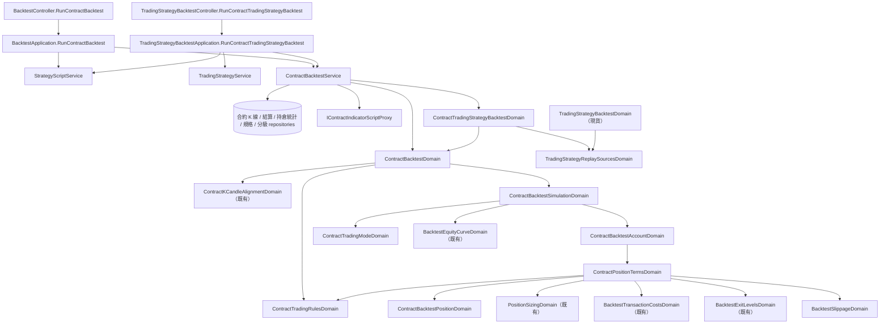

# 合約回測 — Architecture Design

**Status:** Confirmed（使用者授權一律採 best practice）
**Source PRD:** `.sdd/2026-09-23-contract-backtest/PRD.md`
**Tech context:** Go · Gin · GORM · Clean / Onion Architecture（依賴一律指向 domain；行為住在 `domains/`，entity 乾淨）

---

## 1. Design Goal & Guiding Principle

- **In one sentence:** 在現貨重演旁邊**並列**一條合約重演：同一種逐格往前走的形狀，
  但帳戶與倉位換成**逐倉合約**的規則（方向、保證金／名目、標記價格強平、資金費用、交易規格、滑點），
  並讓交易策略帶著行情種類與合約交易模式進到這條路。

- **Guiding principle:** **共用「形狀」與「零件」，不共用「規則」。**
  現貨重演的帳戶（`BacktestAccountDomain`）與倉位（`BacktestPositionDomain`）的每一行註解都是「只朝一個方向、
  借不到錢」的證明；把合約規則塞進去，等於重新打開 `spot-only-backtest` 那一刀刻意關上的門。
  所以合約另有自己的**帳戶、倉位、逐格走**三個模型；而與規則無關的零件——
  倉位大小、交易成本、出場距離、資金曲線、信號、條件樹裁決、合約行情格對齊——**原封重用**。

  唯一被抽出來共用的新東西是**交易策略的信號來源與兩棵條件樹怎麼逐格合成一個信號**
  （`TradingStrategyReplaySourcesDomain`）：現貨與合約兩種交易策略重演要逐格得到**完全相同**的信號，
  那是「單一來源的合約交易策略等於那一支腳本」這條驗收的根據。

---

## 2. Change Scope

| Area | Action | What / Why |
| :--- | :--- | :--- |
| `domains/contract_backtest_*`（見 §3） | **Add** | 合約重演的請求、交易規則、倉位條件、倉位、帳戶、逐格走 |
| `domains/contract_trading_mode_domain.go` · `vo/contract_trading_mode_vo.go` · `vo/contract_target_position_vo.go` | **Add** | 合約交易模式三選一，以及它把一個信號讀成的目標倉位 |
| `domains/backtest_slippage_domain.go` | **Add** | 滑點的驗證與「往不利方向偏」 |
| `domains/trading_strategy_replay_sources_domain.go` | **Add（抽出）** | 從 `TradingStrategyBacktestDomain` 抽出：共同刻度、參數、條件樹、**來源行情種類**、逐格合成 |
| `domains/trading_strategy_backtest_domain.go` | **Modify** | 改由 `TradingStrategyReplaySourcesDomain` 提供來源與合成；多檢查「交易策略吃 K 線、每個來源吃 K 線」 |
| `domains/backtest_transaction_costs_domain.go` | **Modify** | 多一個 `ForMarginAt(leverage)`：讓既有的「可押上限」照名目收進場成本 |
| `domains/backtest_exit_levels_domain.go` | **Modify** | 多一個 `PricesFacing(direction, entryPrice)`：空倉的止損在上、止盈在下；既有 `PricesFrom` 不動 |
| `domains/market_data_kind_domain.go` | **Modify** | 多兩句重演用的拒絕（`RequireReplayableAs`）、交易策略用的「不得更換」（`RetainingForTradingStrategy`）與「機器人只跑 K 線」（`RequireFollowableByStrategyBot`） |
| `domains/trading_strategy_domain.go` · `trading_strategy_signal_sources_domain.go` | **Modify** | 交易策略有行情種類；合約的那一種讀合約交易模式；K 線的那一種照舊擋交易模式；每個來源的行情種類要與交易策略相同 |
| `entities/trading_strategy.go` · `dto/trading_strategy_dto.go` · `dto/trading_strategy_write_dto.go` | **Modify** | 多 `MarketDataKind`（預設 `kCandle`）與 `TradingMode`（合約才有值）兩欄；來源寫入多 `DeclaredMarketDataKind` |
| `dto/trading_strategy_backtest_request_dto.go` | **Modify** | 多 `TradingStrategyMarketDataKind`；`ResolvedSignalSourceDto` 多 `MarketDataKind` |
| `dto/contract_backtest_*_dto.go` · `vo/contract_closed_trade_vo.go` · `vo/position_direction_vo.go` · `vo/trade_exit_reason_vo.go` | **Add / Modify** | 合約請求、結果、成績單、交易明細；方向多 `short`；出場原因多 `liquidation` |
| `service/contract_backtest_service.go` | **Add** | 兩種合約重演的編排：讀合約 K 線、結算、持倉統計、交易規格、分級，跑算式，交給 domain |
| `application/backtest_application.go` · `trading_strategy_backtest_application.go` · `trading_strategy_application.go` · `strategy_bot_application.go` | **Modify** | 合約兩個用例；現貨兩個用例補上行情種類檢查；存交易策略時帶上來源行情種類；機器人擋合約交易策略 |
| `controller/backtest_controller.go` · `trading_strategy_backtest_controller.go` · `controller/models/*` | **Modify / Add** | `POST /contract-backtests`、`POST /trading-strategies/:id/contract-backtests`；交易策略請求多 `marketDataKind` |
| `cmd/server/dependencies.go` · `routes_test.go` · `postman/` | **Modify** | 組裝、路由、Postman |
| `BacktestAccountDomain` · `BacktestPositionDomain` · `BacktestSimulationDomain` · `BacktestDomain` 的規則 | **Not touched** | 現貨重演一字不變；`SpotOnlyReplayDomain` 照舊守著現貨那兩扇門 |
| 合約行情的抓取、背景 job、合約指標計算 | **Not touched** | 只讀它們存下來的東西 |
| 系統內建助手（`assistantqueries/*`） | **Not touched** | Out of scope；助手照舊只認得現貨重演 |

---

## 3. New Classes / Modules

| Name | Kind | Responsibility (purpose) | Collaborators | Satisfies |
| :--- | :--- | :--- | :--- | :--- |
| `ContractTradingModeVo` | VO | `longShort`／`longOnly`／`shortOnly` 三個拼法 | — | US-02 |
| `ContractTargetPositionVo` | VO | 一個信號在某種合約交易模式下要帳戶變成什麼：`long`／`short`／`flat`／`unchanged` | — | US-02 |
| `ContractTradingModeDomain` | Domain Model | 讀宣告（留白→`longShort`，認不得含 `spot` 即拒絕並列出三種）；`TargetFor(signal) ContractTargetPositionVo` | `SignalDomain` | US-02、US-09 |
| `BacktestSlippageDomain` | Domain Model | 滑點驗證（不得為負、不得超過 100）；`BuyingAt(price)`、`SellingAt(price)` 往不利方向偏；留白為零 | — | US-03 |
| `ContractTradingRulesDomain` | Domain Model | **這個合約標的交易所的規矩**，由交易規格 entity 與分級 entity 建成：沒有規格即拒絕；`MaximumLeverage()`（分級最高那一級，沒有分級則無上限）；`QuantityFor(notional, price)` 照步進往下取整；`Admits(quantity, price, leverage)`（最小下單量、最小名目、所在那一級的最高槓桿）；`TierFor(notional)`（維持保證金率＋速算額；沒有分級退回規格最小那一級、速算額 0）；`RoundedToTick(price)`；`BasisDto()`（維持保證金依據） | `entities.ContractTradingSymbol`、`entities.ContractMaintenanceMarginTier` | US-01 #5 #6、US-03、US-04 #5 #6 |
| `ContractBacktestDomain` | Domain Model | 一次合約重演的**請求與讀取計畫**：驗證標的、刻度、期間、初始資金、倉位大小、出場價位、交易成本、槓桿（留白/零→1、<1 拒、>`MaximumLeverage` 拒）、合約交易模式、滑點、參數；說出要讀哪一段合約 K 線；`SelectInput` 把合約 K 線合成走完的刻度區間（≥2 格）並交回 `ContractKCandleAlignmentDomain`；`ReplayOver(alignment, signals, settlements)` 交出結果 | `ContractTradingRulesDomain`、`ContractPositionTermsDomain`、`ContractBacktestSimulationDomain` | US-01、US-02 #7 #8、US-03 #4 #8、US-08 |
| `ContractPositionTermsDomain` | Domain Model | **開一注合約的全部條件**：倉位大小、出場距離、交易成本、滑點、槓桿、交易規則。唯一的問題：`OpenFor(direction, time, closePrice, availableCash)` → 開成的倉位／付不起／被交易規則擋下 | `PositionSizingDomain`、`BacktestTransactionCostsDomain.ForMarginAt`、`BacktestExitLevelsDomain.PricesFacing`、`BacktestSlippageDomain`、`ContractTradingRulesDomain` | US-01 #1 #6、US-03 |
| `ContractBacktestPositionDomain` | Domain Model | 手上那一注合約：方向、進場時間／價、開倉保證金、槓桿、數量、止損止盈價、所在那一級、進場成本、**資金費用淨額**。`LiquidationPrice()`（逐倉公式，隨資金費用變）；`SettleFunding(settlement, fallbackMark)`；`ExitOn(bucket)`（不利側：止損看最新價、強平看標記價格，近的先；再止盈）；`ClosedAt(...)`；`CashReturnedFor(trade)`（強平為零）；`ValueAt(price)`（不低於零） | `BacktestSlippageDomain` | US-04、US-05、US-06 |
| `ContractBacktestAccountDomain` | Domain Model | 可用資金、那一注、已平倉交易、被擋下的開倉次數。`SettleFundingWithin(bucketStart, bucketEnd, settlements, markClose)`、`ApplyExitLevels(bucket)`、`Apply(target, time, closePrice)`（平、開、反手；反手先結清再開）、`EquityAt(price)`；成績單所需的彙總（強平筆數、累計資金費用、做多做空筆數與勝率） | `ContractPositionTermsDomain` | US-02 #9、US-06 #8、US-07 |
| `ContractBacktestSimulationDomain` | Domain Model | 逐格走一次：①資金費用 ②出場價位 ③信號 ④資金曲線；產出 `ContractBacktestResultDto` | `ContractBacktestAccountDomain`、`ContractTradingModeDomain`、`BacktestEquityCurveDomain` | US-04～US-07 |
| `ContractTradingStrategyBacktestDomain` | Domain Model | 一次合約交易策略重演：交易策略必須吃合約行情、每個來源吃合約行情、重演不得送交易模式；刻度由來源說；其餘交給 `ContractBacktestDomain` | `TradingStrategyReplaySourcesDomain`、`ContractBacktestDomain` | US-10 |
| `TradingStrategyReplaySourcesDomain` | Domain Model（抽出） | 交易策略重演的**信號那一半**：共同刻度、每個來源的參數、兩棵條件樹、`RequireMarketDataKind(kind)`（說出哪一個來源吃另一種行情）、`Combine(candleCount, signalsBySource)`（逐格裁決、打架計數） | `SharedAggregationIntervalDomain`、`TradingStrategyConditionDomain`、`StrategyBotVerdictDomain` | US-10 #5 #6、US-11 #2 |
| `ContractBacktestService` | Domain Service | `RunContractBacktest`、`RunContractTradingStrategyBacktest`：讀規格與分級 → 建 domain → 讀合約 K 線 → 對齊（結算、持倉統計）→ 逐格跑合約算式 → `ReplayOver` | `IKCandleContractRepository`、`IContractFundingRateSettlementRepository`、`IContractPositionStatisticRepository`、`IContractTradingSymbolRepository`、`IContractMaintenanceMarginTierRepository`、`IContractIndicatorScriptProxy`、`IClockProxy` | 全部合約場景 |
| `ContractBacktestRequestDto` · `ContractTradingStrategyBacktestRequestDto` · `ContractBacktestResultDto` · `ContractBacktestSummaryDto` · `ContractClosedTradeDto` · `MaintenanceMarginBasisDto` | DTO | 兩個合約重演的輸入；結果（交易模式、槓桿、成績單、交易明細、資金曲線） | — | US-07 |
| `ContractClosedTradeVo` | VO | 一筆走完的合約交易（方向、槓桿、數量、保證金、進出場、兩筆成本、資金費用淨額、淨損益、出場原因）；`ToDto()`、`IsWin()` | — | US-07 |
| `ContractBacktestRequest` · `ContractTradingStrategyBacktestRequest` | Request | 兩個合約入口的 body | — | — |

**邊界形狀（deep module 檢查）**

```go
// 服務對 application 只有兩個動詞，各收一個 DTO、回一個 DTO。
func (s *ContractBacktestService) RunContractBacktest(ctx, dto.ContractBacktestRequestDto) (dto.ContractBacktestResultDto, error)
func (s *ContractBacktestService) RunContractTradingStrategyBacktest(ctx, dto.ContractTradingStrategyBacktestRequestDto) (dto.ContractBacktestResultDto, error)

// 帳戶只被問三件事、依序；順序本身就是規則，寫在 simulation 那一個迴圈裡。
account.SettleFundingWithin(bucketStart, bucketEnd, settlements, bucket.MarkClose)
account.ApplyExitLevels(bucket, candleTime)
account.Apply(tradingMode.TargetFor(signal), candleTime, bucket.Close)

// 開一注是一個問題，不是「算保證金→取整→檢查→建倉」四步。
terms.OpenFor(direction, candleTime, closePrice, availableCash) (ContractBacktestPositionDomain, contractOpeningOutcome)
```

**關鍵算式（寫在模型裡的那一份）**

- 名目 ＝ 保證金 × 槓桿；數量 ＝ `QuantityFor(名目, 成交價)`（步進往下取整）；實際保證金 ＝ 數量 × 成交價 ÷ 槓桿。
- 可押上限：`PositionSizingDomain.StakeFor(cash, costs.ForMarginAt(leverage))`——`ForMarginAt` 把進場成本率乘上槓桿，
  因為進場成本照名目收、而保證金是名目的 1/槓桿；分母因此變成 (1 ＋ 槓桿 × 進場成本率)。出場成本率不受影響。
- 強平價（M＝目前保證金＝開倉保證金＋資金費用淨額，q＝數量，E＝進場價，r＝維持保證金率，c＝速算額）：
  多倉 `(qE − M − c) / (q(1 − r))`，空倉 `(qE + M + c) / (q(1 + r))`。多倉強平價 ≤ 0 即永不強平。
- 資金費用 ＝ q × 結算標記價格（沒有則該格標記收盤）× 費率；多倉付（M 減）、空倉收（M 加）；
  只算 `bucketStart ≤ 結算時間 < bucketEnd` 且**這一格開始時已持有**的那一注。
- 滑點：做多進場、做空出場成交 ×(1＋s)；做空進場、做多出場成交 ×(1−s)。止損、止盈成交在各自價位再套滑點。

---

## 4. Modified Components

| Component | Current role | Change needed |
| :--- | :--- | :--- |
| `TradingStrategyBacktestDomain` | 現貨交易策略重演 | 來源解析、條件樹、逐格合成改交給 `TradingStrategyReplaySourcesDomain`；新增：交易策略行情種類必須是 K 線、每個來源必須吃 K 線，否則 `ErrBacktestValidation` 並說出哪一個 |
| `BacktestTransactionCostsDomain` | 兩端成本率 | `ForMarginAt(leverage)`：一份進場成本率乘上槓桿的複本，只給「可押上限」用 |
| `BacktestExitLevelsDomain` | 兩個出場距離 | `PricesFacing(direction, entryPrice)`：空倉反過來；既有 `PricesFrom` 保留給現貨 |
| `MarketDataKindDomain` | 策略腳本行情種類 | `RequireReplayableAs(kind)`（重演措辭）、`RetainingForTradingStrategy(requested)`（交易策略措辭）、`RequireFollowableByStrategyBot()` |
| `TradingStrategyDomain` | 一份規則的驗證與成 entity | 讀行情種類；K 線照舊 `SpotOnlyReplayDomain` 擋交易模式；合約讀 `ContractTradingModeDomain`；要求每個來源的 `DeclaredMarketDataKind` 相同 |
| `TradingStrategySignalSourcesDomain` | 信號來源驗證 | `RequireMarketDataKind(kind)`，說出第一個不相同的來源代號 |
| `TradingStrategy` · `TradingStrategyDto` · `TradingStrategyWriteDto` | 一份規則 | `MarketDataKind`（`gorm:"default:kCandle"`，舊列即 K 線）、`TradingMode`（K 線為空）；`ToDto` 帶出兩者（空的行情種類讀成 `kCandle`） |
| `TradingStrategyService.UpdateTradingStrategy` | 改寫一份規則 | 以儲存的行情種類 `RetainingForTradingStrategy(requested)` 決定這次的行情種類（留白即沿用；換了拒絕） |
| `TradingStrategyApplication.withResolvedStrategyScripts` | 解析來源腳本 | 多帶 `DeclaredMarketDataKind` |
| `TradingStrategyBacktestApplication` | 現貨交易策略重演 | `resolveSignalSources` 多帶 `MarketDataKind`、請求帶 `TradingStrategyMarketDataKind`；新增 `RunContractTradingStrategyBacktest`（兩個公開方法共用 `resolveSignalSources`） |
| `BacktestApplication` | 現貨腳本重演 | 指名的腳本 `RequireReplayableAs(kCandle)`；新增 `RunContractBacktest`（`RequireReplayableAs(contractKCandle)`），兩者共用腳本解析 |
| `StrategyBotApplication.refuseUnownedTradingStrategy` | 擋別人的交易策略 | 讀回的交易策略 `RequireFollowableByStrategyBot()`，以 `ErrStrategyBotValidation` 拒絕 |
| `BacktestController` · `TradingStrategyBacktestController` | 兩個現貨入口 | 各多一個合約 handler；`respondWithError` 多對映 `ErrStrategyScriptMarketDataKindMismatch` → 400 |
| `TradingStrategyRequest` | 交易策略 body | 多 `marketDataKind` |
| `PositionDirectionVo` · `TradeExitReasonVo` | 方向、出場原因 | 多 `short`、`liquidation`（現貨從不產生它們） |

---

## 5. Component Relationships



---

## 6. Extensibility & Handoff Notes

- **Most likely next requirement:** 全倉；四棵條件樹；合約機器人；下一格開盤成交；每筆最低手續費。
- **Where it lands:**
  - **新的開倉條件**（每筆最低手續費、掛單／吃單不同費率）→ `ContractPositionTermsDomain` 一個欄位＋`OpenFor` 一行，帳戶與逐格走不動。
  - **全倉** → 換掉 `ContractBacktestPositionDomain.LiquidationPrice` 的保證金來源（改看帳戶權益），由帳戶把可用資金交給倉位；逐格順序不動。
  - **四棵條件樹** → `ContractTargetPositionVo` 已經有 `flat`，四棵樹只是讓 `TradingStrategyReplaySourcesDomain.Combine` 直接產出目標倉位、跳過 `ContractTradingModeDomain`；帳戶的 `Apply(target, …)` 不必改。
  - **合約機器人** → `ContractTradingModeDomain.TargetFor` 與 `ContractTradingRulesDomain` 就是它要的「這一輪建議什麼」的前半；解除 `RequireFollowableByStrategyBot` 那一關。
  - **下一格開盤成交** → `ContractBacktestSimulationDomain` 迴圈裡決定成交價的那一行。
- **Patterns applied & why:** 並列模型而非共用帳戶（兩種帳戶變動的理由不同）；「條件」物件（`ContractPositionTermsDomain`）沿用現貨已驗證過的做法，讓新條件是加法。
- **Do not hardcode:** 維持保證金率、速算額、最高槓桿、步進、跳動單位、最小名目一律讀交易規格與分級；滑點、槓桿、成本跟著請求走。
- **Known debt / deferred:**
  - 分級沒有歷史，用今天那一組——成績單的 `MaintenanceMarginBasisDto` 說出來。
  - 維持保證金那一級依**開倉當下**名目決定，不隨價格移動換級（交易所會）；部位名目變動大時略偏樂觀。
  - 強平手續費不進強平價（它從保證金裡出，被強平即歸零，不影響成績單的數字）。

---

## 7. Traceability

| PRD Scenario | Fulfilled by |
| :--- | :--- |
| US-01 押下去的是保證金／賺賠照數量乘價差 | `ContractPositionTermsDomain.OpenFor`、`ContractBacktestPositionDomain.ClosedAt` |
| US-01 槓桿留白／小於一／超過上限 | `ContractBacktestDomain`（`ContractTradingRulesDomain.MaximumLeverage`） |
| US-01 名目所在那一級不允許 | `ContractTradingRulesDomain.Admits` → 帳戶的被擋下次數 |
| US-02 全部 | `ContractTradingModeDomain.TargetFor` + `ContractBacktestAccountDomain.Apply` |
| US-03 取整／最小名目／跳動單位／沒有規格 | `ContractTradingRulesDomain` |
| US-03 滑點三則、滑點為負 | `BacktestSlippageDomain` |
| US-03 交易成本照名目 | `ContractPositionTermsDomain`（`BacktestTransactionCostsDomain.EntryCostFor(名目)`） |
| US-04 強平價／標記價格判定／歸零 | `ContractBacktestPositionDomain.LiquidationPrice`、`ExitOn`、`CashReturnedFor` |
| US-04 分級／最小一級 | `ContractTradingRulesDomain.TierFor`、`BasisDto` |
| US-05 全部 | `ContractBacktestPositionDomain.ExitOn` |
| US-06 全部 | `ContractBacktestAccountDomain.SettleFundingWithin` + `ContractBacktestPositionDomain.SettleFunding` |
| US-07 全部 | `ContractBacktestAccountDomain` 的彙總 + `ContractBacktestSimulationDomain.ToDto` |
| US-08 K 線腳本做合約重演 | `BacktestApplication.RunContractBacktest`（`MarketDataKindDomain.RequireReplayableAs`） |
| US-08 湊不出兩格 | `ContractBacktestDomain.SelectInput` |
| US-09 全部 | `TradingStrategyDomain`、`TradingStrategySignalSourcesDomain.RequireMarketDataKind`、`MarketDataKindDomain.RetainingForTradingStrategy`、`ContractTradingModeDomain` |
| US-10 重演合約交易策略／送交易模式／K 線策略做合約 | `ContractTradingStrategyBacktestDomain` |
| US-10 合約策略做現貨 | `TradingStrategyBacktestDomain` |
| US-10 單一來源等於腳本／打架 | `TradingStrategyReplaySourcesDomain.Combine` |
| US-11 現貨重演指名合約腳本 | `BacktestApplication.RunBacktest`（`RequireReplayableAs(kCandle)`） |
| US-11 舊的混合交易策略 | `TradingStrategyBacktestDomain`（`RequireMarketDataKind(kCandle)`） |
| US-11 機器人引用合約交易策略 | `StrategyBotApplication` + `MarketDataKindDomain.RequireFollowableByStrategyBot` |
| US-11 現貨重演照舊 | 既有現貨模型不動（既有測試維持綠） |

---

## 8. Risks & Open Decisions

- **Risks / trade-offs:**
  - 兩個逐格走迴圈（現貨與合約）各一份——刻意的重複，迴圈本身十來行，共用它要把兩種帳戶抽成介面，違反「Domain Model 不是介面抽象」。
  - 合約腳本在重演中收到的仍是 `ContractKCandleVo`（`float64`）；帳戶與倉位一律用 `decimal` 讀 `KCandleContractDto`，兩者由同一批刻度區間產生、以開始時間對齊。
- **Open decisions (resolved as best practice):**
  - 槓桿可為小數（≥1），不強制整數。
  - 資金費用與強平在同一格的先後：先收付資金費用再判強平（見 PRD §4）。
  - 合約重演的錯誤欄位名：`leverage`、`tradingMode`、`slippage`，其餘沿用現貨的欄位名。
