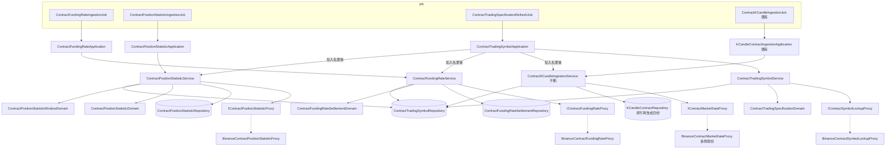

# 合約行情補充資料 — Architecture Design

**Status:** Confirmed
**Source PRD:** `.sdd/2026-09-23-contract-market-supplements/PRD.md`
**Tech context:** Go · Gin · GORM (PostgreSQL, Code First) · Clean / Onion Architecture · 手動 DI 於 `cmd/server/dependencies.go`

---

## 1. Design Goal & Guiding Principle

- **In one sentence:** 讓合約這條獨立的路多收四種資料——合約 K 線多兩組價格、資金費率結算、持倉統計、合約交易規格——
  各自有自己的來源、自己的節奏、自己的家，彼此失敗互不牽連，而且**現貨那條路一行不動**。
- **Guiding principle:** **形狀決定家，節奏決定 job。** 與標記價格同形狀的（一分鐘一組開高低收）就走標記價格已經走過的那條路——
  在 proxy 裡多問兩次、以起始時間對齊、讓「缺了」以沒有值的形式活著走到 domain 被判；
  不同形狀的各開一條**完整而窄**的路：一個 proxy 介面（一次呼叫一個答案）、一個 domain model（規則全在建構子）、
  一個 repository、一個 domain service（編排）、一個 job（節奏）。下一種合約資料照同一個模子加一條，不必改任何既有的路。

### 讓這一刀小下來的關鍵發現

1. **合約 K 線已經有「多一份資料就多問一次」的模式**：`BinanceContractMarketDataProxy` 先問價量、再問標記價格、以 open time 對齊，
   缺的以 `NullDecimal` 無值傳回，`KCandleContractDomain` 判它不合格。指數價格與溢價指數**完全照抄這條路**，
   `IContractMarketDataProxy` 的簽名不變——呼叫端完全不知道一根要問四次。
2. **「判斷一天齊不齊」與「只寫缺的」都集中在 repository 的兩個方法**：`CountInRange` 與 `SaveAllIfAbsent`。
   把「齊」定義成「四份都有」只要改 `CountInRange` 的條件；把「只補缺的兩組」只要讓 `SaveAllIfAbsent` 在衝突時
   **只在目標那兩組為空時更新那兩組**。歷史同步 runner 與 service 一行都不用改就自動會補舊的。
3. **資金費率與持倉統計的「回補」與「每一輪」是同一件事**：兩者都是「從上一次存到的地方接著問到現在」，
   從沒存過時的起點不同（資金費率＝上市第一天、持倉統計＝三十天前）。所以每一種只有一個 round 動作，
   啟動、加入名單、定時三個觸發點呼叫同一個東西——沒有「回補視窗」與「排程視窗」兩套算法要保持一致。
4. **交易規格的來源就是加入名單時已經在打的那份標的清單**：`BinanceContractSymbolLookupProxy` 已經拿到整份 `exchangeInfo`，
   只是丟掉了規格。規格掛在 `ContractTradingSymbol` 上，由 `ContractTradingSymbolService` 擁有——
   它本來就是「系統認得哪些合約標的」的主人。

---

## 2. Change Scope

| Area | Action | What / Why |
| :--- | :--- | :--- |
| `entities.KCandleContract` | **Modify** | 加 `IndexOpen/High/Low/Close`、`PremiumIndexOpen/High/Low/Close` 八欄，`NullDecimal`、可為空——**只因為舊資料**；新寫入的由 domain 保證有值 |
| `KCandleContractDomain` / `KCandleContractWriteDto` / `KCandleContractDto` / `ContractMarketKCandleVo` | **Modify** | 兩組新價格一路帶過去；domain 加兩組規則 |
| `BinanceContractMarketDataProxy` | **Modify** | 多問 `indexPriceKlines`（參數名 `pair`）與 `premiumIndexKlines`，照標記價格的方式合併 |
| `KCandleContractRepository` | **Modify** | `CountInRange` 只數四份齊全的；`SaveAllIfAbsent` 衝突時只補目標缺的兩組；`Save`/`Update` 的欄位清單加八欄 |
| 合約 K 線的 request 與 controller | **Modify** | 手動新增／修改多兩組必填價格 |
| `entities.ContractTradingSymbol` + repository | **Modify** | 加交易規格欄位；`Save` 改為整筆 upsert；新增 `SaveTradingSpecifications` 只寫規格欄 |
| `IContractSymbolLookupProxy` + `BinanceContractSymbolLookupProxy` | **Modify** | `LookUpSymbol` 回帶規格的 `ContractSymbolListingVo`；新增 `FetchTradingSpecifications`（整份清單 ＋ 結算間隔） |
| `ContractTradingSymbolService` / Application / DTO | **Modify** | 加入名單時記下規格；新增 `RefreshTradingSpecifications`；清單帶規格；加入後多補資金費率與持倉統計 |
| 資金費率結算整條路 | **Add** | entity、VO、domain、proxy 介面＋實作、repository、service、application、controller、job |
| 持倉統計整條路 | **Add** | 同上 |
| 合約交易規格刷新 job | **Add** | 啟動一次、之後每 24 小時 |
| `ContractSeriesSymbolReportDomain` + DTO | **Add** | 資金費率與持倉統計共用的逐標的報告（存了幾筆、跳過哪幾筆、來源失敗原因） |
| `ApplicationConfig.ContractIngestion` | **Modify** | 新增四個來源網址、三個 job 間隔、持倉統計的取用額度 |
| `SchemaMigrator` | **Modify** | 登錄兩個新 entity |
| `dependencies.go` | **Modify** | 組裝、路由、三個新 job、一個新 pacer |
| 現貨 K 線、觀察清單、重演、策略、機器人、助手 | **Not touched** | 它們都還不知道這些資料存在——使用它們是合約重演那一刀的事 |
| `ContractKCandleIngestionService` / `contractKCandleHistorySyncRunner` | **Not touched** | 發現 2：齊不齊與只寫缺的都在 repository，編排不變 |
| 合約同步輪次 | **Not touched** | 資金費率與持倉統計不提供指名歷史同步 |

---

## 3. New Classes / Modules

### 資金費率結算

| Name | Kind | Responsibility (purpose) | Collaborators | Satisfies |
| :--- | :--- | :--- | :--- | :--- |
| `entities.ContractFundingRateSettlement` | Entity | 一筆結算的持久化形狀；`(symbol, settlement_time)` 唯一；`MarkPrice` 可為空 | — | US-04 |
| `vo.ContractFundingRateSettlementVo` | VO | 來源回報的一筆結算，已正規化；標記價格以 `NullDecimal` 保留「沒給」 | — | US-04 |
| `domains.ContractFundingRateSettlementDomain` | Domain Model | 建構子守規則：代號合法、結算時間不在未來、標記價格有值時 > 0；費率任何值都合法；`ToEntity()` | — | US-04 全部 |
| `IContractFundingRateProxy` | Interface | `FetchFundingRateSettlements(ctx, symbol, after time.Time)`：回傳 `after` 之後（不含）到現在的每一筆結算，由早到晚；`after` 為零值代表從頭 | — | US-04, US-05 |
| `BinanceContractFundingRateProxy` | Proxy | 分頁打 `/fapi/v1/fundingRate`（`startTime`、`limit=1000`），以最後一筆時間＋1ms 接著翻頁；結算時間照原樣（不取整）；空字串標記價格 → 無值 | `RequestPacer`（合約 K 線那一個） | 同上 |
| `IContractFundingRateSettlementRepository` / `ContractFundingRateSettlementRepository` | Repository | `SaveAllIfAbsent`（衝突 DoNothing）、`FindLatest(symbol)`、`FindInRange(query, limit)` | GORM | US-04 #7, US-05, US-11 |
| `ContractFundingRateService` | Domain Service | `RunRound`（名單上每一檔）、`RunRoundFor(symbol)`（加入名單）、`FindSettlementsInRange`；逐標的併發、逐筆判、只存合格的 | 上面四者 ＋ `IContractTradingSymbolRepository`、`IClockProxy` | US-04, US-05, US-10, US-11 |
| `ContractFundingRateApplication` | Application | 轉呼叫 service | service | — |
| `ContractFundingRateSettlementController` | Controller | `GET /contract-funding-rate-settlements?symbol=&startTime=&endTime=` | application | US-11 |
| `ContractFundingRateIngestionJob` | Job | 啟動先跑一輪、之後每 `interval` 一輪；報告寫 log | application | US-05 #4 |

### 持倉統計

| Name | Kind | Responsibility (purpose) | Collaborators | Satisfies |
| :--- | :--- | :--- | :--- | :--- |
| `entities.ContractPositionStatistic` | Entity | 一筆持倉統計；`(symbol, statistic_time)` 唯一；十個數值皆不可為空 | — | US-06 |
| `vo.ContractPositionStatisticVo` | VO | 三份以統計時間對齊後的一筆；多空人數比與大戶多空持倉比兩組以 `NullDecimal` 保留「缺了」 | — | US-06 #2 |
| `domains.ContractPositionStatisticDomain` | Domain Model | 建構子守規則：三份都在、統計時間在五分鐘刻度且不在未來、持倉量與價值 ≥ 0、佔比 ∈ [0,1]、比值 ≥ 0；錯誤訊息點名缺哪一份 | — | US-06, US-07 |
| `domains.ContractPositionStatisticWindowDomain` | Domain Model | 算一次該問的區間：起點＝上一筆＋5 分鐘**再往回一小時**（重問因缺一份而跳過、後面已存了新的那幾筆），不早於保留期限內第一格；終點＝現在（退回五分鐘刻度）；起點晚於終點＝空 | — | US-08 #2–#5 |
| `IContractPositionStatisticProxy` | Interface | `FetchPositionStatistics(ctx, symbol, startTime, endTime)`：一次呼叫一個答案，三份的拆問與對齊是它的事 | — | US-06, US-08 |
| `BinanceContractPositionStatisticProxy` | Proxy | 分頁打 `openInterestHist`、`globalLongShortAccountRatio`、`topLongShortPositionRatio`（`period=5m`、`limit=500`），以持倉量那份決定哪些時間點存在，另兩份以時間對齊，缺的留無值 | 新的 `RequestPacer`（統計資料的額度） | 同上 |
| `IContractPositionStatisticRepository` / `ContractPositionStatisticRepository` | Repository | `SaveAllIfAbsent`、`FindLatest(symbol)`、`FindInRange(query, limit)` | GORM | US-06 #5, US-08, US-11 |
| `ContractPositionStatisticService` | Domain Service | `RunRound`、`RunRoundFor(symbol)`、`FindStatisticsInRange` | 上面 ＋ 追蹤名單 repository、clock | US-06, US-07, US-08, US-10, US-11 |
| `ContractPositionStatisticApplication` | Application | 轉呼叫 | service | — |
| `ContractPositionStatisticController` | Controller | `GET /contract-position-statistics?symbol=&startTime=&endTime=` | application | US-11 |
| `ContractPositionStatisticIngestionJob` | Job | 啟動先跑一輪、之後每 `interval` 一輪 | application | US-08 #3 |

### 合約交易規格與共用

| Name | Kind | Responsibility (purpose) | Collaborators | Satisfies |
| :--- | :--- | :--- | :--- | :--- |
| `vo.ContractTradingSpecificationVo` | VO | 來源回報的一份規格；結算間隔以 `*int` 保留「沒特別列出」 | — | US-09 |
| `vo.ContractSymbolListingVo` | VO | 加入名單時的答案：是否可追蹤 ＋ 它的規格 | — | US-09 #1 |
| `domains.ContractTradingSpecificationDomain` | Domain Model | 建構子：結算間隔沒列出 → 8 小時；各項須 > 0（維持保證金率、強平手續費率可為 0 以上）；`ApplyTo(entity, updatedAt)` 把規格寫到標的上 | — | US-09 #6, #7 |
| `dto.ContractTradingSpecificationDto` | DTO | 清單上每個標的帶的規格（沒有值時為 `null`） | — | US-09 #1, #8 |
| `ContractTradingSpecificationRefreshJob` | Job | 啟動一次、之後每 `interval` 一次呼叫 `RefreshTradingSpecifications` | `ContractTradingSymbolApplication` | US-09 #2, #9 |
| `domains.ContractSeriesSymbolReportDomain` + `dto.ContractSeriesIngestionReportDto` | Domain Model / DTO | 資金費率與持倉統計共用的逐標的報告；跳過紀錄數量上限與既有 K 線報告相同 | — | 各「留下紀錄」的 Then |

### 深度檢查

- `IContractMarketDataProxy.FetchKCandles` **簽名不變**：一根要問四次、要對齊、要丟掉佔位的零——全藏在實作裡。呼叫端從兩份變四份零感知。
- `IContractFundingRateProxy` / `IContractPositionStatisticProxy` 都是**一個方法、一個答案**。呼叫端不排序步驟、不知道要翻頁、不知道要問三次。
- 三個 service 的 round 都是「一個動作做完一整件事」：讀名單 → 逐標的併發 → 算區間 → 問 → 判 → 存 → 報告。沒有「先呼叫 A 再呼叫 B」的外漏順序。
- `ContractTradingSpecificationDomain.ApplyTo` 讓「沒列出就八小時」與「寫到哪幾欄」只有一個地方知道。

---

## 4. Modified Components

| Component | Current role | Change needed |
| :--- | :--- | :--- |
| `BinanceContractMarketDataProxy.FetchKCandles` | 問價量＋標記價格，對齊 | 再問指數價格（`pair=`）與溢價指數，對齊方式相同；價量那份為空時三份都不問。`fetchRows`/`fetchPage` 多收「代號用哪個參數名」 |
| `binance_contract_wire.go` | 讀標記價格四個價 | `toMarkPriceFigures` 泛化為「讀一份只有四個價有意義的答案」，三份共用 |
| `KCandleContractDomain` | 守合約 K 線規則 | 指數價格：必填、不得為負、高≥低；溢價指數：必填、高≥低、可為負；錯誤訊息點名是哪一組 |
| `KCandleContractRepository.CountInRange` | 數區間內幾根 | 只數 `index_open` 與 `premium_index_open` 都不為空的 |
| `KCandleContractRepository.SaveAllIfAbsent` | 衝突即不動 | 衝突時 `DO UPDATE SET` 八欄 = `EXCLUDED`，**`WHERE` 目標的 `index_open IS NULL OR premium_index_open IS NULL`**——舊的只補缺的兩組，齊全的原封不動。仍回傳受影響筆數 |
| `ContractTradingSymbolRepository.Save` | upsert `is_watched` | upsert 全部欄位（規格也跟著寫） |
| `ContractTradingSymbolService.AddToWatchlist` | 確認代號後登錄 | 把 listing 帶的規格一起寫進去 |
| `ContractTradingSymbolService.ListContractTradingSymbols` | 回清單 | 每筆帶規格 |
| `ContractTradingSymbolApplication.AddToWatchlist` | 加入後補合約 K 線 | 再補資金費率與持倉統計；各自失敗只寫 log |
| `KCandleContractRequest` / DTO | 合約 K 線的 body 與回應 | 加八個價格欄位 |

### 新增路由

- `GET /contract-funding-rate-settlements?symbol=&startTime=&endTime=`
- `GET /contract-position-statistics?symbol=&startTime=&endTime=`

兩者的區間規則與單次上限沿用查詢合約 K 線（`KCandleQueryDomain` 與同一個 `candleLimit`）。

### 新增設定（皆有預設）

| 環境變數 | 預設 | 用途 |
| :--- | :--- | :--- |
| `CONTRACT_MARKET_DATA_INDEX_PRICE_URL` | `https://fapi.binance.com/fapi/v1/indexPriceKlines` | 指數價格 |
| `CONTRACT_MARKET_DATA_PREMIUM_INDEX_URL` | `https://fapi.binance.com/fapi/v1/premiumIndexKlines` | 溢價指數 |
| `CONTRACT_MARKET_DATA_FUNDING_RATE_URL` | `https://fapi.binance.com/fapi/v1/fundingRate` | 資金費率結算 |
| `CONTRACT_MARKET_DATA_FUNDING_INFO_URL` | `https://fapi.binance.com/fapi/v1/fundingInfo` | 結算間隔 |
| `CONTRACT_MARKET_DATA_STATISTICS_BASE_URL` | `https://fapi.binance.com/futures/data` | 持倉統計三份 |
| `CONTRACT_MARKET_DATA_STATISTICS_REQUESTS_PER_MINUTE` | `150` | 統計資料的取用額度（來源另計一份） |
| `CONTRACT_FUNDING_RATE_INGESTION_INTERVAL_MINUTES` | `60` | 資金費率 job 間隔；`0` 停用 |
| `CONTRACT_POSITION_STATISTIC_INGESTION_INTERVAL_MINUTES` | `5` | 持倉統計 job 間隔；`0` 停用 |
| `CONTRACT_TRADING_SPECIFICATION_REFRESH_INTERVAL_HOURS` | `24` | 規格刷新 job 間隔；`0` 停用 |

---

## 5. Component Relationships

---

## 6. Extensibility & Handoff Notes

### Most likely next requirement：合約重演讀這些資料

合約重演會需要：某段期間的合約 K 線（含標記價格判強平）、該期間所有資金費率結算（持倉跨過就收付）、標的的交易規格（捨入、最小名目、維持保證金率、強平手續費）。

### Where it lands

- 資料都已經有**以「標的＋時間區間」查詢**的 repository 方法（`FindInRange`），重演 service 直接注入三個 repository 介面讀，不需要新介面。
- 交易規格在 `ContractTradingSymbol` 上，`FindBySymbol` 就拿得到。

### How to add it（add-only path）

- 新的合約資料種類（例如主動買賣量比、大戶多空人數比）：
  - 同形狀（五分鐘一筆、與持倉統計同時間點）→ 在 `BinanceContractPositionStatisticProxy` 多問一份、VO 與 entity 多一組欄位、domain 多一條規則。
  - 不同形狀 → 照資金費率那條路開一條：entity／VO／domain／proxy 介面＋實作／repository／service／application／controller／job，
    在 `dependencies.go` 註冊，`SchemaMigrator` 登錄。**不必改任何既有的路。**
- 維持保證金分級（要帳戶身分）：在 `IContractSymbolLookupProxy` 旁開一個需要金鑰的 proxy，把分級存成規格的子表；`maintenance_margin_rate` 保留作為最小那一級。

### Patterns applied & why

- **Proxy 藏住「一筆要問幾次」**（沿用合約 K 線既有的做法）：資料來源的拆法是最常變的地方（幣安改端點、換一家來源），呼叫端不該跟著動。
- **缺的以無值活到 domain 才判**：規則只有一個地方，跳過紀錄說得出缺的是哪一份。
- **一種資料一個 round 動作**：啟動、加入名單、定時三個觸發點共用，沒有兩套視窗算法。

### Do not hardcode

- 所有來源網址、job 間隔、取用額度都是設定。
- 持倉統計的保留期限（30 天）與刻度（5 分鐘）是 `ContractPositionStatisticWindowDomain` / `ContractPositionStatisticDomain` 的具名常數，不散落在 proxy 與 service。
- 「結算間隔沒列出就是八小時」只寫在 `ContractTradingSpecificationDomain`。

### Known debt / deferred

- **實作中修正的三處（契約稽核後）**：持倉統計每輪重問最近一小時（原設計只接著最後一筆，被跳過的洞補不回來）；加入名單時結算間隔清單問不到**照樣加入、先沒有規格**（原設計整個加入被拒）；兩個新 repository 的 `SaveAllIfAbsent` **分批寫入**（三十天持倉統計 8640 筆 × 10 欄超過 PostgreSQL 單一語句的參數上限，冒煙測試時發現）。
- `ContractFundingRateService` 與 `ContractPositionStatisticService` 的 `RunRound`／`RunRoundFor`／查詢骨架相同（讀名單 → 逐標的併發 → 報告；指名一檔 → 查登錄）。只有兩份時抽共用編排屬於臆測；第三種合約資料出現時再抽。
- 新的三個 job 共用 `job/repeating_round.go`；既有的 `ContractKCandleIngestionJob` 與現貨 job 仍各自一套（啟動那一步與每一輪不同），未一併搬移。

- 三個新 job 與 `ContractKCandleIngestionJob` 形狀幾乎相同（啟動一輪、ticker、雙重 done 檢查）。本刀照既有「一 job 一檔」寫；若再多一個，值得抽一個共用的週期執行物件。
- `KCandleQueryDomain` 被資金費率與持倉統計借用做區間驗證。名字帶 K 線，但它守的就是「交易標的＋查詢區間」這個通用概念；真的分歧時再拆。
- 規格刷新是整份覆寫，不留變更歷史（PRD Out of Scope）。

---

## 7. Traceability

| PRD Scenario | Fulfilled by |
| :--- | :--- |
| US-01 四份都齊 / 溢價指數獨缺 / 指數價格整份問不到 / 零量丟棄 / 未走完不存 | `BinanceContractMarketDataProxy`（多問兩份、對齊、只取四個價、任一份失敗整份失敗）＋ `KCandleContractDomain`（缺即不合格、訊息點名）＋既有 `judge` 的 latest-closed 判斷 |
| US-02 全部 | `KCandleContractDomain` 建構子；手動新增／修改經 `KCandleContractService` 既有路徑 |
| US-03 舊資料顯示沒有值 | entity 八欄 nullable、`ToDto` 以 `NullDecimal` 輸出 `null` |
| US-03 歷史同步補齊 / 齊全不問 / 問不到維持原狀 | `KCandleContractRepository.CountInRange`（只數四份齊全）＋ `SaveAllIfAbsent`（衝突只補缺的兩組）；問不到時 domain 判不合格，舊列不被觸碰 |
| US-03 每分鐘不回頭 | 既有 `Save` 只寫本輪抓到的時間點（最近幾根），不碰更早的 |
| US-04 全部 | `ContractFundingRateSettlementDomain` ＋ `BinanceContractFundingRateProxy`（空標記價格 → 無值、時間不取整）＋ repository `SaveAllIfAbsent` |
| US-05 全部 | `ContractFundingRateService.RunRound` / `RunRoundFor` ＋ `ContractFundingRateIngestionJob`（啟動先跑）＋ `ContractTradingSymbolApplication.AddToWatchlist` |
| US-06 全部 | `BinanceContractPositionStatisticProxy`（三份對齊、缺的無值、任一份整份失敗即失敗）＋ `ContractPositionStatisticDomain` ＋ repository `SaveAllIfAbsent` ＋ `ContractPositionStatisticWindowDomain`（接著上一筆） |
| US-07 全部 | `ContractPositionStatisticDomain` 建構子 |
| US-08 全部 | `ContractPositionStatisticWindowDomain` ＋ `ContractPositionStatisticService.RunRound` / `RunRoundFor` ＋ job（啟動先跑） |
| US-09 加入時記下 | `BinanceContractSymbolLookupProxy.LookUpSymbol` → `ContractSymbolListingVo` → `ContractTradingSymbolService.AddToWatchlist` |
| US-09 刷新 / 已移除照刷 / 不再列出保留 / 不答話保留 | `ContractTradingSymbolService.RefreshTradingSpecifications`（對所有已登錄標的、只更新清單上有的、失敗不寫）＋ `ContractTradingSpecificationRefreshJob` |
| US-09 八小時預設 / 四小時 | `ContractTradingSpecificationDomain` 建構子 |
| US-09 舊標的沒有值 | entity 規格欄 nullable、DTO 規格為 `null` |
| US-10 全部 | 各 service 逐標的 `sync.WaitGroup`（不用 errgroup）、各自獨立的 job；移除只改 `is_watched` |
| US-11 全部 | 兩個新 controller ＋ `KCandleQueryDomain` ＋ repository `FindInRange`；合約 K 線 DTO 多兩組 |

---

## 8. Risks & Open Decisions

### Risks / trade-offs

- **合約 K 線每一根從兩次請求變四次**，同一個取用額度下跟上的速度減半。每分鐘那一輪只問最近二十幾根，影響小；長歷史同步會慢一倍，可接受（它本來就在背景跑）。
- **`SaveAllIfAbsent` 的衝突更新帶 `WHERE`** 是 PostgreSQL 的 `ON CONFLICT … DO UPDATE … WHERE`，透過 GORM `clause.OnConflict{Where: ...}` 表達，不手寫 SQL。
- **持倉統計的三十天邊界**：來源對「剛好三十天前」的起點可能拒絕。窗口起點取「現在 − 30 天」退回五分鐘刻度後**再往後兩格**，不論時鐘落在格子的哪裡都至少留五分鐘的餘裕——一輪排隊與翻頁要花幾秒，只留一格時餘裕可能只剩一秒，來源會整次拒絕；代價是最舊的五到十分鐘。
- **舊合約 K 線補不上**（來源已經沒有那麼早的指數價格）時，每次歷史同步涵蓋那段都會重問——與既有「標記價格歷史比 K 線短」同一個已接受的代價。

### Open decisions（留給實作）

- 資金費率從頭抓時的起點參數：來源不接受 `startTime=0`（實測會被當成沒給、只回最近的），實作時取一個早於所有永續合約的固定時刻（2019-01-01）。
- 持倉統計報告的跳過紀錄上限沿用 200 筆。
