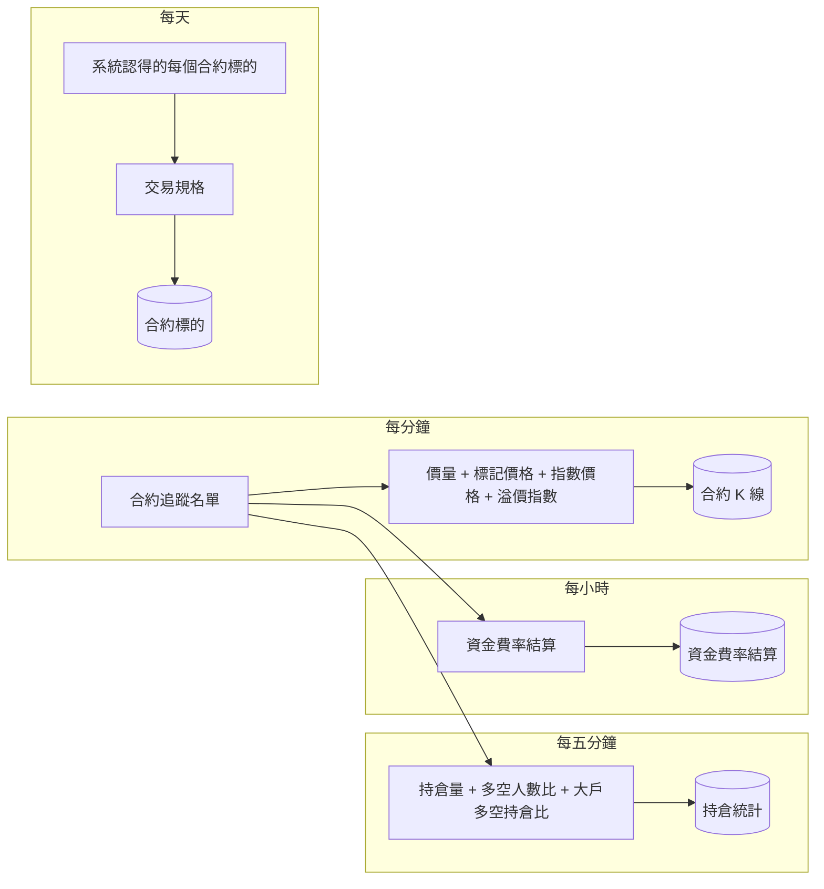

# Product Requirements Document (PRD)

**Status:** Draft
**Version:** v1.0
**Owner:** James Hsueh
**Stakeholders:** Engineering

---

## 1. Background & Goal (Why & Goal)

### Problem Statement

系統已經把永續合約的 K 線抓回來了：每分鐘的價量，加上標記價格。但合約帳戶還有幾件**現貨沒有的事**，
不知道它們，將來的合約重演就算不對，策略也看不到市場擁擠在哪一邊：

- **資金費率**：持倉跨過結算時間點就會被收錢或收到錢。這是合約最重要的一項持有成本，今天完全沒有記。
- **交易規格**：價格一次最少動多少、一筆至少多大、被強制平倉時要付多少——不知道這些，重演會高估能成交的量、低估出場的代價。
- **市場擁擠程度**：持倉量、多空比、合約比現貨貴多少——短線策略最常拿來判斷「現在是不是大家都擠在同一邊」。

其中**持倉量與多空比，來源只留最近三十天**。今天不開始錄，今天以前的就永遠沒有了。

### Expected Outcome

- 每一根合約 K 線多帶**指數價格**與**溢價指數**的開高低收，與標記價格同一條「缺一不存」的規則。
- **資金費率結算**從每個合約追蹤名單上的標的上市第一天起完整存下，之後每小時跟上。
- **持倉統計**每五分鐘錄一筆，加入名單時補最近三十天。
- 每個合約標的帶著它的**合約交易規格**，加入時記下、每天刷新。
- 三種新資料都查得到；合約 K 線查詢多帶兩組價格。
- 這一刀之前存下的合約 K 線一根都不少，歷史同步會把它們缺的兩組補上。

### Out of Scope

- 合約的重演、策略、機器人使用這些資料。
- 維持保證金的完整分級（來源要帳戶身分）；只記最小那一級。
- 交易規格的變更歷史。
- 資金費率結算與持倉統計的手動新增、修改、刪除，以及指名一段的歷史同步。
- 主動買賣量比、大戶多空人數比、預估中的下一次資金費率、訂單簿、強制平倉單。
- 現貨的任何東西。

---

## 2. User Personas

**Primary Role:** 系統擁有者（唯一使用者），直接對系統下指令，沒有畫面。

**Usage Context:** 他正在把系統往合約短線策略推。這一刀之後他不需要做任何事，資料就會自己持續累積；
他會在設計策略或檢查資料時，指定一個標的和一段時間去查資金費率、持倉統計、合約 K 線與交易規格。

---

## 3. User Stories & Acceptance Criteria

### US-01 — 合約 K 線多帶指數價格與溢價指數 [priority: P0]

**As a** 系統擁有者，**I want** 每一根合約 K 線都帶著指數價格與溢價指數，**so that** 我看得到合約比現貨貴還是便宜、貴多少。

```gherkin
Scenario: 四份資料都齊,存成一根完整的合約 K 線
  Given 某一分鐘的價量、標記價格、指數價格、溢價指數,來源四份都給了
  When 自動抓取合約 K 線跑一輪
  Then 存入一根合約 K 線,帶著指數價格與溢價指數各自的開高低收

Scenario: 溢價指數獨缺那一根,那一根不存
  Given 某一分鐘價量、標記價格、指數價格都有
  And 溢價指數獨缺那一分鐘
  When 自動抓取合約 K 線跑一輪
  Then 那一分鐘的合約 K 線不存,並留下「缺溢價指數」的紀錄
  And 同一批其他四份齊全的照常存入

Scenario: 指數價格整份問不到,該標的這一輪一根都不存
  Given 指數價格那一份來源不答話
  When 自動抓取合約 K 線跑一輪
  Then 該標的這一輪一根合約 K 線都不存,並留下失敗紀錄
  And 下一輪照常再抓

Scenario: 指數價格那一份附帶的零量一律丟棄
  Given 指數價格那一份的成交量寫著零
  When 自動抓取合約 K 線跑一輪
  Then 存下的那一根的成交量是價量那一份給的數字,不是那個零

Scenario: 還沒走完的那一分鐘四份都不存
  Given 最新那一分鐘還沒走完
  When 自動抓取合約 K 線跑一輪
  Then 那一分鐘沒有任何合約 K 線被存下
```

### US-02 — 指數價格與溢價指數的合法性 [priority: P0]

**As a** 系統擁有者，**I want** 手動新增或修改合約 K 線時，這兩組價格照它們各自的規則把關，**so that** 存進去的每一根都說得通。

```gherkin
Scenario: 負的溢價指數合法
  Given 溢價指數開 -0.0005、高 -0.0003、低 -0.0007、收 -0.0005
  When 新增一根合約 K 線
  Then 那一根被存入,溢價指數四個值照原樣保存

Scenario: 溢價指數全是零合法
  Given 溢價指數開高低收都是 0
  When 新增一根合約 K 線
  Then 那一根被存入

Scenario: 溢價指數高低於低
  Given 溢價指數高 -0.0008、低 -0.0003
  When 新增一根合約 K 線
  Then 新增被拒絕,並說明「溢價指數最高不得低於最低」

Scenario: 指數價格為負
  Given 指數價格低為 -1
  When 新增一根合約 K 線
  Then 新增被拒絕,並說明「指數價格不得為負」

Scenario: 指數價格高低於低
  Given 指數價格高 86000、低 87000
  When 新增一根合約 K 線
  Then 新增被拒絕,並說明「指數價格最高不得低於最低」

Scenario: 指數價格與最新價差很遠照收
  Given 指數價格收 87000
  And 最新價收 90000
  When 新增一根合約 K 線
  Then 那一根被存入

Scenario: 新增時沒給指數價格
  Given 沒給指數價格
  When 新增一根合約 K 線
  Then 新增被拒絕,並說明「指數價格必填」

Scenario: 修改時沒給溢價指數
  Given 一根既有的合約 K 線
  And 新的數字裡沒給溢價指數
  When 修改那一根
  Then 修改被拒絕,並說明「溢價指數必填」
  And 那一根維持原本的數字
```

### US-03 — 這一刀之前存下的合約 K 線保留，由歷史同步補齊 [priority: P0]

**As a** 系統擁有者，**I want** 既有的合約 K 線一根都不少，而且我有辦法把它們缺的兩組補上，**so that** 不必為了新欄位丟掉已經抓回來的歷史。

```gherkin
Scenario: 舊的合約 K 線照查得到,兩組新價格顯示沒有值
  Given 一根這一刀之前存下的合約 K 線
  When 查詢合約 K 線
  Then 那一根照舊回來,價量與標記價格不變
  And 指數價格與溢價指數顯示為沒有值,而不是零

Scenario: 歷史同步把舊的那一天補齊
  Given 某一天存滿了這一刀之前存下的合約 K 線
  When 歷史同步涵蓋那一天
  Then 那一天被重問
  And 每一根都補上指數價格與溢價指數
  And 每一根原有的價量、標記價格、成交筆數一個數字都沒改

Scenario: 已經四份齊全的那一天連問都不問
  Given 某一天存滿了四份齊全的合約 K 線
  When 歷史同步涵蓋那一天
  Then 那一天沒有向來源問任何東西

Scenario: 來源已經問不到那一天的指數價格
  Given 某一天存滿了這一刀之前存下的合約 K 線
  And 來源已經給不出那一天的指數價格
  When 歷史同步涵蓋那一天
  Then 那一天的每一根都維持原狀、照舊保留
  And 留下「補不上」的紀錄

Scenario: 每分鐘那一輪不回頭處理舊的那幾根
  Given 一根這一刀之前存下的合約 K 線,早於每分鐘那一輪本來就會重抓的最近幾分鐘
  When 自動抓取合約 K 線跑一輪
  Then 只重抓最近那幾分鐘
  And 那一根舊的依然沒有指數價格與溢價指數

Scenario: 每分鐘那一輪本來就會重抓的最近幾分鐘照舊重抓
  Given 一根這一刀之前存下的合約 K 線,落在每分鐘那一輪本來就會重抓的最近幾分鐘裡
  When 自動抓取合約 K 線跑一輪
  Then 那一根和最近幾分鐘的其他根一樣換成這一次抓到的完整一根,帶著指數價格與溢價指數
```

### US-04 — 資金費率結算照來源記下 [priority: P0]

**As a** 系統擁有者，**I want** 每一次資金費率結算都照來源說的被記下來，**so that** 將來的合約重演算得出持倉付了多少、收到多少。

```gherkin
Scenario: 一次一般的結算
  Given BTCUSDT 08:00 結算,費率 +0.0001,當下標記價格 87000
  When 自動抓取資金費率結算跑一輪
  Then 存入一筆 BTCUSDT 08:00 的資金費率結算,費率 +0.0001、標記價格 87000

Scenario: 負的費率
  Given 某次結算費率為 -0.00003
  When 自動抓取資金費率結算跑一輪
  Then 存入那一筆,費率 -0.00003

Scenario: 零費率
  Given 某次結算費率為 0
  When 自動抓取資金費率結算跑一輪
  Then 存入那一筆,費率 0

Scenario: 早年沒給標記價格的結算
  Given 一筆 2019 年的結算,來源沒給當下的標記價格
  When 回補資金費率結算
  Then 存入那一筆,標記價格顯示為沒有值,而不是零

Scenario: 標記價格為零或負的那一筆跳過
  Given 同一批裡有一筆結算的標記價格為 0
  When 自動抓取資金費率結算跑一輪
  Then 那一筆不存,並留下紀錄
  And 同一批其他的照常存入

Scenario: 結算時間不取整
  Given 來源說某次結算時間是 08:00:00.001
  When 自動抓取資金費率結算跑一輪
  Then 存下的結算時間是 08:00:00.001

Scenario: 已存過的同一筆原封不動
  Given BTCUSDT 08:00 那一筆已經存過,費率 +0.0001
  When 下一輪又抓到 BTCUSDT 08:00
  Then BTCUSDT 08:00 仍然只有一筆,費率仍是 +0.0001
```

### US-05 — 資金費率結算自己跟上 [priority: P0]

**As a** 系統擁有者，**I want** 資金費率結算不用我動手就一直是完整的，**so that** 我隨時查得到到最近一次為止的每一次結算。

```gherkin
Scenario: 每小時只取上一次之後的新結算
  Given BTCUSDT 在合約追蹤名單上
  And BTCUSDT 最後存到 08:00 那一筆
  When 自動抓取資金費率結算跑一輪
  Then 只存下 08:00 之後的結算

Scenario: 這一小時沒有新結算
  Given 最後一次結算之後還沒有新的結算
  When 自動抓取資金費率結算跑一輪
  Then 什麼都沒存,也沒有失敗紀錄

Scenario: 加入名單時補齊完整歷史
  Given 一個系統從沒存過資金費率的合約代號
  When 把它加進合約追蹤名單
  Then 它從上市第一天起的每一次結算都被存下

Scenario: 啟動時補上停機期間
  Given 系統停機了兩天
  When 系統啟動
  Then 名單上每一檔補上這兩天的結算
  And 補完之後才開始每小時那一輪

Scenario: 某一檔來源不答話
  Given 名單上有 BTCUSDT 與 ETHUSDT
  And 這一輪 BTCUSDT 的來源不答話
  When 自動抓取資金費率結算跑一輪
  Then BTCUSDT 這一輪什麼都沒存,並留下失敗紀錄
  And ETHUSDT 照常存入
  And 下一輪 BTCUSDT 從上一次存到的地方接著補

Scenario: 名單是空的
  Given 合約追蹤名單是空的
  When 自動抓取資金費率結算跑一輪
  Then 沒有向來源問任何東西
```

### US-06 — 持倉統計由三份資料合成 [priority: P0]

**As a** 系統擁有者，**I want** 每五分鐘的持倉量、多空人數比、大戶多空持倉比被存成同一筆，**so that** 同一個時間點的擁擠程度我一次看得完。

```gherkin
Scenario: 三份都齊
  Given 09:05 的持倉量、多空人數比、大戶多空持倉比三份都有
  When 自動抓取持倉統計跑一輪
  Then 存入一筆 09:05 的持倉統計,三份的數字都在上面

Scenario: 大戶多空持倉比獨缺
  Given 09:05 的持倉量與多空人數比都有
  And 大戶多空持倉比獨缺 09:05
  When 自動抓取持倉統計跑一輪
  Then 09:05 不存,並留下「缺大戶多空持倉比」的紀錄
  And 其他三份齊全的時間點照常存入

Scenario: 下一輪自然補上
  Given 上一輪因為缺一份而沒存 09:05
  And 這一次 09:05 三份都到了
  When 自動抓取持倉統計跑一輪
  Then 09:05 被存入

Scenario: 被跳過的那一筆後面已經存了新的,下一輪照樣補上
  Given 上一輪 09:05 缺一份而沒存,09:10 已經存了
  And 這一次 09:05 三份都到了
  When 自動抓取持倉統計跑一輪
  Then 09:05 被存入,09:10 原封不動

Scenario: 持倉量那一份整份問不到
  Given 持倉量那一份來源不答話
  When 自動抓取持倉統計跑一輪
  Then 該標的這一輪一筆都不存,並留下失敗紀錄

Scenario: 已存過的同一筆原封不動
  Given 09:05 那一筆已經存過
  When 下一輪又抓到 09:05
  Then 09:05 仍然只有一筆,數字不變
```

### US-07 — 持倉統計的合法性 [priority: P1]

**As a** 系統擁有者，**I want** 不合理的持倉統計不被存下，**so that** 我查到的每一筆都說得通。

```gherkin
Scenario: 一般的一筆
  Given 多方佔 0.47、空方佔 0.53、比值 0.89
  When 自動抓取持倉統計跑一輪
  Then 那一筆被存入

Scenario: 一面倒
  Given 多方佔 1、空方佔 0
  When 自動抓取持倉統計跑一輪
  Then 那一筆被存入

Scenario: 佔比超過一
  Given 多方佔 1.2
  When 自動抓取持倉統計跑一輪
  Then 那一筆不存,並留下「佔比必須介於零與一之間」的紀錄

Scenario: 持倉量為負
  Given 持倉量為 -1
  When 自動抓取持倉統計跑一輪
  Then 那一筆不存,並留下「持倉量不得為負」的紀錄

Scenario: 持倉價值為負
  Given 持倉價值為 -1
  When 自動抓取持倉統計跑一輪
  Then 那一筆不存,並留下「持倉價值不得為負」的紀錄

Scenario: 比值為負
  Given 大戶多空持倉比的比值為 -1
  When 自動抓取持倉統計跑一輪
  Then 那一筆不存,並留下「大戶多空持倉比的比值不得為負」的紀錄

Scenario: 統計時間不在五分鐘刻度
  Given 統計時間是 09:03
  When 自動抓取持倉統計跑一輪
  Then 那一筆不存,並留下「統計時間必須落在五分鐘刻度」的紀錄

Scenario: 統計時間指向未來
  Given 統計時間比現在晚
  When 自動抓取持倉統計跑一輪
  Then 那一筆不存,並留下「統計時間不得指向未來」的紀錄
```

### US-08 — 持倉統計要持續錄 [priority: P0]

**As a** 系統擁有者，**I want** 持倉統計從加入名單那一刻起一直被錄下來，**so that** 三十天之後我手上的歷史比來源還長。

```gherkin
Scenario: 加入名單時補最近三十天
  Given 一個系統從沒存過持倉統計的合約代號
  When 把它加進合約追蹤名單
  Then 它最近三十天的持倉統計被存下

Scenario: 每五分鐘接著上一次
  Given BTCUSDT 最後存到 09:05
  When 自動抓取持倉統計跑一輪
  Then 從 09:05 前一小時問到現在,只存下還沒存過的那幾筆

Scenario: 啟動時補上停機期間
  Given 系統停機了兩天
  When 系統啟動
  Then 名單上每一檔補上這兩天的持倉統計
  And 補完之後才開始每五分鐘那一輪

Scenario: 停機超過三十天
  Given 系統停機了四十天
  When 系統啟動
  Then 只補上最近三十天
  And 沒有失敗紀錄

Scenario: 名單上有一檔從沒存過
  Given BTCUSDT 在名單上但系統從沒存過它的持倉統計
  When 自動抓取持倉統計跑一輪
  Then 從三十天前開始取

Scenario: 名單是空的
  Given 合約追蹤名單是空的
  When 自動抓取持倉統計跑一輪
  Then 沒有向來源問任何東西
```

### US-09 — 合約交易規格 [priority: P0]

**As a** 系統擁有者，**I want** 每個合約標的都帶著它現在的交易規格，**so that** 將來的合約重演知道一筆能下多小、價格能停在哪、被強平要付多少。

```gherkin
Scenario: 加入名單時記下規格
  Given 來源說 BTCUSDT 價格跳動 0.1、數量步進 0.001、最小名目 50
  When 把 BTCUSDT 加進合約追蹤名單
  Then 加入成功
  And 查詢合約標的清單時 BTCUSDT 帶著價格跳動 0.1、數量步進 0.001、最小名目 50 與確認時間

Scenario: 每天刷新
  Given BTCUSDT 目前記著價格跳動 0.1
  And 來源現在說 0.01
  When 刷新合約交易規格
  Then BTCUSDT 的價格跳動變成 0.01,規格最後更新時間變成這一次

Scenario: 已移出名單的標的照樣刷新
  Given 一個已經從合約追蹤名單移除、但系統還認得的標的
  When 刷新合約交易規格
  Then 它的規格照樣被更新

Scenario: 來源不再列出的標的保留最後一次的規格
  Given 一個標的記著規格,更新時間是上週
  And 來源的清單裡已經沒有它
  When 刷新合約交易規格
  Then 它保留原本的規格,更新時間仍是上週

Scenario: 來源不答話
  Given 來源不答話
  When 刷新合約交易規格
  Then 每個標的保留原本的規格,並留下失敗紀錄
  And 下一次照常再試

Scenario: 沒特別列出結算間隔就是八小時
  Given 來源沒特別列出某個標的的資金費率結算間隔
  When 刷新合約交易規格
  Then 它的結算間隔記為八小時

Scenario: 四小時結算的標的
  Given 來源說某個標的的結算間隔是四小時
  When 刷新合約交易規格
  Then 它的結算間隔記為四小時

Scenario: 還沒刷新過的舊標的
  Given 一個這一刀之前就登錄的合約標的,還沒刷新過
  When 查詢合約標的清單
  Then 它在清單上,交易規格顯示為沒有值

Scenario: 啟動時刷新一次
  Given 系統剛啟動
  When 啟動流程跑完
  Then 所有合約標的的規格都刷新過一次
```

### US-10 — 四種資料彼此獨立，移除只停止追蹤 [priority: P0]

**As a** 系統擁有者，**I want** 任何一種資料出事都不拖累其他資料，**so that** 一個來源不穩不會讓我整條合約資料都斷掉。

```gherkin
Scenario: 資金費率失敗不影響其他
  Given 資金費率那一輪 BTCUSDT 失敗
  When 持倉統計與合約 K 線那一輪同時跑
  Then BTCUSDT 的持倉統計與合約 K 線照常存入

Scenario: 移除只停止追蹤
  Given BTCUSDT 已存了資金費率結算、持倉統計、合約 K 線
  When 把 BTCUSDT 從合約追蹤名單移除
  Then 之後的每一輪都不再抓 BTCUSDT 的這三種資料
  And 已存下的每一筆都還查得到

Scenario: 現貨不受影響
  Given 現貨也在追 BTCUSDT
  When 合約這邊任何一種資料抓取或失敗
  Then 現貨的 BTCUSDT 照常抓取,資料不變
```

### US-11 — 查得到 [priority: P0]

**As a** 系統擁有者，**I want** 指定一個標的和一段時間就查得到這些資料，**so that** 我能檢查、也能拿去設計策略。

```gherkin
Scenario: 查資金費率結算
  Given BTCUSDT 在 1 日到 3 日之間有九次結算
  When 查 BTCUSDT 1 日到 3 日的資金費率結算
  Then 回那九筆,依結算時間由早到晚

Scenario: 查持倉統計
  Given BTCUSDT 在 09:00 到 10:00 之間有十三筆持倉統計
  When 查 BTCUSDT 09:00 到 10:00 的持倉統計
  Then 回那十三筆,依統計時間由早到晚

Scenario: 那段時間一筆都沒有
  Given BTCUSDT 在那段時間沒有任何資金費率結算
  When 查那段時間的資金費率結算
  Then 回空的,不算錯誤

Scenario: 沒指定合約標的
  Given 沒指定合約標的
  When 查資金費率結算或持倉統計
  Then 查詢被拒絕,並說明「必須指定交易標的」

Scenario: 查合約 K 線多帶兩組價格
  Given 一根四份齊全的合約 K 線
  When 查詢合約 K 線
  Then 那一根帶著指數價格與溢價指數的開高低收
```

---

## 4. Business Flow & Logic

### Flow



加入合約追蹤名單時，四種各自立刻補一次；系統啟動時也各自補一次，補完才開始定時那一輪。

### Core Business Rules

- **缺一不存**：合約 K 線四份、持倉統計三份，以時間對齊，缺任何一份那一筆就不存、留紀錄、同一批其他照常。
  **價量（合約 K 線）與持倉量（持倉統計）決定那一刻存不存在**：它們沒有的那一刻，就是市場那一刻不在，其他幾份關於那一刻的答案是一份讀不到任何東西的讀數，直接丟掉、不留紀錄。
- **接著上一次**：資金費率結算與持倉統計都「從上一次存到的地方接著問」；從沒存過的，資金費率從上市第一天、持倉統計從三十天前。
  持倉統計**另外重問上一筆之前的一小時**：因為缺一份而跳過的那一筆，後面可能已經存了新的，只從最後一筆接著問就再也問不到它。一小時仍在來源的一頁之內，不多花請求。
- **每分鐘那一輪只重抓最近幾分鐘**（既有行為）：落在那幾分鐘裡的舊合約 K 線會跟著被換成完整的一根；更早的只有歷史同步會補。
- **查詢上限**：資金費率結算與持倉統計的查詢沿用合約 K 線的單次上限，超過即整次拒絕並請縮小區間。
- **結算時間與統計時間都不得指向未來。**
- **交易規格的刷新涵蓋已登錄的合約標的**（在名單上或曾經在名單上）；只因手動存過合約 K 線而出現在清單上的標的沒有規格。
- **加入名單時確認代號與記下規格是兩件事**：來源確認代號可追蹤就加入；規格讀不懂、不合規則或結算間隔那份答案問不到時，照樣加入、先沒有規格，由每天的刷新補上。
- **已存過的原封不動**：資金費率結算與持倉統計再抓到同一筆時不覆蓋。
- **判斷一天齊不齊只算四份都有的合約 K 線**；補齊舊的只補缺的兩組，原有的數字不動。
- **沒有值與零是兩件事**：舊合約 K 線的兩組新價格、早年結算的標記價格、還沒刷新過的交易規格，都是「沒有值」。
- **規格只記現在這一份**；來源不再列出或不答話時保留原本的。
- **各自獨立**：四種資料、每個標的彼此獨立；任何失敗只留紀錄、下一輪自然重試。

### Edge Cases

- 系統在啟動回補途中被中斷：下一次啟動會從上一次存到的地方接著補，不會重複也不會漏（因為都是接著上一次、已存過的不覆蓋）。
- 同一個代號在追蹤名單上被移除又加回來：加回來時照「加入名單」的規則補齊，已存下的不重複。
- 一個合約標的在來源下市：交易規格保留最後一次；若它仍在追蹤名單上，資金費率與持倉統計那幾輪問不到東西，只留紀錄，不影響其他標的。

---

## 5. UI/UX Design & Interaction

N/A — 系統沒有畫面，使用者直接對系統下指令查詢。

---

## 6. Non-Functional Requirements

- **取用額度**：持倉統計的來源與 K 線來源的取用額度**分開計算**，各自守各自的節奏，互不擠占。
- **不重問**：每一輪只問上一次之後的部分；已經齊全的東西不重問。
- **資料量**：一個標的的完整資金費率歷史約數千筆，一次補齊是可接受的；持倉統計一個標的三十天約八千多筆。

---

## 7. Dependencies & Risks

- **外部依賴**：永續合約行情來源的資金費率、持倉統計、指數價格、溢價指數、標的清單與結算間隔。
- **風險：持倉統計只留三十天。** 若系統長時間停機，中間那段永久缺失。這是來源的限制，只能靠系統持續運作降低。
- **風險：舊合約 K 線的兩組價格可能永遠補不上**（來源若不再提供那麼早的資料）。它們會一直保留、一直顯示沒有值。
- **風險：手動新增／修改合約 K 線多了必填項**，既有的呼叫方式要多帶兩組價格才會被接受。

---

## 8. Appendix

- 需求共識：`BRIEF.md`（同資料夾）
- 前一刀：`.sdd/2026-09-22-contract-k-candle-ingestion/`（合約 K 線、標記價格、合約追蹤名單、合約同步輪次）
- 來源實測紀錄見 BRIEF 的 Context / Background。
