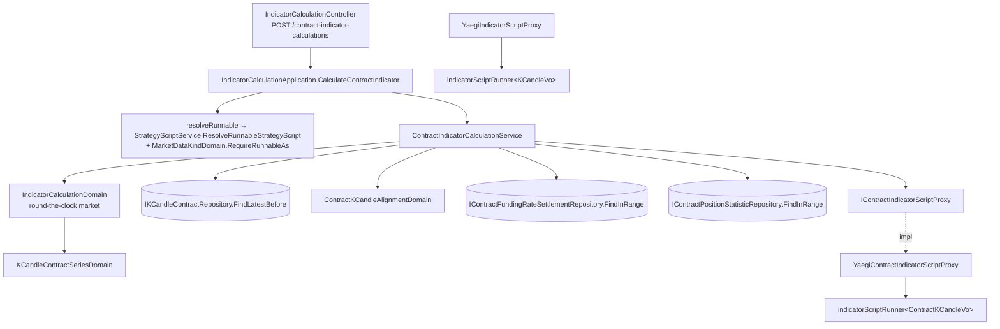

# 合約策略腳本 — Architecture Design

**Status:** Confirmed
**Source PRD:** `.sdd/2026-09-23-contract-strategy-script/PRD.md`
**Tech context:** Go · Gin · GORM (PostgreSQL, code-first) · yaegi · Clean / Onion Architecture（`.claude/rules/`）

---

## 1. Design Goal & Guiding Principle

- **In one sentence:** 讓一支策略腳本帶著一個**行情種類**（`kCandle` / `contractKCandle`），並新增一條**合約指標計算**的路：
  讀合約 K 線、依刻度彙總、把資金費率結算與持倉統計對齊進每一格，成為一串 `vo.ContractKCandleVo` 交給 yaegi 執行。
- **Guiding principle:** **對齊規則只住在一個 Domain Model（`ContractKCandleAlignmentDomain`），執行算式只住在一個泛型 runner。**
  下一刀（合約回測）要的是「同一套對齊、逐格重跑」：它只需要換一種讀法（區間讀而非往回讀）並呼叫已經存在的
  `ExecuteForEachCandle`，不必重新推導任何一條對齊規則，也不必再複製一份 yaegi 組裝。

---

## 2. Change Scope

| Area | Action | What / Why |
| :--- | :--- | :--- |
| 行情種類（vo / domain） | **Add** | `MarketDataKindVo`、`MarketDataKindDomain`：讀宣告、預設、修改時的「不得更換」、執行時的「不得混用」 |
| 策略腳本（entity / domain / dto / request / repository 的 ToDto） | **Modify** | 多一個 `MarketDataKind` 欄位，建立時決定；**不列入可改寫欄位**，所以更新路徑結構上改不到它 |
| 策略腳本服務 `UpdateStrategyScript` | **Modify** | 拿既有那一支的行情種類判定「沒提＝沿用、照抄＝可、不同＝拒絕」 |
| 合約 K 線 repository | **Modify** | 補 `FindLatestBefore`（與現貨同一語意），指標計算依賴「截至某刻往回讀 N 根」 |
| 合約行情格（vo） | **Add** | `ContractKCandleVo`（內嵌 `KCandleVo`）、`PriceLineVo`——腳本看到的形狀 |
| 對齊（domain） | **Add** | `ContractKCandleAlignmentDomain`：決定要讀哪一段結算與持倉統計、並把它們對進每一格 |
| 指標計算 domain | **Modify** | `IndicatorCalculationDomain` 加 `SelectContractInput`（與 `SelectInputCandles` 共用最少可算根數規則，回傳待對齊的 `ContractKCandleAlignmentDomain`）、`ToResultDto`（兩個 service 共用的回應組裝） |
| 合約指標計算服務 | **Add** | `ContractIndicatorCalculationService`：編排四次讀取與一次執行 |
| 腳本執行（infra） | **Modify / Add** | 把 yaegi 組裝抽成泛型 `indicatorScriptRunner[T]`；`YaegiIndicatorScriptProxy` 改為委派；新增 `YaegiContractIndicatorScriptProxy` 實作新介面 `IContractIndicatorScriptProxy` |
| 指標計算 application / controller | **Modify** | 同一個 `IndicatorCalculationApplication` / `IndicatorCalculationController` 加合約用例與路由 `POST /contract-indicator-calculations`；解析指名策略腳本與錯誤對映各自共用一個 private helper |
| 組裝根、Postman | **Modify** | DI 與路由註冊；Postman 補建立合約策略腳本與合約指標計算 |
| 回測、交易策略、策略機器人、助手 | **Not touched** | PRD Out of Scope；現貨回測仍走 `IIndicatorScriptProxy`，行為不變 |
| 合約交易規格、維持保證金分級 | **Not touched** | 不進合約行情格 |
| 資金費率 / 持倉統計 repository | **Not touched** | 既有 `FindInRange` 已足夠：前置段落以「最長結算間隔」與「統計間隔」往前多讀即可，不需要新的查詢 |

---

## 3. New Classes / Modules

| Name | Kind | Responsibility (purpose) | Collaborators | Satisfies (PRD scenario) |
| :--- | :--- | :--- | :--- | :--- |
| `vo.MarketDataKindVo` | VO | 行情種類的兩個合法拼法 `kCandle` / `contractKCandle` | — | US-01 全部 |
| `domains.MarketDataKindDomain` | Domain Model | 讀宣告（空白＝`kCandle`、大小寫寬容、非法拒絕）；`Retaining(requested)`：修改時沿用或拒絕更換；`RequireRunnableAs(expected)`：執行時不得混用 | `ErrStrategyScriptValidation`、`ErrStrategyScriptMarketDataKindMismatch` | US-01、US-06 |
| `vo.PriceLineVo` | VO | 一組開高低收（`float64`），腳本以 `indicator.PriceLine` 看到 | — | US-02 三組價格 |
| `vo.ContractKCandleVo` | VO | 一格合約行情：內嵌 `KCandleVo`（同名欄位）、`TradeCount`、`Mark`/`Index`/`PremiumIndex`、`FundingRate`、`FundingSettledInBar`、持倉統計八項 | `KCandleVo`、`PriceLineVo` | US-02、US-03、US-04 |
| `domains.ContractKCandleAlignmentDomain` | Domain Model | 持有已彙總好的合約 K 線格；說出要讀的**結算區間**（第一格起點往前一個最長結算間隔 8h，到唯讀截止點）與**持倉統計區間**（第一格起點往前一個統計間隔 5m，到唯讀截止點）及各自讀取上限；`Aligning(settlements, statistics)` 產出 `[]vo.ContractKCandleVo`：現行資金費率、這一格內有結算、夠新的持倉統計、缺值給零 | `AggregationIntervalDomain`、`ContractPositionStatisticInterval`、`KCandleQueryDomain` | US-02 缺值、US-03 全部、US-04 全部 |
| `service.ContractIndicatorCalculationService` | Domain Service | 合約指標計算的唯一入口：驗證請求（沿用 `IndicatorCalculationDomain`，市場固定全天候）→ 讀合約 K 線 → 選格 → 讀結算與持倉統計 → 對齊 → 執行 → 組回應 | `IKCandleContractRepository`、`IContractFundingRateSettlementRepository`、`IContractPositionStatisticRepository`、`IContractIndicatorScriptProxy`、`IClockProxy` | US-05 全部 |
| `IContractIndicatorScriptProxy` | Interface | 以一串合約行情格執行算式：`Execute`、`ExecuteForEachCandle`（後者供下一刀回測，本刀就位） | — | US-05 |
| `script.indicatorScriptRunner[T]` | Infra（泛型、未匯出） | yaegi 的全部組裝：沙箱、`indicator` 套件符號（依 T 換入口型別名與額外型別）、入口形狀檢查、逾時、參數讀取、逐格重跑 | `indicatorScriptShape`（加入口資料型別） | US-05 逾時 / 參數 / 入口寫錯 |
| `script.YaegiContractIndicatorScriptProxy` | Proxy | 以 `indicatorScriptRunner[vo.ContractKCandleVo]` 實作 `IContractIndicatorScriptProxy`，匯出 `ContractKCandle`、`PriceLine`（也匯出 `KCandle`，讓腳本能把內嵌那一格交給吃 `indicator.KCandle` 的 helper） | runner | US-05 |

> 刻意不新增 `ContractIndicatorCalculationApplication` / `Controller`：同一個用例家族，**解析指名策略腳本 + 行情種類檢查**與**錯誤對映**是兩條真正被兩個 public method 共用的 private helper；拆成兩個類別反而要複製它們。

---

## 4. Modified Components

| Component | Current role | Change needed |
| :--- | :--- | :--- |
| `entities.StrategyScript` | 策略腳本資料 | 加 `MarketDataKind string gorm:"size:32;not null;default:'kCandle'"`；`ToDto` 帶出。AutoMigrate 以預設值補既有列 |
| `persistence.strategyScriptWritableColumns` | 可改寫欄位白名單 | **不加** `market_data_kind`——「建立後不得更換」由結構保證 |
| `entities.PublishedStrategyScript.ToDto` | 市集形狀 | 帶出 `MarketDataKind` |
| `dto.StrategyScriptWriteDto` / `StrategyScriptDto` / `PublishedStrategyScriptDto` / `RunnableStrategyScriptDto` | 形狀 | 各加 `MarketDataKind`（json `marketDataKind`） |
| `models.StrategyScriptRequest` | 請求 | 加 `MarketDataKind`（可省略） |
| `domains.StrategyScriptDomain` | 策略腳本規則 | 持有 `MarketDataKindDomain`；`ToEntity` 寫出 |
| `domains.StrategyScriptAccessDomain.ToRunnableDto` | 三道關卡 | 帶出 `MarketDataKind` |
| `service.StrategyScriptService.UpdateStrategyScript` / `requireOwnership` | 修改 | `requireOwnership` 改回傳找到的 entity（刪除路徑忽略它）；更新路徑以 `MarketDataKindDomain(existing).Retaining(writeDto.MarketDataKind)` 決定最終值，再交 `NewStrategyScriptDomain` |
| `IKCandleContractRepository` + `KCandleContractRepository` | 合約 K 線存取 | 加 `FindLatestBefore(symbol, cutoff, limit)`（開盤時間嚴格早於 cutoff，新到舊），重新產生 mock |
| `domains.IndicatorCalculationDomain` | 指標計算規則 | 加 `SelectContractInput([]entities.KCandleContract) (ContractKCandleAlignmentDomain, error)`（以 `KCandleContractSeriesDomain` 彙總，交出持有這些格的對齊 domain）；最少可算根數與取最新 N 格抽成被兩個 Select 共用的 private helper；加 `ToResultDto(openTimes, indicatorValues)` 讓兩個 service 共用回應組裝 |
| `service.IndicatorCalculationService` | 現貨指標計算 | 回應組裝改呼叫 `ToResultDto`（純重構，行為不變） |
| `script.YaegiIndicatorScriptProxy` / `indicatorScriptShape` | 現貨算式執行 | 改委派給 `indicatorScriptRunner[vo.KCandleVo]`；shape 多帶入口資料型別與其腳本名稱，錯誤訊息依之改寫 |
| `application.IndicatorCalculationApplication` | 指標計算用例 | 注入 `ContractIndicatorCalculationService`；加 `CalculateContractIndicator`；private `resolveRunnable(ctx, viewer, subject, expectedKind)`：指名的那一支走三道關卡並 `RequireRunnableAs`；自帶算式不檢查（那段算式就是以此種類執行） |
| `controller.IndicatorCalculationController` | HTTP | 加 `CalculateContractIndicator`（`POST /contract-indicator-calculations`，body 同 `IndicatorCalculationRequest`）；`respondWithError` 加一條 `ErrStrategyScriptMarketDataKindMismatch` → 400 |
| `cmd/server/dependencies.go` | 組裝根 | 建 `YaegiContractIndicatorScriptProxy`、`ContractIndicatorCalculationService`，注入 application；註冊路由 |

---

## 5. Component Relationships

**對齊演算法（`Aligning`）**：結算與持倉統計各自依時間由早到晚排好、各持一個指標往前推；對每一格
（`bucketStart`、`bucketEnd = bucketStart + 刻度長度`）：

- 結算：推進到最後一筆 `settlementTime < bucketEnd`；那一筆的費率即現行資金費率（沒有即 0）；
  `FundingSettledInBar` ＝ 那一筆 `settlementTime >= bucketStart`（最後一筆落在格內 ⇔ 格內至少一筆）。
- 持倉統計：推進到最後一筆 `statisticTime < bucketEnd`；若 `statisticTime >= min(bucketStart, bucketEnd − 5m)` 即採用，否則八項為 0。
- 指數價格 / 溢價指數：`KCandleContractSeriesDomain` 已把「一根缺即整組沒有值」算成 `NullDecimal`；轉 VO 時無值即 0。

一次合約指標計算恰好四次讀取（合約 K 線、結算、持倉統計各一次，加上執行），不隨格數增加。

---

## 6. Extensibility & Handoff Notes

- **Most likely next requirement:** 合約回測（使用者已排定為下一刀）：逐格重跑合約算式、扣資金費用、判強平。
- **Where it lands:**
  - 逐格重跑：`IContractIndicatorScriptProxy.ExecuteForEachCandle` 本刀已就位（runner 共用，現貨的同名方法同一份程式）。
  - 對齊：`ContractKCandleAlignmentDomain` 只吃「已彙總的格 + 結算 + 持倉統計」，與讀法無關——回測以區間讀（`FindInRange`）取得格後同樣交給它。
  - 資金費用扣款：`FundingSettledInBar` + `FundingRate` 已足夠在回測 domain 內計算每一格的收付。
- **How to add it:** 新的回測 service 讀區間 → `KCandleContractSeriesDomain` 彙總 → `ContractKCandleAlignmentDomain.Aligning` → `ExecuteForEachCandle`。不要回頭改 `IndicatorCalculationDomain`。
- **Next field on the cell:** 在 `vo.ContractKCandleVo` 加欄位、在 `Aligning` 填值；yaegi 以反射匯出型別，**runner 不用改**。前端欄位參考清單需同步。
- **Next market-data kind:** 在 `MarketDataKindVo` 加值、寫一個新的 `indicatorScriptRunner[NewVo]` 的 proxy；`MarketDataKindDomain` 的兩條規則自動適用。
- **Patterns applied & why:** 泛型 runner（去除 yaegi 組裝的兩份拷貝，入口型別是唯一變化軸）；兩階段 Domain Model（先說要讀什麼、再對齊）讓 service 只做 I/O 編排。
- **Do not hardcode:** 持倉統計間隔一律引用 `ContractPositionStatisticInterval`；最長結算間隔（8h）寫成 alignment domain 的一個具名常數並附理由。
- **Known debt / deferred:**
  - 交易策略可以掛一支合約行情種類的信號腳本而在執行時才以「入口寫錯」失敗——使用者指示本刀不處理。
  - 長觀察區間 × 粗刻度會讀大量持倉統計（1000 天約 29 萬筆），與現貨讀一分鐘 K 線的規模同級；若變慢再考慮依格取最新一筆的查詢。

---

## 7. Traceability

| PRD Scenario | Fulfilled by |
| :--- | :--- |
| US-01 建立合約行情種類 / 沒說即 K 線 / 既有即 K 線 | `MarketDataKindDomain` 建構子 + entity 預設值 + `StrategyScriptDomain` |
| US-01 建立後不得更換 / 不提沿用 / 照抄可 | `MarketDataKindDomain.Retaining` + `UpdateStrategyScript` + 可改寫欄位白名單 |
| US-01 不認得的行情種類 | `MarketDataKindDomain` 建構子 → `ErrStrategyScriptValidation` |
| US-01 市集 / 可用策略腳本帶行情種類 | `PublishedStrategyScript.ToDto`、`StrategyScript.ToDto` |
| US-02 價量合併 / 三組價格 / 舊資料 / 空格不產出 | `KCandleContractSeriesDomain`（既有）+ `IndicatorCalculationDomain.SelectContractInput` + `ContractKCandleAlignmentDomain`（NullDecimal → 0） |
| US-02 現貨算式讀法照舊 | `ContractKCandleVo` 內嵌 `KCandleVo` + yaegi 欄位提升 |
| US-03 全部 | `ContractKCandleAlignmentDomain.Aligning`（結算指標）+ 結算讀取區間往前 8h |
| US-04 全部 | `ContractKCandleAlignmentDomain.Aligning`（持倉統計指標、夠新判準）+ 讀取區間往前 5m |
| US-05 信號 / 自帶算式 / 沒指定刻度即一分鐘 | `ContractIndicatorCalculationService` + `IndicatorCalculationDomain`（全天候市場）+ `ToResultDto` |
| US-05 湊不出最少可算根數 / 從沒存過 | `IndicatorCalculationDomain.SelectContractInput` → `CandleCoverageTooThin` |
| US-05 還沒走完的一格 | `IndicatorCalculationDomain.ReadCutoff` + `FindLatestBefore` |
| US-05 未宣告參數 / 入口寫錯 / 逾時 | `indicatorScriptRunner[vo.ContractKCandleVo]` + `indicatorScriptShape` |
| US-06 混用拒絕（兩個方向） | `IndicatorCalculationApplication.resolveRunnable` + `MarketDataKindDomain.RequireRunnableAs` + controller 400 |
| US-06 現貨照舊 / 別人未發佈的找不到 | 既有 `ResolveRunnableStrategyScript` 三道關卡 |

---

## 8. Risks & Open Decisions

- **Risks / trade-offs:**
  - yaegi 對「二進位 struct 內嵌欄位的提升存取」需實測；若不支援，退回平鋪欄位（同名），腳本端寫法不變，只是少了 `c.KCandleVo`。
  - 結算前置段落只往前看 8 小時：若資金費率抓取曾中斷超過 8 小時，第一格的費率為 0，之後遇到下一次結算即恢復。可接受——與「持倉統計不拿過時狀態冒充現在」同一精神。
- **Open decisions (for implementation):**
  - 混用拒絕的回應：400，`message` 說出這支策略腳本吃的是哪一種行情，另附 `marketDataKind`（該腳本的種類）供前端判讀。
