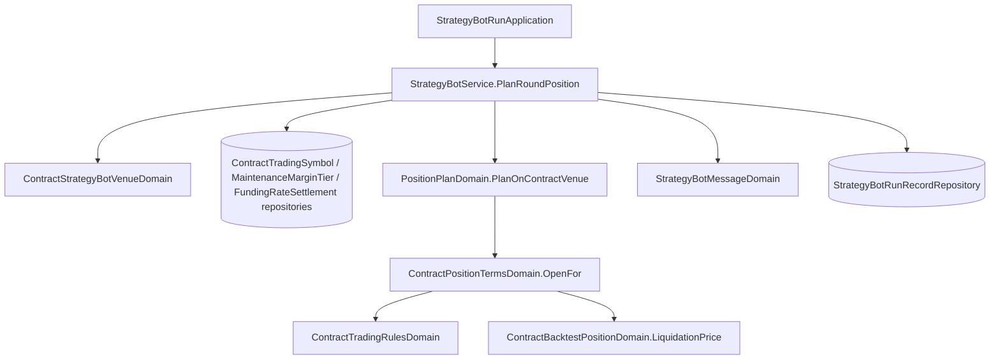

# 合約機器人建議部位的精確度 — Architecture Design

**Status:** Confirmed
**Source PRD:** `.sdd/2026-09-24-contract-bot-position-precision/PRD.md`
**Tech context:** Go · GORM (PostgreSQL, AutoMigrate) · Clean/Onion（`.claude/rules/`）

---

## 1. Design Goal & Guiding Principle

- **In one sentence:** 合約機器人要建議部位的那一輪，讀這個合約標的的交易規格、分級與最近一次資金費率，
  讓 `PositionPlanDomain` 以合約重演的開倉模型（`ContractPositionTermsDomain.OpenFor`）算出取整後的建議、預估強平價與
  交易所收不收，並附上資金費率估算；執行紀錄多記方向、槓桿、名目。
- **Guiding principle:** **不再寫第二套合約帳戶規則。** 取整、准入、分級、強平公式全部借用合約重演的 Domain Model；
  機器人這邊只新增「合約標的在這一刻的交易條件」（`ContractStrategyBotVenueDomain`）與把它交給既有開倉模型的那一步。

---

## 2. Change Scope

| Area | Action | What / Why |
| :--- | :--- | :--- |
| `ContractStrategyBotVenueDomain` | **Add** | 見 §3 |
| `ContractOrderRefusalVo` | **Add** | 交易所不收的原因與數字（最小下單量、最小名目、那一級最高槓桿） |
| `ContractTradingRulesDomain` | **Modify** | 新增 `RefusalFor(quantity, price, leverage) (vo.ContractOrderRefusalVo, bool)`，`Admits` 改由它回答（行為不變）；新增 `HasLadder()`、`FundingIntervalHours` 不在這裡（在 venue） |
| `ContractBacktestPositionDomain` | **Modify** | 新增唯讀 `Quantity()`、`EntryPrice()`、`ExitPrices()`，讓建議讀得到開倉結果（不改任何行為） |
| `PositionPlanDomain` | **Modify** | 新增 `PlanOnContractVenue(target, referencePrice, referenceTime, venue)`；`Suggests(target, hasReference)` 供 service 判斷要不要去讀交易條件；既有 `PlanFor` 不動（現貨與無交易規格時沿用） |
| `dto.PositionPlanDto` | **Modify** | 新增 `ForContract`、`Quantity`/`HasQuantity`、`LiquidationPrice`/`HasLiquidationPrice`/`LiquidationFromSmallestTier`/`CannotBeLiquidated`、`VenueRefusal`（`ContractOrderRefusalDto`）/`HasVenueRefusal`、`LacksTradingSpecification`、`FundingRate`/`HasFundingRate`/`FundingPayment`（正＝付）/`FundingIntervalHours` |
| `StrategyBotService` | **Modify** | 注入 `IContractFundingRateSettlementRepository`；`PlanRoundPosition(ctx, round)`：合約且 `Suggests` 時才讀交易規格、分級、最近結算，組成 venue 交給 `PlanOnContractVenue`；讀取失敗當作沒有 |
| `StrategyBotRunApplication` | **Modify** | 呼叫 `PlanRoundPosition` 帶 ctx |
| `StrategyBotMessageDomain` | **Modify** | 合約建議多數量、預估強平價、資金費率、交易所不收、沒有交易規格的說明；強平警告改看 `LiquidatesBeforeStop`（由 domain 依強平價或粗略判斷給出） |
| `entities.StrategyBotRunRecord` | **Modify** | 新增 `SuggestedDirection`（`size:8;default:''`）、`SuggestedLeverage`、`SuggestedNotional`（nullable numeric）；`ToDto` 帶出（空即省略） |
| `dto.StrategyBotRunRecordDto` | **Modify** | `suggestedDirection`、`suggestedLeverage`、`suggestedNotional`，`omitempty` |
| `StrategyBotRunRecordRepository.Append` | **Modify** | 交易所不收的那一輪不記任何數字；合約那一輪另記三樣 |
| `cmd/server/dependencies.go` | **Modify** | 注入資金費率 repository |
| 現貨機器人訊息、現貨執行紀錄、合約重演本身、存檔規則 | **Not touched** | 現貨一字不變；重演只多了唯讀 accessor 與 `RefusalFor` 的抽出 |

---

## 3. New Classes / Modules

| Name | Kind | Responsibility (purpose) | Collaborators | Satisfies |
| :--- | :--- | :--- | :--- | :--- |
| `ContractStrategyBotVenueDomain` | Domain Model | 一個合約標的在這一輪的交易條件：交易規格與分級（`ContractTradingRulesDomain`，可能沒有）、最近一次資金費率（可能沒有）、結算間隔。建構子吃 entities，交易規格不存在或讀不懂時記為「沒有交易規格」而不是錯誤 | `ContractTradingRulesDomain`、entities `ContractTradingSymbol`/`ContractMaintenanceMarginTier`/`ContractFundingRateSettlement` | US-01..05 |
| `ContractOrderRefusalVo` | VO | 交易所不收的那一條與它的數字 | — | US-02 |

---

## 4. Modified Components — key logic

- `PositionPlanDomain.PlanOnContractVenue`：
  1. `!Suggests` → 無建議；押不下 → 同今天。
  2. 沒有交易規格 → `PlanFor` 的結果 ＋ `LacksTradingSpecification` ＋ 資金費率估算（照 PlanFor 的名目）；強平警告沿用粗略判斷。
  3. 有交易規格 → `NewContractPositionTermsDomain(NewBacktestPositionTermsDomain(sizing, exitLevels, 無成本), leverage, 無滑點, rules).OpenFor(direction, referenceTime, referencePrice, capital)`：
     - `BlockedByTradingRules` → `rules.RefusalFor(rules.QuantityFor(stake×leverage, price), price, leverage)` 填 `VenueRefusal`，其餘數字不給。
     - `Opened` → 保證金＝`OpeningMargin()`、數量、名目＝數量×進場價、止損止盈（已取整）、虧賺照名目、`LiquidationPrice()` 取整（≤0 → `CannotBeLiquidated`）、`LiquidationFromSmallestTier = !rules.HasLadder()`、`LiquidatesBeforeStop` 由止損價與強平價比出。
  4. 資金費率：`FundingPayment = 名目 × 費率`，做空取反號。
- `StrategyBotRunRecordRepository.Append`：`HasPositionPlan && Affordable && !HasVenueRefusal` 才記數字；`ForContract` 時另記方向、槓桿、名目。

---

## 5. Component Relationships

---

## 6. Extensibility & Handoff Notes

- **Most likely next requirement:** 手續費或滑點進入建議、以標記價格估強平、預估下一次資金費率。
- **Where it lands:** 手續費與滑點——`PlanOnContractVenue` 目前傳入「無成本」「無滑點」給 `ContractPositionTermsDomain`，改成機器人的設定即可；
  標記價格——venue 帶標記價當進場價；下一次費率——venue 讀的來源換掉，`FundingPayment` 公式不變。
- **Do not hardcode:** 任何合約帳戶規則都不在機器人這邊重寫，一律走重演的 Domain Model。
- **Known debt:** 預估強平價以參考價為進場價；以「預估」明示。

---

## 7. Traceability

| PRD Scenario | Fulfilled by |
| :--- | :--- |
| US-01 取整三則 | `PlanOnContractVenue` → `OpenFor`（`QuantityFor`、`RoundedToTick`） |
| US-02 交易所不收三則 | `ContractTradingRulesDomain.RefusalFor` + `ContractOrderRefusalVo` + message |
| US-03 強平五則 | `ContractBacktestPositionDomain.LiquidationPrice` + `LiquidatesBeforeStop` + message |
| US-04 資金費率四則 | `ContractStrategyBotVenueDomain` + `FundingPayment` + message |
| US-05 沒有交易規格兩則 | `ContractStrategyBotVenueDomain`（沒有交易規格）+ `PlanFor` fallback + message |
| US-06 執行紀錄四則 | `StrategyBotRunRecordRepository.Append` + entity/DTO |
| US-07 現貨不變 | `PlanRoundPosition` 只在合約時走新路；message 現貨分支不動 |

---

## 8. Risks & Open Decisions

- `ContractTradingRulesDomain` 的建構錯誤用的是重演的說法；venue 只把它當「沒有交易規格」，不把那句話轉給使用者。
- 無。
