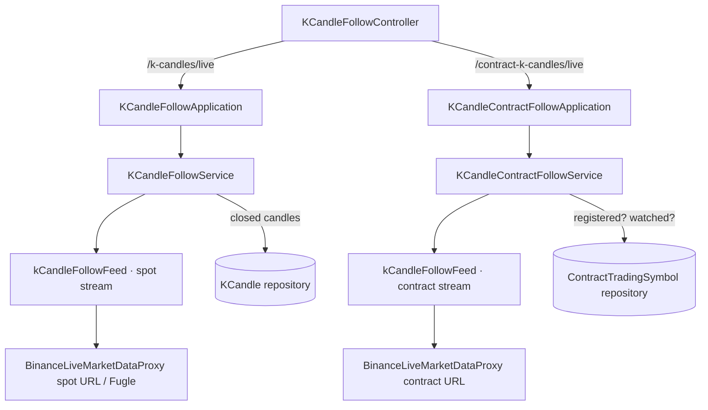

# 合約 K 線即時跟盤 — Architecture Design

**Status:** Confirmed
**Source PRD:** `.sdd/2026-09-24-contract-live-follow/PRD.md`
**Tech context:** Go · Gin（SSE）· Clean/Onion（`.claude/rules/`）· 既有現貨即時跟盤（`KCandleFollowService` 一族）

---

## 1. Design Goal & Guiding Principle

- **In one sentence:** 新增 `GET /contract-k-candles/live?symbol=`，由一個獨立的 `KCandleContractFollowService`
  依觀看者開關合約標的的跟盤，經合約來源的即時串流取得最新價的一分鐘 K 線，節流後以與現貨相同的更新形狀送出，**不存入**。
- **Guiding principle:** **兩份名單、一個引擎。** 現貨與合約各有自己的「誰在看哪個標的」（service 的登記簿），
  但「一條連線怎麼跟、斷了怎麼重試、靜默多久算斷」是與市場無關的機制，抽成一個兩邊共用的 `kCandleFollowFeed`。
  如此合約不必複製 600 行的現貨服務，現貨那份也不必長出合約的分支。

---

## 2. Change Scope

| Area | Action | What / Why |
| :--- | :--- | :--- |
| `service/k_candle_follow_feed.go` | **Add** | 從 `KCandleFollowService.run/consume` 抽出的「保持一條線被跟著」：連線、收件、靜默判定、逐次拉長重試、中斷時告知；對每一根收到的 K 線呼叫擁有它的服務給的 `report` |
| `KCandleFollowService` | **Modify** | `run`/`consume` 改由它持有的 `kCandleFollowFeed` 執行；`report`（節流＋送出＋存入）留在原處。行為一字不變 |
| `service/k_candle_contract_follow_service.go` | **Add** | `KCandleContractFollowService`：合約的登記簿（一個合約標的一份跟盤、第一人開始、最後一人結束）、只跟合約追蹤名單上的、`report` 只節流與送出不存 |
| `application/k_candle_contract_follow_application.go` | **Add** | `KCandleContractFollowApplication`：`WatchKCandleContracts`、`Stop` |
| `KCandleFollowController` | **Modify** | 多一個 handler `WatchKCandleContracts`（`GET /contract-k-candles/live`）；SSE 串流寫法抽成兩個 handler 共用的 private `stream`，錯誤對映合約的兩個哨兵 |
| `domains/k_candle_contract_follow_errors.go` | **Add** | `ErrContractTradingSymbolNotWatched`（認得但不在合約追蹤名單上）；不認得沿用 `ErrTradingSymbolNotRegistered` |
| `config.LiveFollowConfig` | **Modify** | 新增 `ContractMarketDataStreamUrl`（`CONTRACT_MARKET_DATA_STREAM_URL`，預設 `wss://fstream.binance.com/ws`）；節流、靜默、重試三個數字共用 |
| `cmd/server/dependencies.go`、`main.go` | **Modify** | 組裝合約跟盤、掛路由、關機時兩邊都 `Stop` |
| `BinanceLiveMarketDataProxy` | **Reuse** | 合約來源的即時 K 線串流與現貨同一種訊息格式（`<symbol>@kline_1m`），只換連線位址：另建一個實例，不另寫一份 |
| README、postman | **Modify** | 說明與範例 |
| 現貨名額／台股名單（`RefreshFixedFollows`、`LiveFollowRosterJob`） | **Not touched** | 合約永不休市、沒有名額 |
| 合約 K 線收取、`KCandleContract` 儲存 | **Not touched** | 走完那一根不由跟盤存入 |

---

## 3. New Classes / Modules

| Name | Kind | Responsibility (purpose) | Collaborators | Satisfies (PRD scenario) |
| :--- | :--- | :--- | :--- | :--- |
| `kCandleFollowFeed` | 執行機制（service 旁、無後綴） | 讓一條 `kCandleFollowChannel` 持續被跟：`keep(ctx, openChannel)` 連線→收件→靜默→告知中斷→重試，直到 context 結束；每根交給 `report` | `ILiveMarketDataProxy`、`IClockProxy`、`LiveChannelHealthDomain` | US-05 全部；US-01 跟盤本身 |
| `KCandleContractFollowService` | Domain Service | 合約標的的跟盤登記簿與送出規則（`WatchKCandleContracts`、`Stop`、`FollowedSymbolCount`） | `IContractTradingSymbolRepository`、`kCandleFollowFeed`、`kCandleFollowSymbol`、`kCandleFollowChannel`、`ViewerUpdateThrottleDomain` | US-01、US-02、US-03、US-04 |
| `KCandleContractFollowApplication` | Application | 觀看者看合約標的、關機時結束所有合約跟盤 | `KCandleContractFollowService` | 全部（入口） |

> `kCandleFollowFeed` 只拿機制（來源、時鐘、三個時間規則）與它要通知的 `report`；靜默與重試的規則照舊問 `LiveChannelHealthDomain`。

---

## 4. Modified Components

| Component | Current role | Change needed |
| :--- | :--- | :--- |
| `KCandleFollowService` | 現貨跟盤 | 建構子建立 `kCandleFollowFeed{proxy, clock, quiet, retry, report: service.report}`；`openChannel` 改 `go feed.keep(ctx, openChannel)`；刪除 `run`、`consume`（搬進 feed） |
| `KCandleFollowController` | 現貨 SSE | 建構子多收 `*KCandleContractFollowApplication`；新 handler；共用 `stream(ginContext, updates)` |
| `LiveFollowConfig` | 現貨跟盤設定 | `ContractMarketDataStreamUrl` |

---

## 5. Component Relationships

---

## 6. Extensibility & Handoff Notes

- **Most likely next requirement:** 合約即時更新帶上**標記價格**（另一條 `@markPrice` 串流），或讓外部助理「看一眼」合約即時 K 線。
- **Where it lands:** 標記價格：一個新的合約即時來源（proxy）把兩條串流對齊成一根，`KCandleContractFollowService.report` 送出時多帶一欄——feed 與登記簿不動。
  助理看一眼：前端／MCP 呼叫同一個路由即可，後端不動。
- **Patterns applied & why:** 以 `kCandleFollowFeed` 收納市場無關的連線機制；兩個 service 只各自保留「誰在看」與「一根要怎麼處理」。
- **Do not hardcode:** 合約串流位址是設定；節流／靜默／重試沿用 `LIVE_*` 設定。
- **Known debt / deferred:** 更新形狀沿用 `KCandleFollowUpdateDto`（其 K 線是現貨的價量形狀）；合約多出標記價格時再另立合約的更新形狀。

---

## 7. Traceability

| PRD Scenario | Fulfilled by |
| :--- | :--- |
| US-01 第一個觀看者、共用、繼續跟、最後一人離開 | `KCandleContractFollowService.WatchKCandleContracts` / `leave` + `kCandleFollowSymbol.join/leave` |
| US-01 現貨與合約各跟各的 | 兩個 service 各自的登記簿與各自的 proxy 實例 |
| US-02 名單上的、不認得、不在名單上 | `WatchKCandleContracts` 讀 `IContractTradingSymbolRepository.FindBySymbol`；`ErrTradingSymbolNotRegistered`（404）、`ErrContractTradingSymbolNotWatched`（409） |
| US-03 十秒上限、走完不等 | `ViewerUpdateThrottleDomain`（共用）in `KCandleContractFollowService.report` |
| US-03 最新價那一份 | 合約串流的 kline 只有價量；更新形狀的 K 線只有價量欄位 |
| US-04 不存、由每分鐘那一輪存入、進行中不存不算 | `KCandleContractFollowService.report` 不寫任何 repository；收取流程不變 |
| US-05 斷線告知、恢復給現在、其他照常 | `kCandleFollowFeed.keep` + `kCandleFollowChannel.publishStalled`；獨立路由 |
| US-05 永不休市、無名額 | 合約 service 沒有名單與休市分支 |

---

## 8. Risks & Open Decisions

- **Risks:** 抽出 feed 動到現貨路徑——以既有現貨跟盤測試全部維持綠燈為準（純搬移，不改行為）。
- **Open decisions:** 無。
