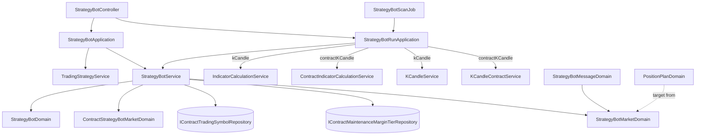

# 合約策略機器人 — Architecture Design

**Status:** Confirmed
**Source PRD:** `.sdd/2026-09-24-contract-strategy-bot/PRD.md`
**Tech context:** Go · Gin · GORM (PostgreSQL, AutoMigrate) · Clean/Onion（`.claude/rules/`）· entity 乾淨、行為在 `*Domain`

---

## 1. Design Goal & Guiding Principle

- **In one sentence:** 讓 `StrategyBot` 帶一個建立後不可更換的 `MarketDataKind`（`kCandle`／`contractKCandle`），
  存檔時要求它與引用的交易策略同種、合約機器人另要求標的在合約追蹤名單上且槓桿不超過分級上限；
  每一輪依種類走現貨或合約的指標計算與參考價，並以合約交易模式寫出合約動作與方向正確的建議部位。
- **Guiding principle:** **一台機器人只有一條生命週期，市場相關的差異集中在兩個地方**：
  - **讀行情**（信號與參考價）——`StrategyBotRunApplication` 內兩個依種類分派的方法，別處不問種類；
  - **講話與建議**（目標倉位、開頭動作、顏色、標的標籤）——新的 `StrategyBotMarketDomain`，
    訊息、生命週期訊息與部位規劃都問它，不各自 `if kind == contract`。
  啟停、刪除、執行紀錄、衝突、失敗分類、上限計數完全不分種類，所以不拆兩套機器人。

---

## 2. Change Scope

| Area | Action | What / Why |
| :--- | :--- | :--- |
| `entities.StrategyBot` | **Modify** | 新增 `MarketDataKind`（`default:kCandle`，既有列自動是 K 線）與 `PositionPlanLeverage`（`default:0`，現貨恆為 0）；`ToDto` 帶出兩者 |
| `dto.StrategyBotWriteDto` / `StrategyBotDto` / `PositionPlanSettingsDto` / `PositionPlanDto` / `StrategyBotRoundDto` | **Modify** | 帶行情種類、槓桿、名目、方向、強平警告、合約交易模式；`PositionPlanSettingsDto` 補上 camelCase `json` 標籤（見 §8，順手修掉回應大小寫與前端不一致） |
| `controller/models.StrategyBotRequest` | **Modify** | 收 `marketDataKind`；`positionPlan.leverage` 從「只拿來拒絕」變成「合約機器人的槓桿」 |
| `StrategyBotDomain` | **Modify** | 讀行情種類；現貨沿用 `SpotOnlyReplayDomain` 拒絕槓桿，合約讀槓桿（零即一、小於一拒絕）；`RequireFollowing(tradingStrategyKind)` 判同種 |
| `MarketDataKindDomain` | **Modify** | `RequireFollowableByStrategyBot()` 改為 `RequireFollowableByStrategyBotOf(botKind)`；新增 `RetainingForStrategyBot(requested)`；`label()` 供句子共用 |
| `PositionPlanDomain` | **Modify** | 多一個槓桿（零值＝現貨，視同一倍）；`PlanFor` 接受做空；止損止盈依方向；虧賺照名目；強平警告 |
| `StrategyBotMessageDomain` / `StrategyBotLifecycleMessageDomain` | **Modify** | 開頭、標的標籤、參考價句子問 `StrategyBotMarketDomain`；合約多一行交易模式、建議部位多槓桿與名目 |
| `StrategyBotService` | **Modify** | 注入 `IContractTradingSymbolRepository`、`IContractMaintenanceMarginTierRepository`；Create/Update 收引用的交易策略 DTO 並判同種、合約機器人檢查標的與槓桿；Update 保留行情種類；`ListStrategyBots` 可依種類篩；`PlanRoundPosition`／`WriteStartedMessage`／`WriteStoppedMessage` 走 `StrategyBotMarketDomain` |
| `StrategyBotApplication` | **Modify** | 讀交易策略（歸屬檢查不變）後把 DTO 交給 service，種類判斷搬進 domain |
| `StrategyBotRunApplication` | **Modify** | 注入 `ContractIndicatorCalculationService`、`KCandleContractService`；`calculateSourceSignal`／`readReferenceCandle` 依種類分派；round DTO 帶種類與交易模式 |
| `KCandleContractService` | **Modify** | 新增 `GetLatestKCandleContract`（與 `GetLatestKCandle` 同義） |
| `StrategyBotRepository.Save` | **Modify** | 更新欄位清單加 `position_plan_leverage`；**不含 `market_data_kind`**——種類改不動是寫入路徑說不出來，而不是記得不去改 |
| `StrategyBotController.ListStrategyBots` | **Modify** | 讀 `?marketDataKind=` |
| `cmd/server/dependencies.go` | **Modify** | 組裝新依賴 |
| README / postman | **Modify** | 路由說明與範例 |
| `StrategyBotMarketDomain` | **Add** | 見 §3 |
| `ContractStrategyBotMarketDomain` | **Add** | 見 §3 |
| 機器人啟停、刪除、執行紀錄、`StrategyBotRoundFailureDomain`、`StrategyBotVerdictDomain`、`DecideRound`、掃描 job、上限計數 | **Not touched** | 與種類無關；合約機器人照同一套規則跑 |
| 回測、交易策略、策略腳本、合約行情收取 | **Not touched** | 只被讀；它們的規則不因機器人改變 |
| 助手（assistant queries） | **Not touched** | 助手本來就沒有機器人能力 |

---

## 3. New Classes / Modules

| Name | Kind | Responsibility (purpose) | Collaborators | Satisfies (PRD scenario) |
| :--- | :--- | :--- | :--- | :--- |
| `StrategyBotMarketDomain` (`domains/strategy_bot_market_domain.go`) | Domain Model | 一台機器人「在哪一種帳戶上講話」：`TargetFor(signal)`（現貨＝`SignalDomain.TargetPosition`；合約＝`ContractTradingModeDomain.TargetFor`）、`HeadlineVerb(signal)`（現貨照舊；合約 做多／做空／平多／平空）、`HeadlineMark(signal)`、`SymbolLabel(symbol)`（合約加「 永續合約」）、`IsContract()`、`TradingModeInWords()` | `SignalDomain`、`ContractTradingModeDomain`、`MarketDataKindDomain` | US-03 全部；US-04 做空方向、平倉無建議 |
| `ContractStrategyBotMarketDomain` (`domains/contract_strategy_bot_market_domain.go`) | Domain Model | 一個合約標的能不能讓合約機器人盯、槓桿上限多少：由 `ContractTradingSymbol`（是否登錄、`IsWatched`）與分級建構；`Admit(leverage)` 回不在追蹤名單／超過上限的拒絕（無分級不擋上限） | entities `ContractTradingSymbol`、`ContractMaintenanceMarginTier` | US-02 前兩條；US-04 槓桿超上限、無分級不擋 |

> 兩者都是一般 class（struct + method），不抽介面；各一檔，無 static。

---

## 4. Modified Components

| Component | Current role | Change needed |
| :--- | :--- | :--- |
| `StrategyBotDomain` | 驗證機器人 | 新欄位 `marketDataKind MarketDataKindDomain`、`leverage decimal.Decimal`；`MarketDataKind()`、`Symbol()`、`Leverage()`、`WatchesContracts()`；`RequireFollowing(tradingStrategyMarketDataKind string) error`；`ToEntity` 寫兩欄 |
| `PositionPlanDomain` | 算現貨建議 | `NewPositionPlanDomain(settings)` 讀 `settings.Leverage`（零＝現貨）；`PlanFor(target, price, has)`：`long`/`short` 才建議；`notional = stake × max(leverage,1)`；做空止損在上、止盈在下；`LossAtStop = notional × stop%`；`LiquidatesBeforeStop = stop% × leverage ≥ 100%`（只在合約時） |
| `StrategyBotService.CreateStrategyBot(ctx, writeDto, followedTradingStrategy dto.TradingStrategyDto)` | 建立 | 領域驗證 → `RequireFollowing` → 合約時 `admitContractMarket`（private，Create/Update 共用） |
| `StrategyBotService.UpdateStrategyBot(ctx, viewerID, writeDto, followedTradingStrategy)` | 修改 | 先以 stored 種類 `RetainingForStrategyBot(writeDto.MarketDataKind)` 決定種類再驗證 |
| `StrategyBotService.ListStrategyBots(ctx, ownerID, marketDataKind string)` | 列出 | 空白全列；否則讀成 `MarketDataKindDomain`（錯即 `ErrStrategyBotValidation`）後篩選 |
| `StrategyBotService.PlanRoundPosition` | 算建議 | target 改問 `NewStrategyBotMarketDomain(round.MarketDataKind, round.ContractTradingMode).TargetFor` |
| `StrategyBotService.WriteStartedMessage/WriteStoppedMessage` | 生命週期訊息 | 傳入 `SymbolLabel` |
| `StrategyBotRunApplication.readSignals` | 現貨指標計算 | 每個來源改呼叫 `calculateSourceSignal`（依 `botDto.MarketDataKind` 走 `CalculateIndicator` 或 `CalculateContractIndicator`） |
| `StrategyBotRunApplication.sendRoundMessage` | 讀一分鐘 K 線當參考價 | 改呼叫 `readReferenceCandle`（依種類走 `GetLatestKCandle` 或 `GetLatestKCandleContract`），round 帶 `MarketDataKind`、`ContractTradingMode`（取自交易策略 DTO） |
| `KCandleContractService.GetLatestKCandleContract` | — | `FindLatest(symbol, 1)`，無即 `(zero, false, nil)` |
| `StrategyBotController.ListStrategyBots` | 列出 | `ginContext.Query("marketDataKind")` |

---

## 5. Component Relationships

---

## 6. Extensibility & Handoff Notes

- **Most likely next requirement:** 合約建議部位加上**強平價估算**（用分級與名目）或**交易規格取整**；其次是**以標記價格當參考價**。
- **Where it lands:**
  - 強平價／取整：`PositionPlanDomain.PlanFor` 需要分級與交易規格——`ContractStrategyBotMarketDomain` 已經在存檔時讀這兩樣，
    讓 round 也讀一次並以 VO 交給 `PlanFor` 即可，`ContractTradingRulesDomain`（合約重演用）已有 `TierFor`／`QuantityFor` 可重用。
  - 參考價來源：只動 `StrategyBotRunApplication.readReferenceCandle` 的合約分支與訊息的參考價句子（`StrategyBotMarketDomain`）。
- **How to add it:** 新的市場相關措辭一律加在 `StrategyBotMarketDomain`；新的讀行情差異一律加在 run application 那兩個分派方法。
- **Patterns applied & why:** 以一個 Domain Model 吸收「市場軸」上的所有講話差異（取代散落的種類判斷）；分派只在 application 的兩個讀取點，因為 domain service 彼此不呼叫。
- **Do not hardcode:** 「永續合約」、交易模式措辭只寫在 `StrategyBotMarketDomain`；槓桿句子沿用 `ErrLeverageMultiplierBelowOne` 與合約重演的上限句型。
- **Known debt / deferred:** 強平警告是 `停損距離 × 槓桿 ≥ 100%` 的粗略判斷（不含維持保證金），訊息明說；分級變動不回頭檢查已存機器人。

---

## 7. Traceability

| PRD Scenario | Fulfilled by |
| :--- | :--- |
| US-01 建立合約機器人／沒說即現貨 | `StrategyBotDomain`（`NewMarketDataKindDomain`）+ `StrategyBot.MarketDataKind` + `ToDto` |
| US-01 現貨不得引用合約／合約不得引用 K 線 | `StrategyBotDomain.RequireFollowing` → `MarketDataKindDomain.RequireFollowableByStrategyBotOf` |
| US-01 行情種類不得更換／沒提即維持 | `MarketDataKindDomain.RetainingForStrategyBot` in `StrategyBotService.UpdateStrategyBot`；repository 不更新該欄 |
| US-01 認不得的行情種類 | `NewMarketDataKindDomain` 錯誤包成 `ErrStrategyBotValidation` |
| US-01 只列合約／不指定全列 | `StrategyBotService.ListStrategyBots(kind)` + controller query |
| US-02 盯追蹤名單上的／不在名單上 | `ContractStrategyBotMarketDomain.Admit` |
| US-02 被移出後跳過 | 既有 `StrategyBotRoundFailureDomain`（未知錯誤＝跳過）；不新增停擺原因 |
| US-02 現貨不看合約名單 | `StrategyBotService` 只在 `WatchesContracts()` 時讀合約標的 |
| US-03 全部開頭與永續合約標籤、交易模式行 | `StrategyBotMarketDomain` + `StrategyBotMessageDomain` |
| US-03 現貨訊息不變 | `StrategyBotMarketDomain` 現貨分支委派 `SignalDomain`，訊息現貨路徑逐字不動 |
| US-03 生命週期標出永續合約 | `StrategyBotLifecycleMessageDomain`（收 `SymbolLabel`） |
| US-04 做多／做空建議、槓桿留白、強平警告、平倉無建議、押不下 | `PositionPlanDomain.PlanFor` + `StrategyBotMarketDomain.TargetFor` + 訊息 `positionPlanLines` |
| US-04 槓桿小於一 | `StrategyBotDomain`（合約分支） |
| US-04 超上限／無分級不擋 | `ContractStrategyBotMarketDomain.Admit` |
| US-04 現貨不收槓桿 | `StrategyBotDomain` 現貨分支 `SpotOnlyReplayDomain`（不變） |
| US-04 執行紀錄記下建議 | 既有 `RecordRound`（`Stake`＝保證金） |
| US-05 合約行情格判結論、不重送 | `StrategyBotRunApplication.calculateSourceSignal` + 既有 `DecideRound` |
| US-05 參考價一分鐘合約 K 線 | `readReferenceCandle` + `KCandleContractService.GetLatestKCandleContract` + 訊息參考價句子 |
| US-05 策略腳本找不到停擺 | 既有 `StrategyBotRoundFailureDomain` |
| US-05 上限合併計算 | 既有 `CountRunningByOwner`（不分種類） |

---

## 8. Risks & Open Decisions

- **Risks / trade-offs:**
  - `PositionPlanSettingsDto` 目前沒有 `json` 標籤，回應是 `Capital`/`SizingMode`… 而前端讀 `capital`——既有不一致。
    本刀加上 camelCase 標籤（`leverage` 用 `omitzero`，現貨機器人回應不出現這個字），讓回應與請求同一套拼法。
    讀這個回應的 MCP 若依賴大寫拼法需同步確認（Go `json.Unmarshal` 不分大小寫，不會壞）。
  - `StrategyBotService` 多兩個 repository 依賴：是「合約機器人能盯什麼」這條機器人規則的資料，不是去叫別的 service。
- **Open decisions (for implementation):** 無。
