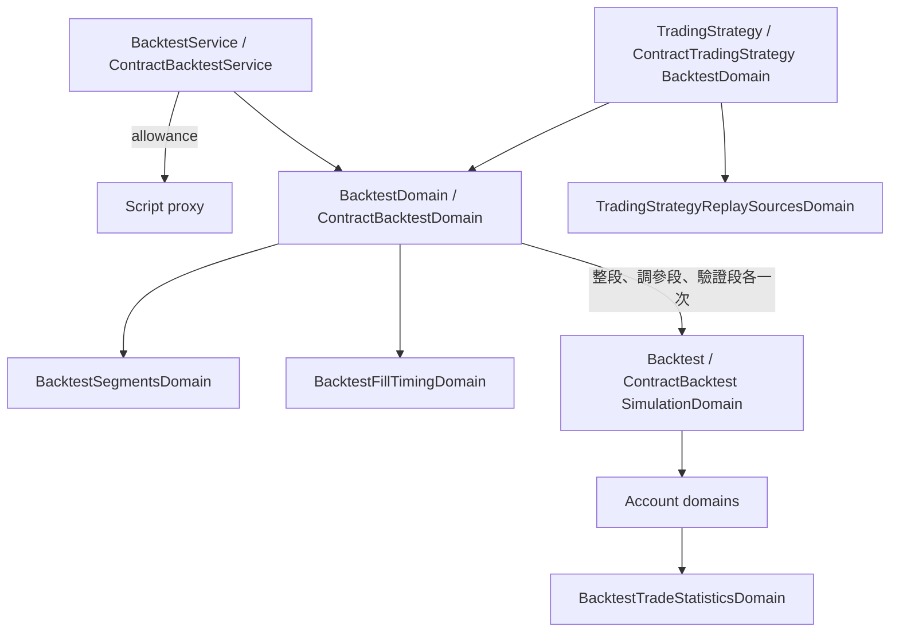

# 短線回測強化 — Architecture Design

**Status:** Confirmed（使用者授權一律採 best practice）
**Source PRD:** `.sdd/2026-09-24-short-term-backtest/PRD.md`
**Tech context:** Go · Gin · GORM · Clean / Onion（行為住在 `domains/`）

---

## 1. Design Goal & Guiding Principle

- **In one sentence:** 讓現貨與合約兩種重演共用四個新能力——自己的格數上限與整次允許時間、成交時點、五格交易統計、
  樣本外分段——而不讓兩種帳戶的規則彼此滲透。
- **Guiding principle:** **新東西都長在「兩種重演共有的那一層」。** 成交時點與分段是「逐格怎麼走、走哪幾格」的事，
  各自的逐格走（`BacktestSimulationDomain`、`ContractBacktestSimulationDomain`）只多讀一個成交時點；
  五格統計是「一串已平倉交易說得出什麼」的事，由一個新的模型從兩種交易明細的共同形狀算出來；
  分段是「同一批信號切成幾段、各走一次」的事，由重演請求模型（`BacktestDomain`／`ContractBacktestDomain`）負責切，
  逐格走本身不知道有分段。

---

## 2. Change Scope

| Area | Action | What / Why |
| :--- | :--- | :--- |
| `vo/fill_timing_vo.go` · `domains/backtest_fill_timing_domain.go` | **Add** | 成交時點二選一與它的讀法 |
| `vo/trade_outcome_vo.go` · `domains/backtest_trade_statistics_domain.go` · `dto/backtest_trade_statistics_dto.go` | **Add** | 五格統計：從一串交易結果算出獲利因子、每筆期望值、平均持倉時間、最大連續虧損、成本佔毛利 |
| `domains/backtest_segments_domain.go` | **Add** | 驗證起點的驗證與「一批格子切成調參段／驗證段」 |
| `vo/closed_trade_vo.go` · `vo/contract_closed_trade_vo.go` | **Modify** | 各多一個 `ToOutcomeVo()`（淨損益、扣成本前損益、交易成本、進出場時間） |
| `domains/backtest_account_domain.go` · `contract_backtest_account_domain.go` | **Modify** | 彙總時交出統計；合約帳戶的資金費率收付可以分兩次（開盤那一刻、其餘） |
| `domains/backtest_simulation_domain.go` · `contract_backtest_simulation_domain.go` | **Modify** | 讀成交時點：下一格開盤成交時，先執行上一格留下的信號再判出場價位 |
| `domains/backtest_domain.go` · `contract_backtest_domain.go` · `trading_strategy_backtest_domain.go` · `contract_trading_strategy_backtest_domain.go` | **Modify** | 讀成交時點與驗證起點；`SelectInput*` 檢查兩段都湊得出格；`ReplayOver` 交出整段加兩段 |
| `domains/trading_strategy_replay_sources_domain.go` | **Modify** | `Combine` 另外交出每一格是否打架，好讓分段各自計數 |
| `dto/backtest_*_dto.go` · `dto/contract_backtest_*_dto.go` · `dto/trading_strategy_backtest_request_dto.go` · `dto/contract_trading_strategy_backtest_request_dto.go` | **Modify** | 請求多 `FillTiming`、`ValidationStartTime`；成績單內嵌統計；結果多 `InSample`、`Validation` |
| `domains/backtest_errors.go` | **Modify** | 新欄位名 `fillTiming`、`validationStartTime`；新哨兵 `ErrBacktestTimeAllowanceSpent` |
| `service/backtest_service.go` · `service/contract_backtest_service.go` | **Modify** | 建構子多收整次允許時間；跑算式的那一段包在允許時間內，超過回 `ErrBacktestTimeAllowanceSpent` |
| `service/trading_strategy_service.go` · `application/trading_strategy_application.go` · `controller/trading_strategy_controller.go` | **Modify** | 列出交易策略可帶行情種類 |
| `controller/*backtest*` · `controller/models/*backtest_request.go` | **Modify** | 請求多兩欄；`ErrBacktestTimeAllowanceSpent` 對映 422 |
| `config/application_config.go` · `cmd/server/dependencies.go` | **Modify** | `BACKTEST_MAX_CANDLE_COUNT`（預設 50000）、`BACKTEST_TIME_ALLOWANCE_SECONDS`（預設 90）；四個重演服務改讀它們 |
| 腳本執行器、單格允許時間 | **Not touched** | 算式看得到的歷史不變（改了會改掉既有算式的答案） |
| 機器人、助手 | **Not touched** | 助手的重演查詢照舊（沒給新欄位即與今天相同） |

---

## 3. New Classes / Modules

| Name | Kind | Responsibility | Satisfies |
| :--- | :--- | :--- | :--- |
| `FillTimingVo` | VO | `close`／`nextOpen` | US-02 |
| `BacktestFillTimingDomain` | Domain Model | 讀宣告（留白即 `close`，認不得即拒絕並列出兩種）；`FillsAtNextOpen()` | US-02 |
| `TradeOutcomeVo` | VO | 一筆已平倉交易對統計而言的形狀：淨損益、扣成本前損益、交易成本、進場時間、出場時間 | US-03 |
| `BacktestTradeStatisticsDomain` | Domain Model | 從一串 `TradeOutcomeVo` 算五格；`ToDto()` | US-03 |
| `BacktestTradeStatisticsDto` | DTO | 五格（不適用即 `null`），**內嵌**在兩種成績單裡 | US-03 |
| `BacktestSegmentsDomain` | Domain Model | 驗證起點（可無）；`Validate(start, end)`；`Split(openTimes)` 交出調參段與驗證段的格數界線；兩段任一為空即拒絕 | US-04 |

```go
// 逐格走只多讀成交時點；分段由呼叫它的請求模型切好一段一段交進來。
NewBacktestSimulationDomain(initialCapital, positionTerms, fillTiming, inputKCandles, signals)
NewContractBacktestSimulationDomain(initialCapital, positionTerms, tradingMode, fillTiming, tradingRules, interval, buckets, signals, settlements)

// 統計只認一種形狀，兩種交易明細各自轉過來。
closedTrade.ToOutcomeVo() vo.TradeOutcomeVo
NewBacktestTradeStatisticsDomain(outcomes []vo.TradeOutcomeVo).ToDto()
```

**下一格開盤成交的逐格順序**
- 現貨：`①以開盤價執行上一格的信號 → ②判出場價位 → ③以收盤價記資金曲線`。
- 合約：`①收付開盤那一刻的結算 → ②以開盤價執行上一格的信號 → ③收付其餘結算 → ④判出場價位 → ⑤記資金曲線`。
- 收盤成交：兩種都與今天一字不差。

**分段**：整段照舊走一次；有驗證起點時，同一批信號與格子依開始時間切成兩段，
各自以一個新的逐格走（初始資金、空手）重演；合約各段只帶落在該段內的結算；交易策略的打架格數依 `Combine` 交出的逐格旗標各段自計。

---

## 4. Modified Components

| Component | Change |
| :--- | :--- |
| `ClosedTradeVo.ToOutcomeVo` | 扣成本前 ＝ 淨損益 ＋ 進出場成本；交易成本 ＝ 兩端成本 |
| `ContractClosedTradeVo.ToOutcomeVo` | 扣成本前 ＝ 淨損益 ＋ 兩端成本 ＋ 資金費用淨額（資金費用不算成本） |
| `BacktestAccountDomain` / `ContractBacktestAccountDomain` | 彙總時以已平倉交易建統計並填進成績單 |
| `ContractBacktestAccountDomain.SettleFundingWithin` | 不變；由逐格走分兩次呼叫（開盤那一刻的一批、其餘一批） |
| `TradingStrategyReplaySourcesDomain.Combine` | 回 `(verdicts, conflictedFlags []bool)`；計數交由呼叫者 |
| `BacktestService` / `ContractBacktestService` | `context.WithTimeoutCause(…, replayTimeAllowance, errReplayTimeAllowanceSpent)` 包住逐格跑算式；因它被中止即回 `ErrBacktestTimeAllowanceSpent`（說出秒數） |
| `TradingStrategyService.ListTradingStrategies` | 多收行情種類（空字串即全部）；以 `MarketDataKindDomain` 驗證後篩選 |

---

## 5. Component Relationships



---

## 6. Extensibility & Handoff Notes

- **Next likely:** 參數掃描、多段滾動驗證。**Where:** `BacktestSegmentsDomain` 從「一個驗證起點」擴成「一串切點」即是多段；逐格走不必改。
- **Next likely:** 更多統計（夏普、持倉時間分佈）。**Where:** `BacktestTradeStatisticsDomain` 加一格；兩種成績單因內嵌自動帶上。
- **Do not hardcode:** 格數上限、整次允許時間一律讀設定。
- **Known debt:** 分段各自重跑逐格走（算式只跑一次）；三段交易明細與資金曲線讓回應變大，交由呼叫端取樣呈現。

---

## 7. Traceability

| PRD Scenario | Fulfilled by |
| :--- | :--- |
| US-01 上限之內／超過上限／不受單次查詢上限限制 | 四個重演服務的 `maxCandleCount` 改讀 `BACKTEST_MAX_CANDLE_COUNT` + `BacktestDomain` 既有檢查 |
| US-01 超過整次允許時間 | 兩個重演服務的允許時間 + `ErrBacktestTimeAllowanceSpent` |
| US-02 全部 | `BacktestFillTimingDomain` + 兩個 SimulationDomain |
| US-03 全部 | `BacktestTradeStatisticsDomain` + 兩個 `ToOutcomeVo` + 兩個帳戶彙總 |
| US-04 全部 | `BacktestSegmentsDomain` + 四個重演請求模型的 `SelectInput*`／`ReplayOver` |
| US-05 全部 | `TradingStrategyService.ListTradingStrategies` + controller query |

---

## 8. Risks & Open Decisions

- 分段的起點不一定落在刻度邊界上：以格的開始時間 ≥ 驗證起點歸入驗證段。
- 整次允許時間只包住跑算式的那一段（讀資料庫不算），與 PRD「從開始跑算式起算」一致。
- 錯誤回應：允許時間用完回 422（與算式失敗同一類：請求本身沒錯，但這一次算不出來）。
