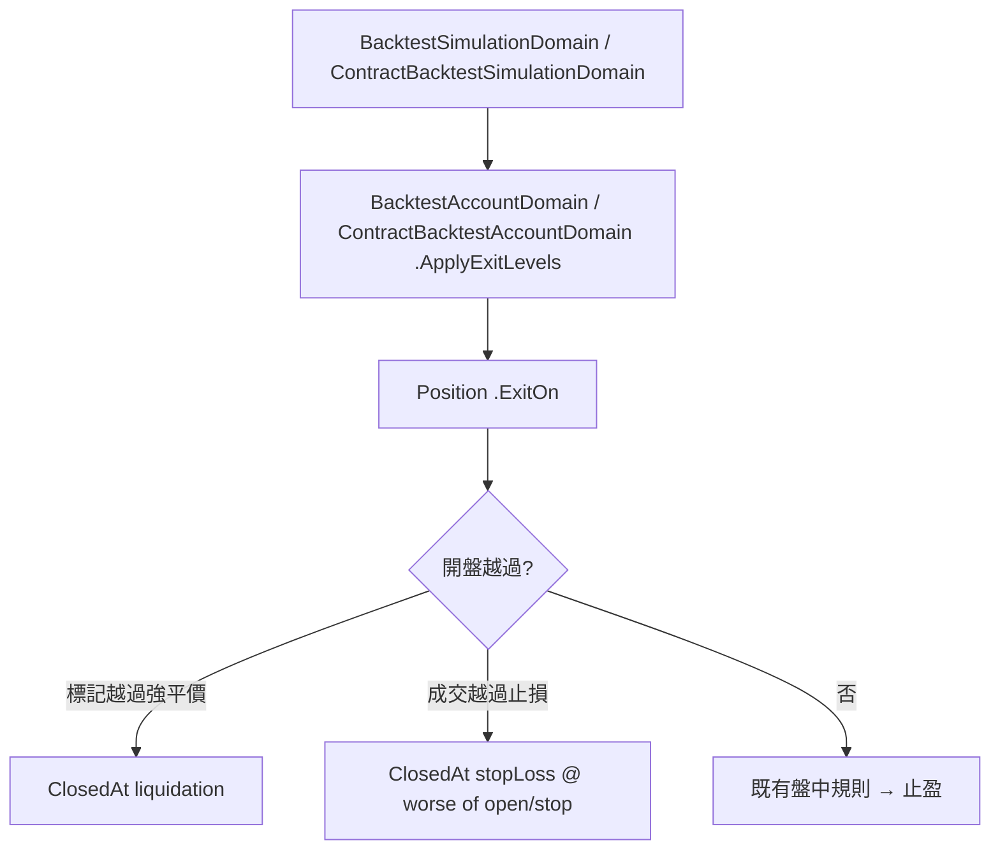

# 跳空穿過止損的成交價 — Architecture Design

**Status:** Confirmed
**Source PRD:** `.sdd/2026-09-25-backtest-gapped-stop-fill/PRD.md`
**Tech context:** Go · Clean / Onion Architecture · 行為在 `domain/models/domains/` 的 Domain Model

---

## 1. Design Goal & Guiding Principle

- **In one sentence:** 兩個倉位 Domain Model 的 `ExitOn` 在判到止損時，成交價改成「開盤價與止損價中對倉位較不利的那一個」；合約的 `ExitOn` 先判開盤那一刻（標記開盤越過強平價 → 強平；成交開盤越過止損 → 開盤價止損），再落回既有的盤中規則。
- **Guiding principle:** 出場判定已經集中在每種倉位自己的 `ExitOn`（現貨 `BacktestPositionDomain`、合約 `ContractBacktestPositionDomain`），兩種成交時點、兩種重演對象都經過它。**只改這兩個方法**，所有呼叫端（account、simulation、application）自動得到新讀法，不需要任何新參數或新型別。

---

## 2. Change Scope

| Area | Action | What / Why |
| :--- | :--- | :--- |
| `BacktestPositionDomain.ExitOn` | **Modify** | 止損成交價 ＝ `decimal.Min(open, stopLossPrice)`；現貨只做多 |
| `ContractBacktestPositionDomain.ExitOn` | **Modify** | 加入開盤那一刻的兩個判定（`liquidatedAtOpen`、`stoppedAtOpen`），盤中止損仍成交在止損價；滑點照舊由 `exitFillFor` 套上 |
| 止盈成交價 | **Not touched** | 已經是保守讀法（跳空時記在止盈價，少算好處） |
| `ClosedAt` / `CashReturnedFor` | **Not touched** | 既有的 `decimal.Max(0, …)` 已保證非強平出場最多輸掉保證金；強平既有的「只輸保證金加進場成本」不變 |
| account / simulation / 兩種成交時點的走法 | **Not touched** | 兩者都只呼叫 `ExitOn`；下一格開盤成交先開倉再判出場的順序不變 |
| request / DTO / controller / postman | **Not touched** | 沒有新參數、成績單形狀不變 |

---

## 3. New Classes / Modules

無。這是既有兩個 Domain Model 方法內的規則修正；拉新型別只會讓「止損怎麼成交」散在兩處。

---

## 4. Modified Components

| Component | Current role | Change needed |
| :--- | :--- | :--- |
| `BacktestPositionDomain.ExitOn(kCandle, exitTime)` | 低點碰止損 → 以止損價出場；高點碰止盈 → 以止盈價出場 | 止損成交價改為 `decimal.Min(decimal.NewFromFloat(kCandle.Open), StopLossPrice)` |
| `ContractBacktestPositionDomain.ExitOn(bucket, exitTime)` | 止損（成交價高低）與強平（標記高低）兩個都碰到時近者先到，再看止盈 | 依序：① `bucket.MarkOpen` 越過強平價 → 強平；② `bucket.Open` 越過止損 → `exitFillFor(bucket.Open)` 止損；③ 既有盤中規則；④ 止盈 |

合約的開盤判定用既有同樣的「多倉看下側、空倉看上側、多倉強平價須為正」條件，只是比較對象換成開盤價。

---

## 5. Component Relationships

---

## 6. Extensibility & Handoff Notes

- **Most likely next requirement:** 跳空時額外的成交偏差（例如止損單在跳空時多吃一段滑點），或用更細的 K 線還原盤中順序。
- **Where it lands:** 仍在 `ExitOn`——成交價在那裡決定，合約的滑點已經經由 `exitFillFor` 套上；現貨若要加滑點，應比照合約在倉位上持有 `BacktestSlippageDomain`。
- **Do not hardcode:** 不要在 account 或 simulation 層再判一次跳空；兩種成交時點都已經經過 `ExitOn`。
- **Known debt / deferred:** 止盈跳空的較好成交價刻意不做；若日後要做，同樣只改 `ExitOn` 的止盈分支。
- **測試夾具：** 現貨出場測試的 K 線過去沒有開盤價（零）；加入開盤價、未指定時以收盤價代替。合約測試夾具的標記開盤過去固定取收盤價，改為可指定、未指定時取開盤價，讓「開盤標記價格」能被表達。

---

## 7. Traceability

| PRD Scenario | Fulfilled by |
| :--- | :--- |
| US-01 開盤跳過止損價 / 正好等於 / 盤中才碰到 / 也碰到止盈 | `BacktestPositionDomain.ExitOn` 止損分支（在止盈分支之前） |
| US-01 止盈跳空不動 | `BacktestPositionDomain.ExitOn` 止盈分支（未改） |
| US-01 沒有設止損 | `HasStopLoss` 為假時止損分支不成立（未改） |
| US-02 進場那一格 / 之後那一格 | 下一格開盤成交的走法（未改）＋ `BacktestPositionDomain.ExitOn` |
| US-03 做多 / 做空開盤跳過、做空盤中才碰到、滑點 | `ContractBacktestPositionDomain.ExitOn` ② 與 ③、`exitFillFor` |
| US-04 開盤越過止損未越過強平價 | `ContractBacktestPositionDomain.ExitOn` ② |
| US-04 開盤標記越過強平價（止損較近 / 較遠） | `ContractBacktestPositionDomain.ExitOn` ①、`ClosedAt` 強平分支 |
| US-04 開盤成交越過強平價、標記還沒 | `ExitOn` ② ＋ `CashReturnedFor` 的零下限 |
| US-04 開盤兩個都沒越過、盤中強平較近 | `ExitOn` ③（未改） |
