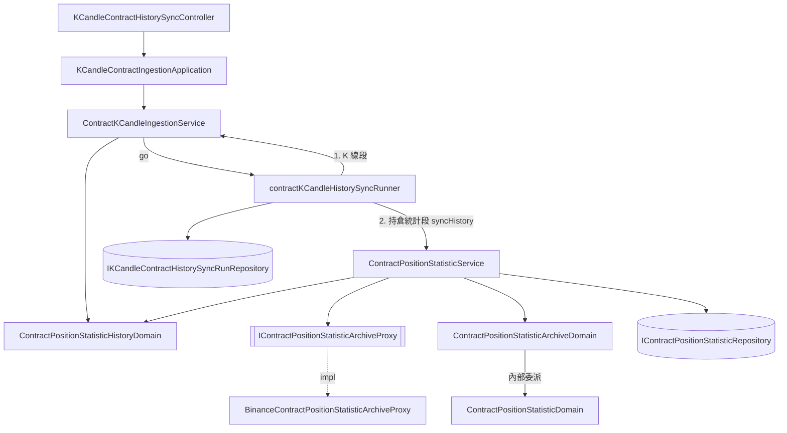

# 合約歷史同步一併補齊持倉統計 — Architecture Design

**Status:** Confirmed
**Source PRD:** `.sdd/2026-09-25-contract-position-statistic-history-sync/PRD.md`
**Tech context:** Go · Gin · GORM（PostgreSQL）· Clean / Onion Architecture（`.claude/rules/`）

---

## 1. Design Goal & Guiding Principle

- **In one sentence:** 合約歷史同步輪次（`contractKCandleHistorySyncRunner`）走完合約 K 線那一段後，接著以同一個回溯天數一天一天向**持倉統計歷史資料庫**要檔案，只把系統沒有的持倉統計寫進既有的持倉統計表，並在輪次上另記一組持倉統計進度。
- **Guiding principle:** **持倉統計的規則只住在持倉統計那一邊。** 合約 K 線的 service 只負責「在同一趟輪次裡接著跑」，怎麼切天、什麼算齊、比值怎麼換算成佔比、哪一筆合法，全部交給 `ContractPositionStatisticService` 與它底下的 domain model。下一次要替同步再加一種資料時，是在 runner 多接一段，而不是把第三種規則塞進 K 線的 service。

---

## 2. Change Scope

| Area | Action | What / Why |
| :--- | :--- | :--- |
| `domain/interface` | **Add** | `IContractPositionStatisticArchiveProxy`：以「一天」為單位向歷史資料庫要持倉統計的能力 |
| `infrastructure/marketdata` | **Add** | `BinanceContractPositionStatisticArchiveProxy`：下載幣安 `data.binance.vision` 的每日 metrics zip、解壓、讀 CSV、正規化成 VO |
| `domain/models/vo` | **Add** | `ContractPositionStatisticArchiveVo`（歷史資料庫的一筆，只有比值）、`ContractPositionStatisticSyncDayVo`（一個同步天的起訖） |
| `domain/models/domains` | **Add** | `ContractPositionStatisticArchiveDomain`（比值 → 佔比）、`ContractPositionStatisticHistoryDomain`（切天、判斷一天齊不齊） |
| `domain/models/dto` | **Add** | `ContractPositionStatisticSyncProgressDto`、`KCandleContractHistorySyncRunDto` |
| `IContractPositionStatisticRepository` + 實作 | **Modify** | 加 `CountInRange`，供「已齊全就不問」 |
| `ContractPositionStatisticService` | **Modify** | 注入 archive proxy；加同 package 可見的 `syncHistory`（一天一天走、換算、判斷、寫入、回報） |
| `ContractKCandleIngestionService` | **Modify** | 注入 `*ContractPositionStatisticService`；`StartHistorySyncFor` 同時算出持倉統計的天數寫進輪次；`GetHistorySyncRun` 回新 DTO |
| `contractKCandleHistorySyncRunner` | **Modify** | K 線段走完後接著跑持倉統計段；收尾時兩組進度一起寫 |
| `KCandleContractHistorySyncRun` entity | **Modify** | 新增五個持倉統計欄位（皆 `not null default`，舊列自動為零） |
| `KCandleContractIngestionApplication` / controller | **Modify** | 回傳型別換成 `KCandleContractHistorySyncRunDto`（controller 程式碼不變，型別跟著走） |
| `config` / `cmd/server/dependencies.go` | **Modify** | 新增歷史資料庫網址與節奏設定、第四個 venue pacer；調整組裝順序 |
| Postman 集合 | **Modify** | 合約同步輪次的回應範例多一組 `positionStatistic` |
| `go-trading-mcp` | **Modify**（另一個 repo） | `trading_sync_contract_k_candle_history` / `trading_get_contract_k_candle_history_sync` 的說明補上持倉統計 |
| 現貨歷史同步、`KCandleHistorySyncRunDto` | **Not touched** | 現貨輪次沒有持倉統計；共用 DTO 加欄位會讓現貨回應多一組永遠為零的數字 |
| 每五分鐘那一輪、三十天補齊（`RunRound` / `RunRoundFor`） | **Not touched** | PRD 明定照舊用即時來源 |
| 持倉統計的合法性規則（`ContractPositionStatisticDomain`） | **Not touched** | 歷史資料庫換算後的一筆直接交給它判斷——同一套規則，一份程式碼 |
| `go-trading-frontend` | **Not touched** | 前端沒有顯示合約同步輪次（已確認） |
| `go-trading-deploy` | **Not touched** | 新設定都有預設值，不需要改 configmap |

---

## 3. New Classes / Modules

| Name | Kind | Responsibility (purpose) | Collaborators | Satisfies (PRD scenario) |
| :--- | :--- | :--- | :--- | :--- |
| `IContractPositionStatisticArchiveProxy` | Interface | 給一個合約標的與一個同步天，回那一天歷史資料庫的每一筆（由早到晚），以及**那一天有沒有檔案**。沒有檔案不是錯誤，是 `found=false` | — | US-04 全部；US-05「連不上」「讀不懂」 |
| `BinanceContractPositionStatisticArchiveProxy` | Proxy | 組出 `{baseUrl}/{SYMBOL}/{SYMBOL}-metrics-{yyyy-mm-dd}.zip`、照自己的 pacer 下載；`404` → 沒有檔案；其他非 `200`、zip 或 CSV 讀不懂 → 錯誤。依表頭找欄位（不依位置），空白欄位 → 那一項**缺值**（`NullDecimal` 無效），統計時間照 `2006-01-02 15:04:05` UTC 讀 | `RequestPacer` | US-02 缺值；US-04；US-05 |
| `ContractPositionStatisticArchiveVo` | VO | 歷史資料庫的一筆：標的、統計時間、持倉量、持倉價值、全體帳戶比值、大戶持倉比值（後四者皆可缺） | — | US-02 |
| `ContractPositionStatisticArchiveDomain` | Domain Model | 把一筆歷史資料庫的讀數換成**可存的持倉統計**：先換算 **多方佔比 = r ÷ (1 + r)、空方佔比 = 1 ÷ (1 + r)**（兩組比值各換一次），再交給既有的 `ContractPositionStatisticDomain` 判斷，建構子收 `currentTime`、任何一條規則不過即拒絕並說出是哪一條；`ToEntity()` 回要存的那一筆。**比值為負時在換算前就拒絕**（「…的比值不得為負」）——r = −1 會讓分母為零；缺持倉量或持倉價值在此說「缺…」；缺比值原樣帶過，由既有規則說「缺…」。呼叫端一次呼叫、一個錯誤分支 | `ContractPositionStatisticDomain`（內部委派） | US-02 全部 |
| `ContractPositionStatisticHistoryDomain` | Domain Model | 以「現在」與回溯長度切出持倉統計同步天：從 `now − lookback` 所在的 UTC 日曆日到今天（含），每天 `[00:00, 23:55]`；`IsDayComplete(heldCount)` 以一天 288 筆為準 | `ContractPositionStatisticInterval` | US-01「共 181 天」「共 2 天」；US-03「已存滿」 |
| `ContractPositionStatisticSyncDayVo` | VO | 一個同步天：`Day`（日曆日）、`FirstStatisticTime`、`LastStatisticTime` | — | US-01、US-03 |
| `ContractPositionStatisticSyncProgressDto` | DTO | 持倉統計那一組進度：`totalDays`、`completedDays`、`storedCount`、`skippedCount`、`fetchFailureReason` | — | US-06 全部 |
| `KCandleContractHistorySyncRunDto` | DTO | 合約同步輪次的對外形狀：**嵌入** `KCandleHistorySyncRunDto`（既有欄位原樣攤平在 JSON 頂層），另加 `positionStatistic` | — | US-06「兩種數字不加總」「這一刀之前結束的輪次」 |

> 深度檢查：`IContractPositionStatisticArchiveProxy` 一個方法、一個概念（「那一天」），zip、CSV、欄位位置、網址格式全部藏在實作裡；呼叫端不必按順序呼叫任何東西。`syncHistory` 對 runner 是一個呼叫加一個進度回呼，切天、跳過、換算、判斷、寫入都在裡面。

---

## 4. Modified Components

| Component | Current role | Change needed |
| :--- | :--- | :--- |
| `IContractPositionStatisticRepository` | 存、找最新、區間查詢 | 加 `CountInRange(ctx, symbol, startTime, endTime) (int, error)`（兩端含） |
| `ContractPositionStatisticRepository` | GORM 實作 | 實作 `CountInRange`（`Where` + `Count`，無手寫 SQL） |
| `ContractPositionStatisticService` | 每五分鐘錄、三十天補齊、查詢 | 建構子多收 `IContractPositionStatisticArchiveProxy`。新增 **unexported** `syncHistory(ctx, symbol, historyDomain, recordProgress) error`：對每一天——先回報進度；`CountInRange` 達 288 → 算走過、下一天；否則問 archive；`found=false` → 下一天；錯誤 → `NoteFetchFailure`、回報、**回 nil**（只停這一份）；有檔案 → 每筆經 `ContractPositionStatisticArchiveDomain`（內部再交給 `ContractPositionStatisticDomain`），不合法者 `NoteSkipped`，合法者 `SaveAllIfAbsent`；存不進去 → **回 error**（輪次失敗）。另加 unexported `historyOf(currentTime, lookback)` 不需要——`ContractPositionStatisticHistoryDomain` 由 ingestion service 建好傳入 |
| `ContractKCandleIngestionService` | 合約 K 線的各種抓取與歷史同步 | 建構子多收 `*ContractPositionStatisticService`。`StartHistorySyncFor`：在切 K 線段的同一個「現在」建 `ContractPositionStatisticHistoryDomain`，把 `PositionStatisticTotalDays` 寫進輪次、交給 runner。`GetHistorySyncRun` 回 `KCandleContractHistorySyncRunDto` |
| `contractKCandleHistorySyncRunner` | 驅動 K 線段、記錄進度與收尾 | 多持有 `positionStatisticService`、`positionStatisticHistory`、`positionStatisticProgress`（`dto.ContractPositionStatisticSyncProgressDto`）。`run()`：K 線段回 error → 照舊收在失敗、**不跑**持倉統計段；否則接著跑 `syncHistory`，其 error → 失敗。`recordProgress` 與新的 `recordPositionStatisticProgress` 都寫同一列；`recordEnding` 兩組一起寫（panic 路徑同樣兩組都寫實際走到的地方） |
| `KCandleContractHistorySyncRun` entity | 輪次一列 | 加 `PositionStatisticTotalDays`、`PositionStatisticCompletedDays`、`PositionStatisticStoredCount`、`PositionStatisticSkippedCount`（`int not null default 0`）、`PositionStatisticFetchFailureReason`（`text not null default ''`）。`ToDto()` 改回 `KCandleContractHistorySyncRunDto` |
| `KCandleContractIngestionApplication` | 轉手 service | `StartSymbolHistorySync` / `GetSymbolHistorySync` 回傳型別換成 `KCandleContractHistorySyncRunDto` |
| `config.ContractIngestionConfig` | 合約來源設定 | 加 `PositionStatisticArchiveBaseUrl`（`CONTRACT_MARKET_DATA_POSITION_STATISTIC_ARCHIVE_BASE_URL`，預設 `https://data.binance.vision/data/futures/um/daily/metrics`）、`PositionStatisticArchiveRequestsPerMinute`（`CONTRACT_MARKET_DATA_POSITION_STATISTIC_ARCHIVE_REQUESTS_PER_MINUTE`，預設 `120`） |
| `cmd/server/dependencies.go` | 組裝根 | `venuePacers` 加 `cryptoContractArchive`；`contractPositionStatisticService` 移到 `contractKCandleIngestionService` 之前建，注入 archive proxy，再把它交給 ingestion service |

---

## 5. Component Relationships

---

## 6. Extensibility & Handoff Notes

- **Most likely next requirement:** 同步再多補一種歷史資料庫才有的資料（例如主動買賣量比、大戶多空**人數**比），或另一種只有即時來源三十天的資料。
- **Where it lands:** 歷史資料庫已經一天一份、同一個檔案裡就有那兩欄——**多讀一欄是 `ContractPositionStatisticArchiveVo` 加欄位**，proxy 依表頭取值不必改切法。要存下來則是持倉統計 entity 的事，與同步無關。若是**另一種資料**，在 runner 多接一段 `syncHistory` 形狀的呼叫，並比照這次在輪次上另記一組進度 DTO。
- **How to add it:** 新資料的 service 提供同 package 的 `syncHistory(ctx, symbol, historyDomain, recordProgress) error`；runner 在 `run()` 依序呼叫；entity 加一組 `Xxx…` 欄位、`KCandleContractHistorySyncRunDto` 多一個巢狀進度。**不要**把第二種資料的數字加進既有那一組。
- **Patterns applied & why:** 能力命名的 proxy 介面（換一家交易所的歷史資料庫只換實作）；DTO 嵌入（合約輪次多一組、現貨輪次零改動）；只停一份的失敗語意沿用「來源不答話不是失敗」。
- **Do not hardcode:** 歷史資料庫網址與節奏走設定；一天 288 筆由 `ContractPositionStatisticInterval` 推出，不另寫一個 288。
- **Known debt / deferred:** 天是依序走的、不平行——一千五百天在 120 次／分下約十三分鐘，可接受；若要更快再把節奏調高即可，平行化要一起處理進度回報的順序。沒有檔案的日子（上市前）每次同步都會再問一次，成本是請求而不是正確性，與既有「舊 K 線缺標記價格會被重問」同一類取捨。

---

## 7. Traceability

| PRD Scenario | Fulfilled by |
| :--- | :--- |
| US-01 回溯 180 天，前一百五十天從歷史資料庫補進來 | runner 第二段 → `ContractPositionStatisticService.syncHistory` + archive proxy |
| US-01 持倉統計涵蓋的天數跟著回溯天數走（181 天） | `ContractPositionStatisticHistoryDomain` |
| US-01 回溯 1 天，只涵蓋昨天與今天 | `ContractPositionStatisticHistoryDomain` |
| US-01 先補合約 K 線，再補持倉統計 | `contractKCandleHistorySyncRunner.run` 的順序 |
| US-01 回溯天數超過上限，整次拒絕 | 既有 `KCandleHistoryLookbackDomain`（`StartHistorySyncFor` 最先檢查，不建輪次） |
| US-02 比值 3 / 1 / 0 換算 | `ContractPositionStatisticArchiveDomain` |
| US-02 比值為負，那一筆不存 | `ContractPositionStatisticArchiveDomain`（換算前拒絕）+ `syncHistory` 記跳過 |
| US-02 任何一項缺了 | proxy（空白 → 缺值）+ 既有 `ContractPositionStatisticDomain` |
| US-02 持倉量為負 / 不在五分鐘刻度 | 既有 `ContractPositionStatisticDomain` + `syncHistory` 記跳過 |
| US-03 一筆都沒有的那一天整天補進來 | `syncHistory` + `SaveAllIfAbsent` |
| US-03 已存滿一整天，連問都不問 | `CountInRange` + `ContractPositionStatisticHistoryDomain.IsDayComplete` |
| US-03 只缺一筆，只補那一筆 | `SaveAllIfAbsent`（`ON CONFLICT DO NOTHING`） |
| US-03 即時錄下的那一筆不被覆蓋 | `SaveAllIfAbsent` |
| US-03 整段本來就齊全，存了 0 筆 | `syncHistory`（全部略過） |
| US-04 今天的檔案還沒出現 / 上市前 / 完全沒有檔案 | archive proxy `found=false` + `syncHistory` 繼續下一天、不記原因 |
| US-05 補到第 40 天連不上 | archive proxy 錯誤 → `syncHistory` `NoteFetchFailure`、回 nil、停下 |
| US-05 檔案內容讀不懂 | archive proxy（zip / CSV 解析錯誤回 error） |
| US-05 合約 K 線來源不答話，持倉統計照常補 | runner：K 線段回 nil（只記 K 線那組原因）→ 照跑第二段 |
| US-05 兩個來源的原因分開記 | entity 的 `FetchFailureReason` 與 `PositionStatisticFetchFailureReason` |
| US-05 系統自己存不進去 | `syncHistory` 回 error → runner `recordEnding(失敗)` |
| US-05 補到一半服務重啟 | 既有 `FailInterruptedHistorySyncs` + `IsDayComplete` 讓重跑略過已齊全的天 |
| US-06 補持倉統計到第 20 天時查輪次 | runner `recordPositionStatisticProgress` + `KCandleContractHistorySyncRunDto` |
| US-06 兩種數字不加總 | entity 兩組欄位 + DTO 巢狀 `positionStatistic` |
| US-06 這一刀之前結束的輪次 | 欄位 `default 0` / `''` |

---

## 8. Risks & Open Decisions

- **Risks / trade-offs:**
  - 歷史資料庫格式由幣安決定。依表頭取欄位能擋住欄位重排；**欄位改名或少了欄位時整份檔案讀不懂**，照來源不答話處理——持倉統計的來源原因寫著少了哪一欄、剩下的日子不再問，而不是悄悄存錯或逐筆跳過。一個數字或時間讀不懂也一樣。
  - 換算出的佔比有 16 位小數，即時來源只有 4 位；兩者並存時 `SaveAllIfAbsent` 保留先到的那一筆。
  - `ContractKCandleIngestionService` 依賴一個具體的 `*ContractPositionStatisticService`：兩者同屬 domain service、同 package，runner 本來就活在 service 旁邊；經 application 編排做不到，因為這段工作必須活得比請求久（既有 runner 存在的理由）。
- **Open decisions (for implementation):**
  - 回傳的 `found=false` 條件：**只有 `404`**。實測（2026-09-25）：今天、昨天（9/24 尚未出檔）、不存在的代號都回 `404`；其他任何狀態碼都是來源不答話。
  - Postman 範例的輪次編號沿用集合既有變數。
