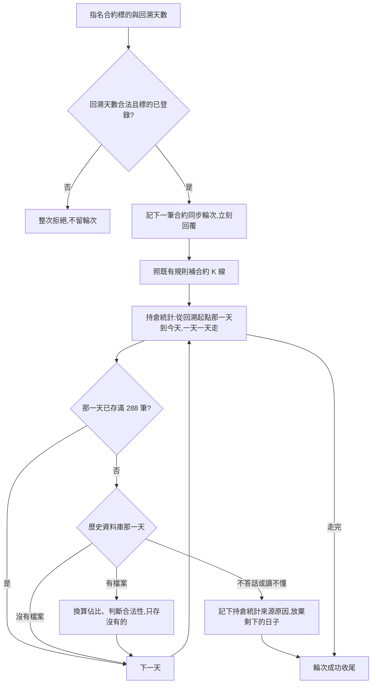

# Product Requirements Document (PRD)

**Status:** Draft
**Version:** v1.0
**Owner:** James Hsueh
**Stakeholders:** Engineering

---

## 1. Background & Goal (Why & Goal)

### Problem Statement

合約策略腳本回測時，每一格合約行情格都帶著持倉統計（持倉量、多空人數比、大戶多空持倉比）。
但系統手上的持倉統計**只從加入合約追蹤名單前三十天開始**——那是交易所即時來源的極限。
一段半年的回測，前五個月的持倉統計全是零：任何用到持倉量或多空比的策略條件在那段時間**形同關閉**，
回測說不出這些條件到底有沒有用。

交易所另有一份**持倉統計歷史資料庫**，一天一份檔案，記著同一份每五分鐘一筆的持倉統計，可回溯好幾年。

### Expected Outcome

- **合約歷史同步**從此同一趟補兩樣：合約 K 線（照舊）與持倉統計（新增），用同一個回溯天數。
- 同步完一段 180 天的 ETHUSDT，那 180 天除了今天之外，每一天都有持倉統計（歷史資料庫有檔案的日子）。
- 合約同步輪次另外說出持倉統計的進度與結果，與合約 K 線那組分開。
- 合約 K 線那一份的行為一字不差；每五分鐘那一輪、三十天補齊照舊。

### Out of Scope

- 另開一條專門補持倉統計的路。
- 改變每五分鐘那一輪、系統啟動與加入名單時的三十天補齊。
- 歷史資料庫裡有、但系統本來就沒有的數字（大戶多空人數比、主動買賣量比）。
- 資金費率結算的歷史同步。
- 覆蓋或修正已存的持倉統計。
- 現貨的任何東西。

---

## 2. User Personas

**Primary Role:** 系統擁有者（唯一使用者）。直接對系統下指令，或透過交易助手的工具代為操作。

**Usage Context:** 他在設計、回測合約策略，想知道持倉量或多空比的條件在過去幾個月有沒有用。
他指名一個合約標的與回溯天數啟動一次合約歷史同步，之後拿輪次編號回來看進度，跑完就回測。

---

## 3. User Stories & Acceptance Criteria

### US-01 — 同一趟同步也補持倉統計 [priority: P0]

**As a** 系統擁有者，**I want** 合約歷史同步同一趟也把那一段的持倉統計補齊，
**so that** 回測時持倉統計的歷史跟合約 K 線一樣長。

```gherkin
Scenario: 回溯 180 天,持倉統計的前一百五十天從歷史資料庫補進來
  Given ETHUSDT 的持倉統計只有最近三十天
  When 同步 ETHUSDT、回溯 180 天
  Then 合約 K 線照既有規則補齊
  And 那 180 天裡歷史資料庫有檔案的每一天,持倉統計都補進來

Scenario: 持倉統計涵蓋的天數跟著回溯天數走
  Given 今天是 2026-09-25
  When 同步 ETHUSDT、回溯 180 天
  Then 輪次說持倉統計共 181 天(從 2026-03-29 到 2026-09-25)

Scenario: 回溯 1 天,持倉統計只涵蓋昨天與今天
  Given 今天是 2026-09-25
  When 同步 ETHUSDT、回溯 1 天
  Then 輪次說持倉統計共 2 天

Scenario: 先補合約 K 線,再補持倉統計
  Given 一趟同步剛開始
  When 查輪次
  Then 合約 K 線的段數還沒走完時,持倉統計走到第 0 天

Scenario: 回溯天數超過上限,整次拒絕
  Given 合約回溯天數上限是 3650 天
  When 同步 ETHUSDT、回溯 3651 天
  Then 整次拒絕,並說出上限是 3650 天
  And 持倉統計也不補,沒有留下任何輪次
```

### US-02 — 由比值換算出多方與空方佔比 [priority: P0]

**As a** 系統擁有者，**I want** 歷史資料庫補進來的持倉統計跟即時錄下的長得一樣、守同一套規則，
**so that** 策略腳本分不出、也不必分出它是從哪裡來的。

```gherkin
Scenario: 比值 3 換算成多方 0.75、空方 0.25
  Given 某一筆的全體帳戶多空人數比比值是 3
  When 那一筆補進來
  Then 存下的多方佔比 0.75、空方佔比 0.25、比值 3

Scenario: 比值 1 換算成各佔一半
  Given 某一筆的大戶多空持倉比比值是 1
  When 那一筆補進來
  Then 存下的多方佔比 0.5、空方佔比 0.5

Scenario: 比值 0 換算成一面倒做空
  Given 某一筆的全體帳戶比值是 0
  When 那一筆補進來
  Then 存下的多方佔比 0、空方佔比 1

Scenario: 比值為負,那一筆不存
  Given 某一筆的全體帳戶比值是 -1
  When 那一天補進來
  Then 那一筆不存,持倉統計跳過數加一
  And 同一天其他合法的照常存入

Scenario: 任何一項缺了,那一筆不存
  Given 某一筆的大戶比值是空白
  When 那一天補進來
  Then 那一筆不存,持倉統計跳過數加一

Scenario: 持倉量為負,那一筆不存
  Given 某一筆的持倉量是負的
  When 那一天補進來
  Then 那一筆不存,持倉統計跳過數加一

Scenario: 統計時間不在五分鐘刻度,那一筆不存
  Given 某一筆的統計時間是 09:03
  When 那一天補進來
  Then 那一筆不存,持倉統計跳過數加一
```

### US-03 — 只補沒有的，已齊全的那天不問 [priority: P0]

**As a** 系統擁有者，**I want** 同步只補系統還沒有的持倉統計，
**so that** 即時錄下的數字不被蓋掉，而且重跑一次不會浪費時間。

```gherkin
Scenario: 一筆都沒有的那一天,整天補進來
  Given 2026-03-01 一筆持倉統計都沒有
  And 歷史資料庫那一天有 288 筆合法的
  When 同步涵蓋 2026-03-01
  Then 那一天存了 288 筆

Scenario: 已存滿一整天,連問都不問
  Given 2026-03-01 已經存了 288 筆
  When 同步涵蓋 2026-03-01
  Then 不向歷史資料庫要 2026-03-01
  And 那一天仍算走過一天

Scenario: 只缺一筆,只補那一筆
  Given 2026-03-01 存了 287 筆,缺 09:05
  When 同步涵蓋 2026-03-01
  Then 只新增 09:05 那一筆
  And 其他 287 筆的每一個數字都不變

Scenario: 即時錄下的那一筆不被覆蓋
  Given 09:05 那一筆是即時錄下的,多方佔比 0.7353
  And 歷史資料庫換算出的 09:05 多方佔比是 0.73531
  When 同步涵蓋那一天
  Then 09:05 那一筆的多方佔比仍是 0.7353

Scenario: 整段本來就齊全,存了 0 筆
  Given 回溯的每一天都已存滿
  When 同步
  Then 持倉統計存了 0 筆,輪次成功
```

### US-04 — 沒有那一天的檔案不是失敗 [priority: P0]

**As a** 系統擁有者，**I want** 歷史資料庫沒有某一天時，同步照常往下走，
**so that** 回溯到上市前、或今天還沒出檔案時，不會被誤判為失敗。

```gherkin
Scenario: 今天的檔案還沒出現
  Given 歷史資料庫還沒有今天的檔案
  When 同步涵蓋今天
  Then 今天什麼都不存
  And 持倉統計沒有來源原因,輪次成功

Scenario: 回溯到合約上市之前
  Given 回溯的前 100 天合約還沒上市,歷史資料庫沒有那些天的檔案
  When 同步
  Then 那 100 天什麼都不存、繼續下一天
  And 上市之後有檔案的日子照常補進來

Scenario: 某個標的在歷史資料庫裡完全沒有檔案
  Given 歷史資料庫沒有 FOOUSDT 的任何一天
  When 同步已登錄的 FOOUSDT
  Then 持倉統計存了 0 筆、走完全部的天數
  And 輪次成功,沒有持倉統計的來源原因
```

### US-05 — 歷史資料庫不答話，只停下持倉統計這一份 [priority: P0]

**As a** 系統擁有者，**I want** 歷史資料庫出問題時，只停下持倉統計、不拖累合約 K 線，並且說清楚是哪一個來源，
**so that** 我知道該等一下重跑，而不是懷疑系統壞了。

```gherkin
Scenario: 補到第 40 天時歷史資料庫連不上
  Given 前 39 天已經補好
  When 第 40 天向歷史資料庫要檔案時連不上
  Then 第 40 天之後的日子不再問
  And 輪次上持倉統計走到第 39 天,來源原因寫著連不上
  And 輪次成功,前 39 天存下的留著

Scenario: 某一天的檔案內容壞掉讀不懂
  Given 第 10 天的檔案內容讀不懂
  When 同步
  Then 視為歷史資料庫不答話:第 10 天之後不再問,持倉統計的來源原因寫著讀不懂
  And 輪次成功

Scenario: 合約 K 線的來源不答話,持倉統計照常補
  Given 合約 K 線的來源在第 3 段就不答話
  When 同步
  Then 合約 K 線照既有規則收,來源原因寫在合約 K 線那一組
  And 持倉統計照常從第一天補到最後一天

Scenario: 兩個來源的原因分開記
  Given 合約 K 線的來源不答話,歷史資料庫也不答話
  When 同步
  Then 輪次上合約 K 線與持倉統計各自寫著自己的來源原因

Scenario: 系統自己存不進去,輪次失敗
  Given 存持倉統計時系統自己存不進去
  When 同步
  Then 輪次收在失敗,寫著原因
  And 已經存下的留著

Scenario: 補到一半服務重啟
  Given 一趟同步補持倉統計到一半
  When 服務重啟
  Then 那一趟收在失敗,寫著被重啟中斷
  And 再跑一次時,已存滿的那幾天連問都不問
```

### US-06 — 進度分開說 [priority: P0]

**As a** 系統擁有者，**I want** 輪次把合約 K 線與持倉統計的進度分開說，
**so that** 我看得出現在走到哪一份、各存了多少。

```gherkin
Scenario: 補持倉統計到第 20 天時查輪次
  Given 一趟同步的合約 K 線已走完,持倉統計補到第 20 天
  When 查輪次
  Then 合約 K 線的段數已走完
  And 持倉統計說走到第 20 天、共幾天

Scenario: 兩種數字不加總
  Given 一趟同步合約 K 線存了 1,000 根、持倉統計存了 500 筆
  When 查輪次
  Then 合約 K 線那組說存了 1,000 根,持倉統計那組說存了 500 筆

Scenario: 這一刀之前結束的輪次
  Given 一趟在這一刀之前就結束的合約同步輪次
  When 查輪次
  Then 持倉統計的天數、走到第幾天、筆數、跳過數都是零,沒有來源原因
```

---

## 4. Business Flow & Logic

### Flow



### Core Business Rules

- **同一個回溯天數**：持倉統計涵蓋「從現在往回推回溯天數那一刻所在的那一天」到「今天」，以世界標準時間的日曆日計。
- **一天一份**：持倉統計以日曆日為單位向歷史資料庫要；一天最多 288 筆。
- **已齊全就不問**：某一天已存 288 筆，不向歷史資料庫要那一天。這只拿來決定要不要問，不決定從哪天開始。
- **只存沒有的**：已經有的（包括即時錄下的）原封不動，不覆蓋。
- **佔比由比值換算**：多方佔比 = 比值 ÷（1 + 比值）、空方佔比 = 1 ÷（1 + 比值）；全體帳戶與大戶各換一次。
- **同一套合法性**：換算後每一筆適用與即時錄製相同的規則；任何一項缺了或不合法即跳過並算進持倉統計的跳過數。
- **沒有那一天的檔案不是失敗**：繼續下一天，不留原因。
- **不答話只停這一份**：歷史資料庫連不上、回錯誤、內容讀不懂時，放棄持倉統計剩下的日子，原因記在持倉統計那組；輪次照樣成功。
- **兩份互不牽連**：合約 K 線的來源不答話不影響持倉統計，反之亦然。
- **系統自己壞掉才算失敗**：存不進去、讀不到自己的資料時輪次收在失敗。
- **既有規則照舊**：回溯天數上下限、一個標的同時只跑一趟、先回輪次、重啟掃成失敗。

### Edge Cases

- **中途重啟**：輪次掃成失敗；已存的留著；重跑時已存滿的日子不問。
- **今天與昨天**：多半還沒有檔案，由每五分鐘那一輪負責。
- **上市前**：沒有檔案，不算失敗。
- **即時錄下的與歷史資料庫的有尾差**：保留即時錄下的。

---

## 5. UI/UX Design & Interaction

- **沒有新畫面。** 合約同步輪次的查詢結果多一組持倉統計進度。
- **交易助手的工具說明**要一起更新：合約歷史同步現在也補持倉統計、輪次多一組進度、兩個來源原因分開。
- 前端若有顯示合約同步輪次，一併顯示持倉統計那組；沒有則不新增畫面。

---

## 6. Non-Functional Requirements

- **Performance:** 一天一份檔案；四年約一千五百天、一千五百次請求，照歷史資料庫自己的節奏打，不影響即時來源的額度。
- **Memory:** 一次只處理一天（最多 288 筆），不把整段候在記憶體裡。
- **Security:** 歷史資料庫是公開的，不需要身分。
- **Compatibility:** 既有的合約同步輪次照查得到；它們的持倉統計那組為零。

---

## 7. Dependencies & Risks

- **External Dependencies:** 交易所的持倉統計歷史資料庫（公開、一天一份檔案）。
- **Known Risks:**
  - 歷史資料庫的檔案格式由交易所決定，改了就讀不懂——這時照「不答話」處理，不會壞掉系統。
  - 換算出的佔比與即時來源有小數尾差；策略腳本讀的是同一種數字，差異可忽略。
  - 歷史資料庫的出檔時間不固定；今天、昨天沒有檔案是常態。

---

## 8. Appendix

- 需求共識見同資料夾 `BRIEF.md`。
- 相關切片：`2026-09-17-k-candle-history-sync`（歷史同步本身）、`2026-09-22-contract-k-candle-ingestion`（合約歷史同步）、
  `2026-09-23-contract-market-supplements`（持倉統計的即時錄製）、`2026-09-23-contract-k-candle-series`（合約行情格上的持倉統計）。
