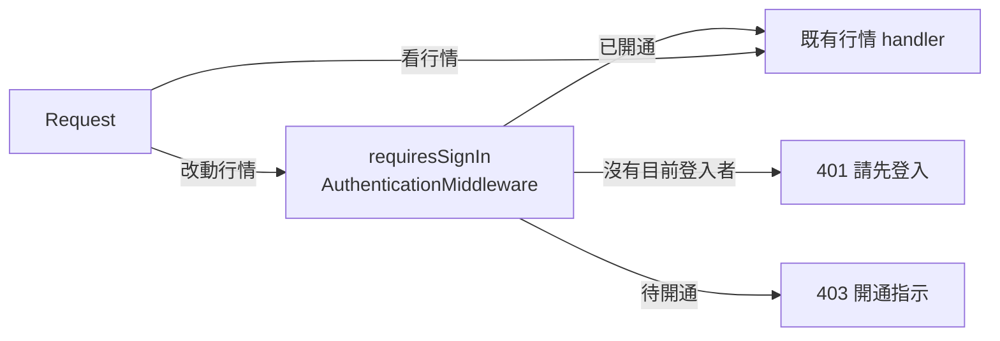

# 改動行情資料須先登入 — Architecture Design

**Status:** Confirmed
**Source PRD:** `.sdd/2026-09-25-market-data-writes-require-sign-in/PRD.md`
**Tech context:** Go · Gin · Clean / Onion Architecture；組裝根 `cmd/server/dependencies.go`

---

## 1. Design Goal & Guiding Principle

- **In one sentence:** 把現貨與合約的每一條「改動行情資料」路由掛到既有的 `requiresSignIn`（`AuthenticationMiddleware.Handle`）後面，看行情的路由維持不掛。
- **Guiding principle:** **門只在組裝根決定。** 哪一條路由要先登入，是路由註冊那一行上看得到的事；handler、application、domain 一概不知道有這道門——它們今天不讀目前登入者，這次也不需要讀。已開通與否早已由 `UserApplication.IdentifyActivatedUser` 判定（401 / 403 兩種拒絕），這次不另開任何判斷。

---

## 2. Change Scope

| Area | Action | What / Why |
| :--- | :--- | :--- |
| `cmd/server/dependencies.go` | **Modify** | 16 條路由加上 `requiresSignIn`；更正「Market data is deliberately public」那句註解，改為只說看的那一半公開 |
| `cmd/server/` 路由測試 | **Add** | 以真正的 `registerRoutes` 證明：16 條改動不帶憑證回 401；看的那一半帶壞憑證也不回 401 |
| `internal/controller/tests/` 行情相關 router fixture | **Modify** | 改動路由比照正式註冊掛上 `doorOpenFor`，請求帶 `signedInProof`，證明已開通的使用者照常能改；加一組未登入回 401、東西沒被動的案例 |
| `postman/`、`README.md` | **Modify** | 改動請求帶 bearer；路由說明標出需登入 |
| Controller / application / domain | **Not touched** | 這些 handler 不需要知道是誰在改（行情沒有歸屬），門在它們前面就結束了 |
| `AuthenticationMiddleware` | **Not touched** | 401 / 403 的分流與開通指示已經是這支的行為 |
| 背景 job、即時跟盤的存入 | **Not touched** | 系統自己排定的抓取不經過任何路由 |

**被保護的路由（16 條）**

| 現貨 | 合約 |
| :--- | :--- |
| `POST /k-candles` | `POST /contract-k-candles` |
| `PUT /k-candles/:symbol/:openTime` | `PUT /contract-k-candles/:symbol/:openTime` |
| `DELETE /k-candles/:symbol/:openTime` | `DELETE /contract-k-candles/:symbol/:openTime` |
| `POST /k-candles/backfill` | `POST /contract-k-candles/backfill` |
| `POST /k-candles/history` | `POST /contract-k-candles/history` |
| `GET /k-candles/history/:id` | `GET /contract-k-candles/history/:id` |
| `POST /watchlist` | `POST /contract-watchlist` |
| `DELETE /watchlist/:symbol` | `DELETE /contract-watchlist/:symbol` |

**維持公開**：`GET /k-candles`、`/k-candles/series`、`/k-candles/:symbol/:openTime`、`/k-candles/live`、`/trading-symbols`，合約同名的五條，`/contract-funding-rate-settlements`、`/contract-maintenance-margin-tiers`、`/contract-position-statistics`、`/health`。

其餘不必登入的改動路由（`POST /users`、`/sessions`、`/sessions/renewal`、`/sessions/revocation`）是進門本身，不在此列。

---

## 3. New Classes / Modules

無。這次只是把既有的門掛到更多路由上；多一個型別只會讓「哪條要登入」分散到兩個地方。

---

## 4. Modified Components

| Component | Current role | Change needed |
| :--- | :--- | :--- |
| `registerRoutes` | 組裝根與路由註冊 | 16 條改動路由加上 `requiresSignIn` |
| `cmd/server` 路由測試 | 釘住整個可達面 | 新增一份表格：改動路由不帶憑證 → 401；看的路由帶過期憑證 → 不是 401（handler 自己怎麼答不論，nil 資料庫造成的 panic 由 `gin.Recovery` 收成 500） |
| 行情 controller 測試的 router fixture | 直接掛 handler | 改動路由前面掛 `doorOpenFor`，與正式註冊同形 |

---

## 5. Component Relationships

---

## 6. Extensibility & Handoff Notes

- **Most likely next requirement:** 記下誰改了哪根 K 線，或只讓某些人改。
- **Where it lands:** 前者：handler 以 `middlewares.CurrentUserID` 取得改動者，往下傳成 DTO 欄位——門已經保證它存在。後者：需要角色時是一支新的 middleware 掛在 `requiresSignIn` 之後，不是改這支。
- **Do not hardcode:** 不要在 handler 裡再檢查一次登入；門只有一處。
- **Known debt / deferred:** 即時跟盤仍對任何人開著，陌生人可以替任何已登錄標的開啟來源連線；它有「同一標的只跟一份」與名額上限兜著，是資源問題不是資料完整性問題，另案處理。

---

## 7. Traceability

| PRD Scenario | Fulfilled by |
| :--- | :--- |
| 已開通的使用者新增一根 K 線 / 手動回補 / 啟動歷史同步 / 查歷史同步進度 / 加進觀察清單 | `requiresSignIn` 放行 → 既有 handler；controller 測試以 `doorOpenFor` 證明 |
| 沒有登入就新增 K 線 / 手動回補 / 啟動歷史同步 / 查進度 / 從觀察清單移除 | `requiresSignIn` 回 401，handler 不執行；`cmd/server` 路由測試（真實註冊）＋ controller 測試（mock 沒被呼叫） |
| 帶著過期的身分證明刪除 K 線 | `requiresSignIn` → `JwtAccessTokenProxy` 驗不過 → 401；`cmd/server` 路由測試帶壞憑證 |
| 待開通的使用者修改 K 線 | `requiresSignIn` 的 403 分流（既有 middleware 測試覆蓋；這裡只證明路由掛了這支門） |
| 合約那邊的改動與現貨一模一樣 | 同上，合約 8 條 |
| 沒有登入照常查 K 線 / 跟盤 / 交易標的清單 / 合約補充資料；帶著壞掉的身分證明看行情 | 看的路由不掛門；`cmd/server` 路由測試帶過期憑證仍非 401 |

---

## 8. Risks & Open Decisions

- **Risks / trade-offs:** 上線順序——操作台與代操外掛必須先帶憑證，否則它們的改動會全部被擋。後端 PR 必須等兩個使用者端部署後才合併。
- **Open decisions:** 無。
