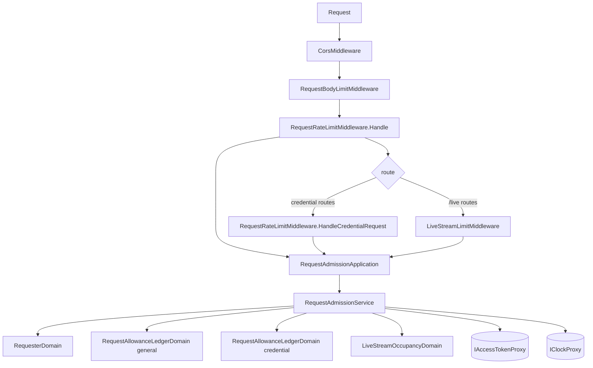

# 請求節流 — Architecture Design

**Status:** Confirmed
**Source PRD:** `.sdd/2026-09-25-request-rate-limiting/PRD.md`
**Tech context:** Go · Gin · Clean / Onion（`.claude/rules/architecture.md`）

---

## 1. Design Goal & Guiding Principle

- **In one sentence:** 每一個請求在進到任何 handler 之前，先由**一個 Domain Service** 回答「這位請求者現在還能不能被服務」，拒絕時以 429 + `Retry-After` 回覆；即時跟盤另問「還有沒有名額」；內容大小與連線時間由 HTTP 邊緣自己擋。
- **Guiding principle:** **政策（額度數字）是資料、機制（令牌桶、名額、清理）是 Domain Model、HTTP 翻譯是 middleware**。middleware 只問一句話、翻一種錯；「誰算誰」「補多快」「何時忘掉」全部住在 domain 裡，下一個需求（新增一類更嚴或更鬆的路由、改成認別的身分）只是多一份 `RequestBudgetVo` 或改一個 Domain Model。

---

## 2. Change Scope

| Area | Action | What / Why |
| :--- | :--- | :--- |
| `internal/domain/models/vo` | **Add** | `RequestBudgetVo`、`LiveStreamCapacityVo`：政策資料，由組裝根從設定組好注入 |
| `internal/domain/models/domains` | **Add** | `RequesterDomain`、`RequestAllowanceLedgerDomain`、`LiveStreamOccupancyDomain`、`request_admission_errors.go` |
| `internal/domain/models/dto` | **Add** | `RequesterDto`（輸入）、`LiveStreamSlotDto`（開啟跟盤後交回、關閉時交還） |
| `internal/domain/service` | **Add** | `RequestAdmissionService`：跨三個 Domain Model 的編排 + 以 `IAccessTokenProxy` 認出使用者、以 `IClockProxy` 取現在 |
| `internal/application` | **Add** | `RequestAdmissionApplication`：薄薄一層用例轉交 |
| `internal/controller/middlewares` | **Add** | `RequestRateLimitMiddleware`（一般 / 身分相關兩個 handle）、`LiveStreamLimitMiddleware`、`RequestBodyLimitMiddleware` |
| `CorsMiddleware` | **Modify** | 多送 `Access-Control-Expose-Headers: Retry-After`，瀏覽器的 JS 才讀得到等待秒數 |
| `internal/config` | **Modify** | `RequestLimitConfig`（十一個設定，全部有預設值） |
| `cmd/server` | **Modify** | 新檔 `request_limits.go` 集中組裝（信任轉手、全域 middleware、回傳兩個逐路由 handler）；`dependencies.go` 只加一行呼叫與六條路由上的 handler；`serve.go` 多一個 `newServer` 帶齊逾時；`main.go` 改用它 |
| `IAccessTokenProxy` / `IClockProxy` | **Reused, not touched** | 認使用者只需驗簽與效期（不查資料庫），時間走既有 clock proxy |
| `UserService` / `AuthenticationMiddleware` | **Not touched** | 驗證流程不變；節流不需要「已開通」這種要查資料庫的判斷 |
| 背景工作 / `serve` 的關機順序 | **Not touched** | 清理不靠 goroutine（見 §6），沒有東西要在關機時停 |
| `SignInLockoutDomain` | **Not touched** | 登入鎖定認帳號、這裡認來源，兩者並存 |

---

## 3. New Classes / Modules

| Name | Kind | Responsibility (purpose) | Collaborators | Satisfies |
| :--- | :--- | :--- | :--- | :--- |
| `vo.RequestBudgetVo` | VO | 一份額度：每分鐘補幾份、最多累積幾份 | — | US-02、US-03 |
| `vo.LiveStreamCapacityVo` | VO | 每位請求者幾條、全服務幾條 | — | US-04 |
| `domains.RequesterDomain` | Domain Model | 決定一次請求算在誰頭上：`Key()`＝使用者（有效憑證）或來源位置；以「未認出的使用者」建立即一律是來源位置。新式位址收斂到 /64 | — | US-01 |
| `domains.RequestAllowanceLedgerDomain` | Domain Model | 每位請求者一個令牌桶（`golang.org/x/time/rate`，以明確的 `now` 呼叫，不讀時鐘）；`Admit` 拒絕時取消預約（不消耗）並回 `RequestRateExceededError{RetryAfter}`；**順手清理**已補滿的桶 | `rate.Limiter` | US-02、US-03、US-06 |
| `domains.LiveStreamOccupancyDomain` | Domain Model | 每位請求者與全服務的同時跟盤計數；`Occupy` 超過任一上限回 `ErrLiveStreamCapacityReached`，`Vacate` 歸還 | — | US-04 |
| `domains.RequestRateExceededError` / `ErrLiveStreamCapacityReached` | Domain error | 兩種拒絕；前者帶等待時間並產生「請求太頻繁，請 N 秒後再試」 | — | US-02、US-03、US-04 |
| `dto.RequesterDto` | DTO | `AccessToken` + `ClientAddress`，application → domain 的輸入形狀 | — | US-01 |
| `dto.LiveStreamSlotDto` | DTO | 開啟跟盤時佔下的名額，關閉時原樣交還 | — | US-04 |
| `service.RequestAdmissionService` | Domain Service | `AdmitRequest`（一般額度、認請求者）、`AdmitCredentialRequest`（身分相關額度、只認來源）、`OpenLiveStream` / `CloseLiveStream` | `IAccessTokenProxy`、`IClockProxy`、上面三個 Domain Model | 全部 |
| `application.RequestAdmissionApplication` | Application | 轉交上面四個用例 | `RequestAdmissionService` | 全部 |
| `middlewares.RequestRateLimitMiddleware` | Middleware | `Handle`（全域）與 `HandleCredentialRequest`（逐路由）；拒絕 → 429 + `Retry-After` | application | US-01～03 |
| `middlewares.LiveStreamLimitMiddleware` | Middleware | 佔名額 → `Next()` → `defer` 歸還；拒絕 → 429 | application | US-04 |
| `middlewares.RequestBodyLimitMiddleware` | Middleware | 宣告長度已超過 → 413；否則把 body 包進 `http.MaxBytesReader` | — | US-05 |

---

## 4. Modified Components

| Component | Current role | Change needed |
| :--- | :--- | :--- |
| `config.ApplicationConfig` | 讀環境變數 | 多 `RequestLimit RequestLimitConfig` |
| `cmd/server/dependencies.go` `registerRoutes` | 組裝與路由 | CORS 之後呼叫 `guardRequests(engine, applicationConfig)`；`POST /users`、`POST /sessions`、`POST /sessions/renewal`、`POST /users/me/password` 前加身分相關 handler；兩條 `/live` 前加跟盤 handler |
| `cmd/server/serve.go` | 起停 server | 新 `newServer(applicationConfig, handler)`：`ReadHeaderTimeout` 10s（不變）、`ReadTimeout`、`IdleTimeout`，**不設 `WriteTimeout`** |
| `middlewares.CorsMiddleware` | 允許的來源 | 多送 expose `Retry-After` |

---

## 5. Component Relationships

---

## 6. Decisions (and why)

1. **政策 vs 機制的歸屬。** 額度數字是部署調校值 → `config` 讀、組裝根組成 VO（與 `SignInLockoutPolicyVo` 同一條路）。「誰算誰、補多快、拒絕不消耗、何時忘掉」是規則 → Domain Model，可以用明確時間做純單元測試。middleware 只翻 HTTP，controller 層不 import domain。
2. **`golang.org/x/time/rate` 放在 domain。** 它是純演算法（Go 擴充標準庫），不碰 I/O、不認識 HTTP；呼叫一律帶 `now`（`ReserveN(now, 1)`、`TokensAt(now)`），所以 domain 不讀時鐘，時間由 service 經 `IClockProxy` 取得（測試 mock）。
3. **認使用者不查資料庫。** 全域 middleware 在路由的 `requiresSignIn` 之前執行，每個請求都要判斷一次；只用 `IAccessTokenProxy.UserIdentifiedBy`（驗簽＋效期，HMAC 一次）。偽造或過期 → 回退到來源位置，不可能偽冒別人的桶。被刪掉的使用者的憑證最多再活 15 分鐘，只影響他自己的桶，可接受。
4. **身分相關額度一律認來源位置。** 否則有效憑證 = 一份新額度，註冊一批帳號就換一批額度。這四條路由仍然**也**扣一般額度（全域），兩份各自獨立。
5. **清理不用 goroutine。** `Admit` 在持鎖時檢查「距上次清理是否已過一個清理間隔」，到了就走一遍 map，刪掉 `TokensAt(now) >= burst`（已補滿）的桶。**補滿的桶與沒有桶在行為上完全相同，所以清理是無損的**，不需要另設閒置期限。清理間隔 = 補滿所需時間，但至少一分鐘。好處：沒有要在關機時停的 goroutine（background-jobs 的生命週期規則自然成立）、不受 `BACKGROUND_JOBS_ENABLED=false` 影響、測試以明確時間推進即可驗證。成本：清理那一次請求多花 O(n)，n 受「一個清理間隔內出現的不同來源數」所限。
6. **新式位址收斂到 /64。** 一般使用者拿到一整段 /64，不收斂的話換一個位址就換一份額度，而且 map 會被一段位址灌爆。
7. **信任的轉手。** 永遠呼叫 `engine.SetTrustedProxies(TRUSTED_PROXY_CIDRS)`——空值 = 一層都不信（Gin 的預設是全部都信，必須覆寫）；格式錯誤 → 啟動失敗。`engine.RemoteIPHeaders = CLIENT_IP_HEADERS`（預設 Gin 自己的 `X-Forwarded-For,X-Real-IP`）。Gin 只在「直接連進來的那一方」落在信任段內時才讀這些標頭，`X-Forwarded-For` 由右往左跳過信任段取第一個不信任的位址。
   - **正式環境：** 瀏覽器 → Cloudflare → 通道（主機上的 cloudflared，systemd）→ `localhost:80`（k3s ServiceLB）→ Traefik（pod）→ go-trading。服務看到的直接連線方是 Traefik pod（k3s 預設 pod 網段 `10.42.0.0/16`）。k3s 內建 Traefik 預設不信任外來的 `X-Forwarded-For`，會把它換成自己看到的上一跳（ServiceLB / 節點位址），所以**真正的原始來源只剩 Cloudflare 蓋上的 `CF-Connecting-IP`**（Cloudflare 會覆寫、用戶端無法偽造，Traefik 原樣轉送）。部署設 `TRUSTED_PROXY_CIDRS=10.42.0.0/16`、`CLIENT_IP_HEADERS=CF-Connecting-IP,X-Forwarded-For`。
   - **不用 `gin.TrustedPlatform = PlatformCloudflare`：** 它不看直接連線方就採信標頭，任何能直接連到服務的人都能偽冒。
   - **外掛**從叢集內直接連 `go-trading:8080`，它的 pod 也在 `10.42.0.0/16`；它不送這些標頭，所以來源位置就是它自己的 pod 位址。帶登入憑證的請求各算各的使用者。
8. **逾時。** `ReadTimeout` 30s（1 MB 以內的內容綽綽有餘）、`IdleTimeout` 120s（大於 Traefik 對後端的閒置連線 90s，避免服務先關連線而讓 Traefik 撞上半關的連線）、`ReadHeaderTimeout` 維持 10s。**不設 `WriteTimeout`**：它是「從讀完標頭起整個回覆要寫完」的死線，會切斷即時跟盤，也會切斷接近 90 秒的回測，而且失敗方式是連線被默默重設。慢讀取端由前面的 Traefik 吸收。已驗證 Go 1.26 的 `ReadTimeout` 不會取消串流請求的 context，也不影響偵測斷線（`serve_test` 以真實 server 驗證串流可活過 `ReadTimeout`）。
9. **內容上限 1024 KB。** 策略腳本原始碼沒有 domain 長度上限（通常數 KB），助手提問也沒有；1 MB 容得下任何合理的腳本，又讓一次請求的記憶體有界。宣告長度超過 → 413 並說明上限；未宣告長度（chunked）而超過 → `MaxBytesReader` 在 bind 時失敗，由既有的 bind 錯誤回 400（訊息為 Go 的 `http: request body too large`）——瀏覽器與外掛都會送長度，所以常見路徑是 413。
10. **拒絕的位置。** 全域 middleware 放在 CORS 之後：預檢 `OPTIONS` 由 CORS 先結束（不扣額度），429 回覆帶著 CORS 標頭，瀏覽器才讀得到。

### 預設值與理由（皆可由環境變數調整；零、負數、讀不懂即回預設）

| 變數 | 預設 | 理由 |
| :--- | :--- | :--- |
| `RATE_LIMIT_REQUESTS_PER_MINUTE` / `RATE_LIMIT_BURST` | 600 / 120 | 平均每秒 10 次、爆發 120：操作台開一頁約 5–15 個請求、輪詢同步進度每 1–2 秒一次；外掛每個工具 1–3 個請求、秒級間隔。遠碰不到 |
| `RATE_LIMIT_CREDENTIAL_REQUESTS_PER_MINUTE` / `RATE_LIMIT_CREDENTIAL_BURST` | 10 / 10 | 每次 bcrypt cost 12 ≈ 250 ms CPU；每來源每分鐘最多 2.5 秒 CPU。外掛所有使用者共用它的 pod 位址：續用每人約 15 分鐘一次，數十位同時在線也只有每分鐘數次 |
| `LIVE_STREAM_CONNECTIONS_PER_CLIENT` / `LIVE_STREAM_CONNECTIONS_TOTAL` | 20 / 1000 | 操作台一個畫面一條、多開幾個分頁也不到 10；外掛的「看一眼即時」最多掛 10 秒。總數保護 goroutine 與記憶體 |
| `REQUEST_BODY_LIMIT_KILOBYTES` | 1024 | 見決策 9 |
| `SERVER_READ_TIMEOUT_SECONDS` / `SERVER_IDLE_TIMEOUT_SECONDS` | 30 / 120 | 見決策 8 |
| `TRUSTED_PROXY_CIDRS` | 空（一層都不信） | 安全預設；本機開發直接連線 |
| `CLIENT_IP_HEADERS` | `X-Forwarded-For,X-Real-IP` | Gin 的預設；只有在信任段非空時才有作用 |

---

## 7. Extensibility & Handoff Notes

- **Most likely next requirement:** 某一類路由（例如回測、助手提問這種貴的）要自己一份額度；或外掛要轉告終端使用者的來源。
- **Where it lands:** 新額度 = `RequestAdmissionService` 多一個 ledger + 一個 `AdmitXxxRequest`，middleware 多一個 handle、組裝根多掛一條路由；Domain Model 不動。外掛轉告來源 = 外掛送 `X-Forwarded-For`，服務端**不用改**（它的 pod 已在信任段內）。
- **Do not hardcode:** 額度數字、信任段、標頭清單——全部在 `RequestLimitConfig`。
- **Known debt / deferred:** 額度只在記憶體（服務永遠一份副本，見部署說明）；要多副本時改成共享儲存，替換點是 `RequestAllowanceLedgerDomain` 背後的狀態。

---

## 8. Traceability

| PRD Scenario | Fulfilled by |
| :--- | :--- |
| US-01 同一個位置的兩位使用者各算各的 | `RequesterDomain.Key` + `RequestAdmissionService.AdmitRequest` |
| US-01 登入憑證已過期就算在來源位置頭上 | `RequestAdmissionService`（驗證失敗回退）+ `RequesterDomain` |
| US-01 沒有信得過的轉手 / 經由信得過的轉手 / 不是從信得過的轉手來 | `guardRequests`（`SetTrustedProxies` + `RemoteIPHeaders`）+ Gin `ClientIP` |
| US-01 相鄰的新式位址算同一個來源 | `RequesterDomain`（/64） |
| US-02 全部 | `RequestAllowanceLedgerDomain.Admit` + `RequestRateLimitMiddleware.Handle`（429 + `Retry-After`） |
| US-03 全部 | `RequestAdmissionService.AdmitCredentialRequest`（不看憑證、獨立 ledger）+ `HandleCredentialRequest` 掛在四條路由 |
| US-04 上限、拒絕、歸還、全服務 | `LiveStreamOccupancyDomain` + `LiveStreamLimitMiddleware` |
| US-04 掛很久也不會被切斷 | `newServer`（無 `WriteTimeout`）+ `serve_test` |
| US-05 內容大小 | `RequestBodyLimitMiddleware` |
| US-05 送太慢 | `newServer`（`ReadTimeout`） |
| US-06 全部 | `RequestAllowanceLedgerDomain`（無損清理）+ `TrackedRequesterCount` |

---

## 9. Risks & Open Decisions

- **外掛共用一個位置。** 外掛匿名請求與它代人做的身分相關動作共用外掛 pod 的額度。預設值下以目前人數遠碰不到；若成真，外掛送 `X-Forwarded-For` 即可（見 §7）。
- **k3s pod 網段假設為預設的 `10.42.0.0/16`。** 若叢集自訂了 `cluster-cidr`，部署的 `TRUSTED_PROXY_CIDRS` 要跟著改；設錯的後果是來源一律變成 Traefik pod（所有匿名者共用一份額度），不是被偽冒。
- **區域網路直連 Traefik 可偽冒 `CF-Connecting-IP`。** 區域網路是營運者自己的，接受。
- **chunked 且超過上限的內容回 400 而非 413。** 見決策 9。
