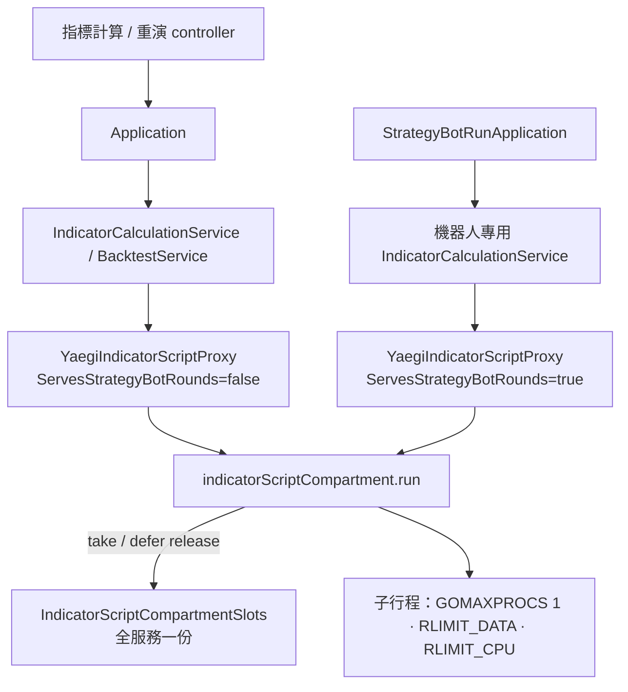

# 算式隔間同時上限 — Architecture Design

**Status:** Confirmed
**Source PRD:** `.sdd/2026-09-25-strategy-script-concurrency-cap/PRD.md`
**Tech context:** Go · Clean/Onion · 算式隔間 = 服務二進位以 `indicator-script-worker` 重新啟動的子行程（`internal/infrastructure/script/`）

---

## 1. Design Goal & Guiding Principle

- **In one sentence:** 讓每一個算式隔間在啟動前向一份全服務共用的名額池拿名額、在子行程被收掉後歸還；池滿時依「機器人輪次優先、同類先來先算」排隊，等待上限就是呼叫端的 context；等不到回傳領域可辨識的 `ErrIndicatorScriptCompartmentsBusy`。另在子行程內加 `RLIMIT_CPU` 與 `GOMAXPROCS=1`。
- **Guiding principle:** 名額的取得與歸還**只發生在一個地方**——`indicatorScriptCompartment.run` 的開頭與它的 `defer`。所有現有與未來的算式入口（計算、重演、機器人、助手）都經過 `run`，因此不可能繞過上限、也不可能漏還名額；domain 完全不知道名額存在，只認得一個哨兵錯誤。

---

## 2. Change Scope

| Area | Action | What / Why |
| :--- | :--- | :--- |
| `internal/infrastructure/script/indicator_script_compartment_slots.go` | **Add** | `IndicatorScriptCompartmentSlots`：全服務共用的名額池（執行機制，不是 domain model，不加後綴，住在 compartment 旁邊） |
| `internal/infrastructure/script/indicator_script_isolation.go` | **Modify** | 加 `CompartmentSlots *IndicatorScriptCompartmentSlots` 與 `ServesStrategyBotRounds bool`；proxy 建構子簽名不變 |
| `internal/infrastructure/script/indicator_script_compartment.go` | **Modify** | `run` 開頭取名額、`defer` 歸還；外層時限算一次，同時送進 header 作為處理器時間上限 |
| `internal/infrastructure/script/indicator_script_request.go` | **Modify** | header 加 `ProcessorTimeLimit`；子行程設 `GOMAXPROCS(1)` 與 `RLIMIT_CPU` |
| `internal/domain/models/domains/indicator_calculation_errors.go` | **Modify** | 新哨兵 `ErrIndicatorScriptCompartmentsBusy`（不包 `ErrIndicatorScriptFailed`） |
| `internal/domain/service/backtest_service.go`、`contract_backtest_service.go` | **Modify** | `refusalFor` 先放行「忙碌中」，不被改寫成「用完允許時間」 |
| `internal/controller/indicator_calculation_controller.go`、`backtest_controller.go`、`trading_strategy_backtest_controller.go` | **Modify** | 「忙碌中」→ `503 Service Unavailable`，body `{"message", "compartmentsBusy": true}` |
| `internal/config/application_config.go`、`.env.example`、README | **Modify** | `INDICATOR_SCRIPT_MAX_CONCURRENT_COMPARTMENTS`（預設 6） |
| `cmd/server/dependencies.go` | **Modify** | 建一份名額池；機器人輪次另建一對 indicator calculation service，其 isolation `ServesStrategyBotRounds=true` |
| `StrategyBotRoundFailureDomain` | **Not touched** | 「忙碌中」不包 `ErrIndicatorScriptFailed`，天生落入 default = 跳過（不停機器人）；只補測試釘住 |
| 助手查詢（assistantqueries） | **Not touched** | 錯誤原樣帶回訊息給助手，「忙碌中」的訊息已可讀 |
| 每位使用者的名額配額 | **Not touched** | PRD Out of Scope |

---

## 3. New Classes / Modules

| Name | Kind | Responsibility (purpose) | Collaborators | Satisfies (PRD scenario) |
| :--- | :--- | :--- | :--- | :--- |
| `IndicatorScriptCompartmentSlots` | 執行機制（mutex + 兩條 FIFO 等待佇列） | 限制同時運作的隔間數；滿時排隊，機器人佇列永遠先於隨選佇列；等待者 context 結束即離開佇列，若名額在同一瞬間已交給它就轉交下一位 | `indicatorScriptCompartment` | US-01、US-02、US-03、US-04 全部 |

方法（package 內部 API，由 compartment 呼叫）：

- `NewIndicatorScriptCompartmentSlots(capacity int)`：`capacity < 1` 視為 1。
- `take(executionContext, servesStrategyBotRounds) error`：拿到名額回 `nil`；context 先結束回 `ErrIndicatorScriptCompartmentsBusy` 包裝的錯誤。
- `release()`：有機器人等待者先交給它，否則交給隨選等待者，否則空位 +1。`take` 的取消路徑也用它把「剛好交到手」的名額轉交出去。

---

## 4. Modified Components

| Component | Current role | Change needed |
| :--- | :--- | :--- |
| `indicatorScriptCompartment.run` | 啟動子行程、等回答或時限 | 開頭 `take`，失敗直接回傳；`defer release()`——`run` 本身就是「資源持有範圍」，每條 return / panic 路徑都在子行程被 `Wait` 收掉之後才歸還 |
| `indicatorScriptRequestHeader` | 帶行情種類、記憶體上限、允許時間 | 加 `ProcessorTimeLimit`（= 外層時限 = `ExecutionTimeout × max(runCount,1) + 5s`）；`answer` 先 `runtime.GOMAXPROCS(1)`，再以 `Cur=ceil 秒, Max=Cur+1` 設 `RLIMIT_CPU`；Linux 上設不了即失敗（與記憶體上限同一模式） |
| `refusalFor`（兩個 backtest service） | 允許時間到就改寫成 `BacktestTimeAllowanceSpent` | 錯誤若是「忙碌中」原樣回傳 |

處理器時間的決策：隔間只用一顆處理器，處理器時間 ≤ 經過時間，所以與外層牆鐘時限用同一個數字不會誤殺合法算式；soft 到 hard 之間 1 秒；Go runtime 預設忽略 `SIGXCPU`（macOS 也不在 hard 送 `SIGKILL`），所以子行程自己接 `SIGXCPU` 並立刻結束，Linux 的 hard 上限 `SIGKILL` 是最後一道。由於處理器時間 ≤ 經過時間，父行程的計時一定先到、照舊回報「未能算完」；只有父行程計時失靈時核心才出手，那時隔間沒有回答，依既有規則以「算式失敗：算式隔間意外結束」收場。

飽和時的決策：**等待、以呼叫端 context 為上限**，不另設等待上限——隨選計算在呼叫端離開（或反向代理切斷）時結束，重演受整次允許時間限制，機器人受一輪時限限制。等待中的 goroutine 不佔隔間資源。機器人優先保證灌爆隨選計算時，機器人最多只等「一個正在跑的隔間結束」。

---

## 5. Component Relationships

---

## 6. Extensibility & Handoff Notes

- **Most likely next requirement:** 依使用者分配名額（一人最多同時 K 個），或增加第三種優先級（例如助手查詢）。
- **Where it lands:** 全部在 `IndicatorScriptCompartmentSlots` 內；compartment 只呼叫 `take`/`release`。
- **How to add it:** 優先級：把 `servesStrategyBotRounds bool` 換成有序的佇列清單。每人配額：在 isolation 加上發動者並在 `take` 內多一層計數——呼叫端與 domain 都不必改。
- **Do not hardcode:** 上限（環境變數）、處理器時間上限（永遠由允許時間推導，不另開設定，避免兩個數字互相矛盾）。
- **Known debt / deferred:** 隨選計算的等待沒有獨立上限，完全仰賴呼叫端離開；若日後前端不會自己放棄，再加一個等待上限。

---

## 7. Traceability

| PRD Scenario | Fulfilled by |
| :--- | :--- |
| US-01 沒有其他計算在跑時照常算出結果 | `run` + `take` 快速路徑 |
| US-01 還有空位時不必等 | `take`（空位 > 0 且無人排隊） |
| US-02 等到空位就照常算 | `release` 交給等待者 |
| US-02 在時限內等不到空位 | `take` 取消路徑 → `ErrIndicatorScriptCompartmentsBusy`；controller 503 |
| US-02 重演因為等空位而用完允許時間 | `refusalFor` 放行忙碌錯誤；backtest controller 503 |
| US-03 四個「名額歸還」 | `run` 的 `defer release()`；`take` 取消時移出佇列 / 轉交 |
| US-04 機器人插隊 / 同類先來先算 | 兩條 FIFO 佇列；dependencies 為機器人另建 isolation |
| US-04 機器人一輪等不到空位 | 忙碌錯誤不包 `ErrIndicatorScriptFailed` → `StrategyBotRoundFailureDomain` 跳過 |
| US-05 用完處理器時間被收掉 | header `ProcessorTimeLimit` + 子行程 `RLIMIT_CPU` |
| US-05 額度隨重演根數放大 | `ProcessorTimeLimit` 與外層時限同一公式（乘上根數） |
