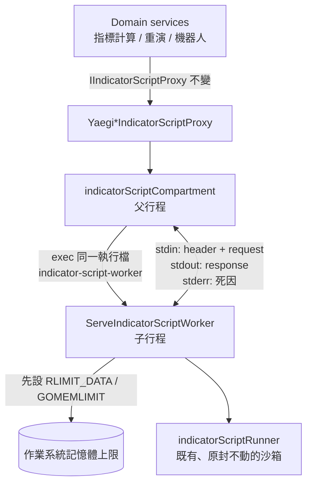

# 策略腳本隔離執行 — Architecture Design

**Status:** Confirmed
**Source PRD:** `.sdd/2026-09-25-strategy-script-isolated-execution/PRD.md`
**Tech context:** Go 1.26 · Clean / Onion Architecture · yaegi 直譯器 · 部署為 k3s 上的單一 Linux 容器（alpine）

---

## 1. Design Goal & Guiding Principle

- **In one sentence:** 每次執行指標算式（單次計算或一整段逐根重演），都放進一個**同一執行檔另開的子行程**（算式隔間）。子行程在跑任何使用者程式碼之前，先替自己設好作業系統層級的記憶體上限（`RLIMIT_DATA`）。父行程負責監看，並把子行程的任何結局翻譯回既有的領域錯誤。
- **Guiding principle:** **隔離是 proxy 內部的實作細節，不是新的領域概念。** 下列東西都一個字不改：`IIndicatorScriptProxy`、`IContractIndicatorScriptProxy` 兩個介面，所有 domain service，所有 application。既有的 `indicatorScriptRunner` 也原封不動，只是改在子行程裡跑。父子行程之間只用一個型別往返：`indicatorScriptCompartment`（隔間）。將來要換隔離技術（WASM、別的沙箱），或加上同時執行的上限，都只動這一個型別。

---

## 2. Change Scope

| Area | Action | What / Why |
| :--- | :--- | :--- |
| `internal/infrastructure/script/` | **Add** | `indicatorScriptCompartment`（父行程端）、`indicatorScriptWorker`（子行程端）、往返訊息型別、`IndicatorScriptIsolation`（隔離設定） |
| `YaegiIndicatorScriptProxy` / `YaegiContractIndicatorScriptProxy` | **Modify** | 建構子改收 `IndicatorScriptIsolation`；執行改走隔間，不再直接呼叫 runner |
| `indicatorScriptRunner.prepare` | **Modify** | 直譯器的 `Stdout`、`Stderr` 改成丟棄：算式印出的文字不得混進父子行程之間的通道（PRD 邊界案例） |
| `cmd/server/main.go` | **Modify** | `main()` 一開頭就判斷是不是子命令 `indicator-script-worker`。是的話直接交給 worker 並結束，不讀 `.env`、不讀設定、不連資料庫 |
| `cmd/server/dependencies.go` | **Modify** | 以 `os.Executable()` 組出隔離設定，注入四個 proxy 實例 |
| `internal/config/application_config.go` | **Modify** | 新增 `INDICATOR_SCRIPT_MEMORY_LIMIT_MEGABYTES`（預設 512） |
| `dto.StrategyScriptParameterDto` | **Modify** | 新增 `ToWriteDto()`：子行程要從已套用值的參數重建參數模型（轉換寫在來源上，遵守規範） |
| `.env.example`、deploy configmap | **Modify** | 記錄新的環境變數（deploy repo 只開 branch，不自動合併） |
| domain interfaces / services / application / controller | **Not touched** | 隔離不改變任何業務語意，呼叫端不必知道算式在哪裡跑 |
| 同時執行的上限、CPU 限制 | **Not touched** | PRD 範圍外；§6 說明加在哪裡 |
| Dockerfile | **Not touched** | 子行程就是同一個 `/usr/local/bin/server`，不需要新的 binary |

---

## 3. New Classes / Modules

| Name | Kind | Responsibility (purpose) | Collaborators | Satisfies (PRD scenario) |
| :--- | :--- | :--- | :--- | :--- |
| `IndicatorScriptIsolation` | 設定資料（infra） | 描述隔間怎麼開：子行程的命令與參數、環境變數、每根允許時間、記憶體上限 | 組裝根 | US-02 全部（上限可設定） |
| `indicatorScriptCompartment[Input]` | 父行程端執行機制 | 開一個子行程，把請求送進去，並監看它：呼叫端離開、總時限到、子行程倒下，都要收掉子行程。最後把回應或死因翻譯成 `ErrIndicatorScriptFailed`、`UndeclaredParameter`，或正常結果。一次重演只開一個子行程 | `os/exec`、`encoding/gob` | US-01～US-04 全部 |
| `indicatorScriptWorker` + 匯出的 `ServeIndicatorScriptWorker(input, output) int` | 子行程端執行機制 | 先讀市場種類，設記憶體上限（`RLIMIT_DATA`，並把 `GOMEMLIMIT` 設成上限的 80%，讓 GC 在撞牆前先回收）。接著用既有 runner 算完，把結果或失敗寫回一個 gob 訊息 | `indicatorScriptRunner`、`syscall` | US-01、US-02、US-04 |
| `indicatorScriptRequestHeader` / `indicatorScriptRequest[Input]` / `indicatorScriptResponse` | 往返訊息（infra 內部） | 父子行程之間的全部契約：先送 header（市場種類、記憶體上限），再送 body（算式、指標值種類、已套用的參數、允許時間、是否逐根、輸入）。回應是單次結果、逐根結果、失敗說法或未宣告參數名稱其中之一 | gob | US-01、US-04 |

**為什麼不是更多型別：** 父行程這一側「開子行程、送請求、等回應、翻譯死因」只有一個變更理由（隔離方式），所以合成一個 compartment。子行程這一側「設上限、跑 runner、寫回應」也只有一個變更理由，所以合成一個 worker。

**市場種類的對照：** 現貨與合約各自需要的 `inputTypeName` 和 `inputTypes`，目前寫在兩個 proxy 的建構子裡。改成 package 層級的兩個設定值（`spotIndicatorScriptInput`、`contractIndicatorScriptInput`），與既有的 `allowedPackages` 同類。父行程 proxy 與子行程 worker 共用同一份，不會漂移。

---

## 4. Modified Components

| Component | Current role | Change needed |
| :--- | :--- | :--- |
| `YaegiIndicatorScriptProxy` / `YaegiContractIndicatorScriptProxy` | 直接在服務行程內用 runner 執行 | 改持有 `indicatorScriptCompartment`。對外方法簽章不變 |
| `indicatorScriptRunner.prepare` | 建直譯器 | `interp.Options{Stdout: io.Discard, Stderr: io.Discard}` |
| `main()` | 啟動 HTTP 服務 | 最前面加上子命令分派 |
| `ApplicationConfig` | 讀環境變數 | 新增 `IndicatorScriptMemoryLimitBytes` |
| script 測試 | 直接建 proxy | 加一個 `TestMain`：看到約定的環境變數就扮演 worker，否則照常跑測試。所有 proxy 改用 helper 建立，helper 以測試執行檔本身當子行程 |

---

## 5. Component Relationships

**父行程的結局判定（依序）：**
1. 呼叫端的 context 結束 → 結束子行程，回報「算式已中止，因為發動它的請求已經結束」。
2. 總時限到（每根允許時間 × 根數，至少一根，再加 5 秒緩衝）→ 結束子行程，回報「算式在 N 內未能算完，已中止」。正常情況下子行程會先用自己的每根允許時間回報同一句話，這一層只是保險。
3. 讀到完整回應 → 依回應還原：正常結果、`UndeclaredParameter(name)`，或 `ErrIndicatorScriptFailed` 加上子行程原話。
4. 沒讀到回應（子行程倒下）→ stderr 含 `out of memory` 時，回報「超出記憶體上限（512MB）」；其他情況回報「算式執行失敗：算式隔間意外結束」。

一律先 `Kill` 再 `Wait`，不留殭屍行程。子行程的環境變數給**空集合**，資料庫密碼、JWT 金鑰都不會流進隔間（縱深防禦：算式本來就讀不到環境變數）。

---

## 6. Extensibility & Handoff Notes

- **Most likely next requirement:** 限制同時執行的算式數量（多個隔間都用到上限時，總量會逼近 Pod 的 4Gi 上限），或改用 WASM 之類更強的隔離。
- **Where it lands:** 都在 `indicatorScriptCompartment` 裡。要限制同時數量，就在開子行程前取得一個 semaphore（容量從 `IndicatorScriptIsolation` 讀）。要換隔離技術，就替換 compartment 的內部實作，proxy、介面和 runner 都不動。
- **How to add a new market kind:** 新增一個 `xxxIndicatorScriptInput` 設定值、一個 proxy，並在 worker 的市場種類分派多加一個 case。
- **Patterns applied & why:** 子命令自我執行（self re-exec），不需要第二個 binary 或部署。header 與 body 分兩段送，讓子行程先知道要解哪一種泛型輸入。
- **Do not hardcode:** 記憶體上限（走設定）、子行程命令（由組裝根注入，測試才能用測試執行檔扮演 worker）。
- **Known debt / deferred:**
  - race detector 的影子記憶體會計入 `RLIMIT_DATA`；記憶體上限測試在 `-race` 下跳過，由 CI 另一個不開 race 的步驟在 Linux 上實證（有跳過即判失敗）。
  - 子行程被結束後以 `WaitDelay`（1 秒）收尾，殘留孫行程握著輸出管線也不會讓等待卡住（CI 上實際踩過）。
  - macOS 上 `RLIMIT_DATA` 不一定生效，記憶體相關測試只在 Linux 執行（CI 是 Linux）。
  - 每次執行多了一次開行程的成本（約 10ms）。如果將來機器人數量大到這筆成本明顯，再考慮常駐的 worker 池。

---

## 7. Traceability

| PRD Scenario | Fulfilled by |
| :--- | :--- |
| US-01 一次指標計算的結果與改版前相同 | compartment（單次模式）+ worker + runner |
| US-01 逐根重演的結果與改版前相同 | compartment（逐根模式）+ worker 呼叫 `runner.executeForEachElement` |
| US-01 一次重演只讀一次算式 | 一次重演只開一個子行程；worker 內只呼叫一次 `executeForEachElement` |
| US-01 沒有任何 K 線的重演 | worker 回傳空的逐根結果 |
| US-02 一次計算要的記憶體超過上限 | worker 設 `RLIMIT_DATA` + compartment 從 stderr 判定 out of memory |
| US-02 重演的第一根就要超過上限的記憶體 | 同上；沒有回應就不會有部分結果 |
| US-02 在上限內用大量記憶體的算式照常完成 | 預設 512MB + `GOMEMLIMIT` 80% |
| US-02 一支算式吃爆記憶體不影響另一支 | 每次執行各自一個子行程 |
| US-02 前一個隔間倒下後立刻再算 | compartment 不保留狀態，每次都開新的子行程 |
| US-03 算不完的算式在允許時間到時中止 | runner 的每根允許時間（子行程內）+ compartment 的總時限保險；子行程結束，所以不會殘留 |
| US-03 發動計算的人中途離開 | compartment 監看呼叫端 context → Kill + Wait |
| US-03 每一根各自有完整的允許時間 | runner 既有行為；總時限依根數放大 |
| US-04 算式在計算中刻意引發錯誤 | runner 既有說法，經回應原話傳回 |
| US-04 算式取用沒人宣告的參數 | 回應帶參數名稱 → `domains.UndeclaredParameter` |
| US-04 讀不懂的算式 | runner 既有說法，經回應原話傳回 |

---

## 8. Risks & Open Decisions

- **Risks / trade-offs:**
  - `RLIMIT_DATA` 只計入可寫的私有記憶體映射。Go runtime 用 `PROT_NONE` 保留、配置時才改成可寫，所以這個限制能精準對應 heap 用量。`RLIMIT_AS` 會被 Go 很大的虛擬位址保留誤傷，所以不用。實際效果由 CI（Linux）上的測試驗證。
  - 本機的 macOS 不保證上限生效，PRD 已經接受這一點。
- **Open decisions (for implementation):**
  - 從 stderr 判定 out of memory 的關鍵字：採用 Go runtime 的 `out of memory`，由實測確認。
