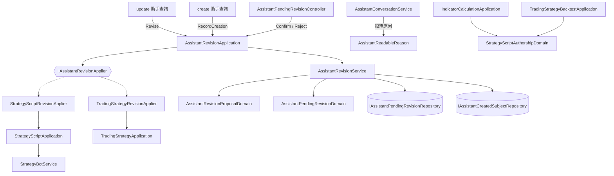

# 別人寫的字騙不動助手去改你的東西 — Architecture Design

**Status:** Confirmed
**Source PRD:** `.sdd/2026-09-26-assistant-injection-hardening/PRD.md`
**Tech context:** Go · Gin · GORM (Postgres) · Clean / Onion Architecture（`.claude/rules/`）

---

## 1. Design Goal & Guiding Principle

- **In one sentence:** 改寫策略腳本多一道「使用它的執行中機器人」關卡；助手用到別人的算式失敗時只拿到固定一句話；
  助手改寫既有的策略腳本／交易策略時改為留下**待確認修改**，由對話擁有者確認後才照一般改寫寫入。
- **Guiding principle:** **「能被助手改寫的東西」是一個可擴充的種類**。待確認修改的整套生命週期（提出、直接生效的例外、
  確認、拒絕、被改過就作廢）由一個通用的 `AssistantRevisionApplication` + `AssistantRevisionService` 管，
  每一種能被改寫的東西只需提供一個 `IAssistantRevisionApplier`（怎麼檢查、怎麼寫進去）。
  下一次要讓助手改機器人設定時，是**新增一個 applier**，不是改流程。

---

## 2. Change Scope

| Area | Action | What / Why |
| :--- | :--- | :--- |
| `StrategyScriptApplication.UpdateStrategyScript` | **Modify** | 擁有權之後、內容檢查之前查「使用它的執行中機器人」，存在即拒絕（人與助手同一條路） |
| `StrategyBotService` / `IStrategyBotRepository` | **Modify** | 新增「哪些機器人透過交易策略用到這支策略腳本」的讀取 |
| `StrategyScriptService` / `TradingStrategyService` | **Modify** | 抽出「照改寫規則檢查但不寫入」的 `Inspect*Rewrite`，與原本的改寫共用同一段 private 前半 |
| `RunnableStrategyScriptDto` / `StrategyScriptAccessDomain` | **Modify** | 帶出 `OwnedByViewer`，好讓執行端知道這支是不是提問者自己的 |
| `IndicatorCalculationApplication` / `TradingStrategyBacktestApplication` | **Modify** | 算式失敗時，若用到別人的腳本，把錯誤標記為「別人的算式失敗」（訊息原封不動，HTTP 路徑看起來完全一樣） |
| `AssistantConversationService.runAssistantQuery` | **Modify** | 所有助手查詢的拒絕原因經同一個出口 `domains.AssistantReadableReason`，別人的算式失敗換成固定一句話 |
| `IAssistantQuery.Run` | **Modify** | `viewerID uint` → `vo.AssistantQueryOriginVo`（提問者、對話、一次回答），因為建立與改寫需要知道自己在哪段對話 |
| 兩支 update 助手查詢 | **Modify** | 改呼叫 `AssistantRevisionApplication.Revise`；兩支 create 助手查詢建立成功後記下「助手本段對話建立的」 |
| `AssistantTurn` / `ConversationDomain.ToDto` / `ConversationMessageDto` | **Modify** | 回答訊息帶出它底下的待確認修改 |
| 待確認修改整套 | **Add** | entity、domain model、service、application、兩個 applier、controller 與兩條路由 |
| 別人的機器人用到你已發佈的腳本 | **Not touched** | PRD Out of Scope：牽涉發佈者的權力，另開切片 |
| 市集腳本名稱／參數名稱／指標名稱 | **Not touched** | PRD Out of Scope：確認這道牆已經讓被騙的助手什麼都做不成 |
| 助手系統提示 | **Not touched** | 兩支 update 查詢的能力說明直接講清楚「會先成為待確認修改」，不動可快取的前綴 |
| MCP / 部署設定 | **Not touched** | MCP 刻意不含助手；沒有新的環境變數 |

---

## 3. New Classes / Modules

| Name | Kind | Responsibility (purpose) | Collaborators | Satisfies |
| :--- | :--- | :--- | :--- | :--- |
| `AssistantPendingRevision` | Entity | 一筆待確認修改：擁有者、對話、一次回答、種類、目標識別碼與名稱、完整內容（助手送的引數原文）、提出時目標的最後修改時刻、狀態、提出／處理時刻 | `AssistantTurn`（外鍵、隨之刪除） | US-03 全部 |
| `AssistantCreatedSubject` | Entity | 「助手本段對話建立的」一筆記錄：對話、種類、目標識別碼（唯一） | — | US-03 本段對話建立的 |
| `AssistantPendingRevisionDomain` | Domain Model | 擁有權（別人的＝找不到）、只有待確認能處理、提出之後被改過即作廢、轉成 DTO | entity | 處理過的不能再處理、被改過、別人動不了 |
| `AssistantRevisionProposalDomain` | Domain Model | 決定一次改寫是**直接生效**還是**留下待確認修改**：本段對話建立的且沒有機器人引用 → 直接 | — | 本段對話建立的三個情境、別段對話建立的 |
| `AssistantRevisionService` | Domain Service | 待確認修改與建立記錄的持久化編排：提出（含直接生效判斷）、找出可確認的、以條件式狀態轉換搶下確認／拒絕、確認失敗退回待確認、記下建立 | `IAssistantPendingRevisionRepository`、`IAssistantCreatedSubjectRepository`、`IClockProxy` | US-03 |
| `IAssistantRevisionApplier` | Interface | 一種能被助手改寫的東西：`SubjectKind()`、`Inspect(viewer, content)`（照改寫規則檢查不寫入，回目標現況與被幾台機器人引用）、`Apply(viewer, content)`（照一般改寫寫入） | — | 擴充縫 |
| `StrategyScriptRevisionApplier` / `TradingStrategyRevisionApplier` | Application（assistantqueries） | 把助手引數原文解析成改寫內容，委派給既有的改寫用例 | `StrategyScriptApplication` / `TradingStrategyApplication` | US-03 兩種東西 |
| `AssistantRevisionApplication` | Application | `Revise`（助手提出）、`RecordCreation`、`ConfirmPendingRevision`、`RejectPendingRevision`；依種類挑 applier，把「檢查 → 搶下 → 寫入 → 失敗退回」串成一個動作 | `AssistantRevisionService`、`[]IAssistantRevisionApplier` | US-03 |
| `AssistantPendingRevisionController` | Controller | `POST /chat/pending-revisions/:id/confirm`、`.../reject` | `AssistantRevisionApplication` | US-03 確認／拒絕 |
| `AssistantPendingRevisionRepository` / `AssistantCreatedSubjectRepository` | Repository | GORM 持久化；條件式狀態轉換 `WHERE status = pending` | — | 同時按兩次只生效一次 |
| `StrategyScriptReferencesDto` / `RewriteTargetDto` / `AssistantPendingRevisionDto` / `AssistantRevisionProposalDto` / `AssistantRevisionProposalOutcomeDto` | DTO | 跨邊界的資料形狀 | — | — |
| `AssistantQueryOriginVo` | VO | 一次助手查詢來自哪裡：提問者、對話、一次回答 | — | 建立記錄、提出修改 |
| `AssistantPendingRevisionStatusVo` / `AssistantRevisionSubjectKindVo` | VO | `pending`/`confirmed`/`rejected`；`strategyScript`/`tradingStrategy` | — | — |

錯誤（`domains`）：`ErrStrategyScriptBotRunning` + `StrategyScriptBotRunning(names)`；`ErrForeignStrategyScriptFailed` +
`StrategyScriptAuthorshipDomain.AttributeFailure`；`ErrAssistantPendingRevisionNotFound`、`ErrAssistantPendingRevisionResolved`、
`ErrAssistantPendingRevisionStale`；`AssistantReadableReason(error) string`。

---

## 4. Modified Components

| Component | Current role | Change needed |
| :--- | :--- | :--- |
| `StrategyScriptApplication` | 策略腳本用例 | 注入 `StrategyBotService`；`UpdateStrategyScript` 先 `GetStrategyScript`（找不到照舊）→ `ReadReferencesToStrategyScript` → 有執行中即 `StrategyScriptBotRunning`；新增 `InspectStrategyScriptRewrite` |
| `StrategyScriptService` | 策略腳本規則 | 新 `InspectStrategyScriptRewrite`；與 `UpdateStrategyScript` 共用 private `preparedRewrite`（兩個 public 使用者） |
| `TradingStrategyApplication` / `TradingStrategyService` | 交易策略用例 | 新 `InspectTradingStrategyRewrite`（解析來源 + 內容檢查 + 引用數）；service 同樣抽 private `preparedRewrite` |
| `StrategyBotService` / `IStrategyBotRepository` | 機器人 | `ReadReferencesToStrategyScript(ownerID, strategyScriptID)`；repository `FindAllByStrategyScript`（子查詢：交易策略的信號來源指名它） |
| `StrategyScriptAccessDomain.ToRunnableDto` | 執行閘門 | 填 `OwnedByViewer` |
| `IndicatorCalculationApplication` / `TradingStrategyBacktestApplication` | 執行用例 | 失敗經 `StrategyScriptAuthorshipDomain.AttributeFailure` |
| `AssistantConversationService` | 助手回答 | 注入不變；`writeAnswer` / `runAssistantQuery` 帶 `AssistantQueryOriginVo`；拒絕原因走 `AssistantReadableReason` |
| 13 支助手查詢 | 能力 | `Run` 簽名改收 origin；兩支 update 改走 revision；兩支 create 記下建立 |
| `IConversationRepository` 實作 | 對話持久化 | `FindOne` 另 preload `Turns.PendingRevisions` |
| `ConversationDomain.ToDto` / `ConversationMessageDto` | 讀回對話 | 回答訊息帶 `pendingRevisions`（永遠是非 nil 的清單） |
| `StrategyScriptController` | HTTP | `ErrStrategyScriptBotRunning` → 409 |
| `SchemaMigrator` / `dependencies.go` | 組裝 | AutoMigrate 兩個新 entity；組裝新物件與路由 |

---

## 5. Component Relationships

**Revise**：applier.Inspect（找不到、內容不合法 → 原因交回助手、不留提議）→ service.Propose（本段對話建立且沒有機器人引用 → 直接；否則存待確認）
→ 直接時 applier.Apply。

**Confirm**：service.FindPendingRevision（別人的＝找不到、已處理）→ applier.Inspect（目標現況）→ service.ClaimConfirmation
（被改過 → 作廢錯誤；條件式 pending→confirmed，搶輸 → 已處理）→ applier.Apply → 失敗則 service.ReopenPendingRevision 並回原因。

建構順序無循環：applier（需既有 application）→ `AssistantRevisionApplication` → 助手查詢 → `AssistantConversationService`。

---

## 6. Extensibility & Handoff Notes

- **Most likely next requirement:** 讓助手也能改機器人設定，或把「建立」也放進確認。
- **Where it lands:** `IAssistantRevisionApplier`——新增一種 applier 並加進 `dependencies.go` 的 applier 清單；
  建立要確認時，新增一個 `Propose` 的變體（目標識別碼為零），`AssistantPendingRevisionDomain` 已把內容當不透明文字。
- **How to add it:** 實作 `SubjectKind/Inspect/Apply`，在 `AssistantRevisionSubjectKindVo` 補一個值，不動 service 與 application 的流程。
- **Patterns applied & why:** Strategy（applier）隔開「每種東西怎麼改」與「待確認修改的生命週期」；條件式狀態轉換（樂觀鎖）保證一筆只生效一次；
  單一拒絕原因出口（`AssistantReadableReason`）讓之後任何新的「不可信文字」過濾都只加在一處。
- **Do not hardcode:** 種類名稱只在 VO；固定一句話只在 domains。
- **Known debt / deferred:** 兩筆不同的待確認修改同時確認同一個目標時，兩者都通過「被改過」的檢查的窄窗仍在（一人操作的系統可接受）；
  一次重演裡只要有別人的來源就全部遮蔽，會把使用者自己腳本的失敗也遮掉——因為執行端說不出是哪個來源失敗的，寧可多遮。

---

## 7. Traceability

| PRD Scenario | Fulfilled by |
| :--- | :--- |
| US-01 沒有機器人使用照常改得動／已停止不擋／沒用到不擋 | `StrategyScriptApplication.UpdateStrategyScript` + `StrategyBotService.ReadReferencesToStrategyScript` |
| US-01 執行中即拒絕／只點名執行中 | 同上 + `domains.StrategyScriptBotRunning` + controller 409 |
| US-01 助手的修改在確認時一樣被擋 | `AssistantRevisionApplication.ConfirmPendingRevision`（Apply 失敗 → Reopen） |
| US-02 別人的算式以自訂文字／沒宣告參數／算太久失敗 | `StrategyScriptAuthorshipDomain.AttributeFailure` + `AssistantReadableReason` |
| US-02 自己的算式、助手自帶算式 | `OwnedByViewer`（自帶算式視為自己的） |
| US-02 系統自己說的原因 | `AttributeFailure` 只標記隔間失敗兩種哨兵 |
| US-02 重演時任一來源是別人的 | `TradingStrategyBacktestApplication`（全部來源都是自己的才算自己的） |
| US-02 使用者自己跑時不變 | 標記錯誤的 `Error()` 與原錯誤相同；只有助手出口換句 |
| US-03 只留下待確認修改／交易策略一樣／提出時不合法不留 | `AssistantRevisionApplication.Revise` + applier.Inspect + `AssistantRevisionService.Propose` |
| US-03 確認後生效／拒絕 | `ConfirmPendingRevision` / `RejectPendingRevision` |
| US-03 處理過的不能再處理（確認、拒絕） | `AssistantPendingRevisionDomain` + 條件式狀態轉換 |
| US-03 被改過不能確認／同一次回答兩筆 | `ClaimConfirmation`（比對提出時與現在的最後修改時刻） |
| US-03 確認時被一般規則擋下 | Apply 失敗 → `ReopenPendingRevision` |
| US-03 本段對話建立的（沒引用／已引用／間接引用）／別段對話 | `AssistantCreatedSubject` + `AssistantRevisionProposalDomain` + `RewriteTargetDto.BotReferenceCount` |
| US-03 建立新東西直接生效 | create 助手查詢照舊 + `RecordCreation` |
| US-03 別人看不到也動不了 | `AssistantPendingRevisionDomain.RequireOwnership`（找不到）+ 對話讀取既有擁有權 |
| US-03 讀回對話看得到每一筆 | `FindOne` preload + `ConversationDomain.ToDto` |

---

## 8. Risks & Open Decisions

- **Risks / trade-offs:**
  - 「被改過」以最後修改時刻判斷，依賴資料庫以相同精度存回；比對一律取自資料庫讀回的值。
  - 記下「助手本段對話建立的」失敗時不讓建立失敗（東西已存下，回報失敗只會讓助手重建一支同名的）；代價是之後改它要確認——往安全的方向退。
- **Open decisions (for implementation):** 無。
