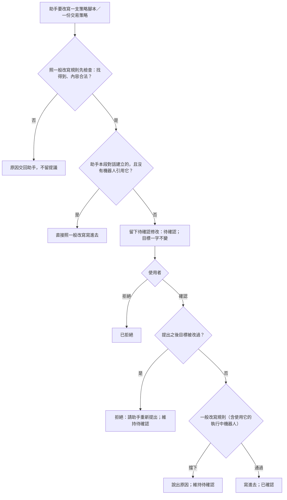

# Product Requirements Document (PRD)

**Status:** Finalized
**Version:** v1.0
**Owner:** James Hsueh
**Stakeholders:** Engineering

---

## 1. Background & Goal (Why & Goal)

### Problem Statement

助手以委託它的那位使用者的身分做事，握有**改寫策略腳本**與**改寫交易策略**兩隻會寫東西的手；
而它讀進來的東西裡有一部分是**別人寫的**——市集上已發佈的策略腳本任何人都跑得動，
它失敗時的原因，是作者自己決定要寫什麼的一段話，今天原封不動交到助手手上。

於是一段別人寫的話，可以讓助手改掉使用者**正在被執行中機器人使用**的策略腳本，
機器人下一輪起就照著被改過的規則把假信號送到他的 Telegram。今天改寫策略腳本
**不會**因為執行中的機器人而被擋——交易策略會，策略腳本漏了。

### Expected Outcome

三道各自獨立的牆：

1. **使用它的執行中機器人**存在時，改寫策略腳本一律被拒絕——人與助手同一句話。
2. 助手用到**別人的**策略腳本、且失敗原因出自那支算式時，助手只拿到固定的一句話（**別人的算式失敗**）。
3. 助手改寫使用者**既有的**東西只產生**待確認修改**；使用者看過完整內容、按下確認才生效。
   **助手本段對話建立的**、且沒有機器人引用的，改寫照舊直接生效，好讓
   「拼 → 重演 → 調整 → 再重演」那一圈跑得動。

成功的樣子：沒有任何一段別人寫的字，能在使用者沒有點頭的情況下，讓他既有的策略腳本或交易策略改變一個字。

### Out of Scope

- 別人的機器人使用到你已發佈的策略腳本時，你改寫它不因此被擋。
- 市集策略腳本的名稱、參數名稱、算出來的指標名稱仍會出現在助手看得到的地方。
- 待確認修改的結果不帶回下一次回答；待確認修改沒有期限。
- 建立新的策略腳本／交易策略也要確認。
- 每日用量改為每人各自計算。

---

## 2. User Personas

**Primary Role:** 已登入的使用者——同時是自己每一支策略腳本、每一份交易策略、每一台機器人與每一段對話的擁有者。

**Usage Context:** 桌面瀏覽器的助手對話與策略腳本工作檯。他常在機器人跑著的時候請助手「看看」或「調一下」；
他不一定會逐字讀助手的回答，但**會**在畫面上看到「有一筆等你確認的修改」。

---

## 3. User Stories & Acceptance Criteria

### US-01 — 正在被執行中機器人使用的策略腳本改不動 [priority: P0]

**As a** 使用者，**I want** 我的執行中機器人正在用的策略腳本不會被改掉，
**so that** 機器人每一輪用的一定是同一版規則，而且不會被任何人在半途換掉。

```gherkin
Scenario: 沒有機器人使用的策略腳本照常改得動
  Given 我的策略腳本 A 沒有被任何機器人使用
  When 我改寫 A
  Then A 被改成新的內容

Scenario: 執行中的機器人使用它時拒絕改寫
  Given 我的機器人 X 執行中
  And X 引用的交易策略有一個信號來源指名策略腳本 A
  When 我改寫 A
  Then 改寫被拒絕，並說出「有執行中的機器人正在使用這支策略腳本，請先停止它」
  And A 一個字都不變

Scenario: 已停止的機器人不擋
  Given 我的機器人 X 已停止
  And X 引用的交易策略有一個信號來源指名策略腳本 A
  When 我改寫 A
  Then A 被改成新的內容

Scenario: 執行中的機器人沒用到它就不擋
  Given 我的機器人 X 執行中
  And X 引用的交易策略沒有任何信號來源指名策略腳本 A
  When 我改寫 A
  Then A 被改成新的內容

Scenario: 只要有一台執行中就擋
  Given 我有兩台機器人都用到策略腳本 A，一台執行中、一台已停止
  When 我改寫 A
  Then 改寫被拒絕，並說出「有執行中的機器人正在使用這支策略腳本，請先停止它」

Scenario: 助手的修改在確認時一樣被擋
  Given 我的機器人 X 執行中並用到策略腳本 A
  And 一筆把 A 改寫的待確認修改
  When 我確認那筆修改
  Then 確認被拒絕，並說出「有執行中的機器人正在使用這支策略腳本，請先停止它」
  And 那筆修改維持待確認
```

### US-02 — 別人的策略腳本失敗時，助手拿不到作者寫的字 [priority: P0]

**As a** 使用者，**I want** 助手跑別人的策略腳本失敗時看不到作者寫的任何一句話，
**so that** 別人無法藉著一支故意失敗的腳本對我的助手下指令。

```gherkin
Scenario: 別人的算式以自訂文字失敗
  Given 策略腳本 B 屬於別人且已發佈
  And B 執行時以一段自訂文字失敗
  When 助手用 B 算指標
  Then 助手拿到「這支策略腳本不是你的，它執行失敗，不提供細節」
  And 那段自訂文字不出現在助手拿到的任何內容裡

Scenario: 自己的算式失敗照舊交出完整原因
  Given 策略腳本 A 是我的
  And A 執行時以一段文字失敗
  When 助手用 A 算指標
  Then 助手拿到的失敗原因含那段文字

Scenario: 別人的算式讀了一個沒宣告的參數
  Given 策略腳本 B 屬於別人
  And B 讀了一個沒宣告、名稱是一整段話的參數
  When 助手用 B 算指標
  Then 助手拿到「這支策略腳本不是你的，它執行失敗，不提供細節」
  And 那個參數名稱不出現在助手拿到的任何內容裡

Scenario: 系統自己說的原因照舊交出
  Given 策略腳本 B 屬於別人
  And B 算太久被中止
  When 助手用 B 算指標
  Then 助手拿到的原因是「未能算完，已中止」

Scenario: 重演一份交易策略時用到別人的算式
  Given 我的交易策略 S 有一個信號來源指名別人的策略腳本 B
  And B 執行時以一段自訂文字失敗
  When 助手重演 S
  Then 助手拿到「這支策略腳本不是你的，它執行失敗，不提供細節」

Scenario: 使用者自己跑時看到的不變
  Given 策略腳本 B 屬於別人
  And B 執行時以一段自訂文字失敗
  When 我自己在工作檯用 B 算指標
  Then 我看到的失敗原因與今天相同，含那段文字

Scenario: 助手自帶的算式失敗照舊交出完整原因
  Given 助手沒有指名策略腳本，而是自帶一段算式
  And 那段算式執行失敗
  When 助手算指標
  Then 助手拿到的失敗原因含算式失敗的細節
```

### US-03 — 助手改寫我既有的東西要先等我確認 [priority: P0]

**As a** 使用者，**I want** 助手要改我既有的策略腳本或交易策略時，先把改好的完整內容給我看、等我按確認，
**so that** 就算它被騙了，沒有我點頭它也改不動任何東西。

```gherkin
Scenario: 助手改寫既有的策略腳本只留下待確認修改
  Given 我早就有的策略腳本 A
  When 助手改寫 A
  Then A 一個字都不變
  And 這一次回答底下多一筆待確認修改，含 A 被改成的完整內容
  And 助手被告知「已提出修改，等使用者確認，尚未生效」

Scenario: 確認後才生效
  Given 一筆把 A 改寫的待確認修改
  When 我確認那筆修改
  Then A 被改成那筆修改的內容
  And 那筆修改變成已確認

Scenario: 拒絕就什麼都不寫
  Given 一筆把 A 改寫的待確認修改
  When 我拒絕那筆修改
  Then A 一個字都不變
  And 那筆修改變成已拒絕

Scenario: 處理過的不能再處理
  Given 一筆已確認的修改
  When 我再確認一次
  Then 確認被拒絕，並說出「這筆修改已經處理過了」

Scenario: 已拒絕的也不能再處理
  Given 一筆已拒絕的修改
  When 我確認它
  Then 確認被拒絕，並說出「這筆修改已經處理過了」

Scenario: 提出之後被改過就不能確認
  Given 一筆把 A 改寫的待確認修改
  And 那筆提出之後我自己在工作檯改過 A
  When 我確認那筆修改
  Then 確認被拒絕，並說出「提出這筆修改之後，它已經被改過了，請請助手重新提出」
  And 那筆修改維持待確認
  And A 維持我自己改過的內容

Scenario: 確認時被一般規則擋下
  Given 一筆把 A 改名成與我另一支策略腳本同名的待確認修改
  When 我確認那筆修改
  Then 確認被拒絕，並說出名稱重複的原因
  And 那筆修改維持待確認

Scenario: 同一次回答對同一支提出兩次修改
  Given 同一次回答裡有兩筆都改寫 A 的待確認修改
  And 我已確認其中一筆
  When 我確認另一筆
  Then 確認被拒絕，並說出「提出這筆修改之後，它已經被改過了，請請助手重新提出」

Scenario: 助手改寫既有的交易策略一樣要確認
  Given 我早就有的交易策略 T
  When 助手改寫 T
  Then T 一個字都不變
  And 這一次回答底下多一筆待確認修改，含 T 被改成的完整內容

Scenario: 提出時內容就不合法則不留下提議
  Given 我早就有的策略腳本 A
  When 助手改寫 A 但名稱留空
  Then 助手拿到名稱不得為空白的原因
  And 這一次回答底下沒有新的待確認修改

Scenario: 助手本段對話剛建立的，沒有機器人引用，直接生效
  Given 助手在這段對話裡建立了交易策略 S
  And 沒有任何機器人引用 S
  When 助手改寫 S
  Then S 被改成新的內容
  And 這一次回答底下沒有新的待確認修改

Scenario: 本段對話建立的，但已有機器人引用，就要確認
  Given 助手在這段對話裡建立了交易策略 S
  And 我替 S 掛了一台已停止的機器人
  When 助手改寫 S
  Then S 一個字都不變
  And 這一次回答底下多一筆待確認修改

Scenario: 本段對話建立的策略腳本，被機器人間接引用，就要確認
  Given 助手在這段對話裡建立了策略腳本 C
  And 我有一台機器人引用的交易策略指名 C
  When 助手改寫 C
  Then C 一個字都不變
  And 這一次回答底下多一筆待確認修改

Scenario: 別段對話建立的要確認
  Given 助手在另一段對話裡建立的策略腳本 C
  When 這段對話的助手改寫 C
  Then C 一個字都不變
  And 這一次回答底下多一筆待確認修改

Scenario: 建立新東西照舊直接生效
  When 助手建立一支新的策略腳本
  Then 那支策略腳本被存下來
  And 這一次回答底下沒有待確認修改

Scenario: 別人看不到也動不了我的待確認修改
  Given 使用者 U 的對話裡有一筆待確認修改
  When 另一位使用者 V 確認、拒絕或讀取它
  Then V 得到「找不到」
  And 那筆修改維持原狀

Scenario: 讀回對話時看得到每一筆待確認修改
  Given 一次回答底下有一筆待確認、一筆已確認的修改
  When 我讀回這段對話
  Then 那一次回答帶著兩筆修改，各自說出改哪一支／哪一份、完整內容、提出時刻與狀態
```

---

## 4. Business Flow & Logic

### Flow



### Core Business Rules

- **使用它的執行中機器人**：擁有者自己的、執行中的、其交易策略有信號來源指名這支策略腳本的機器人。存在即拒絕改寫策略腳本；
  **這條檢查在所有其他內容檢查之前、擁有權檢查之後**（別人的一律先回答找不到，與改寫交易策略同一順序）。
- **別人的算式失敗**：以「提問者是不是這支策略腳本的擁有者」判斷，**不以有沒有發佈判斷**。
  出自算式本身的失敗 → 固定一句話；系統自己說的原因 → 原句。只作用在交給助手的那一份。
- **待確認修改的內容是完整的改寫後樣子**，與一般改寫送進去的內容相同，不是差異。
- **「提出之後被改過」** 以目標的最後修改時刻判斷：與提出時記下的不同即視為被改過。
- **助手本段對話建立的**：該段對話裡任何一次回答中，助手的建立成功留下的那一支／那一份。
- **提出之前先做一次一般檢查**：找不到、別人的、內容不合法的，照舊把原因交給助手、不留提議；
  執行中機器人的阻擋**不在提出時擋**——使用者可以先停機器人再確認。

### Edge Cases

- **確認時系統出錯**：該筆維持待確認，使用者可再按一次。
- **目標在提出後被刪除**：確認時回答找不到，維持待確認（使用者可拒絕它）。
- **一次回答失敗**（逾時、中斷）時已留下的待確認修改照樣留著、照樣可以處理——它們是完整的提議，與回答寫完沒寫完無關。
- **同時按兩次確認**：只有一次生效，另一次得到「已經處理過了」或「已經被改過了」。

---

## 5. UI/UX Design & Interaction

- **Prototype Link:** N/A
- **Key Interactions:**
  - 一次回答底下列出它的待確認修改：改的是策略腳本還是交易策略、叫什麼、改成的完整內容、狀態。
  - 待確認的那幾筆有「確認」與「拒絕」兩個動作；已確認／已拒絕的只顯示狀態。
  - 確認被擋下時就地顯示那一句原因，該筆維持可再處理。
  - 工作檯改寫策略腳本被執行中機器人擋下時，顯示那一句原因。

---

## 6. Non-Functional Requirements

- **Security:** 待確認修改只有對話擁有者看得到、處理得了，別人的與不存在的回答同一句「找不到」。
  別人的算式失敗那一句話**一個字都不含作者可控的內容**。
- **Performance:** 改寫策略腳本多一次「有沒有使用它的執行中機器人」的查詢，不影響感受。
- **Compatibility:** 既有對話讀回時照舊，沒有待確認修改的一次回答帶著空的清單。
- **Analytics / Tracking:** N/A

---

## 7. Dependencies & Risks

- **External Dependencies:** 無新增。
- **Known Risks:**
  - 助手可能仍把「已提出」講成「已改好」——由交回助手的那句話與助手的規矩明白要求它說尚未生效。
  - 前端需要配合呈現與處理待確認修改；在那之前使用者看不到它們。

---

## 8. Appendix

- `BRIEF.md`（本切片）
- 相關切片：`2026-09-04-chat-assistant`、`2026-09-17-assistant-trading-strategy-authoring`、
  `2026-09-16-strategy-bot`、`2026-09-10-strategy-script-ownership-and-marketplace`
