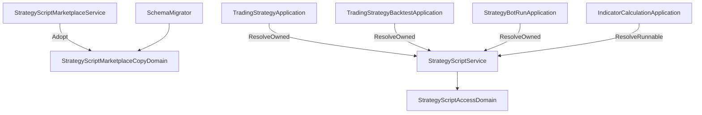

# 加入市集的策略腳本，是拿到一份自己的副本 — Architecture Design

**Status:** Confirmed
**Source PRD:** `.sdd/2026-09-26-marketplace-adoption-copies/PRD.md`
**Tech context:** Go · Gin · GORM (Postgres) · Clean / Onion Architecture（`.claude/rules/`）

---

## 1. Design Goal & Guiding Principle

- **In one sentence:** 市集副本就是一支 `StrategyScript`，多一個 `IsAdoptedFromMarketplace`；加入改成「建一支副本」；
  交易策略、交易策略重演與機器人改走「只收自己的」解析；啟動時把舊的加入與跨擁有者的信號來源搬成副本，再丟掉加入表。
- **Guiding principle:** 「這支是不是副本、能對它做什麼」只問 `StrategyScriptAccessDomain`——讀不讀得到算式、
  改不改得動、發佈不發佈得了、失敗算不算作者的字，全從那裡回答。

## 2. Change Scope

| Area | Action | What / Why |
| :--- | :--- | :--- |
| `StrategyScript` entity | **Modify** | `IsAdoptedFromMarketplace bool`；`ToDto` 對副本不給算式並帶出這個標記 |
| `StrategyScriptDto` | **Modify** | `IsAdoptedFromMarketplace` |
| `AvailableStrategyScriptsDto.Adopted` | **Modify** | 型別改為 `[]StrategyScriptDto`（副本本身），不再是市集的樣子 |
| `StrategyScriptAccessDomain` | **Modify** | `IsAdoptedFromMarketplace`、`RequireRewritable(refusal)`、`ToOwnedRunnableDto`；`ToRunnableDto.AuthoredByViewer`＝擁有且非副本 |
| `RunnableStrategyScriptDto.OwnedByViewer` | **Rename** | → `AuthoredByViewer` |
| `StrategyScriptService` | **Modify** | 改寫檢查用 `RequireRewritable`；新 `ResolveOwnedStrategyScript`；`ListAvailableStrategyScripts` 從自己擁有的拆出副本 |
| `StrategyScriptMarketplaceService` | **Modify** | 加入＝建副本；發佈拒絕副本；**移除** `AbandonStrategyScript` |
| `TradingStrategyApplication` / `TradingStrategyBacktestApplication` / `StrategyBotRunApplication` | **Modify** | 解析信號來源用 `ResolveOwnedStrategyScript` |
| `StrategyBotRoundFailureDomain` | **Modify** | `ErrStrategyScriptNotYours` 視同找不到策略腳本而停擺 |
| `IStrategyScriptRepository` | **Modify** | 移除 `FindAllAdoptedBy` |
| 加入表：`StrategyScriptAdoption` entity、`IStrategyScriptAdoptionRepository`、實作、mock、`PublishedStrategyScript.Adoptions` | **Remove** | |
| `DELETE /marketplace/strategy-scripts/:id/adoption` | **Remove** | 不要了就刪副本 |
| `SchemaMigrator` | **Modify** | 啟動時 `copyMarketplaceDependencies`；讀舊加入表用 persistence 內部的 retired row 型別，搬完 `DropTable` |
| `strategy_script_list` 助手查詢 | **Modify** | 採用來的那一組換成副本 |
| 指標計算／策略腳本回測 | **Not touched** | 一次性試算照舊可用別人已發佈的 |

## 3. New Classes / Modules

| Name | Kind | Responsibility | Satisfies |
| :--- | :--- | :--- | :--- |
| `StrategyScriptMarketplaceCopyDomain` | Domain Model | 由原本那一支建出副本 entity（含參數快照）；搬移時挑一個不撞名的名稱 | US-01、US-03 |
| `ErrStrategyScriptFromMarketplace` / `ErrStrategyScriptNotYours` | 錯誤 | 副本不能改寫或發佈；交易策略指名別人的 | US-01、US-02 |

## 4. Component Relationships

## 5. Extensibility & Handoff Notes

- **Most likely next requirement:** 副本改名，或讓使用者看到副本是誰發佈的。
- **Where it lands:** 改名＝在 `RequireRewritable` 旁多一個只允許名稱的檢查；發佈者＝在副本上加一個快照欄位，由 `StrategyScriptMarketplaceCopyDomain.ToEntity` 填。
- **Do not hardcode:** 撞名標記只在 `StrategyScriptMarketplaceCopyDomain`。
- **Known debt:** 作者改名後再加入一次會得到第二份副本（沒有記來源）——使用者已接受。

## 6. Traceability

| PRD Scenario | Fulfilled by |
| :--- | :--- |
| US-01 加入／撞名／沒發佈／自己的 | `AdoptStrategyScript` + `StrategyScriptMarketplaceCopyDomain` + 既有唯一名稱索引 |
| US-01 作者改寫／收回／刪除不影響 | 副本是獨立的一列 |
| US-01 看不到算式／改不動／不能再發佈 | `StrategyScript.ToDto` + `RequireRewritable` |
| US-01 刪除副本 | 既有 `DeleteStrategyScript` |
| US-01 列出 | `ListAvailableStrategyScripts` |
| US-01 取消加入不再是動作 | 路由移除 |
| US-02 全部 | `ResolveOwnedStrategyScript` + 三個 application + `StrategyBotRoundFailureDomain` |
| US-03 全部 | `SchemaMigrator.copyMarketplaceDependencies` |
| US-04 | `AuthoredByViewer` + `RequireRewritable` |

## 7. Risks & Open Decisions

- 搬移在一個交易內完成；失敗即啟動失敗，不留半套。
