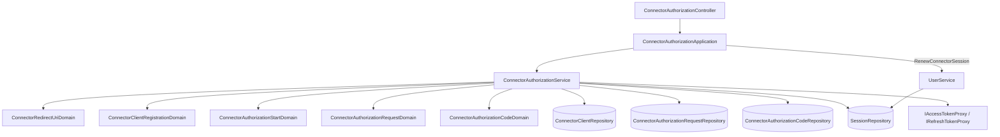

# 外掛授權 — Architecture Design

**Status:** Confirmed（依跨專案約定自行決定，未另行詢問）
**Source PRD:** `.sdd/2026-09-27-connector-authorization/PRD.md`
**Tech context:** Go · Gin · GORM (Postgres) · Clean / Onion Architecture（`.claude/rules/`）· golang-jwt v5 · gomock

---

## 1. Design Goal & Guiding Principle

- **In one sentence:** 交易服務成為 OAuth 2.1 授權伺服器（授權碼＋PKCE、RFC 7591 動態登記、RFC 8414 說明書、RFC 7662 查驗）；
  以授權碼換出的是**既有登入階段機制**上的一條新換發鏈，只多記「所屬外掛」與「對象服務」，登入憑證多一個 `aud`。
- **Guiding principle:** 協定規則全部住在 `domains/` 的 Connector* Domain Model（送回地址比對、請求完整性、授權碼核對與 PKCE），
  `ConnectorAuthorizationService` 只做「取資料 → 問 Domain Model → 寫回」；續用**不另寫一份**，仍由 `UserService` 的同一段續用邏輯處理，
  外掛與網頁只差「這段登入屬於哪個外掛」一個欄位。

## 2. Change Scope

| Area | Action | What / Why |
| :--- | :--- | :--- |
| `entities.Session` | **Modify** | 加 `ConnectorClientIdentifier`、`Audience`（皆 `not null default ''`）；網頁登入兩者為空 |
| `SessionDomain` | **Modify** | `Renewed` 帶著兩個欄位走；新 `HeldBy(connectorClientIdentifier)`、`Audience()` |
| `IAccessTokenProxy` / `JwtAccessTokenProxy` | **Modify** | `Issue(vo.AccessTokenClaimsVo)`（有對象服務才寫 `aud`）；新 `ClaimsOf(accessToken)` 讀回使用者、對象服務、到期；`UserIdentifiedBy` 保留（不驗 `aud`，所以帶或不帶都接受） |
| `UserService` | **Modify** | 續用邏輯抽成私有 `renewedSessionTokens`，由 `RenewSession`（網頁）與新 `RenewConnectorSession`（外掛）共用；續用時 `HeldBy` 不符即 `ErrAuthenticationRequired`；簽發帶對象服務 |
| `SessionRenewalDto` | **Modify** | 加 `ConnectorClientIdentifier`（網頁恆空） |
| `SessionTokensVo` | **Modify** | 新 `ToConnectorTokensDto(now)`（`expires_in` = 到期 − now 秒數） |
| `config.ApplicationConfig` | **Modify** | `ConnectorAuthorization{PublicBaseUrl, FrontendBaseUrl}`，讀 `PUBLIC_BASE_URL`（預設 `http://localhost:8080`）、`FRONTEND_BASE_URL`（預設 `http://localhost:3000`），去結尾斜線 |
| `SchemaMigrator` | **Modify** | 同步三個新 entity |
| `entities.User` | **Modify** | `ConnectorAuthorizationCodes` cascade（使用者刪除，授權碼跟著消失） |
| `cmd/server/dependencies.go` | **Modify** | 組裝並註冊 8 條路由 |
| Postman / `.env.example` / `.env` | **Modify** | 新路由與兩個環境變數 |
| `AuthenticationMiddleware` / `RequestAdmissionService` | **Not touched** | 它們只用 `UserIdentifiedBy`，本來就不看 `aud` |
| 網頁登入 `POST /sessions*` 的回應 | **Not touched** | 網頁憑證不帶 `aud`；網頁續用路徑續不了外掛登入（反之亦然） |

## 3. New Classes / Modules

| Name | Kind | Responsibility (purpose) | Collaborators | Satisfies |
| :--- | :--- | :--- | :--- | :--- |
| `entities.ConnectorClient` | Entity | 外掛登記：`ClientIdentifier`（唯一、隨機）、`ClientName`、`RedirectUris`（jsonb）、`CreatedAt`；`ToDto()` | — | US-01 |
| `entities.ConnectorAuthorizationRequest` | Entity | 待授權請求：`RequestIdentifier`（唯一、隨機）、`ConnectorClientIdentifier`、`RedirectUri`（原樣）、`CodeChallenge`、`State`、`Resource`、`ExpiresAt`、`DecidedAt` | — | US-02, US-03 |
| `entities.ConnectorAuthorizationCode` | Entity | 授權碼：`CodeDigest`（唯一）、`UserID`、`ConnectorClientIdentifier`、`RedirectUri`、`CodeChallenge`、`Resource`、`ExpiresAt`、`RedeemedAt`、`SessionChainID`（換出的鏈，重用時作廢） | — | US-04 |
| `ConnectorRedirectUriDomain` | Domain Model | 一個送回地址：是否本機非加密、忽略埠號比對、附參數組出送回網址 | — | US-01, US-02, US-03 |
| `ConnectorClientRegistrationDomain` | Domain Model | 驗證登記內容（送回地址、`token_endpoint_auth_method`、`grant_types`、`response_types`、名稱長度），`ToEntity` | `ConnectorRedirectUriDomain` | US-01 |
| `ConnectorClientDomain` | Domain Model | 某地址是否為此外掛登記過（`Registers`） | `ConnectorRedirectUriDomain` | US-02 |
| `ConnectorAuthorizationStartDomain` | Domain Model | 授權請求的協定完整性（`Refusal`）、拒絕時的送回網址、`ToEntity` | `ConnectorRedirectUriDomain` | US-02 |
| `ConnectorAuthorizationRequestDomain` | Domain Model | 待授權請求是否仍可決定（`Open(now)`）、產生授權碼 entity、允許/拒絕的送回網址、`ToDto(clientName)` | `ConnectorRedirectUriDomain` | US-03 |
| `ConnectorAuthorizationCodeExchangeDomain` | Domain Model | 換授權請求欄位齊備 | — | US-04 |
| `ConnectorAuthorizationCodeDomain` | Domain Model | 授權碼 `Redeemed`／`Expired`／`Accepts(exchange)`（同外掛、地址一字不差、S256(verifier)==challenge）、`ToSession` | — | US-04 |
| `ConnectorAuthorizationService` | Domain Service | 登記、開始授權、查詢/允許/拒絕待授權請求、授權碼換授權、查驗登入憑證 | 三個新 repository、`ISessionRepository`、`IUserRepository`、`IAccessTokenProxy`、`IRefreshTokenProxy`、`IClockProxy`、`SessionLifetimesVo`、`ConnectorAuthorizationPolicyVo` | US-01..05 |
| `ConnectorAuthorizationApplication` | Application | 轉交上述用例；`RenewConnectorSession` 轉交 `UserService`；說明書由 policy 產生 | `ConnectorAuthorizationService`、`UserService` | US-04, US-06 |
| `ConnectorAuthorizationController` | Controller | 8 個 handler；OAuth 錯誤 `{"error","error_description"}`；token 回應 `Cache-Control: no-store`；依 `grant_type` 分派 | `ConnectorAuthorizationApplication` | 全部 |
| `IConnectorClientRepository` + `ConnectorClientRepository` | Repository | `Save`、`FindOneByClientIdentifier` | — | US-01, 02 |
| `IConnectorAuthorizationRequestRepository` + impl | Repository | `Save`、`FindOneByRequestIdentifier`、`Approve(requestID, code)`（**同一交易**：未決定才標記＋建授權碼）、`Deny(requestID)`（未決定才標記） | — | US-03 |
| `IConnectorAuthorizationCodeRepository` + impl | Repository | `FindOneByDigest`、`Redeem(codeID, session)`（**同一交易**：未兌換才標記並記鏈＋建登入階段） | — | US-04 |
| `vo.ConnectorAuthorizationPolicyVo` | VO | `PublicBaseUrl`、`FrontendBaseUrl`、`RequestLifetime`(10m)、`CodeLifetime`(5m)；`ToServerMetadataDto()` | — | US-02, 03, 04, 06 |
| `vo.AccessTokenClaimsVo` | VO | `UserID`、`Audience`、`ExpiresAt`；`ToIntrospectionDto()` | — | US-04, 05 |
| DTOs | DTO | `ConnectorClientRegistrationDto`、`ConnectorClientDto`、`ConnectorAuthorizationStartDto`、`ConnectorAuthorizationRedirectDto`(`redirectTo`)、`ConnectorAuthorizationRequestDto`(`clientName`,`expiresAt`)、`ConnectorAuthorizationCodeExchangeDto`、`ConnectorTokensDto`、`AccessTokenIntrospectionDto`、`ConnectorAuthorizationServerMetadataDto` | — | — |
| Requests | Request | `ConnectorClientRegistrationRequest`（JSON）、`ConnectorTokenRequest`（form）、`AccessTokenIntrospectionRequest`（form） | — | — |
| `connector_authorization_errors.go` | 錯誤 | `ErrConnectorRedirectUriInvalid`、`ErrConnectorClientMetadataInvalid`、`ErrConnectorClientNotFound`、`ErrConnectorRedirectUriNotRegistered`、`ErrConnectorAuthorizationRequestNotFound`、`ErrConnectorAuthorizationCodeNotFound`、`ErrConnectorAuthorizationCodeAlreadyRedeemed`、`ErrConnectorTokenRequestInvalid`、`ErrConnectorGrantInvalid` | — | — |

### 錯誤 → 回應對映（controller）

| 錯誤 | 回應 |
| :--- | :--- |
| `ErrConnectorRedirectUriInvalid` | 400 `invalid_redirect_uri` |
| `ErrConnectorClientMetadataInvalid`（含 JSON 解析失敗） | 400 `invalid_client_metadata` |
| `ErrConnectorClientNotFound` | 400 `invalid_client`（授權端點與換授權端點皆然，依約定一律 400） |
| `ErrConnectorRedirectUriNotRegistered` | 400 `invalid_request` |
| `ErrConnectorTokenRequestInvalid`、缺 `grant_type` | 400 `invalid_request` |
| 不支援的 `grant_type` | 400 `unsupported_grant_type` |
| `ErrConnectorGrantInvalid`、`ErrAuthenticationRequired`（續用失敗） | 400 `invalid_grant` |
| `ErrConnectorAuthorizationRequestNotFound` | 404 `{"message": ...}`（網頁端點沿用專案風格） |
| `ErrAccessTokenUnavailable` | 503 `temporarily_unavailable` |
| 其他（儲存失敗） | 502 `server_error`（沿用專案「未知錯誤 → 502」慣例） |

## 4. Modified Components

| Component | Current role | Change needed |
| :--- | :--- | :--- |
| `UserService.SignIn` | 開網頁登入鏈 | 簽發改用 `AccessTokenClaimsVo`（對象服務空） |
| `UserService.RenewSession` | 續用 | 邏輯移入 `renewedSessionTokens`；檢查 `HeldBy("")` |
| `UserService.RenewConnectorSession` | — | 新；檢查必要欄位與 `HeldBy(client)`；回 `ConnectorTokensDto` |
| `JwtAccessTokenProxy` | HS256 JWT | `aud` 寫入/讀出；`ClaimsOf` |
| `dependencies.go` `registerRoutes` | 組裝根 | 新組裝；`POST /oauth/register`、`POST /oauth/token` 掛 `credentialRequest`；`approval` 掛 `requiresSignIn` |

## 5. Component Relationships

## 6. Extensibility & Handoff Notes

- **Most likely next requirement:** 使用者在網頁上看到並撤銷「已授權的外掛」。
- **Where it lands:** 外掛登入階段已記著 `ConnectorClientIdentifier`；列出＝ `ISessionRepository` 加一個依使用者列出未作廢且有外掛的鏈，撤銷＝既有 `RevokeChain`。
- **Next likely:** 細分權限範圍 → `scope` 目前在 `ConnectorAuthorizationStartDomain` 被忽略；要支援時把它存進待授權請求 → 授權碼 → 登入階段，並放進 `AccessTokenClaimsVo`，與 `Audience` 同一條路徑。
- **Next likely:** 清除過期資料 → 新增一個 `XxxJob` 呼叫三個 repository 的刪除方法，不必改流程。
- **Patterns applied & why:** 條件式更新（`WHERE decided_at IS NULL` / `redeemed_at IS NULL`）做一次性保證，與既有 `SessionRepository.Rotate` 同一招；需要兩張表一起寫時放在同一個 repository 方法的交易內（比照 `UserRepository.ChangePasswordProof` 作廢登入階段）。
- **Do not hardcode:** 公開網址一律取自 `ConnectorAuthorizationPolicyVo`；兩個有效期在組裝根給入 VO，不散落在 Domain Model。
- **Known debt / deferred:**
  - 授權碼與隨機代號沿用 `IRefreshTokenProxy.Mint`（256-bit 隨機值＋SHA-256 留存樣），不另開介面——能力完全相同。
  - 換授權時「產生一對憑證」的兩行（Mint＋Issue）與 `UserService.newSessionMaterial` 重複；若再有第三處需要開登入鏈，再抽出共用的登入鏈簽發者。
  - 待授權請求、授權碼、外掛登記不清除。

## 7. Traceability

| PRD Scenario | Fulfilled by |
| :--- | :--- |
| US-01 本機即成功／新式位址任意埠 | `ConnectorClientRegistrationDomain` + `ConnectorRedirectUriDomain`；`ConnectorAuthorizationService.RegisterConnectorClient` |
| US-01 公開網站／加密協定／沒有地址 | `ConnectorRedirectUriDomain` → `ErrConnectorRedirectUriInvalid` |
| US-01 要求外掛祕密 | `ConnectorClientRegistrationDomain` → `ErrConnectorClientMetadataInvalid` |
| US-01 登記額度 | `dependencies.go`：`credentialRequest` |
| US-02 完整請求 → 網頁授權頁 | `ConnectorAuthorizationService.StartConnectorAuthorization` + `ConnectorAuthorizationPolicyVo.FrontendBaseUrl` |
| US-02 忽略埠號／路徑不同 | `ConnectorClientDomain.Registers` |
| US-02 外掛不存在 | `ConnectorClientRepository` → `ErrConnectorClientNotFound` |
| US-02 缺挑戰／挑戰方式／非授權碼 | `ConnectorAuthorizationStartDomain.Refusal` + `ConnectorRedirectUriDomain.WithParameters` |
| US-02 權限範圍忽略 | `ConnectorAuthorizationStartDomain`（不讀 `scope`） |
| US-03 查詢／10 分鐘邊界 | `ConnectorAuthorizationRequestDomain.Open` |
| US-03 允許 | `ConnectorAuthorizationService.ApproveConnectorAuthorization` + `ConnectorAuthorizationRequestRepository.Approve` |
| US-03 未登入／待開通不能允許 | `AuthenticationMiddleware`（`requiresSignIn`） |
| US-03 拒絕不必登入 | `DenyConnectorAuthorization`（路由不掛 `requiresSignIn`） |
| US-03 已決定／過期 | `Open(now)` + 條件式更新 |
| US-04 換授權 | `ConnectorAuthorizationService.ExchangeAuthorizationCode` + `ConnectorAuthorizationCodeDomain` + `ConnectorAuthorizationCodeRepository.Redeem` + `JwtAccessTokenProxy`（`aud`） |
| US-04 5 分鐘／答案錯／埠號差／別的外掛 | `ConnectorAuthorizationCodeDomain.Expired` / `Accepts` |
| US-04 第二次使用 | `Redeemed()` / `ErrConnectorAuthorizationCodeAlreadyRedeemed` → `ISessionRepository.RevokeChain(SessionChainID)` |
| US-04 缺少資料／不支援換法 | `ConnectorAuthorizationCodeExchangeDomain`；controller 的 `grant_type` 分派 |
| US-04 續用保留對象服務／重用／外掛代號不符 | `UserService.RenewConnectorSession` + `SessionDomain.Renewed/HeldBy` |
| US-04 額度／不暫存 | `credentialRequest`；controller `Cache-Control: no-store` |
| US-05 有效／無對象服務／無效／使用者不在 | `ConnectorAuthorizationService.IntrospectAccessToken` + `JwtAccessTokenProxy.ClaimsOf` + `AccessTokenClaimsVo.ToIntrospectionDto` |
| US-05 自家功能接受兩種憑證 | `JwtAccessTokenProxy.UserIdentifiedBy`（不驗 `aud`） |
| US-06 說明書 | `ConnectorAuthorizationPolicyVo.ToServerMetadataDto` + config 去斜線 |

## 8. Risks & Open Decisions

- **Decisions made in place of questions:**
  1. 查驗端點**只套用全域請求額度**，不套身分相關動作額度（10 次/分）：外掛伺服器替所有使用者查驗，全部來自同一個位址，套嚴格額度會讓它被擋。約定只寫「rate-limited」，全域額度已滿足。
  2. 登記時 `grant_types` 若給，只能是 `authorization_code`/`refresh_token` 的子集；`response_types` 若給，只能含 `code`；否則 `invalid_client_metadata`。回應一律固定清單。
  3. 送回地址額外限制：不得含 fragment、不得含帳密段；最多 10 個、每個不超過 2048 字元。外掛名稱去空白後不超過 128 字，空白時記為「未命名外掛」。
  4. 授權請求缺 `redirect_uri` 視同「未登記的送回地址」→ 400，不採用 RFC 允許的「唯一登記地址當預設」。
  5. 本機地址比對：協定與主機不分大小寫，路徑與查詢字串須完全相同，只忽略埠號。
  6. 續用時外掛代號必須與該段登入的外掛相同；網頁續用路徑以空外掛代號續用，因此外掛登入不能從網頁續用路徑續用，反之亦然。
  7. 授權碼重用判定先於其他核對：只要持有一張已兌換的授權碼就作廢它換出的鏈（持有即代表外洩）。
  8. 換授權時 `client_id` 不存在 → `invalid_client`；存在但與授權碼不符 → `invalid_grant`。
  9. 授權碼換授權時再次確認使用者仍存在，不在則 `invalid_grant`。
  10. 未知錯誤沿用專案慣例回 502（OAuth 形狀 `server_error`）。
- **Risks / trade-offs:** 登入憑證仍撤不掉（最長 15 分鐘），外掛伺服器的查驗快取再加最多 60 秒。
