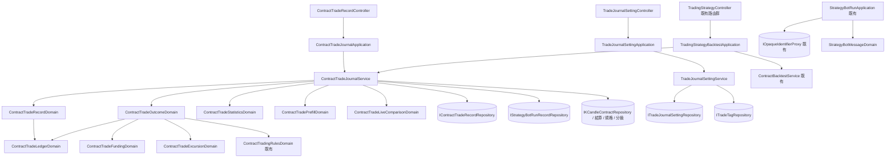

# 合約交易日誌 — Architecture Design

**Status:** Confirmed
**Source PRD:** `.sdd/2026-09-27-contract-trade-journal/PRD.md`
**Tech context:** Go · Gin · GORM（PostgreSQL，Code First `AutoMigrate`）· Clean / Onion（`entities` 乾淨、行為在 `domains`、Domain Service 為 application 唯一入口）· mockgen

---

## 1. Design Goal & Guiding Principle

- **In one sentence:** 以一個「合約交易紀錄」聚合承接使用者手動記下的成交、計畫、附註、檢討與標籤，守住所有記錄規則；
  損益、資金費用、最大不利／最大有利、浮動損益、強平價、統計與實盤 vs 回測在**讀取時**由既有的合約行情、結算、交易規格與重演即時算出；
  合約機器人訊息多一條以隨機識別碼指名那一輪的預填連結。
- **Guiding principle:** **三層各自只有一個改變理由**——
  1. **成交帳本**（`ContractTradeLedgerDomain`）：均價、持倉、平倉判定、出場不超過持倉。與市場無關。
  2. **合約結果**（`ContractTradeOutcomeDomain` 及其資金費用／最大不利有利兩個零件）：只屬於合約的算法。
  3. **統計**（`ContractTradeStatisticsDomain`）：只吃每筆算好的結果 DTO，不碰讀取。

  現貨日誌來時換掉第 2 層即可；匯入成交來時只是聚合的另一個呼叫者；統計多一個切法只加一個 method。

---

## 2. Change Scope

| Area | Action | What / Why |
| :--- | :--- | :--- |
| `entities/ContractTradeRecord`、`ContractTradeFill`、`ContractTradeNote`、交易↔標籤對照表 | **Add** | 交易聚合的資料；子表隨聚合根存取 |
| `entities/TradeTag`、`TradeJournalSetting` | **Add** | 標籤；每人一份的日誌設定（費率、預設標籤是否已建立） |
| `domains/ContractTrade*Domain`、`TradeTagDomain`、`TradeJournalSettingDomain` | **Add** | 規則與計算 |
| `service/ContractTradeJournalService`、`TradeJournalSettingService` | **Add** | 用例編排、擁有者檢查、讀行情、轉 DTO |
| `application/ContractTradeJournalApplication`、`TradeJournalSettingApplication` | **Add** | 用例入口 |
| `controller/ContractTradeRecordController`、`TradeJournalSettingController` ＋ `models/*_request.go` | **Add** | 路由與請求轉換 |
| `persistence/ContractTradeRecordRepository`、`TradeTagRepository`、`TradeJournalSettingRepository` ＋ 介面與 mocks | **Add** | 持久化 |
| `entities/StrategyBotRunRecord` | **Modify** | 多 `ReferencePrice`、`SuggestedQuantity`、`JournalLinkIdentifier`（預填與滑點需要；識別碼讓連結在寫紀錄前就能指名那一輪） |
| `IStrategyBotRunRecordRepository` / 實作 | **Modify** | `Append` 寫入新欄位；新增 `FindByJournalLinkIdentifier` |
| `dto/StrategyBotRunRecordWriteDto`、`StrategyBotRoundDto`、`StrategyBotRoundOutcomeDto` | **Modify** | 帶參考價、識別碼、連結網址 |
| `application/StrategyBotRunApplication.sendRoundMessage` / `runOneRound` | **Modify** | 符合條件時先向 `IOpaqueIdentifierProxy` 取識別碼、組連結、放進 round 與 outcome |
| `domains/StrategyBotMessageDomain` | **Modify** | 有連結網址時在最後加「記到交易日誌」一行；否則一字不變 |
| `IKCandleContractRepository` / 實作 | **Modify** | 新增 `FindPriceExtremesInRange`（GORM 彙總，沿用 run record repository `MAX(...)` 既有寫法） |
| `application/TradingStrategyBacktestApplication` | **Modify** | 新增 `CompareContractTradesWithBacktest`，重用私有 `resolveSignalSources`（從此被兩個公開 method 共用） |
| `config/ApplicationConfig` | **Modify** | `FrontendBaseUrl` 提到頂層共用；授權設定改讀它（值與環境變數不變） |
| `persistence/schema_migrator.go`、`cmd/server/dependencies.go` | **Modify** | 登記新 entity、組裝、路由 |
| 機器人判斷信號、`PositionPlanDomain` 計算、`ContractBacktestService` 引擎、行情收集、現貨任何東西 | **Not touched** | 日誌只讀它們的結果；部位規劃的數字已由既有程式取整，照抄即可 |
| 助手可用能力 | **Not touched** | PRD 明定助手不讀日誌 |

---

## 3. New Classes / Modules

### 3.1 Entities（`internal/domain/models/entities/`）

| Name | Fields（重點） | 備註 |
| :--- | :--- | :--- |
| `ContractTradeRecord` | `ID`、`OwnerID`(index)、`Symbol`、`Direction`(`long`/`short`)、`Leverage` decimal、`Status`(`open`/`closed`/`reviewed`)、`PlannedStopLossPrice`/`PlannedTakeProfitPrice` NullDecimal、`EntryReason`、`Confidence *int`、`TradingStrategyID *uint`（**不設外鍵**，策略刪除後保留）、`OpenedAt`（第一筆進場時間，列表排序）、`ClosedAt *time.Time`（統計期間）、來源快照 `SourceStrategyBotID *uint`、`SourceStrategyBotName`、`SourceRunNumber *int`、`SourceReferencePrice`/`SourceSuggestedStopLossPrice`/`SourceSuggestedTakeProfitPrice` NullDecimal、檢討 `ReviewWentWell`/`ReviewWentWrong`/`ReviewNextTime`/`ExecutionScore *int`/`ReviewedAt *time.Time`、`CreatedAt`/`UpdatedAt`；關聯 `Fills []ContractTradeFill`、`Notes []ContractTradeNote`、`Tags []TradeTag`（many2many `contract_trade_record_tags`） | 部分唯一索引 `(owner_id, symbol, direction) WHERE status = 'open'` 由資料庫守「一標的一方向一筆持倉中」（比照「一趟一標的」由資料庫決定）；`ToDto()` |
| `ContractTradeFill` | `ID`、`ContractTradeRecordID`(index)、`Kind`(`entry`/`exit`)、`FilledAt`、`Price`、`Quantity`、`Liquidity`(`maker`/`taker`)、`Fee` decimal、`FeeRateMissing bool` | 隨聚合根 cascade 刪除 |
| `ContractTradeNote` | `ID`、`ContractTradeRecordID`、`Content`、`CreatedAt` | 只新增 |
| `TradeTag` | `ID`、`OwnerID`、`Kind`(`mistake`/`setup`)、`Name` | 唯一索引 `(owner_id, kind, name)` |
| `TradeJournalSetting` | `ID`、`UserID`(uniqueIndex)、`MakerFeeRate`/`TakerFeeRate` NullDecimal（百分比）、`DefaultMistakeTagsSeededAt *time.Time` | 比照 `TelegramDelivery` 一人一份、`Upsert` |

### 3.2 VO（`vo/`）

| Name | 內容 |
| :--- | :--- |
| `ContractTradeDirectionVo`、`ContractTradeStatusVo`、`ContractTradeFillKindVo`、`TradeFillLiquidityVo`、`TradeTagKindVo` | 字串列舉常數 |
| `PriceExtremesVo` | `HighestPrice`、`LowestPrice`、`Has bool` |
| `FundingAmountVo` | `Amount`（正收負付）、`Available bool`、`SettlementCount` |

### 3.3 Domain Models（`domains/`）

| Name | Kind | Responsibility | Collaborators | Satisfies |
| :--- | :--- | :--- | :--- | :--- |
| `ContractTradeLedgerDomain` | Domain Model | 由成交列建構：`Position()`、`AverageEntryPrice()`、`AverageExitPrice()`、`EnteredQuantity()`、`FirstEntryAt()`、`LastExitAt()`、`IsFlat()`、`GrossProfit(direction)`、`TotalFee()`、`PositionAt(moment)`（資金費用用）；`Admit(fill, now)` 回傳新帳本或錯誤（價量 > 0、時間不在未來、出場不早於第一筆進場、出場後持倉不為負）、`Amend(fillID, fill, now)`、`Remove(fillID)`（至少留一筆進場） | — | US-02 全部、US-05 損益 |
| `ContractTradeRecordDomain` | Domain Model（聚合） | 建構子＝新增（標的已正規化、方向合法、槓桿留白→1、<1 拒絕、至少一筆進場、計畫邊檢查）；`AddFill`/`AmendFill`/`RemoveFill`（已平倉拒絕；歸零→`closed`＋`ClosedAt`）；`AmendPlan`（平倉後拒絕、止損止盈邊、信心 1–5）；`AddNote`；`WriteReview`（平倉後才可、評分 1–5、第一次→`reviewed`）；`AssignTags`；`ToEntity()` | `ContractTradeLedgerDomain` | US-01、02、04、08 |
| `ContractTradeFundingDomain` | Domain Model | 以帳本 `PositionAt(settlementTime)` × 結算標記價（缺則用該時刻收盤價）× 費率，做多付正費率、做空收；無結算紀錄→`Available=false` | Ledger | US-05 資金費用四則 |
| `ContractTradeExcursionDomain` | Domain Model | 由 `PriceExtremesVo`、方向、進場均價、進場總數量、計畫風險 → 最大不利／最大有利浮動損益與 R；無行情→不可用 | — | US-05 最大不利／最大有利 |
| `ContractTradeOutcomeDomain` | Domain Model | 合成 `ContractTradeOutcomeDto`：毛損益、手續費、資金費用、淨損益（未含資金費用標示）、計畫風險、R（無止損→算不出）、利潤捕捉率、浮動損益（最新價）、預估強平價（僅持倉中；以 `ContractTradingRulesDomain.TierFor` 取級、建構 `ContractBacktestPositionDomain` 呼叫 `LiquidationPrice()` 再 `RoundedToTick`，**不另寫公式**；無交易規格→估不出）、進場滑點（有來源快照時） | Ledger、Funding、Excursion、`ContractTradingRulesDomain` | US-05、US-11 滑點 |
| `ContractTradeStatisticsDomain` | Domain Model | 由 `[]ContractTradeOutcomeDto` ＋ 期間 → `ContractTradeStatisticsDto`：勝率（打平不算、0 筆不適用）、平均 R、獲利因子（無虧損不適用）、累積 R、R 分布、失誤成本、有關聯 vs 自行判斷、平均滑點、費用佔毛利、排除筆數 | — | US-09 |
| `ContractTradeStatisticsPeriodDomain` | Domain Model | `7d`/`30d`/`90d`/`all`（預設 `30d`）→ 起點；非法值拒絕 | Clock 時刻 | US-09 期間 |
| `ContractTradeLiveComparisonDomain` | Domain Model | 已平倉關聯實單按標的分組 → 每組期間（第一筆進場～最後一筆出場）、槓桿（最後一筆）、重演設定（初始資金 10,000、全押、進出場成本率＝吃單費率）→ `[]ContractTradingStrategyBacktestRequestDto`；再把各組重演結果或失敗原因與實盤筆數、勝率、做多／做空勝率並排成 `ContractTradeLiveComparisonDto` | — | US-10 |
| `ContractTradePrefillDomain` | Domain Model | 由執行紀錄（方向、槓桿、止損、止盈、參考價、建議數量）＋機器人（名稱、標的、交易策略）＋是否已有持倉中 → `ContractTradePrefillDto`：`mode = newTrade | addEntryFill`（帶目標交易 ID）、預填值、`EntryPriceNeedsConfirmation=true`；舊紀錄無參考價時進場價與數量留空並附原因 | — | US-11 |
| `TradeJournalSettingDomain` | Domain Model | 費率不得為負；`FeeFor(price, quantity, liquidity) (fee, rateMissing)`；`NeedsDefaultMistakeTags()` | — | US-03、US-08 預設標籤 |
| `TradeTagDomain` | Domain Model | 類別合法、名稱去前後空白、不得空白、長度上限 64 | — | US-08 |

錯誤（`domains/contract_trade_errors.go`、`domains/trade_tag_errors.go`）：`ErrContractTradeNotFound`（「找不到這筆交易」）、`ErrContractTradeValidation`（所有規則拒絕，句子自帶原因）、`ErrContractTradeOpenPositionExists`（帶既有交易 ID）、`ErrContractTradeLocked`（平倉後修改）、`ErrTradeTagNotFound`、`ErrTradeTagNameConflict`、`ErrTradeTagInUse`（帶筆數）、`ErrJournalLinkNotFound`。

### 3.4 DTOs（`dto/`）

`ContractTradeRecordWriteDto`（新增：標的、方向、槓桿、第一筆成交 `FirstEntryFill ContractTradeFillWriteDto`（請求 body 為巢狀 `firstEntryFill`）、計畫、策略 ID、標籤 ID、`JournalLinkIdentifier`）、`ContractTradeFillWriteDto`（`FilledAt *time.Time`：**省略即由交易服務以 `IClockProxy.Now()` 記下**，回覆帶出實際記下的時間——外掛與畫面都不必自己填「現在」）、`ContractTradePlanWriteDto`、`ContractTradeReviewWriteDto`、`ContractTradeRecordDto`（含 `Fills`、`Notes`、`Tags`、`Source`、`Outcome`、`TradingStrategyName`/`TradingStrategyDeleted`）、`ContractTradeRecordSummaryDto`（列表列）、`ContractTradeOutcomeDto`（每個數字都帶 `Available`/原因，如 `RMultipleUnavailableReason = noStopLoss`）、`ContractTradeStatisticsDto`、`ContractTradeLiveComparisonDto`、`ContractTradePrefillDto`、`ContractTradeListQueryDto`（狀態、標的、期間（選填，與統計同一組 `7d`/`30d`/`90d`/`all`，依第一筆進場時間篩選；省略＝不篩選，非法值 400）、筆數上限，預設 20、最多 200；回覆附總筆數）、`TradeJournalSettingDto`/`WriteDto`、`TradeTagDto`/`WriteDto`。

### 3.5 Interfaces（`domain/interface/`，各帶 `//go:generate mockgen`）

| Interface | Methods |
| :--- | :--- |
| `IContractTradeRecordRepository` | `Create(ctx, entity) (entity, error)`（撞部分唯一索引→`ErrContractTradeOpenPositionExists`）、`Save(ctx, entity) error`（聚合根＋子表同一交易；成交／標籤以整組取代）、`FindOne(ctx, id) (entity, bool, error)`（預載子表與標籤）、`FindAllByOwner(ctx, ownerID, query) ([]entity, error)`、`FindClosedByOwnerSince(ctx, ownerID, since *time.Time) ([]entity, error)`、`FindClosedByOwnerAndTradingStrategy(ctx, ownerID, tradingStrategyID)`、`FindOpenByOwnerSymbolDirection(ctx, ownerID, symbol, direction) (entity, bool, error)`、`Delete(ctx, id) error`、`CountByTag(ctx, tagID) (int64, error)` |
| `ITradeTagRepository` | `FindAllByOwner`、`FindByOwnerAndIDs`、`FindOne`、`Create`（撞唯一→名稱衝突）、`Save`、`Delete`、`CreateMany` |
| `ITradeJournalSettingRepository` | `FindOneByUser(ctx, userID) (entity, bool, error)`、`Upsert(ctx, entity) error` |

### 3.6 Services（`domain/service/`）

| Name | Public methods（全部帶 `viewerID`；別人的一律 `ErrContractTradeNotFound`） | Collaborators |
| :--- | :--- | :--- |
| `ContractTradeJournalService` | `RecordTrade`、`AddFill`、`AmendFill`、`RemoveFill`、`AmendPlan`、`AddNote`、`WriteReview`、`AssignSetupTags`、`DeleteTrade`、`ListTrades`、`GetTrade`（含結果）、`GetStatistics(period)`、`PrepareJournalLink(identifier)`、`ListComparableGroups(tradingStrategyID)` | `IContractTradeRecordRepository`、`ITradeTagRepository`、`ITradeJournalSettingRepository`、`IContractTradingSymbolRepository`、`IContractMaintenanceMarginTierRepository`、`IContractFundingRateSettlementRepository`、`IKCandleContractRepository`、`IStrategyBotRunRecordRepository`、`IStrategyBotRepository`、`ITradingStrategyRepository`、`IClockProxy` |
| `TradeJournalSettingService` | `GetSetting`、`SaveFeeRates`、`ListTags`（第一次時建立五個預設失誤標籤並記下已建立）、`CreateTag`、`RenameTag`、`DeleteTag`（使用中→`ErrTradeTagInUse`） | `ITradeJournalSettingRepository`、`ITradeTagRepository`、`IContractTradeRecordRepository`、`IClockProxy` |

讀取細節：
- `GetTrade`：一次讀結算（`FindInRange`，持倉期間）、極值（`FindPriceExtremesInRange`）、最新一根（`FindLatest`）、交易規格與分級；任何一項讀取失敗只讓那一項「暫時算不出」，不讓整筆失敗。
- `GetStatistics`：先取期間內已平倉交易，**每個標的只讀一次**涵蓋所有交易的結算區間與（不需要）極值——統計不含最大不利／最大有利，只需資金費用。
- 結算區間超過 1,000 筆（約 333 天、八小時結算）時分段讀取。

### 3.7 Application / Controller

| Name | Responsibility |
| :--- | :--- |
| `ContractTradeJournalApplication` | 對應 service 每一個用例，一對一轉呼叫 |
| `TradeJournalSettingApplication` | 同上 |
| `TradingStrategyBacktestApplication.CompareContractTradesWithBacktest(ctx, viewerID, tradingStrategyID)` | 讀策略（擁有者檢查；已刪除→交易服務回報策略已刪除、實盤照常）→ `ListComparableGroups` → 每組 `resolveSignalSources` 一次（同一策略只解一次）後逐組呼叫 `ContractBacktestService.RunContractTradingStrategyBacktest`（**依序**，受既有重演時限約束；個別失敗寫進該列）→ 合併 |
| `ContractTradeRecordController` | 路由見下；`respondWithError`：Validation/Locked→400、NotFound/JournalLinkNotFound→404、OpenPositionExists→409（附既有交易 ID）、其他→502 |
| `TradeJournalSettingController` | 費率與標籤；名稱衝突、使用中→409 |

路由（全部 `requiresSignIn`）：

```
POST   /contract-trade-records
GET    /contract-trade-records?status=&symbol=&period=7d|30d|90d|all&limit=
GET    /contract-trade-records/statistics?period=7d|30d|90d|all
GET    /contract-trade-records/journal-links/:identifier      預填（不建立任何東西）
GET    /contract-trade-records/:id
DELETE /contract-trade-records/:id
POST   /contract-trade-records/:id/fills
PUT    /contract-trade-records/:id/fills/:fillId
DELETE /contract-trade-records/:id/fills/:fillId
PUT    /contract-trade-records/:id/plan
POST   /contract-trade-records/:id/notes
PUT    /contract-trade-records/:id/review
PUT    /contract-trade-records/:id/setup-tags
GET    /trading-strategies/:id/contract-trade-comparison
GET|PUT              /users/me/trade-journal-settings
GET|POST             /users/me/trade-tags
PUT|DELETE           /users/me/trade-tags/:id
```

連結網址：`{FRONTEND_BASE_URL}/contract-trade-journal/new?journalLink={identifier}`。

---

## 4. Modified Components

| Component | Current role | Change needed |
| :--- | :--- | :--- |
| `StrategyBotRunRecord` | 一輪的結果與建議數字 | 加 `ReferencePrice`、`SuggestedQuantity`（NullDecimal）、`JournalLinkIdentifier string`（index，空＝沒有連結） |
| `StrategyBotRunRecordRepository.Append` | 寫入並修剪到 50 筆 | 寫新欄位；新增 `FindByJournalLinkIdentifier(ctx, identifier) (entity, bool, error)`（被修剪掉即查無） |
| `StrategyBotRunApplication.sendRoundMessage` | 組 round、規劃部位、送訊息 | `PlanRoundPosition` 之後，若 `MarketDataKind` 為合約、方向為做多／做空、`HasPositionPlan && Affordable && !HasVenueRefusal`，向 `IOpaqueIdentifierProxy.Mint()` 取識別碼，組 `JournalLinkUrl` 放進 round；識別碼與參考價一併放進 outcome。取識別碼失敗→不附連結，照常送（連結是附加物，不該讓一輪失敗） |
| `StrategyBotService.RecordRound` | 寫 run state 與執行紀錄 | 把 outcome 的參考價、建議數量、識別碼傳給 `Append`。若因重啟而不記這一輪，連結之後查無→「已不在紀錄中」 |
| `StrategyBotMessageDomain.Text` | 組訊息各行 | `round.JournalLinkUrl` 非空時最後加 `📝 記到交易日誌：{url}`；空則一字不變 |
| `IKCandleContractRepository` | 合約 K 線存取 | `FindPriceExtremesInRange(ctx, symbol, start, end) (vo.PriceExtremesVo, error)` |
| `TradingStrategyBacktestApplication` | 重演交易策略 | 新增比較用例（見 3.7），建構子多收 `ContractTradeJournalService` |
| `ApplicationConfig` | 設定 | 頂層 `FrontendBaseUrl`；`ConnectorAuthorizationConfig` 改由它帶入 |
| `dependencies.go` | 組裝與路由 | 新元件組裝、`StrategyBotRunApplication` 多收 `IOpaqueIdentifierProxy` 與前端網址 |

---

## 5. Component Relationships



---

## 6. Extensibility & Handoff Notes

- **Most likely next requirement:** 現貨（加密貨幣／台股）交易日誌。
- **Where it lands:** `ContractTradeLedgerDomain` 與 `ContractTradeStatisticsDomain` 不含任何合約概念（資金費用、槓桿、強平都在 outcome 層）。
- **How to add it:** 新增 `SpotTradeRecord` 聚合（重用帳本；沒有方向就固定做多）、`SpotTradeOutcomeDomain`（沒有資金費用與強平）、`SpotTradeJournalService`；統計 domain 吃的是結果 DTO，只要現貨結果也轉成同一組統計輸入即可。**不要**在合約聚合上加「市場種類」開關——那違反兩條線各自獨立的既有原則。
- **Second likely:** 從交易所匯入成交 → 匯入是 `ContractTradeRecordDomain.AddFill` 的另一個呼叫者；規則不重寫。
- **Third likely:** 統計多一個切法（依型態標籤、依星期幾）→ `ContractTradeStatisticsDomain` 加一個 method 並在 DTO 加一欄。
- **Patterns applied & why:** 聚合根（成交改變狀態，必須和紀錄一起守規則、一起存）；部分唯一索引守唯一持倉（比照「一趟一標的」，不先讀再寫）；outcome 組合零件（資金費用、極值各自可測、可缺）。
- **Do not hardcode:** 統計期間選項、標籤名長度、列表上限放 domain 常數集中一處；實盤 vs 回測的重演口徑集中在 `ContractTradeLiveComparisonDomain`。
- **Known debt / deferred:**
  - 結果每次讀取即時算（資金費率與行情可能事後補齊，存下來會過期）；若交易量大到統計變慢，再考慮以「平倉時快照＋資料補齊時失效」快取。
  - 實盤 vs 回測逐組依序重演，標的多時會慢；目前單人使用可接受，訊號是回應常逼近重演時限。
  - 最大不利／最大有利以 1 分 K 最高／最低價計，不含進場那一分鐘內成交前的價格；可接受的近似。

---

## 7. Traceability

| PRD Scenario | Fulfilled by |
| :--- | :--- |
| US-01 新增一筆做多交易／沒有附進場成交／槓桿留白即一倍／槓桿小於一／方向只有做多與做空 | `ContractTradeRecordDomain` 建構子 |
| US-01 不認得的合約標的 | `ContractTradeJournalService.RecordTrade` ＋ `IContractTradingSymbolRepository.FindBySymbol` |
| US-01 別人的交易一律找不到 | `ContractTradeJournalService` 擁有者檢查 → `ErrContractTradeNotFound` → 404 |
| US-01 同一標的同一方向已有持倉中／方向不同可以並存／前一筆已平倉可以再新增 | 部分唯一索引 ＋ `Create` 對映 `ErrContractTradeOpenPositionExists` ＋ `FindOpenByOwnerSymbolDirection` 取既有 ID |
| 成交時間省略（外掛切片需要） | `ContractTradeJournalService` 以 `IClockProxy.Now()` 補上後交給 `ContractTradeLedgerDomain.Admit` |
| US-02 加碼後重算均價／部分出場／出場正好歸零即平倉／出場超過持倉／成交價與數量／時間不在未來／出場不早於第一筆進場／修正打錯的成交／不得刪到沒有進場成交 | `ContractTradeLedgerDomain.Admit/Amend/Remove` |
| US-02 已平倉不得再加成交 | `ContractTradeRecordDomain.AddFill` → `ErrContractTradeLocked` |
| US-03 依吃單費率自動算／手動填的優先／尚未設定費率／改費率不回頭改 | `TradeJournalSettingDomain.FeeFor`（記成交當下算入 `Fee` 並存） |
| US-03 費率不得為負 | `TradeJournalSettingDomain` 建構子 |
| US-04 持倉中可以修改計畫／平倉後計畫鎖定／平倉後成交也鎖定／附註不動原本計畫／止損止盈放錯邊／信心超出範圍 | `ContractTradeRecordDomain.AmendPlan/AmendFill/AddNote` |
| US-05 平倉後的損益與 R／做空的損益方向／沒有計畫止損就算不出 R | `ContractTradeOutcomeDomain` ＋ `ContractTradeLedgerDomain.GrossProfit` |
| US-05 做多付／做空收／沒跨過結算／沒有結算資料 | `ContractTradeFundingDomain` |
| US-05 最大不利最大有利與捕捉率／持倉中算到目前／沒有行情 | `ContractTradeExcursionDomain` ＋ `FindPriceExtremesInRange` |
| US-05 持倉中浮動損益／沒有最新價 | `ContractTradeOutcomeDomain` ＋ `IKCandleContractRepository.FindLatest` |
| US-05 預估強平價／沒有交易規格 | `ContractTradeOutcomeDomain` ＋ `ContractTradingRulesDomain` ＋ `ContractBacktestPositionDomain.LiquidationPrice` |
| US-06 列出自己的交易／依狀態篩選／沒有任何交易 | `ContractTradeJournalService.ListTrades` ＋ `FindAllByOwner` |
| US-06 刪除整筆交易 | `ContractTradeJournalService.DeleteTrade`（cascade） |
| US-07 指名自己的合約交易策略／不指名／不能指名 K 線／不能指名別人的 | `ContractTradeJournalService.RecordTrade` ＋ `ITradingStrategyRepository.FindOne` ＋ `MarketDataKindDomain.IsContract` |
| US-07 關聯的策略被刪除 | `GetTrade` 讀策略查無 → `TradingStrategyDeleted=true` |
| US-08 平倉後寫檢討／持倉中不能檢討／評分範圍／已檢討仍可修改 | `ContractTradeRecordDomain.WriteReview` |
| US-08 預設失誤標籤 | `TradeJournalSettingService.ListTags` ＋ `TradeJournalSettingDomain.NeedsDefaultMistakeTags` |
| US-08 自訂並貼上／同類不重名／不同類同名／改名 | `TradeTagDomain` ＋ 唯一索引 ＋ `TradeJournalSettingService.CreateTag/RenameTag` ＋ `AssignSetupTags` |
| US-08 使用中不能刪／沒在用可以刪 | `TradeJournalSettingService.DeleteTag` ＋ `CountByTag` |
| US-09 全部 | `ContractTradeStatisticsDomain` ＋ `ContractTradeStatisticsPeriodDomain` ＋ `GetStatistics` |
| US-10 單一標的／多標的各一列／沒有已平倉實單 | `ContractTradeLiveComparisonDomain` ＋ `TradingStrategyBacktestApplication.CompareContractTradesWithBacktest` |
| US-10 策略已被刪除／重演失敗時實盤照常 | `CompareContractTradesWithBacktest`（逐組捕捉錯誤寫進該列） |
| US-11 做多且有建議部位時附連結／平多平空或沒有建議部位不附／現貨一字不變 | `StrategyBotRunApplication.sendRoundMessage` 條件 ＋ `StrategyBotMessageDomain` |
| US-11 連結帶出預填內容／預填的是那一輪當時的建議 | `PrepareJournalLink` ＋ `FindByJournalLinkIdentifier` ＋ `ContractTradePrefillDomain`（讀執行紀錄，不讀機器人現在的設定） |
| US-11 已有持倉中時改為加成交 | `ContractTradePrefillDomain` mode `addEntryFill` |
| US-11 那一輪已不在紀錄中／別人的機器人 | `PrepareJournalLink` → `ErrJournalLinkNotFound`（被修剪）／擁有者不符同樣回找不到 |
| US-11 沒儲存就什麼都沒有 | `PrepareJournalLink` 為唯讀 |
| US-11 儲存後記下來源與當時的建議／做空的滑點方向 | `RecordTrade` 帶 `JournalLinkIdentifier` 重新讀執行紀錄抄進來源快照 ＋ `ContractTradeOutcomeDomain` 滑點 |

---

## 8. Risks & Open Decisions

- **Risks / trade-offs:**
  - 連結識別碼存明文（非密碼類憑據；打開時仍要登入且是機器人擁有者），換得查詢簡單。
  - 最大不利／最大有利用資料庫彙總查詢（`MIN`/`MAX` 經 GORM `Select`），與「禁手寫 SQL」的邊界沿用 run record repository 的既有先例；需在程式碼註明原因。
  - 部分唯一索引需以 GORM 標註或 migrator 內的 GORM API 建立；若 GORM 標籤無法表達 `WHERE`，在 `schema_migrator` 以 `Migrator().CreateIndex` 搭配條件標籤處理並註明。
  - 資金費用以結算當下標記價估名目，與交易所實扣可能有些微差距（PRD 已接受）。
- **Open decisions (for implementation):**
  - 執行紀錄新欄位對既有資料為空值，預填時進場價與數量留空並說明（PRD 已涵蓋）。
  - 列表預設 20 筆、最多 200，回覆附總筆數（對齊外掛 PRD）。
  - `SourceStrategyBotName` 快照是否需要（機器人刪除後仍顯示名字）——預設要。

---

## 9. Implementation Notes（實作時的調整）

實作貼著程式碼既有做法做了以下調整，行為與 PRD 一致：

- **連結由 `ContractTradeJournalLinkService` 產生**，而不是寫在 `StrategyBotRunApplication` 裡：它只依賴 `IOpaqueIdentifierProxy` 與前端網址，跑一輪機器人因此不需要日誌的任何儲存；判斷「這一輪該不該附連結」的規則在 `ContractTradeJournalLinkDomain`。
- **實盤 vs 回測另開 `ContractTradeLiveComparisonApplication`**，路由由 `ContractTradeRecordController.CompareWithBacktest` 處理；原本 `TradingStrategyBacktestApplication` 的私有 `resolveSignalSources` 搬到 `StrategyScriptService.ResolveSignalSources`，兩個用例共用，避免 application 呼叫 application。`TradingStrategyBacktestApplication` 的建構子不變。
- **新增兩個小 Domain Model**：`PlannedRiskDomain`（R 的分母與 `RMultipleOf`，給結果與最大不利／最大有利共用）、`FundingSettlementScheduleDomain`（持倉期間是否跨過結算時間，用來分辨「資金費用為 0」與「沒有結算資料」）。
- **Repository 介面貼合既有慣例**：`FindOne` 找不到回 `ErrContractTradeNotFound`（不回 bool）；列表為 `FindPageByOwner(filter vo.ContractTradeListFilterVo)` 同時回總筆數；統計用 `FindClosedByOwner(closedSince *time.Time)`。交易與標籤的對照表名稱為 `contract_trade_record_tags`。
- **同標的同方向已有持倉中**：回 409，body 為 `{"message": "…已有持倉中的 #27…", "openTradeId": 27}`；錯誤型別 `ContractTradeOpenPositionExistsError` 帶出 `OpenTradeID`，controller 對映時放進 body，前端直接用它前往那一筆加成交。兩筆同時送達、由資料庫擋下的那一筆當下不知道既有 ID，body 不帶 `openTradeId`。
- **結算當下沒有標記價格**時以該筆交易的進場均價估名目（只影響交易所最早期的結算，不會落在任何日誌交易的持倉期間），不另讀 K 線。
- **最大不利／最大有利**從第一筆進場那一分鐘的 K 線起算（進場時間往下取整到分鐘）。
- **實盤 vs 回測的策略已刪除**判斷：同一個策略 ID 仍有本人的已平倉實單、但策略讀不到時視為已刪除；沒有任何實單又讀不到策略則回 404。
