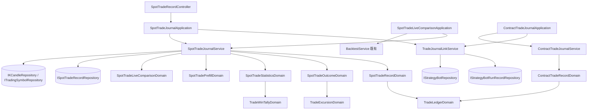

# 現貨交易日誌 — Architecture Design

**Status:** Confirmed
**Source PRD:** `.sdd/2026-09-27-spot-trade-journal/PRD.md`
**Tech context:** Go · Gin · GORM（PostgreSQL，Code First）· Clean / Onion；延續 `2026-09-27-contract-trade-journal/ARCH.md`

---

## 1. Design Goal & Guiding Principle

- **In one sentence:** 以一個與合約完全獨立的「現貨交易紀錄」聚合承接現貨買賣，讀取時算出淨損益、報酬率、R、最大不利／最大有利、浮動損益與依市場分組的統計；
  機器人連結依行情種類導到對應日誌；合約日誌只改說法。
- **Guiding principle:** **把合約日誌裡本來就與市場無關的三個零件真正抽成共用**，現貨只寫自己不同的那一層：
  1. `TradeLedgerDomain`（原 `ContractTradeLedgerDomain`）：均價、持有、平倉判定、不可超賣——改吃中性的 `TradeLedgerFillVo`，拒絕訊息的用詞由呼叫者給（合約說開倉／平倉、現貨說買進／賣出）。
  2. `TradeExcursionDomain`（原 `ContractTradeExcursionDomain`）與 `PlannedRiskDomain`：最大不利／最大有利與 R。
  3. `TradeWinTallyDomain`（原 `ContractTradeWinTallyDomain`）：勝場、勝率、平均 R、平均報酬率、滑點，吃中性的 `TradeResultVo`。
  4. `TradeJournalLinkService`（原 `ContractTradeJournalLinkService`）：鑄連結、讀回「屬於我的那一輪」，依行情種類決定導到哪本。

  **不在合約聚合上加市場種類開關**：現貨有自己的聚合、結果層、統計、對照、預填與 service。

---

## 2. Change Scope

| Area | Action | What / Why |
| :--- | :--- | :--- |
| `ContractTradeLedgerDomain` → `TradeLedgerDomain` | **Modify（改名＋改輸入）** | 吃 `[]vo.TradeLedgerFillVo` 與 `vo.TradeLedgerWordingVo`；掛單／吃單的驗證與「未設定費率」移回合約聚合 |
| `ContractTradeExcursionDomain` → `TradeExcursionDomain`；`ContractTradeExcursionDto` → `TradeExcursionDto`；`ContractTradeFloatingDto` → `TradeFloatingDto` | **Modify（改名）** | 現貨共用；JSON 形狀不變 |
| `ContractTradeWinTallyDomain` → `TradeWinTallyDomain` | **Modify（改名＋改輸入）** | 吃 `[]vo.TradeResultVo`；多 `AverageReturnRate` |
| `ContractTradeJournalLinkService` / `Domain` → `TradeJournalLinkService` / `TradeJournalLinkDomain` | **Modify** | 現貨買入與出場也附連結、網址依行情種類；新增 `FindOwnedRound`（讀回屬於我的那一輪）；兩本日誌的「打開連結／從連結建立」改由 application 編排 |
| `ContractTradeJournalService` / `Application` | **Modify** | 不再自己讀執行紀錄與機器人：`PrepareJournalLink`、`RecordTrade` 收 application 從 `TradeJournalLinkService.FindOwnedRound` 拿到的 `JournalLinkRoundDto`；合約連結打到現貨日誌（反之亦然）說明屬於另一本 |
| `ContractTradeRecordDomain`、`contract_trade_errors.go` | **Modify（只改用詞）** | 開倉／加倉／減倉／平倉、開倉價／平倉價；不再出現「成交」 |
| `ContractTradeListFilterVo` → `TradeListFilterVo` | **Modify（改名）** | 多 `Market`（現貨用） |
| `TradeJournalSettingService.DeleteTag` | **Modify** | 使用中筆數＝合約＋現貨 |
| `IKCandleRepository` / 實作 | **Modify** | 新增 `FindPriceExtremesInRange`（與合約同寫法） |
| `schema_migrator.go` | **Modify** | 登記現貨三個 entity 與部分唯一索引「同一擁有者同一標的一筆持有中」 |
| 現貨 entity／VO／domain／DTO／repository／service／application／controller | **Add** | 見第 3 節 |
| `dependencies.go`、postman | **Modify** | 組裝、路由、請求範例 |
| 現貨機器人的判斷、訊息內容、停損停利；合約計算；回測引擎 | **Not touched** | 只多一條連結；合約數字與 JSON 欄位名不變 |

---

## 3. New Classes / Modules

### 3.1 Entities

| Name | Fields（重點） |
| :--- | :--- |
| `SpotTradeRecord`（`SpotTradeRecords`） | `ID`、`OwnerID`、`Symbol`、`Market`（`crypto`/`taiwanStock`）、`Status`、計畫四欄、`TradingStrategyID *uint`（無外鍵）、來源快照（機器人 ID／名稱、輪次、參考價、建議止損／止盈）、檢討欄、`OpenedAt`、`ClosedAt`、時戳；`Fills []SpotTradeFill`、`Notes []SpotTradeNote`、`Tags []TradeTag`（many2many `spot_trade_record_tags`）；`ToDto()` |
| `SpotTradeFill`（`SpotTradeFills`） | `ID`、`SpotTradeRecordID`、`Kind`（`buy`/`sell`）、`FilledAt`、`Price`、`Quantity`、`Fee`；`ToDto()`、`ToTradeLedgerFillVo()` |
| `SpotTradeNote`（`SpotTradeNotes`） | 同合約 |

部分唯一索引 `idx_spot_trade_records_one_open_per_symbol`：`(owner_id, symbol) WHERE status = 'open'`，沿用 migrator 既有的部分索引做法。

### 3.2 VO

`TradeLedgerFillVo`（ID、`Kind` entry/exit、時間、價、量、手續費）、`TradeLedgerWordingVo`（進場／出場的說法、持有的說法、`ValidationError` 哨兵）、`TradeResultVo`（淨損益、R、報酬率、滑點、方向、是否依策略）、
`SpotTradeFillKindVo`（buy/sell）、`SpotTradeMarketFactsVo`（最新價、極值）、`TradeListFilterVo`。

### 3.3 Domain Models

| Name | Responsibility | Satisfies |
| :--- | :--- | :--- |
| `TradeLedgerDomain`（改） | 市場無關的帳本；用詞由 `TradeLedgerWordingVo` 給 | US-01、US-03 |
| `SpotTradeMarketDomain` | 所屬市場 → 計價幣（TWD／USDT）、數量規則（台股整數股）、預填數量取整（台股整數、加密 8 位小數，往下） | US-02 台股整數、US-07 預填數量 |
| `SpotTradeRecordDomain` | 現貨聚合：開一筆（第一筆必須買進、不收槓桿、台股整數股）、加／改／刪買賣、改計畫（止損低於第一筆買進價、止盈高於、信心 1–5、平倉後鎖定）、附註、檢討、型態標籤、來源快照 | US-02、03、04 |
| `SpotTradeOutcomeDomain` | 淨損益、買進成本、報酬率、計畫風險、R、最大不利／最大有利（`TradeExcursionDomain`）、利潤捕捉率（已平倉才有）、浮動損益（持有中）、進場滑點 | US-04、US-07 滑點 |
| `SpotTradeStatisticsDomain` | 恆分台股、加密貨幣兩組的統計（勝率、淨損益、平均報酬率、獲利因子、平均 R 與筆數、累積損益、報酬率分布、失誤成本、兩組比較、平均滑點） | US-05 |
| `SpotTradeLiveComparisonDomain` | 依標的分組 → 現貨回測請求（初始資金 10,000、全押、不計成本）→ 與重演結果並排 | US-08 |
| `SpotTradePrefillDomain` | 由 `JournalLinkRoundDto`、標的所屬市場、持有中那一筆 → `newTrade`／`addBuyFill`／`addSellFill`／`noOpenHolding` 與預填值 | US-07 |
| `TradeJournalLinkDomain`（改） | 合約：做多／做空且有建議部位；現貨：買入或出場；網址 `{前端}/contract-trade-journal/new?journalLink=` 或 `/spot-trade-journal/new?journalLink=` | US-07 |
| `TradeWinTallyDomain`（改）、`TradeExcursionDomain`（改）、`PlannedRiskDomain` | 共用 | US-04、05 |

錯誤（`domains/spot_trade_errors.go`）：`ErrSpotTradeValidation`、`ErrSpotTradeNotFound`、`SpotTradeOpenHoldingExistsError{OpenTradeID}`（unwrap `ErrSpotTradeOpenHoldingExists`）、`ErrSpotTradeLocked`；連結打錯本沿用 `ErrJournalLinkNotFound`，訊息說明屬於另一本日誌。

### 3.4 Interfaces

`ISpotTradeRecordRepository`：`Create`（撞部分索引→`SpotTradeOpenHoldingExists`）、`Save`、`FindOne`、`FindPageByOwner(ownerID, TradeListFilterVo)`、`FindClosedByOwner(ownerID, closedSince)`、
`FindClosedByOwnerAndTradingStrategy`、`FindOpenByOwnerSymbol`、`Delete`、`CountByTag`。
`IKCandleRepository.FindPriceExtremesInRange(ctx, symbol, start, end) (vo.PriceExtremesVo, error)`。

### 3.5 Services

| Name | Public methods |
| :--- | :--- |
| `SpotTradeJournalService` | `RecordTrade(viewerID, writeDto, linkRound *JournalLinkRoundDto)`、`AddFill`、`AmendFill`、`RemoveFill`、`AmendPlan`、`AddNote`、`WriteReview`、`AssignSetupTags`、`DeleteTrade`、`ListTrades`、`GetTrade`、`GetStatistics`、`PlanLiveComparison`、`ComposeLiveComparison`、`ComposeLiveComparisonForDeletedTradingStrategy`、`PrepareJournalLink(viewerID, linkRound)` |
| `TradeJournalLinkService`（改） | `OfferJournalLink(round)`、`FindOwnedRound(viewerID, identifier) (JournalLinkRoundDto, error)` |

### 3.6 Application / Controller

- `SpotTradeJournalApplication`：一對一轉呼叫；`RecordTrade` 與 `PrepareJournalLink` 先經 `TradeJournalLinkService.FindOwnedRound`（`RecordTrade` 找不到那一輪時照樣建立、只是沒有來源）。
- `ContractTradeJournalApplication`：同樣改由它編排連結。
- `SpotTradeLiveComparisonApplication`：比照合約，重演用 `BacktestService.RunTradingStrategyBacktest`。
- `SpotTradeRecordController`：`respondWithError` 比照合約（驗證／鎖定 400、找不到／連結找不到 404、已有持有中 409 附 `openTradeId`、其他 502）。

路由（全部需登入）：

```
POST   /spot-trade-records
GET    /spot-trade-records?status=&symbol=&market=&period=&limit=
GET    /spot-trade-records/statistics?period=7d|30d|90d|all
GET    /spot-trade-records/journal-links/:identifier
GET    /spot-trade-records/:id
DELETE /spot-trade-records/:id
POST   /spot-trade-records/:id/fills
PUT    /spot-trade-records/:id/fills/:fillId
DELETE /spot-trade-records/:id/fills/:fillId
PUT    /spot-trade-records/:id/plan
POST   /spot-trade-records/:id/notes
PUT    /spot-trade-records/:id/review
PUT    /spot-trade-records/:id/setup-tags
GET    /trading-strategies/:id/spot-trade-comparison
```

請求與回應欄位見 `spot-api-contract`（主對話交付前端與外掛的契約檔）與第 9 節實作註記。

---

## 4. Modified Components

| Component | Change |
| :--- | :--- |
| `ContractTradeFill` | 新增 `ToTradeLedgerFillVo()` |
| `ContractTradeRecordDomain` | 持有成交 entity 列表；每次變更以 `TradeLedgerDomain` 驗證；掛單／吃單驗證、`FeeRateMissing()` 留在此；用詞改開倉／平倉 |
| `ContractTradeOutcomeDomain`、`ContractTradeStatisticsDomain`、`ContractTradeLiveComparisonDomain` | 改用共用的帳本、極值、勝場零件 |
| `ContractTradeRecordDto` | 新增 `ToTradeResultVo()` |
| `StrategyBotRunApplication` | 改注入 `TradeJournalLinkService` |
| `TradeJournalSettingService` | 注入 `ISpotTradeRecordRepository`，刪除標籤時兩本計數相加 |

---

## 5. Component Relationships



---

## 6. Extensibility & Handoff Notes

- **Most likely next requirement:** 現貨手續費率自動帶出（尤其台股手續費＋證交稅）。
- **Where it lands:** `TradeJournalSettingDomain` 加兩組依市場的費率；`SpotTradeJournalService` 記買賣前照合約的 `PricedFill` 模式補手續費；帳本與結果層不動。
- **Second likely:** 第三種市場（例如美股） → `SpotTradeMarketDomain` 加一種市場的計價幣與數量規則。
- **Patterns applied & why:** 共用零件吃中性 VO（帳本、勝場），市場差異只在各自聚合與結果層；連結的「讀回那一輪」集中在一個 service，由 application 編排，兩本日誌不各自重寫。
- **Do not hardcode:** 計價幣與數量規則集中在 `SpotTradeMarketDomain`；預填取整位數集中一處。
- **Known debt / deferred:** 現貨對照不計成本與實盤口徑不同（PRD 已接受）；沒追蹤的台股標的沒有行情。

---

## 7. Traceability

| PRD Scenario | Fulfilled by |
| :--- | :--- |
| US-01 全部 | `ContractTradeRecordDomain`／`TradeLedgerDomain` 的合約用詞 ＋ `contract_trade_errors.go` |
| US-02 新增台股／加密／同標的已有持有中／沒有槓桿／不能先賣／台股整數股／不認得標的／別人的找不到 | `SpotTradeRecordDomain` 建構 ＋ `SpotTradeMarketDomain` ＋ `SpotTradeJournalService.RecordTrade`（`ITradingSymbolRepository`、部分索引）＋ 擁有者檢查 |
| US-03 全部 | `TradeLedgerDomain`（現貨用詞）＋ `SpotTradeRecordDomain` |
| US-04 損益報酬率 R／沒有止損／止損放錯邊／平倉後鎖定 | `SpotTradeOutcomeDomain` ＋ `SpotTradeRecordDomain.AmendPlan` |
| US-04 最大不利最大有利／沒有行情／浮動損益、沒有資金費用與強平價 | `SpotTradeOutcomeDomain` ＋ `TradeExcursionDomain` ＋ `IKCandleRepository.FindPriceExtremesInRange/FindLatest` |
| US-05 全部 | `SpotTradeStatisticsDomain` ＋ `TradeWinTallyDomain` |
| US-06 貼既有標籤／刪除兩本一起算 | `SpotTradeJournalService.WriteReview`（共用 `ITradeTagRepository`）＋ `TradeJournalSettingService.DeleteTag` |
| US-07 合約連結導合約／現貨買入預填／沒有建議部位／出場有持有中／出場沒有持有中／買入已有持有中 | `TradeJournalLinkDomain` ＋ `SpotTradePrefillDomain` ＋ `SpotTradeJournalApplication.PrepareJournalLink` |
| US-07 別人的或已刷掉 | `TradeJournalLinkService.FindOwnedRound` |
| US-07 其他訊息一字不變 | `StrategyBotMessageDomain` 只在有網址時加一行 |
| US-08 | `SpotTradeLiveComparisonDomain` ＋ `SpotTradeLiveComparisonApplication` |

---

## 8. Risks & Open Decisions

- 共用零件改名會動到合約日誌的程式與測試；以既有測試全綠為準，JSON 欄位不變。
- 現貨對照的回測回應沒有多空之分，只並排平倉筆數與勝率。
- 預填數量：加密貨幣 8 位小數往下取；若交易所步進更粗，使用者照實改。

---

## 9. Implementation Notes

（實作時補上偏離與最終欄位）
