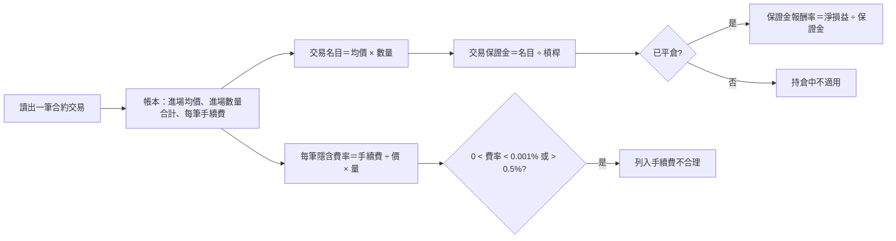

# Product Requirements Document (PRD) — 合約交易的部位大小

**Status:** Finalized
**Version:** v1.0
**Owner:** James Hsueh
**Stakeholders:** Engineering

---

## 1. Background & Goal (Why & Goal)

- **Problem Statement:** 合約交易日誌的「數量」是標的單位，使用者卻常用保證金想部位。一筆實際押約 56 USDT 保證金的 BTCUSDT 做多被記成數量 1（＝1 顆 BTC），毛損益 −270.5、資金費用 −3.79 都放大了約 750 倍；使用者照實填的手續費 0.05 其實早就對不上 1 顆 BTC 的部位（應約 42），但結果裡沒有任何數字讓人看得出來。
- **Expected Outcome:**
  - 一筆合約交易的結果說出**交易名目**與**交易保證金**，部位大小一眼可見。
  - 已平倉的交易有**保證金報酬率**，用合約使用者習慣的方式衡量成績。
  - 手續費與部位大小對不上的開平倉紀錄被列出，記錯的數量藏不住。
- **Out of Scope:**
  - 現貨日誌。
  - 用名目或保證金**輸入**一筆開平倉紀錄（前端換算成數量後照舊送數量）。
  - 依交易規格的數量步進檢查數量。
  - 修改既有交易的資料；統計頁的彙總數字。

---

## 2. User Personas

- **交易者**：從網頁或授權的外掛記錄、查看自己的合約交易。

---

## 3. User Stories & Acceptance Criteria

### US-01 — 結果說出部位大小與保證金報酬率 [priority: P0]
**As a** 交易者, **I want** 每筆合約交易的結果告訴我名目、保證金與保證金報酬率, **so that** 我能用押下去的錢衡量成績，也能一眼看出數量記錯。

```gherkin
Scenario: 已平倉交易有名目、保證金與保證金報酬率
  Given 一筆已平倉的做多合約交易，槓桿 10
  And 開倉 97,905 × 0.030 與 97,960 × 0.021，平倉 100,420 × 0.051
  And 淨損益 120.53
  When 我查看這筆交易
  Then 交易名目為 4,994.31
  And 交易保證金為 499.43
  And 保證金報酬率約為 24.13%

Scenario: 一倍槓桿的保證金等於名目
  Given 一筆已平倉的做多合約交易，槓桿 1，開倉 84,780.9 × 0.0013
  When 我查看這筆交易
  Then 交易名目與交易保證金都是 110.22

Scenario: 持倉中沒有保證金報酬率
  Given 一筆持倉中的合約交易，開倉 100 × 2，槓桿 5
  When 我查看這筆交易
  Then 交易名目為 200、交易保證金為 40
  And 保證金報酬率為「持倉中不適用」

Scenario: 列表與單筆的數字相同
  Given 一筆已平倉的合約交易
  When 我列出合約交易與查看這一筆
  Then 兩處的交易名目、交易保證金、保證金報酬率相同
```

### US-02 — 指出手續費與部位對不上的開平倉紀錄 [priority: P0]
**As a** 交易者, **I want** 手續費換算出來的費率明顯不合理時被指出是哪一筆, **so that** 我知道那一筆的數量（或手續費）很可能記錯了。

```gherkin
Scenario: 隱含手續費率過低的那一筆被指出
  Given 一筆合約交易的開倉 84,780.9 × 1、手續費 0.05
  When 我查看這筆交易
  Then 這一筆開倉紀錄列在手續費不合理的紀錄中

Scenario: 正常費率不被指出
  Given 一筆合約交易的開倉 97,905 × 0.030、手續費 1.47
  When 我查看這筆交易
  Then 手續費不合理的紀錄是空的

Scenario: 手續費為零不被指出
  Given 一筆合約交易的開倉手續費為 0
  When 我查看這筆交易
  Then 這一筆不列在手續費不合理的紀錄中

Scenario Outline: 隱含手續費率的合理範圍含邊界
  Given 一筆合約交易的一筆紀錄 100 × 1、手續費 <fee>
  When 我查看這筆交易
  Then 這一筆<listed>

  Examples:
    | fee     | listed   |
    | 0.00099 | 被列出   |
    | 0.001   | 不被列出 |
    | 0.5     | 不被列出 |
    | 0.6     | 被列出   |
```

---

## 4. Business Flow



---

## 5. Non-Functional Requirements

- 查看時計算、不寫資料庫，沒有 schema 變更。
- 回應新增欄位不改動既有欄位的意義，舊的讀者照常運作。

## 6. Response Shape

`outcome` 多出：

| 欄位 | 型別 | 說明 |
| :--- | :--- | :--- |
| `entryNotional` | decimal string | 交易名目 |
| `entryMargin` | decimal string | 交易保證金 |
| `returnOnMarginPercentage` | number \| null | 保證金報酬率（24.13 即 24.13%）；持倉中為 null |
| `returnOnMarginUnavailableReason` | string | `notClosed`（持倉中）或空字串 |
| `implausibleFeeFillIds` | number[] | 手續費不合理的開平倉紀錄編號，依時間先後；沒有即空陣列 |
