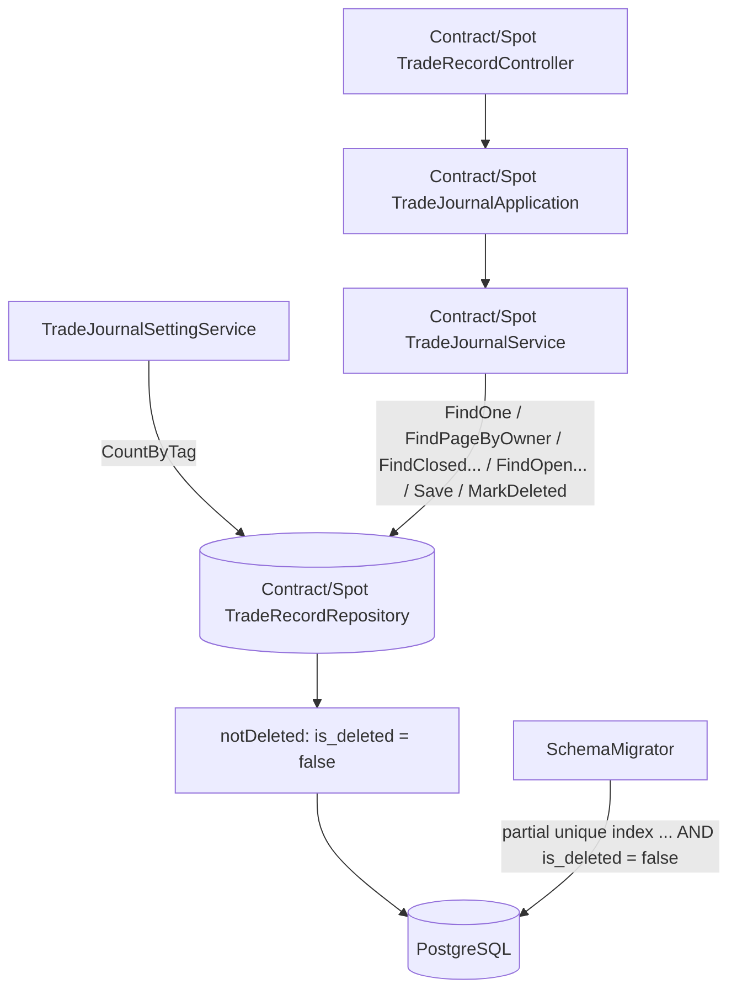

# 交易日誌軟刪除 — Architecture Design

**Status:** Confirmed
**Source PRD:** `.sdd/2026-09-28-trade-journal-soft-delete/PRD.md`
**Tech context:** Go · Gin · GORM（PostgreSQL，Code First）· Clean Architecture（controller → application → domain service → repository 介面，實作在 infrastructure）

---

## 1. Design Goal & Guiding Principle

- **In one sentence:** 刪除一筆合約／現貨交易改為把該列標成 `is_deleted = true` 並記下 `deleted_at`，而**每一條讀寫路徑都只看得到 `is_deleted = false` 的列**。
- **Guiding principle:** **「未刪除」的判斷只寫一次，且寫在 repository 裡最底層的查詢起點。** 兩個 trade record repository 各自有一個私有的 `notDeleted(executionContext)` 作為所有讀取的共同起點；`withChildren`、`FindPageByOwner`、`CountByTag`、`Save` 全都從它出發。Domain service 不知道「軟刪除」的存在——它照舊呼叫 `FindOne`，已刪除的列自然回 `ContractTradeNotFound`／`SpotTradeNotFound`，所以「已刪除等同不存在」與「找不到一致」不需要在任何 use case 裡各寫一次。

---

## 2. Change Scope

| Area | Action | What / Why |
| :--- | :--- | :--- |
| `entities.ContractTradeRecord`、`entities.SpotTradeRecord` | **Modify** | 加 `IsDeleted bool`（`not null;default:false;index`）與 `DeletedAt *time.Time`（`timestamptz`）。AutoMigrate 以預設值 false 補欄，既有列一律是未刪除 |
| `IContractTradeRecordRepository`、`ISpotTradeRecordRepository` | **Modify** | `Delete(ctx, id)` 換成 `MarkDeleted(ctx, id, deletedAt)`；語意從「移除」變成「標記」，名字跟著改，避免下一位以為還是硬刪 |
| `ContractTradeRecordRepository`、`SpotTradeRecordRepository` | **Modify** | 新增私有查詢起點 `notDeleted`；所有 finder、`CountByTag`、`Save` 都經過它；`MarkDeleted` 只更新未刪除的那一列，沒更新到就回找不到 |
| `ContractTradeJournalService.DeleteTrade`、`SpotTradeJournalService.DeleteTrade` | **Modify** | 改呼叫 `MarkDeleted`，刪除時間取自既有的 `clockProxy.Now().UTC()` |
| `SchemaMigrator` 的持倉唯一部分索引 | **Modify** | 兩條部分索引的條件加上 `AND is_deleted = false`；因 `CREATE ... IF NOT EXISTS` 不會改寫既有索引，**換新名字建立，舊名字列入 `retiredIndexes` 移除** |
| Controller、Application、路由、DTO、前端/外掛看到的回覆形狀 | **Not touched** | 刪除仍回 204、找不到仍是同一個錯誤；對外完全不變 |
| 單筆成交刪除（`RemoveFill`）、`Save` 內移除消失的 fill | **Not touched** | PRD 明訂仍是當場移除 |
| 使用者帳號的 `OnDelete:CASCADE` | **Not touched** | PRD Out of Scope |
| GORM 內建 `gorm.DeletedAt`／`soft_delete` plugin | **Not adopted** | 需求指名 `is_deleted` 旗標；內建機制是全域隱式 scope，會讓 `Unscoped` 在往後的維運查詢裡變成必須記得的陷阱，也要新增依賴。以一個私有查詢起點達成同樣效果、行為可見 |

---

## 3. New Classes / Modules

無新增型別。本切片只在既有 repository 內新增一個私有方法：

| Name | Kind | Responsibility (purpose) | Collaborators | Satisfies (PRD scenario) |
| :--- | :--- | :--- | :--- | :--- |
| `notDeleted(executionContext)`（兩個 trade record repository 各一） | Repository 私有查詢起點 | 回傳已限定 `is_deleted = false` 的 `*gorm.DB`，是所有讀取與 `Save` 的唯一起點 | `gorm.DB` | US-01～US-05 全部讀取類情境 |

> 深度檢查：呼叫端（domain service）介面完全不變、不需要知道軟刪除；複雜度（過濾、索引條件、標記時的並發守門）全藏在 repository 與 migrator 內。

---

## 4. Modified Components

| Component | Current role | Change needed |
| :--- | :--- | :--- |
| `ContractTradeRecord` / `SpotTradeRecord` entity | 交易列 | 加 `IsDeleted`、`DeletedAt`；`ToDto` 不輸出這兩欄（對擁有者不可見） |
| `I{Contract,Spot}TradeRecordRepository` | 交易持久化契約 | `Delete` → `MarkDeleted(ctx, id uint, deletedAt time.Time) error`；註解寫明「只看得到未刪除的列」是這個介面所有方法的共同約定；重新產生 mock（`go:generate` mockgen） |
| `{Contract,Spot}TradeRecordRepository.withChildren` | 帶 preload 的查詢起點 | 改為 `preloadChildren(notDeleted(ctx))` → `FindOne`、`FindClosedByOwner`、`FindClosedByOwnerAndTradingStrategy`、`FindOpenBy…` 自動排除已刪除 |
| `FindPageByOwner` | 分頁與總數 | 起點改 `notDeleted(ctx).Model(...)`，列表與總筆數同時排除 |
| `Save` | 更新列與子紀錄 | 更新條件加上未刪除（從 `notDeleted` 出發）；`contractTradeRecordColumns`／spot 對應欄位清單**不含** `is_deleted`、`deleted_at`，一般儲存永遠改不到刪除狀態 |
| `MarkDeleted`（取代 `Delete`） | — | `notDeleted(ctx).Model(&Record{}).Where(id).Updates({is_deleted: true, deleted_at})`；`RowsAffected == 0` 回 `ContractTradeNotFound(id)`／`SpotTradeNotFound(id)`。條件含未刪除，所以並發的第二次刪除不會覆寫刪除時間 |
| `CountByTag` | 數標籤還貼著幾筆 | 兩步、全型別安全：先從連結表 `Pluck` 出貼著此標籤的交易 ID，再以 `notDeleted` + `clause.IN` 數未刪除的列。不用 JOIN 字串，符合「禁手寫 SQL」 |
| `{Contract,Spot}TradeJournalService.DeleteTrade` | 驗擁有權後刪除 | `findOwnedTrade` 不變（已刪除的會在這裡回找不到）；改呼叫 `MarkDeleted(ctx, id, clockProxy.Now().UTC())` |
| `SchemaMigrator` | 建部分唯一索引 | 新常數 `ContractTradeOneLiveOpenPerSymbolDirectionIndex = "idx_contract_trade_records_one_live_open_per_symbol_direction"`、`SpotTradeOneLiveOpenPerSymbolIndex = "idx_spot_trade_records_one_live_open_per_symbol"`，條件 `WHERE status = '<open>' AND is_deleted = false`；舊兩個名字加入 `retiredIndexes`（`dropRetiredIndexes` 先於 `createPartialIndexes` 執行）；`writeFailureOf` 改認新常數 |

---

## 5. Component Relationships

---

## 6. Extensibility & Handoff Notes

- **Most likely next requirement:** 「還原已刪除交易」或「營運方／使用者瀏覽已刪除交易（垃圾桶）」。
- **Where it lands:** repository。已刪除列的內容完整保留、`deleted_at` 已記下。
- **How to add it:**
  - 還原：在 repository 介面加 `Restore(ctx, id)`（從**不**經 `notDeleted` 的查詢起點找 `is_deleted = true` 的列，清掉兩欄）；還原持倉中交易時，新的部分唯一索引會自動擋下「同標的同方向已有另一筆持倉中」，由 `writeFailureOf` 轉成既有的業務錯誤。
  - 垃圾桶：加 `FindDeletedPageByOwner`，從 `database.WithContext` 加 `is_deleted = true` 出發；不需要動任何既有 finder。
- **Patterns applied & why:** 單一查詢起點（query root）——軟刪除是橫切所有讀取的規則，集中在一處，新增 finder 時只要從 `notDeleted` 出發就自動正確。
- **Do not hardcode:** 不要在 domain service 裡判斷 `IsDeleted`；domain 不該知道這是軟刪除。新增的任何 finder 都必須從 `notDeleted`（或 `withChildren`）出發，**不要**直接從 `database.WithContext` 起查詢。
- **Known debt / deferred:** 已刪除列永久保留、沒有清除排程；資料量真的成長到影響查詢時，再加定期清除或把 `is_deleted` 併入複合索引。

---

## 7. Traceability

| PRD Scenario | Fulfilled by |
| :--- | :--- |
| US-01 刪除自己的交易後它仍保存並記下刪除時間 | `ContractTradeJournalService.DeleteTrade` + `ContractTradeRecordRepository.MarkDeleted` |
| US-01 刪除自己的現貨交易同樣只是標為已刪除 | `SpotTradeJournalService.DeleteTrade` + `SpotTradeRecordRepository.MarkDeleted` |
| US-01 列表不列出已刪除交易，總筆數也不計入 | `FindPageByOwner`（`notDeleted` 起點） |
| US-01 只剩已刪除交易時列表是空的 | `FindPageByOwner` |
| US-01 依狀態篩選時也不列出已刪除交易 | `FindPageByOwner` |
| US-01 查看已刪除交易回覆找不到 | `FindOne`（`withChildren` → `notDeleted`）→ `findOwnedTrade` |
| US-01 再刪一次已刪除交易回覆找不到 | `findOwnedTrade` → `FindOne`；並發時 `MarkDeleted` 的 `RowsAffected == 0` |
| US-01 刪除別人的交易回覆找不到且不影響它 | 既有 `findOwnedTrade` 擁有者比對（不變） |
| US-01 改動上線前記下的交易照常出現 | entity `IsDeleted` 的 `default:false` + AutoMigrate |
| US-02 為已刪除的持倉中交易加平倉紀錄回覆找不到 | 所有修改 use case 共用的 `findOwnedTrade` → `FindOne` |
| US-02 修正或刪除已刪除交易的一筆開倉紀錄回覆找不到 | 同上 |
| US-02 為已刪除的已平倉交易寫檢討回覆找不到 | 同上 |
| US-02 為已刪除交易加附註、改計畫或改型態標籤回覆找不到 | 同上 |
| US-02 為已刪除的現貨交易加一筆賣出回覆找不到 | `SpotTradeJournalService` 同上 |
| US-02 未刪除的交易照舊可以修改 | 既有行為（`Save` 從 `notDeleted` 出發，未刪除的列不受影響） |
| US-03 績效統計不計入已刪除交易 | `FindClosedByOwner`（`notDeleted`） |
| US-03 現貨統計不計入已刪除交易 | `SpotTradeRecordRepository.FindClosedByOwner` |
| US-03 實盤 vs 回測不拿已刪除交易對照 | `FindClosedByOwnerAndTradingStrategy` |
| US-03 策略的已平倉交易全被刪除時等同沒有實單 | 同上 → 既有「沒有已平倉實單不重演」 |
| US-04 刪除持倉中的合約交易後可以重記同標的同方向 | `FindOpenByOwnerSymbolDirection`（`notDeleted`）+ 新部分唯一索引 `... AND is_deleted = false` |
| US-04 未刪除的持倉中交易照舊擋下同標的同方向 | 同上（既有行為） |
| US-04 刪除持有中的現貨交易後可以重記同標的 | `FindOpenByOwnerSymbol` + 新 spot 部分唯一索引 |
| US-04 記到交易日誌連結不把已刪除交易當成已有持倉中 | `PrepareJournalLink` 經 `FindOpenByOwnerSymbolDirection`（`notDeleted`） |
| US-05 只貼在已刪除交易上的標籤可以刪除 | `CountByTag`（兩步，第二步經 `notDeleted`） |
| US-05 仍貼在未刪除交易上的標籤照舊刪不掉，且只算未刪除的筆數 | 兩個 repository 的 `CountByTag` 合計（`TradeJournalSettingService` 不變） |

---

## 8. Risks & Open Decisions

- **Risks / trade-offs:**
  - `CountByTag` 由一次查詢變兩次；刪除標籤是低頻操作，換來不寫 JOIN 字串，可接受。
  - 部分索引條件仍是 migrator 內既有的原生 DDL 例外（PostgreSQL 部分索引 GORM tag 無法表達），沿用既有寫法並只多一個固定條件，不引入參數拼接。
  - 舊索引在 `dropRetiredIndexes` 與 `createPartialIndexes` 之間有極短的無索引空窗，只發生在啟動遷移時，服務尚未接請求，可接受。
- **Open decisions (for implementation):** 無。
