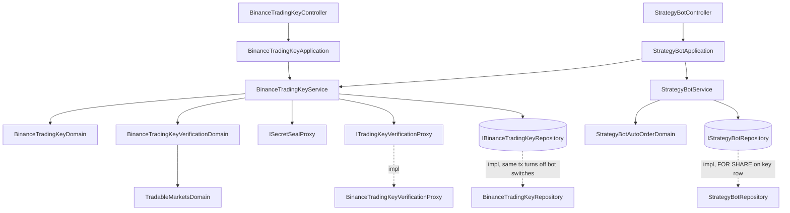

# 幣安自動下單設定 — Architecture Design

**Status:** Confirmed（autonomous run — decisions recorded below）
**Source PRD:** `.sdd/2026-10-01-binance-auto-order-setup/PRD.md`
**Tech context:** Go · Gin · GORM · PostgreSQL · Clean/Onion（`internal/{controller,application,domain,infrastructure}`）

---

## 1. Design Goal & Guiding Principle

- **In one sentence:**
  讓一位使用者存一組經幣安驗證過的幣安交易金鑰（兩串都上鎖、讀回只有 API Key 結尾）並記下可交易市場，
  讓每台策略機器人帶一個自動下單開關，且**任何時刻都不存在「開著卻沒有涵蓋它的金鑰」的機器人**。

- **Guiding principle — 照 Telegram 投遞那一套，再加兩個「結構上就辦不到」：**

  1. **Secret Key 交不出去，是型別上交不出去。** `dto.BinanceTradingKeyDto` 只有 `ApiKeyTail`，
     **沒有任何 Secret Key 的欄位**；給外掛讀的 `dto.BinanceTradingKeyStatusDto` **連 `ApiKeyTail` 都沒有**。
     外掛能讀的那一條路回的是另一個型別，不是同一個型別「記得遮」。
  2. **不變式由交易保證，不由呼叫順序保證。** 「換金鑰 → 關掉不涵蓋的開關」與「移除金鑰 → 關掉全部開關」
     各自是 `IBinanceTradingKeyRepository` 的**一次呼叫、一個資料庫交易**（比照 `UserRepository` 改密碼時一併撤銷 sessions）。
     「打開開關」則在交易中以 `FOR SHARE` 鎖住那一組金鑰並核對**設定時刻**是否仍是剛剛檢查過的那一個
     （比照 `RecordRound` 以 `dueAt` 當作 token 的做法）——與換存/移除互斥，所以不會留下對不上的開關。
  3. **驗證交易金鑰是一個能力，幣安是它的一個供應商。** 介面 `ITradingKeyVerificationProxy`，
     實作 `BinanceTradingKeyVerificationProxy`。幣安那一側的拒絕以 `vo.TradingKeyVerificationVo` 的
     `FailureReason` 回來（nil error），與 `IMessageDeliveryProxy` 同一個慣例；只有本地失敗才是 error。

---

## 2. Change Scope

| Area | Action | What / Why |
| :--- | :--- | :--- |
| `entities.BinanceTradingKey` | **Add** | 一位使用者那一組。`UserID` 唯一索引（一人一組由 schema 保證）；`SealedApiKey`、`SealedSecretKey`（上鎖）、`ApiKeyTail`（存下來的結尾，讀取時不開鎖）、`SpotTradingEnabled`、`ContractTradingEnabled`、`CreatedAt`、`UpdatedAt`（＝設定時刻）。`ToDto()` / `ToStatusDto()` |
| `entities.User` | **Modify** | 加 `BinanceTradingKey *BinanceTradingKey` 關聯，`OnDelete:CASCADE`——使用者不在了，鑰匙也不在 |
| `entities.StrategyBot` | **Modify** | 加 `AutoOrderEnabled bool`（`not null;default:false`，既有每一台自動是關閉）；`ToDto()` 帶出 |
| `dto.StrategyBotDto` | **Modify** | 加 `AutoOrderEnabled bool \`json:"autoOrderEnabled"\``——前端與外掛讀機器人時就看得到 |
| `dto.BinanceTradingKeyDto` / `BinanceTradingKeyStatusDto` / `BinanceTradingKeyWriteDto` | **Add** | 讀（網頁）、讀（外掛可讀的摘要）、寫的三種形狀 |
| `vo.TradableMarketVo` | **Add** | `spot` / `contract` |
| `vo.TradingKeyVerificationFailureVo` | **Add** | `keyRejected` / `unreachable` / `timedOut` / `noTradingPermission`（空字串＝成功） |
| `vo.TradingKeyVerificationVo` | **Add** | proxy 的回答：失敗原因 + 兩個權限布林 |
| `vo.TradingKeyCredentialVo` | **Add** | 交給 proxy 的兩串原文。**唯一裝得下完整 Secret Key 的型別**，只在 domain → infrastructure 這一段存在 |
| `domains.BinanceTradingKeyDomain` | **Add** | 兩串的規則：去空白、不得空白（先 API Key 後 Secret Key）、算 API Key 結尾、`ToCredentialVo()`、`ToEntity(...)` |
| `domains.TradableMarketsDomain` | **Add** | 可交易市場：`Values()`、`Covers(marketDataKind)`、`UncoveredBotMarketDataKinds()`（含既有空白＝現貨的舊列） |
| `domains.BinanceTradingKeyVerificationDomain` | **Add** | 把 proxy 的回答變成「可交易市場」或一個帶失敗原因的錯誤（含「兩種都沒開」） |
| `domains.StrategyBotAutoOrderDomain` | **Add** | 打開開關的兩道關卡：有金鑰、可交易市場涵蓋這台的種類 |
| `domains.binance_trading_key_errors.go` | **Add** | 哨兵錯誤 + `BinanceTradingKeyVerificationError`（帶 `Reason`，比照 `AccountNotActivatedError` 帶額外欄位） |
| `domains.strategy_bot_errors.go` | **Modify** | 加 `ErrStrategyBotAutoOrderKeyNotConfigured`、`ErrStrategyBotAutoOrderMarketNotCovered`、`ErrStrategyBotAutoOrderKeyChanged` |
| `IBinanceTradingKeyRepository` | **Add** | `FindOneByUser`、`Replace(key, uncoveredBotMarketDataKinds)`、`DeleteByUser`——後兩者在同一交易內處理機器人開關 |
| `ITradingKeyVerificationProxy` | **Add** | `VerifyTradingKey(ctx, credential) (vo.TradingKeyVerificationVo, error)` |
| `IStrategyBotRepository` | **Modify** | 加 `EnableAutoOrder(ctx, botID, ownerID, keyConfiguredAt)`、`DisableAutoOrder(ctx, botID)` |
| `persistence.BinanceTradingKeyRepository` | **Add** | GORM 實作；`Replace` = ON CONFLICT upsert + 同交易關掉不涵蓋種類；`DeleteByUser` = 同交易關掉全部 + 刪除 |
| `persistence.StrategyBotRepository` | **Modify** | 兩個新方法；`Save` / `UpdateRunState` 的欄位清單**不含** `auto_order_enabled`，所以修改機器人或跑一輪都不會動到開關 |
| `persistence.SchemaMigrator` | **Modify** | 註冊 `&entities.BinanceTradingKey{}` |
| `internal/infrastructure/exchange/` | **Add** | 新資料夾：`BinanceTradingKeyVerificationProxy` + `binance_trading_key_wire.go` |
| `service.BinanceTradingKeyService` | **Add** | 四個公開用例：讀（網頁）、讀摘要、存、移除。彼此不呼叫 |
| `service.StrategyBotService` | **Modify** | 加 `EnableAutoOrder`、`DisableAutoOrder` |
| `application.BinanceTradingKeyApplication` | **Add** | 用例轉呼 |
| `application.StrategyBotApplication` | **Modify** | 注入 `BinanceTradingKeyService`；`EnableAutoOrder` 先讀金鑰摘要再交給機器人 service（domain service 不互呼，由 application 串） |
| `controller.BinanceTradingKeyController` + `models.BinanceTradingKeyRequest` | **Add** | 四條路由 |
| `controller.StrategyBotController` | **Modify** | `EnableAutoOrder` / `DisableAutoOrder` 兩條路由與錯誤對映 |
| `config.BinanceTradingConfig` | **Add** | `BINANCE_TRADING_API_BASE_URL`（預設 `https://api.binance.com`）、`BINANCE_TRADING_KEY_REQUEST_TIMEOUT_SECONDS`（預設 10） |
| `cmd/server/dependencies.go` | **Modify** | 組裝與路由 |
| `postman/`、`.env.example` | **Modify** | 新路由、新設定 |
| `StrategyBotRunApplication`、輪次、Telegram 訊息 | **Not touched** | PRD：開關目前不生效，每一輪行為一模一樣。刻意一行都不改，連讀都不讀這個欄位 |
| `TelegramDelivery*`、`ISecretSealProxy`、`AesSecretSealProxy` | **Not touched** | 直接重用上鎖能力；`ErrSecretSealUnavailable`（訊息是 Telegram 的措辭）在 service 內轉成本切片自己的 `ErrBinanceTradingKeySealUnavailable` |
| 既有 `CONTRACT_ACCOUNT_API_KEY` 唯讀帳戶金鑰 | **Not touched** | 那是營運者的唯讀金鑰，抓維持保證金分級用；與使用者的幣安交易金鑰是兩件事 |

---

## 3. New Classes / Modules

| Name | Kind | Responsibility (purpose) | Collaborators | Satisfies (PRD scenario) |
| :--- | :--- | :--- | :--- | :--- |
| `BinanceTradingKey` | Entity | 一人一組的留存形狀；不含任何原文 | `User`（cascade） | 例 1、2、7、9、留存處沒有原文 |
| `BinanceTradingKeyDomain` | Domain Model | 驗兩串、去空白、算結尾、產生 credential 與 entity | `vo.TradingKeyCredentialVo` | 例 3、4、5、很短的 API Key |
| `TradableMarketsDomain` | Domain Model | 可交易市場的語意：值、涵蓋判斷、不涵蓋的機器人種類 | `MarketDataKindDomain` | 例 10、11、20、27 |
| `BinanceTradingKeyVerificationDomain` | Domain Model | proxy 回答 → 可交易市場或帶原因的拒絕 | `TradableMarketsDomain` | 例 12–15 |
| `StrategyBotAutoOrderDomain` | Domain Model | 打開自動下單的兩道關卡 | `dto.BinanceTradingKeyStatusDto` | 例 17–20 |
| `BinanceTradingKeyVerificationError` | Error type | 帶 `Reason` 的拒絕，讓 controller 對映狀態碼並把原因放進回應 | — | 例 12–15、28 |
| `BinanceTradingKeyService` | Domain Service | 讀/讀摘要/存/移除；存＝驗證 → 上鎖 → 問幣安 → 一次交易寫入 | repo、`ISecretSealProxy`、`ITradingKeyVerificationProxy` | US-01、02、03、05 |
| `BinanceTradingKeyRepository` | Repository | 一人一組的讀寫，寫入與機器人開關同交易 | GORM | 例 25、27、28、併發 |
| `BinanceTradingKeyVerificationProxy` | Proxy | 以 HMAC-SHA256 簽名呼叫 `GET /sapi/v1/account/apiRestrictions`，正規化成 VO | `IClockProxy`、`http.Client` | 例 10–15 |
| `BinanceTradingKeyApplication` / `BinanceTradingKeyController` | Application / Controller | HTTP 轉換 | — | US-01、02、06 |

---

## 4. Modified Components

| Component | Current role | Change needed |
| :--- | :--- | :--- |
| `StrategyBotService` | 機器人 CRUD、啟停、輪次 | `EnableAutoOrder(ctx, viewerID, id, keyStatus)`：找自己的機器人 → `StrategyBotAutoOrderDomain.RequireEnableable` → 已開著則直接回 → `EnableAutoOrder` 帶 `keyStatus.ConfiguredAt` 當 token。`DisableAutoOrder(ctx, viewerID, id)`：找自己的 → 關（無前提，冪等） |
| `StrategyBotApplication` | 串機器人、交易策略、Telegram | 多注入 `BinanceTradingKeyService`；`EnableAutoOrder` 先 `GetTradingKeyStatus` |
| `StrategyBotRepository` | 機器人留存 | `EnableAutoOrder`：交易內 `SELECT … FOR SHARE` 該擁有者的金鑰列且 `updated_at = token`，找不到即 `ErrStrategyBotAutoOrderKeyChanged`，否則更新那一台；`DisableAutoOrder`：只寫 `auto_order_enabled=false`（`UpdateColumn`，不動 `UpdatedAt`） |
| `StrategyBotController.respondWithError` | 錯誤對映 | 新三個哨兵 → 409，回應帶 `reason` |
| `entities.StrategyBot.ToDto` | — | 帶出 `AutoOrderEnabled` |

---

## 5. Component Relationships

---

## 6. HTTP Contract

| Method & Path | Sign-in | Request | 200/204 | Errors |
| :--- | :--- | :--- | :--- | :--- |
| `GET /users/me/binance-trading-key` | 網頁限定 | — | `BinanceTradingKeyDto` | 401 |
| `GET /users/me/binance-trading-key/status` | 任何登入（含外掛） | — | `BinanceTradingKeyStatusDto` | 401 |
| `PUT /users/me/binance-trading-key` | 網頁限定 | `{"apiKey","secretKey"}` | `BinanceTradingKeyDto` | 400 空白；422 `keyRejected`/`noTradingPermission`；502 `unreachable`；504 `timedOut`；503 系統存不了 |
| `DELETE /users/me/binance-trading-key` | 網頁限定 | — | 204（不論原本有沒有） | 401 |
| `POST /strategy-bots/:id/auto-order` | 網頁限定 | — | `StrategyBotDto` | 400 識別碼；404 找不到；409 `binanceTradingKeyNotConfigured`/`tradableMarketNotCovered`/`binanceTradingKeyChanged` |
| `DELETE /strategy-bots/:id/auto-order` | 網頁限定 | — | `StrategyBotDto` | 400、404 |

- `BinanceTradingKeyDto`：`{"configured":bool,"apiKeyTail":string,"tradableMarkets":["spot","contract"],"configuredAt":RFC3339}`（未設定：`configured:false`、`apiKeyTail:""`、`tradableMarkets:[]`）。
- `BinanceTradingKeyStatusDto`：`{"configured":bool,"tradableMarkets":[...],"configuredAt":...}`。
- 錯誤本體：`{"message": "...", "failureReason"?: "...", "reason"?: "..."}`——驗證失敗帶 `failureReason`，開關拒絕帶 `reason`。
- 可交易市場永遠依 `spot`、`contract` 的固定順序。
- 「網頁限定」重用既有 `requiresWebSignIn`（外掛憑證一律 401）——PRD US-06 的「外掛做不了」在伺服器端也成立，不只靠外掛不呼叫。

---

## 7. Extensibility & Handoff Notes

- **Most likely next requirement:** 開關打開時真的下單（現貨與合約）。
- **Where it lands:** 新增一個「下單」能力的 proxy 介面（例如 `IOrderPlacementProxy`），由輪次在 `AutoOrderEnabled` 為真時呼叫；
  開鎖只需在 `BinanceTradingKeyService` 加一個私有的取 credential 路徑（比照 Telegram 的 `deliver` 是唯一開鎖點）。
  簽名邏輯在 `BinanceTradingKeyVerificationProxy` 內，下一刀若要共用，抽成 `exchange` 套件內的未匯出 signer 即可。
- **How to add it:** 不需要改本切片的任何型別；`TradableMarketsDomain.Covers` 已回答「這台能不能用這把下單」。
- **Patterns applied & why:** 能力介面 + 供應商實作（換交易所是加一個實作）；交易內處理不變式（不靠呼叫順序）；token 式樂觀/悲觀混合鎖（比照 `dueAt`）。
- **Do not hardcode:** 幣安位址與等待上限在設定；遮罩字數（4）是常數，刻意不是設定。
- **Known debt / deferred:**
  - 不留「為什麼被自動關掉」的記號（PRD 決策）。
  - `Replace` 與 `DeleteByUser` 會寫 `StrategyBots` 表——一個 repository 跨兩張表，換來的是不變式由交易保證。若之後要變多，改為 unit-of-work。

---

## 8. Traceability

| PRD Scenario | Fulfilled by |
| :--- | :--- |
| 例 1、2、10、11 | `BinanceTradingKeyService.SaveTradingKey` + `BinanceTradingKeyRepository.Replace`（ON CONFLICT user_id） |
| 例 3、4、5、很短的 API Key | `BinanceTradingKeyDomain` |
| 例 6、外掛做不了、外掛讀不到含結尾那一份 | 路由的 `requiresSignIn` / `requiresWebSignIn` |
| 例 7、9、還沒設定過 | `BinanceTradingKey.ToDto` / `ToStatusDto`、`BinanceTradingKeyService.GetTradingKey` |
| 留存處沒有原文、例 8 | `ISecretSealProxy` + `ErrBinanceTradingKeySealUnavailable`（在問幣安之前） |
| 例 12–15、28 | `BinanceTradingKeyVerificationProxy` → `BinanceTradingKeyVerificationDomain` → `BinanceTradingKeyVerificationError`（不寫入） |
| 例 16 | 只在存入時寫 `SpotTradingEnabled`/`ContractTradingEnabled`；讀取不問幣安 |
| 例 17–21、已經關著再關 | `StrategyBotAutoOrderDomain` + `StrategyBotService.EnableAutoOrder/DisableAutoOrder` |
| 例 22、改機器人內容不動開關 | `AutoOrderEnabled default:false`；`Save` 欄位清單不含它 |
| 例 23 | 輪次程式碼未改動 |
| 例 24 | `findOwnedBot` |
| 例 25、26 | `BinanceTradingKeyRepository.DeleteByUser`（同交易關掉全部） |
| 例 27 | `TradableMarketsDomain.UncoveredBotMarketDataKinds` + `Replace` |
| 打開與換金鑰同時發生 | `StrategyBotRepository.EnableAutoOrder` 的 `FOR SHARE` + `configuredAt` token |
| 例 29 | `StrategyBotDto.AutoOrderEnabled` + `GET …/status` |

---

## 9. Risks & Open Decisions

- **幣安權限端點：** `GET /sapi/v1/account/apiRestrictions` 回 `enableSpotAndMarginTrading`、`enableFutures`。
  401/403 或代碼 `-2014`/`-2015`/`-1022`/`-2008` → `keyRejected`；`-1021`（時間戳記）、429/418、5xx、看不懂 → `unreachable`；
  client 逾時或 context deadline → `timedOut`。
- **時鐘偏差：** 使用 `recvWindow=5000`；偏差過大會被報成 `unreachable`（不誤導使用者重填金鑰）。
- **Secret Key 從不寫進錯誤或紀錄**：proxy 的錯誤字串不含位址查詢字串與 header。
