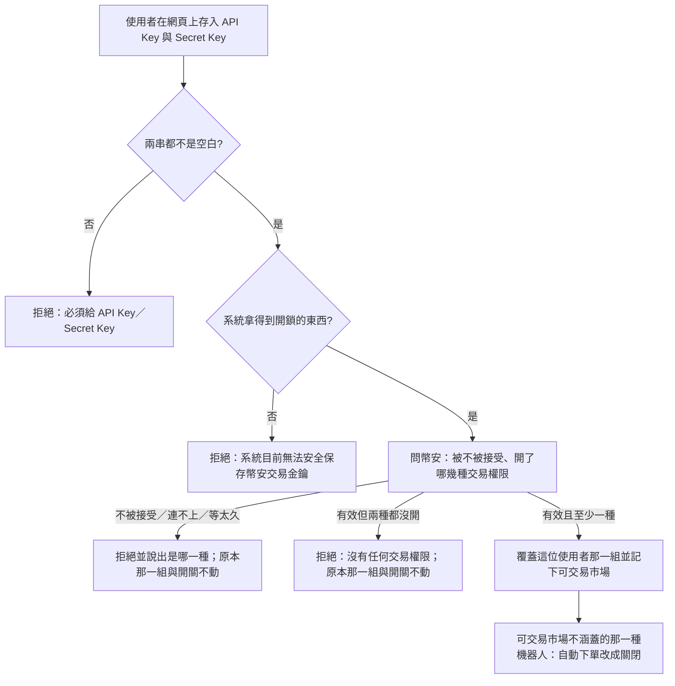

# Product Requirements Document (PRD)

**Feature:** 幣安自動下單設定
**Status:** Draft
**Version:** v1.0
**Owner:** James Hsueh
**Stakeholders:** Engineering

---

## 1. Background & Goal (Why & Goal)

- **Problem Statement:**
  策略機器人到今天為止**只說話、不下單**：每一輪判出信號，只在信號變了的時候送到擁有者的 Telegram。
  使用者最終要的是讓機器人**用他自己的幣安帳戶替他下單**，但系統裡既沒有一個地方放他的幣安交易金鑰，
  也沒有任何方式表達「這台機器人可以動我的錢」。

- **Expected Outcome:**
  這一刀只做「下單之前要準備好的兩件事」，**不下任何一張單**。可驗證的結果有七項：
  1. 一位使用者留得下自己的**幣安交易金鑰**，**每人最多一組**，再存一次是覆蓋。
  2. 存下之前，系統**先問幣安**這組金鑰被不被接受、開了哪幾種交易權限，並記下**可交易市場**。
  3. 存不成時，系統說得出是**四種金鑰驗證失敗原因**的哪一種，或說出是系統自己存不了；**原本那一組與所有開關原封不動**。
  4. 讀回時 **Secret Key 一個字都不出現**，API Key 只看得到最後 4 個字；留存處找不到任何一串原文。
  5. 每一台策略機器人多一個**自動下單**開關：預設關閉、打開要有對得上的金鑰、**關掉永遠可以**。
  6. 金鑰被移除或換掉時，**對不上的開關自動關掉**——系統裡不存在「開著自動下單、卻沒有能用的金鑰」的機器人。
  7. 外掛**只讀得到**開關狀態與「有沒有設定、可交易哪幾種市場」，**做不了任何一件寫入的事**，也看不到任何一段金鑰內容。

- **Out of Scope:**
  - 開關打開後真的下單、平倉、設止損止盈——留給下一個切片。**這一刀結束時機器人仍然只說話。**
  - 檢查「不能有什麼權限」（例如拒收開了提現權限的金鑰）。
  - 定期重新向幣安確認權限、偵測使用者在幣安那邊改了權限或刪了金鑰。
  - 幣安以外的交易所；幣安的測試環境。
  - 一位使用者存多組金鑰、或不同機器人用不同的金鑰。
  - 自動下單開著時的任何額外通知；因金鑰變動被自動關掉時的通知或記號（見第 4 節決策）。

---

## 2. User Personas

- **Primary Role(s):**
  - **使用者**——這台操作台的主人，同時是他那幾台策略機器人的**機器人擁有者**。他自己到幣安建立交易金鑰、自己決定開哪些權限。
  - **外掛**——跑在使用者電腦上、代他操作交易服務的 AI 助理。只能讀，不能寫。
- **Usage Context:**
  使用者在瀏覽器上、已經登入的狀態下設定一次幣安交易金鑰，然後對想讓它「將來可以下單」的那幾台機器人逐台打開自動下單。
  他也會在任何時候、包括緊急的時候，把開關關掉或把金鑰整組移除。

---

## 3. User Stories & Acceptance Criteria

### US-01 — 留下自己的幣安交易金鑰 [priority: P0]

**As a** 使用者，**I want** 留下我的 API Key 與 Secret Key，
**so that** 系統之後有一把以我的幣安帳戶做事的鑰匙。

```gherkin
Scenario: 第一次設定（例 1）
  Given 這位使用者還沒有幣安交易金鑰
  And 幣安說這組金鑰有效、開了現貨交易
  When 他以結尾為「a1b2」的 API Key 與一組 Secret Key 完成設定
  Then 設定成功
  And 讀回來看到 API Key 結尾「a1b2」
  And 讀回來看到可交易市場只有「現貨」

Scenario: 再設定一次是覆蓋，不是多一組（例 2）
  Given 這位使用者已有一組，API Key 結尾是「a1b2」
  And 幣安說新的那一組有效
  When 他以結尾為「c3d4」的 API Key 再設定一次
  Then 他仍然只有一組幣安交易金鑰
  And 讀回來看到 API Key 結尾「c3d4」

Scenario: API Key 不得為空白（例 3）
  Given 使用者已經登入
  When 他以只有空白的 API Key 完成設定
  Then 設定被拒絕，並顯示「必須給 API Key」
  And 系統沒有去問幣安

Scenario: Secret Key 不得為空白（例 4）
  Given 使用者已經登入
  When 他以只有空白的 Secret Key 完成設定
  Then 設定被拒絕，並顯示「必須給 Secret Key」
  And 系統沒有去問幣安

Scenario: 前後空白不予保留（例 5）
  Given 幣安說這組金鑰有效
  When 他填入前後都帶著空白的 API Key 與 Secret Key
  Then 設定成功
  And 系統拿去問幣安的是去掉前後空白之後的兩串
  And 讀回來的 API Key 結尾不含空白

Scenario: 沒有登入就讀不了、存不了、移除不了（例 6）
  Given 請求沒有帶著任何身分
  When 要求讀取、設定或移除幣安交易金鑰
  Then 每一次都被拒絕，並顯示「請重新登入」
```

### US-02 — Secret Key 拿不回來，兩串都不裸著存 [priority: P0]

**As a** 使用者，**I want** 我的幣安交易金鑰存進去之後就再也讀不回來，
**so that** 一條能把它讀回畫面的路，不會同時是一條能把它讀走、拿去動我真錢的路。

```gherkin
Scenario: 讀回設定只看得到 API Key 結尾、可交易市場與設定時刻（例 7）
  Given 這位使用者已存一組，API Key 結尾「a1b2」，可交易市場「現貨」
  When 他讀回自己的設定
  Then 他看到 API Key 結尾「a1b2」、可交易市場「現貨」與設定時刻
  And 回覆裡找不到完整的 API Key
  And 回覆裡找不到 Secret Key 的任何一個字

Scenario: 很短的 API Key 仍然遮到拼不回去
  Given 這位使用者存的 API Key 整串只有 4 個字
  When 他讀回自己的設定
  Then 回覆裡看不到那 4 個字的完整內容

Scenario: 留存處沒有可以直接拿去用的金鑰
  Given 這位使用者已完成設定
  When 讀取系統為這組金鑰留下的內容
  Then 找不到 API Key 的原文
  And 找不到 Secret Key 的原文

Scenario: 系統開不了鎖時寧可拒絕（例 8）
  Given 系統沒有拿到開鎖的東西
  When 使用者要求設定幣安交易金鑰
  Then 設定被拒絕，並顯示「系統目前無法安全保存幣安交易金鑰」
  And 系統沒有以不上鎖的方式把金鑰存下去
  And 系統沒有去問幣安

Scenario: 看不到別人的（例 9）
  Given 甲已存一組幣安交易金鑰
  And 乙還沒有設定
  When 乙讀回自己的設定
  Then 乙看到「還沒有設定」
  And 乙看不到甲的 API Key 結尾或可交易市場

Scenario: 還沒設定過不是錯誤
  Given 這位使用者還沒有任何幣安交易金鑰
  When 他讀回自己的設定
  Then 系統回覆「還沒有設定」
  And 這不算一次失敗
```

### US-03 — 存下之前先問幣安 [priority: P0]

**As a** 使用者，**I want** 系統在收下我的金鑰之前先確認幣安接受它、且開了交易權限，
**so that** 我不會以為設定好了，結果到了真的要下單時才發現這組金鑰不能用。

```gherkin
Scenario: 現貨與合約都開（例 10）
  Given 幣安說這組金鑰有效，現貨與合約交易都開
  When 使用者存入
  Then 設定成功
  And 可交易市場是「現貨」與「合約」

Scenario: 只開合約（例 11）
  Given 幣安說這組金鑰有效，只開合約交易
  When 使用者存入
  Then 設定成功
  And 可交易市場只有「合約」

Scenario: 兩種交易權限都沒開（例 12）
  Given 這位使用者已有一組舊的，API Key 結尾「a1b2」
  And 幣安說新的這組有效，但現貨、合約交易都沒開
  When 使用者存入新的這組
  Then 設定被拒絕，並說出「這組幣安交易金鑰沒有任何交易權限」
  And 失敗原因是「沒有任何交易權限」
  And 讀回來仍是結尾「a1b2」的那一組

Scenario: 金鑰不被接受（例 13）
  Given 這位使用者已有一組舊的，API Key 結尾「a1b2」
  And 幣安說新的這組金鑰不被接受
  When 使用者存入新的這組
  Then 設定被拒絕，並說出「幣安不接受這組金鑰」
  And 失敗原因是「金鑰不被接受」
  And 讀回來仍是結尾「a1b2」的那一組

Scenario: 連不上幣安（例 14）
  Given 這位使用者已有一組舊的，API Key 結尾「a1b2」
  And 系統連不上幣安
  When 使用者存入新的這組
  Then 設定被拒絕，並說出「連不上幣安，請稍後再試」
  And 失敗原因是「連不上幣安」
  And 讀回來仍是結尾「a1b2」的那一組

Scenario: 幣安遲遲不答（例 15）
  Given 這位使用者已有一組舊的，API Key 結尾「a1b2」
  And 幣安超過等待上限仍未回答
  When 使用者存入新的這組
  Then 設定被拒絕，並說出「等幣安回答等太久，這次沒有存成」
  And 失敗原因是「等太久」
  And 讀回來仍是結尾「a1b2」的那一組

Scenario: 可交易市場只在存入當下記一次（例 16）
  Given 這位使用者已存一組，可交易市場「現貨」
  And 他之後在幣安那邊替這組金鑰加開了合約交易
  When 他不重存、直接讀回
  Then 可交易市場仍只有「現貨」
```

### US-04 — 每一台機器人有自己的自動下單開關 [priority: P0]

**As a** 機器人擁有者，**I want** 逐台決定哪一台機器人可以用我的幣安交易金鑰替我下單，
**so that** 「要不要用真錢」是我對那一台機器人做的決定，而且我隨時踩得了煞車。

```gherkin
Scenario: 已停止的現貨機器人打開自動下單（例 17）
  Given 這位使用者有幣安交易金鑰，可交易市場「現貨」
  And 他有一台已停止的現貨機器人，自動下單關著
  When 他打開這台機器人的自動下單
  Then 打開成功
  And 讀回這台機器人看到自動下單是開著

Scenario: 執行中的機器人也改得動（例 18）
  Given 這位使用者有幣安交易金鑰，可交易市場「現貨」
  And 他有一台執行中的現貨機器人
  When 他打開這台機器人的自動下單
  Then 打開成功
  And 這台機器人仍然是執行中

Scenario: 沒有幣安交易金鑰不能打開（例 19）
  Given 這位使用者沒有幣安交易金鑰
  When 他打開任一台機器人的自動下單
  Then 打開被拒絕，並說出「請先完成幣安交易金鑰設定」
  And 那台機器人的自動下單仍然關著

Scenario: 金鑰的可交易市場不涵蓋這台機器人的種類（例 20）
  Given 這位使用者有幣安交易金鑰，可交易市場只有「現貨」
  And 他有一台合約機器人
  When 他打開這台合約機器人的自動下單
  Then 打開被拒絕，並說出「這組幣安交易金鑰沒有合約交易權限」
  And 那台機器人的自動下單仍然關著

Scenario: 關掉永遠可以（例 21）
  Given 這位使用者沒有幣安交易金鑰
  And 他有一台機器人，自動下單開著
  When 他關掉這台機器人的自動下單
  Then 關掉成功
  And 讀回這台機器人看到自動下單是關著

Scenario: 已經關著再關一次不算失敗
  Given 這位使用者有一台機器人，自動下單關著
  When 他關掉這台機器人的自動下單
  Then 關掉成功
  And 自動下單仍是關著

Scenario: 新建的與既有的機器人一律是關閉（例 22）
  Given 這位使用者在這個功能上線前就有一台機器人
  When 他新建一台機器人、沒有提到自動下單
  Then 新建的那一台自動下單是關著
  And 上線前就有的那一台自動下單也是關著

Scenario: 改機器人內容不會順手改到自動下單
  Given 這位使用者有一台已停止的機器人，自動下單開著
  When 他修改這台機器人的名稱
  Then 修改成功
  And 這台機器人的自動下單仍然開著

Scenario: 開關打開了，機器人仍然只說話（例 23）
  Given 一台執行中的機器人自動下單開著
  When 這一輪判出一個新信號
  Then 這個信號跟以前一樣只送到擁有者的 Telegram
  And 系統沒有對幣安下任何一張單

Scenario: 改不動別人的機器人（例 24）
  Given 甲有一台機器人，自動下單關著
  When 乙要打開或關掉這台機器人的自動下單
  Then 乙得到「找不到」，與指名一台不存在的機器人一字不差
  And 那台機器人的自動下單仍然關著
```

### US-05 — 金鑰被移除或換掉時，對不上的開關自動關掉 [priority: P0]

**As a** 使用者，**I want** 金鑰一變，那些已經用不了這把金鑰的機器人自動回到關閉，
**so that** 系統裡永遠不會有一台「開著自動下單、卻沒有能用的金鑰」的機器人。

```gherkin
Scenario: 移除金鑰時所有開關一律關掉（例 25）
  Given 這位使用者有幣安交易金鑰
  And 他有兩台機器人，自動下單都開著
  When 他移除自己的幣安交易金鑰
  Then 移除成功
  And 讀回來是「還沒有設定」
  And 兩台機器人的自動下單都變成關著

Scenario: 沒有設定也可以要求移除（例 26）
  Given 這位使用者沒有幣安交易金鑰
  When 他要求移除
  Then 系統回報現在沒有設定
  And 這不算一次失敗

Scenario: 換成只開現貨的新金鑰，合約機器人自動關掉（例 27）
  Given 這位使用者的舊金鑰可交易「現貨」與「合約」
  And 他的合約機器人甲、現貨機器人乙自動下單都開著
  And 幣安說新的那一組有效、只開現貨
  When 他換存新的那一組
  Then 設定成功
  And 甲的自動下單變成關著
  And 乙的自動下單仍然開著

Scenario: 換存失敗時什麼都不變（例 28）
  Given 這位使用者的舊金鑰可交易「現貨」與「合約」
  And 他的合約機器人甲、現貨機器人乙自動下單都開著
  And 幣安說新的那一組金鑰不被接受
  When 他換存新的那一組
  Then 設定被拒絕，失敗原因是「金鑰不被接受」
  And 讀回來仍是舊的那一組，可交易「現貨」與「合約」
  And 甲與乙的自動下單都仍然開著

Scenario: 打開與換金鑰同時發生，也不會留下對不上的開關
  Given 這位使用者的金鑰可交易「現貨」與「合約」
  And 他在一邊打開合約機器人甲的自動下單
  And 同時在另一邊換存一組只開現貨的新金鑰
  When 兩件事都結束
  Then 甲的自動下單不是開著的
```

### US-06 — 外掛只能讀 [priority: P0]

**As a** 使用者，**I want** 代我操作的 AI 助理看得到開關狀態與金鑰有沒有設定，但碰不到金鑰內容、也改不了任何一樣，
**so that** 金鑰不會經過一段 AI 對話，而「讓機器人拿真錢下單」一定是我親手按下去的。

```gherkin
Scenario: 外掛看得到狀態，看不到金鑰內容（例 29）
  Given 這位使用者有幣安交易金鑰，可交易市場「合約」
  And 他有一台機器人自動下單開著
  When 外掛替他查看那台機器人與他的幣安交易金鑰設定
  Then 外掛看到那台機器人「自動下單：開」
  And 外掛看到「已設定幣安交易金鑰，可交易：合約」
  And 外掛看不到 API Key 的任何一個字，連結尾也沒有
  And 外掛看不到 Secret Key 的任何一個字

Scenario: 外掛做不了任何寫入（例 30）
  Given 一個以這位使用者身分登入的外掛
  When 它試著存入幣安交易金鑰、移除幣安交易金鑰、打開或關掉某台機器人的自動下單
  Then 每一件都被拒絕，與沒有登入時一樣顯示「請重新登入」——外掛的登入在這幾件事上不算數
  And 金鑰與每一台機器人的自動下單都原封不動

Scenario: 外掛也讀不到含 API Key 結尾的那一份設定
  Given 這位使用者有幣安交易金鑰
  When 外掛要求讀取含 API Key 結尾的那一份設定
  Then 被拒絕，與沒有登入時一樣顯示「請重新登入」
```

---

## 4. Business Flow & Logic

- **Flow Diagram:**



- **Core Business Rules:**
  - **一人一組**：幣安交易金鑰以使用者為單位，至多一組；再存一次是覆蓋。只有本人讀得到、改得動。
  - **兩串中間不得有空白或換行**：前後空白去掉；中間夾著空白、換行或定位字元（例如跨兩行貼上）即拒絕，
    並說出是哪一串——這樣的金鑰根本送不出去，不能讓它被說成「連不上幣安」。
  - **檢查順序**：先檢查兩串是否空白（先 API Key 再 Secret Key），再確認系統拿得到開鎖的東西，最後才問幣安——
    本地就判得出的錯不必讓使用者等一趟幣安。
  - **可交易市場的認定**：幣安說「現貨與槓桿交易」開著即記「現貨」；說「合約交易」開著即記「合約」。
    合約指以 USDT 計價的永續合約——幣安的合約交易權限是同一個開關，系統不再細分。至少一種才收。
  - **不檢查「不能有什麼權限」**：開了提現或其他權限不擋。
  - **遮罩**：API Key 只給看最後 4 個字；整串不超過 4 個字時一個字都不給看。Secret Key 一個字都不給看。
  - **自動下單的開與關**：
    - 打開：必須已有幣安交易金鑰，且其可交易市場涵蓋這台機器人的種類（現貨機器人 ↔ 現貨；合約機器人 ↔ 合約）。
    - 關掉：沒有任何前提。已經是那個狀態不算失敗（開著再開、關著再關都成功）。
    - 執行中或已停止都可以改；改開關不改變執行狀態、不改機器人的其他內容，修改機器人內容也不改開關。
    - 別人的機器人一律回覆「找不到」。
  - **不變式**：任何時刻，一台自動下單開著的機器人，其擁有者一定有一組可交易市場涵蓋它種類的幣安交易金鑰。
    移除金鑰時全部關掉；換金鑰時關掉新那一組不涵蓋的那一種；打開時若同一時刻金鑰正在被換掉或移除，
    寧可拒絕這一次打開，也不留下對不上的開關。
  - **只有本人在網頁上做得了寫入**：存入、移除、打開、關掉，以及讀取含 API Key 結尾的那一份設定，都只接受本人在網頁上的登入；
    外掛的登入一律拒絕。外掛只讀得到「有沒有設定、可交易哪幾種市場」與機器人上的開關狀態。
  - **開關目前不生效**：機器人每一輪的判斷、送 Telegram、執行紀錄，與開關無關；系統不對幣安下任何單。

- **Decisions on the brief's open questions:**
  - **幣安詢問的等待上限**：預設 **10 秒**，由營運者可調整（與 Telegram 投遞的等待上限同一個數字）。
  - **合約指哪一種帳戶**：以 USDT 計價的永續合約。幣安只有一個合約交易權限開關，系統不再區分 USDT 與幣本位。
  - **策略機器人的定義**：保留「不下單、不代操——它只說話」，補上「每一台多帶一個自動下單開關，目前不生效」。
  - **新詞彙**：幣安交易金鑰、API Key、Secret Key、可交易市場、自動下單、金鑰驗證失敗原因加入 UL-MAP；
    「金鑰」一律寫全名，不與 Telegram 的機器人金鑰混用。
  - **被自動關掉的開關要不要留記號**：**不留**。自動關掉一定是使用者自己剛剛移除或換掉金鑰的直接結果，
    不是系統背著他做的事；開關本身就是唯一的事實來源。在機器人上多一個「為什麼被關掉」的記號，
    還得決定它何時清掉，而這個切片的開關根本不生效。留給真的開始下單的切片再決定。
  - **外掛的讀取**：另給一份不含 API Key 結尾的設定摘要（有沒有設定、可交易市場、設定時刻），外掛只能讀這一份；
    含 API Key 結尾的那一份只給本人在網頁上的登入。

- **Edge Cases:**
  - 存入時留存失敗（資料庫出錯）：整次不算數，原本那一組與所有開關不變。
  - 移除時留存失敗：整次不算數，金鑰與所有開關不變。
  - 幣安回答了但內容看不懂：視為「連不上幣安」，請稍後再試，不猜測是金鑰的錯。
  - 幣安說時間戳記超出範圍、或要求放慢：視為「連不上幣安」，請稍後再試——不是金鑰的錯。
  - 使用者在打開開關的同時另一邊正在換掉或移除金鑰：打開那一次被拒絕或之後立刻被關掉，結果都是不留下對不上的開關。

---

## 5. UI/UX Design & Interaction

- **Prototype Link:** N/A（後端切片；前端另有一份對應的 brief）
- **Key Interactions:**
  - 存不成時，四種金鑰驗證失敗原因與「系統存不了」各有一句不同的話，前端可依原因給不同的下一步（重填金鑰／稍後再試／去幣安開權限）。
  - 讀回時「還沒有設定」是正常狀態，不是錯誤畫面。
  - 機器人清單與單台機器人都看得到自動下單是開是關。

---

## 6. Non-Functional Requirements

- **Performance:** 存入一次至多等幣安一個等待上限（預設 10 秒）；其餘操作不碰外部服務。
- **Security:**
  - 兩串都以上鎖的方式留存，開鎖的東西不放在留存處旁邊；拿不到開鎖的東西即拒存。
  - 任何回覆、錯誤訊息與紀錄裡都不出現 Secret Key，也不出現完整的 API Key。
  - 寫入只接受本人在網頁上的登入。
- **Compatibility:** N/A
- **Analytics / Tracking:** N/A

---

## 7. Dependencies & Risks

- **External Dependencies:** 幣安的帳戶權限查詢（需要以那組金鑰簽名的請求）。
- **Known Risks:**
  - 幣安可能改變權限欄位的意義或名稱；系統只認得「現貨與槓桿交易」與「合約交易」兩個權限。
  - 系統的時鐘與幣安差太多時，幣安會拒絕簽名請求；此時以「連不上幣安」回報，不誤導使用者去重填金鑰。
  - 換掉保存祕密用的那把鑰匙，既有的每一組幣安交易金鑰就都開不了（與 Telegram 投遞相同），使用者需要重存。

---

## 8. Appendix

- `.sdd/2026-10-01-binance-auto-order-setup/BRIEF.md`
- 沿用規矩：`.sdd/2026-09-10-telegram-delivery/PRD.md`
- 外掛授權與網頁登入的區分：`.sdd/2026-09-27-connector-authorization/`
