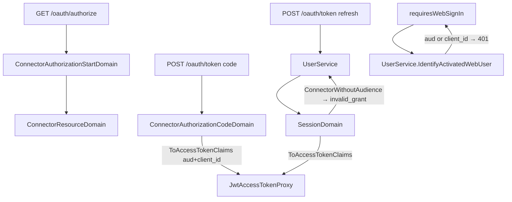

# 外掛授權必須指明對象服務 — Architecture Design

**Status:** Confirmed（autonomous run：決策依 RFC 8707 resource indicators 與 MCP authorization spec 自行拍板，記錄於第 6、8 節）
**Source PRD:** `.sdd/2026-10-01-connector-token-audience-required/PRD.md`
**Tech context:** Go · Gin · GORM · Clean / Onion Architecture（`internal/domain/models/{entities,domains,dto,vo}`）

---

## 1. Design Goal & Guiding Principle

- **In one sentence:** 讓每一張外掛換來／續用出的 access token 都帶非空 `aud`（對象服務）與 `client_id`（外掛代號），`/oauth/authorize` 拒絕缺少或不合格的 `resource`，且網頁專屬 middleware 看到任一標記即拒絕。
- **Guiding principle:** 「這張憑證是不是外掛的」由**簽發端的單一來源**決定——access token claims 一律由授權碼 / 登入階段自己的 `ToAccessTokenClaims` 產生（轉換寫在來源身上），service 不再逐欄組裝；網頁判斷只看 claims，不依賴外掛有沒有乖乖給 `resource`。

---

## 2. Change Scope

| Area | Action | What / Why |
| :--- | :--- | :--- |
| `domains/connector_resource_domain.go` | **Add** | `ConnectorResourceDomain`：對象服務格式驗證（RFC 8707 §2：absolute URI、無 fragment；另要求 https，loopback 才可 http；無 userinfo） |
| `domains/connector_authorization_errors.go` | **Modify** | 新增 `ErrConnectorResourceInvalid`（description of `invalid_target`） |
| `domains/connector_authorization_start_domain.go` | **Modify** | `RefusalRedirect`：缺 `resource` → `invalid_request`「缺少對象服務（resource）」；不合格 → `invalid_target` |
| `domains/connector_authorization_code_domain.go` | **Modify** | `Accepts` 要求授權碼綁定非空 Resource；`Audience()` 改為 `ToAccessTokenClaims(expiresAt)`（帶 `ConnectorClientIdentifier`） |
| `domains/session_domain.go` | **Modify** | 新增 `ConnectorWithoutAudience()`；`Audience()` 改為 `ToAccessTokenClaims(expiresAt)` |
| `vo/access_token_claims_vo.go` | **Modify** | 新增 `ConnectorClientIdentifier` |
| `service/connector_authorization_service.go` | **Modify** | 換授權改用 `authorizationCode.ToAccessTokenClaims(...)` |
| `service/user_service.go` | **Modify** | `renewedSessionTokens` 對 `ConnectorWithoutAudience` 回 `ErrAuthenticationRequired`（不作廢鏈）；`newSessionMaterial` 改收 claims；`IdentifyActivatedWebUser` 看 `Audience` **或** `ConnectorClientIdentifier` |
| `infrastructure/security/jwt_access_token_proxy.go` | **Modify** | JWT 增加 `client_id` claim（RFC 9068 §2.2 同名），簽發與解析 |
| `postman/` | **Modify** | `/oauth/authorize` 說明與缺 `resource` 的範例 |
| controller / routes / middleware | **Not touched** | `invalid_target` 只經由 redirect 回應，既有 `respondWithProtocolError` 對映已足；middleware 只呼叫 `IdentifyActivatedWebUser` |
| `ConnectorTokenRequest`（token endpoint 的 `resource`） | **Not touched** | 憑證的 `aud` 永遠來自使用者允許的那筆請求；token 請求帶的 `resource` 不採用，避免外掛改寫對象服務，也不因字串正規化差異弄壞真實外掛 |
| 設定 / env | **Not touched** | 不加對象服務白名單 env var（見 §6） |
| 憑證查驗回覆 | **Not touched** | 外掛伺服器不需要 `client_id` |

---

## 3. New Classes / Modules

| Name | Kind | Responsibility (purpose) | Collaborators | Satisfies (PRD scenario) |
| :--- | :--- | :--- | :--- | :--- |
| `ConnectorResourceDomain` | Domain Model | 判定一個非空的對象服務是否為合格的完整網址；建構子不合格即回 `ErrConnectorResourceInvalid` | 重用 package 內 `loopbackHostnames` | US-01 全部 |
| `ErrConnectorResourceInvalid` | 哨兵錯誤 | 「對象服務不合格」的訊息，作 `invalid_target` 的 `error_description` | — | US-01 Outline |

---

## 4. Modified Components

| Component | Current role | Change needed |
| :--- | :--- | :--- |
| `ConnectorAuthorizationStartDomain.RefusalRedirect` | 回 `invalid_request` 的 redirect | 增加錯誤碼變數：缺 resource → `invalid_request`；`NewConnectorResourceDomain` 失敗 → `invalid_target`。順序：response_type → 挑戰 → 長度 → 缺 resource → resource 格式 |
| `ConnectorAuthorizationCodeDomain` | 綁定授權碼內容 | `Accepts` 加 `Resource != ""`；新增 `ToAccessTokenClaims(expiresAt)`，移除 `Audience()` |
| `SessionDomain` | 登入階段行為 | 新增 `ConnectorWithoutAudience()`、`ToAccessTokenClaims(expiresAt)`；移除 `Audience()` |
| `UserService.renewedSessionTokens` | web / 外掛共用續用 | 在 `HeldBy` 之後、`Expired` 之前拒絕 `ConnectorWithoutAudience`（`ErrAuthenticationRequired` → `invalid_grant`），不 `RevokeChain` |
| `UserService.IdentifyActivatedWebUser` | 拒絕帶 `aud` 的 token | 也拒絕帶 `client_id` 的 token |
| `JwtAccessTokenProxy` | HS256 簽發 / 解析 | 自訂 claims struct 內嵌 `jwt.RegisteredClaims` + `client_id,omitempty` |

---

## 5. Component Relationships

---

## 6. Extensibility & Handoff Notes

- **Most likely next requirement:** 只接受營運者指定的對象服務（白名單），或在 token 請求比對 `resource`。
- **Where it lands:** `ConnectorResourceDomain` 建構子——加一個由 `ConnectorAuthorizationPolicyVo` 傳入的允許清單即可，與 `TrustedRedirectUris` 同一模式；不需要動 service 或 controller。
- **How to add it:** 在 `ConnectorAuthorizationPolicyVo` 加欄位、`NewConnectorAuthorizationStartDomain` 多收 policy 值、`ConnectorResourceDomain` 加比對。
- **Patterns applied & why:** 轉換寫在來源身上（`code.ToAccessTokenClaims` / `session.ToAccessTokenClaims`），讓「外掛憑證必帶標記」只有一處真相。
- **Do not hardcode:** 對象服務的值（`https://trading-mcp.coding-afternoon.com/mcp`）不得寫死在程式碼。
- **Known debt / deferred:** 不加白名單 env var——外掛伺服器本來就以查驗比對 `aud`，且新增設定會擴大部署面；格式驗證 + 必填已足以消除「外掛憑證被當成網頁憑證」的漏洞。修正前已發出、沒有 `aud`/`client_id` 的 access token 最長 15 分鐘（`AUTH_ACCESS_TOKEN_LIFETIME_MINUTES`）後失效；若要立即切斷可輪替 `AUTH_ACCESS_TOKEN_SIGNING_KEY`（會登出所有人，故不預設做）。

---

## 7. Traceability

| PRD Scenario | Fulfilled by |
| :--- | :--- |
| US-01 加密協定的完整網址 / 本機非加密 | `ConnectorResourceDomain` + `RefusalRedirect` 不拒 |
| US-01 沒有對象服務 | `RefusalRedirect`（`invalid_request`） |
| US-01 對象服務不合格（Outline） | `ConnectorResourceDomain` → `RefusalRedirect`（`invalid_target`） |
| US-01 外掛不可信時直接拒絕 | `ConnectorAuthorizationService.StartConnectorAuthorization` 既有順序（client / redirect 先於 `RefusalRedirect`） |
| US-02 綁定對象服務的授權碼換授權 | `ConnectorAuthorizationCodeDomain.ToAccessTokenClaims` + `JwtAccessTokenProxy` |
| US-02 沒綁定對象服務的授權碼 | `ConnectorAuthorizationCodeDomain.Accepts` |
| US-02 外掛登入續用 | `SessionDomain.ToAccessTokenClaims` |
| US-02 舊外掛登入續用 | `SessionDomain.ConnectorWithoutAudience` + `UserService.renewedSessionTokens` |
| US-03 三個情境 | `UserService.IdentifyActivatedWebUser` + `JwtAccessTokenProxy` 解析 `client_id` |

---

## 8. Risks & Open Decisions

- **Risks / trade-offs:**
  - 舊外掛登入（無 `aud`）續用失敗 → 使用者須在 /mcp 重新連線。Claude Code 一直有送 `resource`，實際影響應為零。
  - 選擇「拒絕、不作廢鏈」而非「作廢鏈」：這不是盜用，且鏈本來就換不出新憑證、會自然過期；與「過期不作廢」的既有原則一致。
  - 缺 `resource` 用 `invalid_request`（缺必要參數，RFC 6749 §4.1.2.1），格式不合格用 `invalid_target`（RFC 8707 §2）。
- **Open decisions (for implementation):** 無。
