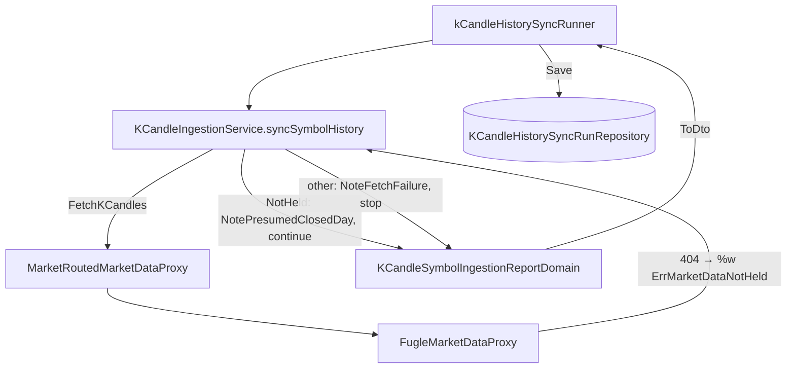

# 歷史同步跳過休市日 — Architecture Design

**Status:** Confirmed
**Source PRD:** `.sdd/2026-10-02-history-sync-skips-closed-days/PRD.md`
**Tech context:** Go · Clean / Onion · GORM code-first（Postgres）· `go tool mockgen`

---

## 1. Design Goal & Guiding Principle

- **In one sentence:** 讓歷史同步的走段迴圈分得出「來源明確說這一天沒有資料」與「來源拒絕」，前者記一天推定休市並繼續、後者照舊放棄剩下的段，並把推定休市天數一路帶到歷史同步輪次上。
- **Guiding principle:** **proxy 只負責說清楚來源說了什麼，要不要繼續由 domain 決定。** 一個 domain 哨兵錯誤 `domains.ErrMarketDataNotHeld` 是兩邊之間唯一的約定：每個來源各自把「我沒有這份資料」翻成它，其他任何異常一律保持原樣（＝拒絕）。新來源或新路徑要沿用這條規則，只要碰這一個哨兵。

---

## 2. Change Scope

| Area | Action | What / Why |
| :--- | :--- | :--- |
| `internal/domain/models/domains/k_candle_ingestion_errors.go` | **Modify** | 新增 `ErrMarketDataNotHeld`：來源明確說「這段時間沒有這個標的的資料」。放在 ingestion 的錯誤檔，因為它是 ingestion 對來源回答的分類 |
| `FugleMarketDataProxy.ask` | **Modify** | 來源回 `404` 時以 `%w` 包上 `ErrMarketDataNotHeld`（訊息照舊帶狀態碼與代號、加上日子）；其他非 200 狀態原樣 |
| `KCandleIngestionService.syncSymbolHistory` | **Modify** | `errors.Is(fetchError, domains.ErrMarketDataNotHeld)` → `NotePresumedClosedDay()`、`continue`；其他錯誤照舊 `NoteFetchFailure` 並放棄 |
| `KCandleSymbolIngestionReportDomain` / `KCandleSymbolIngestionReportDto` | **Modify** | 加 `presumedClosedDayCount`、`presumedClosedDaysInARow` 與 `NotePresumedClosedDay(notHeldReason) bool`——連續到 `maxPresumedClosedDaysInARow`（15）時自己記下拒絕原因並回 `false`；`NoteAsked()` 把連續數歸零。DTO 加 `PresumedClosedDayCount`（`json:"-"`，只在輪次上對外） |
| `KCandleHistorySyncRun`（entity）/ `KCandleHistorySyncRunDto` | **Modify** | 加 `PresumedClosedDayCount int`（`gorm:"not null;default:0"`，舊列由 AutoMigrate 補 0）；JSON `presumedClosedDayCount` |
| `kCandleHistorySyncRunner.recordProgress` / `recordEnding` | **Modify** | 兩處都把 `PresumedClosedDayCount` 從 symbol report 抄到輪次 |
| `postman/go-trading.postman_collection.json` | **Modify** | 「看那一趟走到哪」斷言新欄位存在、說明補一句 |
| `go-trading-mcp` `cmd/server/tool_catalog_market.go` | **Modify（另一 repo）** | `trading_get_k_candle_history_sync` 的說明加上 `presumedClosedDayCount` 是什麼、與 `skippedCount` 不同 |
| 每分鐘例行抓取 `ingestSymbols` / `presumeClosedMarkets` | **Not touched** | PRD Out of Scope。哨兵錯誤在那條路上仍是一般的 fetch failure（`errors.Is` 只在歷史同步用），行為不變 |
| `BinanceMarketDataProxy` | **Not touched** | 幣安不以「找不到」回答某一天；不翻譯就等於永遠是拒絕，最安全 |
| 合約歷史同步（`contract_k_candle_history_sync_runner.go`） | **Not touched** | 合約沒有休市日 |
| `MarketRoutedMarketDataProxy` | **Not touched** | 原樣轉回下游的錯誤，`%w` 鏈不斷 |

---

## 3. New Classes / Modules

無新型別。新增的只有一個哨兵錯誤與既有 model 上的一個欄位 / 一個 method——規則掛在既有的 report domain 與走段迴圈上，不值得另立物件。

| Name | Kind | Responsibility (purpose) | Collaborators | Satisfies |
| :--- | :--- | :--- | :--- | :--- |
| `domains.ErrMarketDataNotHeld` | Sentinel error | 標示「來源明確說沒有這份資料」，是 proxy 與 domain 之間唯一的分類約定 | `FugleMarketDataProxy`、`KCandleIngestionService` | US-01 全部、US-02 全部 |

---

## 4. Modified Components

| Component | Current role | Change needed |
| :--- | :--- | :--- |
| `FugleMarketDataProxy.ask` | 非 200 一律 `fmt.Errorf("market source answered %d for %s")` | `404` → `fmt.Errorf("%w: market source answered 404 for %s", domains.ErrMarketDataNotHeld, symbol)`；其他照舊 |
| `KCandleIngestionService.syncSymbolHistory` | 任一 fetch 錯誤 → 記拒絕、放棄 | 先判 `ErrMarketDataNotHeld`：`NotePresumedClosedDay` 回 `true` 就繼續下一段，回 `false`（連續太久）就照拒絕的路收尾；其餘照舊 |
| `FugleMarketDataProxy.fetchDay` | 回 `ask` 的結果 | `ErrMarketDataNotHeld` 再包上 `on {日期}`，讓拒絕原因說得出最後是哪一天 |
| `KCandleSymbolIngestionReportDomain` | 記 asked / stored / skipped / fetchFailure | 加 `NotePresumedClosedDay()`；**不設 `wasAsked`**——「沒資料」不是「答了零根」，不能餵進例行抓取的休市推定 |
| `KCandleHistorySyncRun` / DTO / runner | 記段數、存、略過、拒絕原因 | 多一個推定休市天數，進行中與收尾都寫 |

一段＝一個 UTC 日，夾到交易時段後台股恰好是一個台北交易日，所以「每段至多一次哨兵」即「每天至多算一次」。

---

## 5. Component Relationships

---

## 6. Extensibility & Handoff Notes

- **Most likely next requirement:** 每分鐘例行抓取在國定假日也把「沒資料」視為休市，不要整天每分鐘重問、寫 log。
- **Where it lands:** `KCandleIngestionService.ingestSymbol` 的 fetch 錯誤分支，判同一個 `ErrMarketDataNotHeld`，並讓 `presumeClosedMarkets` 把它算作「答了、但沒有」。哨兵與 Fugle 翻譯都不必再動。
- **How to add it:** 加一個新來源時，只要在它的 proxy 把「沒有這份資料」翻成 `%w domains.ErrMarketDataNotHeld`；不翻就是拒絕，預設安全。
- **Patterns applied & why:** 哨兵錯誤＋`%w`——現有 `ErrMarketDataSourceUnavailable`、`ErrTradingSymbolNotInMarket` 同一個做法；`errors.Is` 穿得過 routed proxy。
- **Do not hardcode:** 不要在 service 裡比對錯誤字串或狀態碼——那會讓 domain 認識 HTTP。
- **連續推定休市上限是常數不是設定**：它由市場最長的休市決定，不是營運選擇；接進休市更長的市場時，改成依市場給（`MarketRulesVo`）再說。
- **Known debt / deferred:** `FugleMarketDataProxy.FetchKCandles` 一次多天時，一天 `NotHeld` 會讓整個 window 回錯（例行回補的跨日 window）。歷史同步一段只有一天所以不受影響；等例行抓取那一刀再一起決定要不要讓 proxy 在多天 window 裡略過單日。

---

## 7. Traceability

| PRD Scenario | Fulfilled by |
| :--- | :--- |
| 中間有一天沒資料，跳過它繼續補完 | `syncSymbolHistory` NotHeld 分支 + `NotePresumedClosedDay` + runner 抄欄位 |
| 長區間裡很多天沒資料 | 同上（每段各自判） |
| 第一天就沒資料 | 同上（分支在迴圈內、與段的位置無關） |
| 最後一天沒資料 | 同上；`FugleMarketDataProxy.ask` 對今天（intraday 位址）的 404 也翻成 NotHeld |
| 整段每一天都沒資料 | 同上；`FetchFailureReason` 保持空 |
| 沒有任何一天沒資料時與今天相同 | 計數從 0 起；無其他路徑變動 |
| 來源拒絕時停下（請求太多／故障／連不上） | `FugleMarketDataProxy.ask` 非 404 原樣；`syncSymbolHistory` 既有拒絕分支 |
| 先遇到沒資料、後遇到拒絕 | NotHeld 分支 + 既有拒絕分支；計數在拒絕前已累積 |
| 兩件事各記各的 | report domain 的 `presumedClosedDayCount` 與 `skippedCount` 分開 |
| 上一趟推定休市的那一天，下一趟會再問 | 不寫任何長期記錄；「已齊全就不問」以已存根數判斷，那天為 0 根 |
| 已齊全的一天不問、也不算推定休市 | 既有 `CountInRange` 跳段在 fetch 之前 |
| 推定休市之後存不進去 | 既有 save 失敗分支；runner `recordEnding` 帶上已累積的推定休市天數 |
| 舊輪次讀作 0 | entity `default:0`，AutoMigrate 補欄位 |
| 連續 15 個交易日都沒資料就停下 | `KCandleSymbolIngestionReportDomain.NotePresumedClosedDay` 回 `false` + `syncSymbolHistory` 收尾 |
| 中間有一天有資料就重新算 | `NoteAsked()` 歸零連續數 |
