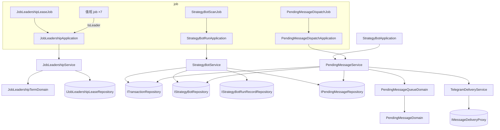

# 多分身運作下的背景工作分工與訊息只送一次 — Architecture Design

**Status:** Confirmed
**Source PRD:** `.sdd/2026-10-02-multi-replica-background-work/PRD.md`
**Tech context:** Go · Gin · GORM（Postgres）· Clean / Onion（`domain/models/{entities,domains,dto,vo}`、`domain/service`、`domain/interface`）· mockgen

---

## 1. Design Goal & Guiding Principle

- **In one sentence:** 讓 N 個 server replica 共用一個 Postgres 就能正確分工——值班工作只在持有租約的 replica 跑、每台 bot 的一輪以留存的認領保證只有一個 replica 跑、所有 bot 訊息先與該輪結果在同一個 DB transaction 寫進 outbox（`PendingMessage`），再由每個 replica 的郵差 job 以條件更新搶單寄出。
- **Guiding principle:** **「誰來做」全部藏在 application / domain service 背後，job 只管「多久做一次」。**
  - 值班：`JobLeadershipApplication` 只露出 `RenewLeadership` / `IsLeader` / `ReleaseLeadership`；值班 job 每輪只多一行 `IsLeader()`。
  - 認領與寄送：`StrategyBotRunApplication.RunDueRounds`、`PendingMessageDispatchApplication.DispatchPendingMessages` 自己保證不重複，job 完全不知道有多台 replica。
  - 跨 repository 的原子寫入走一個新的 `ITransactionRepository` 縫隙（transaction 放在 context 裡），repository 仍維持「一 entity 一 repository」。

---

## 2. Change Scope

| Area | Action | What / Why |
| :--- | :--- | :--- |
| `domain/models/entities` | **Add** `JobLeadershipLease`、`PendingMessage`；**Modify** `StrategyBot` | 租約一列一份；待送訊息；bot 加 `RoundClaimedBy` / `RoundClaimedUntil` 與 `PendingMessages` cascade 關聯 |
| `domain/models/domains` | **Add** `JobLeadershipTermDomain`、`PendingMessageDomain`、`PendingMessageQueueDomain`；**Modify** `StrategyBotMessageDomain`、`StrategyBotRunStateDomain` | 值班保守期限計算；一則訊息的期限 / 退避 / 嘗試結果判定；同一收件人依序取 head；輪次訊息印 Run N；`ForgetSentSignal` |
| `domain/models/vo` | **Add** `DeliveryResultVo`、`PendingMessageStatusVo`、`PendingMessageKindVo` | 寄送結果帶 Telegram 指定的等待；待送訊息狀態與種類 |
| `domain/models/dto` | **Add** `PendingMessageDto`、`PendingMessageWriteDto`、`JobLeadershipChangeDto`；**Modify** `StrategyBotRoundOutcomeDto`、`StrategyBotRoundDto` | outcome 改帶整個 `Round`（記下時才印 Run N）；round 加 `RunNumber` |
| `domain/interface` | **Add** `ITransactionRepository`、`IJobLeadershipLeaseRepository`、`IPendingMessageRepository`；**Modify** `IStrategyBotRepository`、`IStrategyBotRunRecordRepository`、`IMessageDeliveryProxy` | 原子縫隙；租約；outbox；認領 / 鎖讀 / 釋放；`Append` 回傳輪次編號；`Deliver` 回傳 `DeliveryResultVo` |
| `domain/service` | **Add** `JobLeadershipService`、`PendingMessageService`；**Modify** `StrategyBotService`、`TelegramDeliveryService`、`KCandleFollowService` | 值班狀態；寄送編排；`RecordRound` 改為單一 transaction 並寫 outbox、`ClaimDueStrategyBots` / `ClaimStrategyBot`；`DeliverPendingMessage`（取代 `SendMessage`；`ReadDeliveryFailure`、`WriteRoundMessage` 移除）；`ReleaseFixedFollows` |
| `application` | **Add** `JobLeadershipApplication`、`PendingMessageDispatchApplication`；**Modify** `StrategyBotRunApplication`、`StrategyBotApplication`、`KCandleFollowApplication`；**Remove** `StrategyBotRoundGuard` | 一輪不再直接送、改認領；生命週期通知改 enqueue |
| `job` | **Add** `JobLeadershipLeaseJob`、`PendingMessageDispatchJob`；**Modify** 7 個值班 job | 值班 job 每輪開頭一行 `IsLeader()` |
| `infrastructure/persistence` | **Add** `TransactionRepository`、`JobLeadershipLeaseRepository`、`PendingMessageRepository`、`ambientTransactionDatabase`；**Modify** `StrategyBotRepository`、`StrategyBotRunRecordRepository`、`SchemaMigrator` | 見 §4 |
| `infrastructure/messaging` | **Modify** `TelegramMessageDeliveryProxy` | 429 讀 `parameters.retry_after` |
| `config` / `cmd/server` | **Modify** | `ReplicaConfig`、`JobLeadershipConfig`、`PendingMessageConfig`；組裝新 job；啟動前先爭取一次值班；關機最後交還值班 |
| 加密貨幣即時跟盤（`WatchKCandles`、合約跟盤） | **Not touched** | 跟著觀看者的請求走，本來就在接到請求的 replica 上 |
| `RequestPacer`（對外速率） | **Not touched** | PRD 明列 Out of Scope；背景工作只在值班 replica 跑，影響有限 |
| 測試訊息（`SendTestMessage`） | **Not touched**（僅跟著 `Deliver` 簽名改讀 `.FailureReason`） | PRD：當場送、當場回報 |
| `StartStrategyBot` / `StopStrategyBot` 的讀改寫 | **Not touched** | 既有、與本切片無關的競態；不擴大範圍 |

---

## 3. New Classes / Modules

| Name | Kind | Responsibility (purpose) | Collaborators | Satisfies (PRD scenario) |
| :--- | :--- | :--- | :--- | :--- |
| `ITransactionRepository` / `TransactionRepository` | Interface / Repository | `Atomically(ctx, work func(ctx) error) error`：在一個 DB transaction 內執行 work，transaction 經由 context 傳給參與的 repository；巢狀時沿用外層 | `ambientTransactionDatabase` | US-03 全部 |
| `ambientTransactionDatabase` | infra 內部 struct | `within(ctx) *gorm.DB`：context 裡有 transaction 就用它，否則 `root.WithContext(ctx)`。參與原子寫入的 repository 以它取代 `*gorm.DB` 欄位 | — | US-03 |
| `JobLeadershipLease` | Entity | 一列一份租約：`Name`（PK）、`HolderName`、`ExpiresAt`、`UpdatedAt` | — | US-01 |
| `IJobLeadershipLeaseRepository` / `JobLeadershipLeaseRepository` | Interface / Repository | `Acquire(ctx, name, holder, now, expiresAt) (bool, error)`：`INSERT … ON CONFLICT (name) DO UPDATE … WHERE holder_name = holder OR expires_at < now`（GORM `clause.OnConflict{Where}`），RowsAffected=1 即持有；`Release(ctx, name, holder)`：只有持有者能把 `expires_at` 設回過去 | — | US-01 |
| `JobLeadershipTermDomain` | Domain Model | 值班期限規則：`ExpiresAt(acquiredAt)` = acquiredAt + lease；`HeldUntil(acquiredAt)` = acquiredAt + lease − safetyMargin；建構子 clamp（margin < lease、renew < lease − margin） | — | 「接近租期尾聲時…」「保守提早量之內…」 |
| `JobLeadershipService` | Domain Service（有狀態） | 持有本 replica 的 `heldUntil`（mutex 保護）；`Renew(ctx) (JobLeadershipChangeDto, error)`：以呼叫前讀的時刻當 acquiredAt 去 `Acquire`，成功更新 `heldUntil`、失敗或 DB 錯誤清空；回報 gained/lost 供 job 記 log；`IsLeader()` 只讀記憶體與時鐘；`Release(ctx)` 清空並交還 | `IJobLeadershipLeaseRepository`、`IClockProxy` | US-01 全部 |
| `JobLeadershipApplication` | Application | 對 job 的唯一入口：`RenewLeadership`、`IsLeader`、`ReleaseLeadership` | `JobLeadershipService` | US-01 |
| `JobLeadershipLeaseJob` | Job | 每 `RenewInterval` 呼叫 `RenewLeadership`，記成為 / 失去值班的 log。**Stop 不交還**（交還由 `serve` 在背景工作全部放手之後做，見 §5） | `JobLeadershipApplication` | US-01 |
| `PendingMessage` | Entity | 待送訊息：`ID`、`StrategyBotID`（FK、OnDelete CASCADE）、`RecipientUserID`、`Kind`、`RoundDueAt *time.Time`（`uniqueIndex(strategy_bot_id, round_due_at)`；生命週期訊息為 NULL、Postgres 視 NULL 互異）、`Signal`、`Text`、`Status`、`AttemptCount`、`NextAttemptAt`、`ClaimedBy`、`ClaimedUntil *time.Time`、`ExpiresAt`、`SettledAt *time.Time`、`AbandonReason`、`CreatedAt`；index `(status, recipient_user_id, id)` 與 `(settled_at)` | — | US-03、US-04、US-05 |
| `IPendingMessageRepository` / `PendingMessageRepository` | Interface / Repository | `Enqueue`（參與 transaction；唯一鍵衝突視為已存在、不報錯）；`FindUnsettled(ctx, limit)`（依 id 升冪）；`Claim(ctx, id, claimant, now, claimedUntil) (bool, error)`（條件更新：status 可寄且 next_attempt_at ≤ now，或寄送中且 claimed_until < now）；`MarkSent` / `Reschedule` / `Abandon`（皆帶 `claimed_by = claimant` 守門）；`DeleteSettledBefore(ctx, cutoff)` | `ambientTransactionDatabase` | US-03、US-04、US-05 |
| `PendingMessageDomain` | Domain Model | 一則訊息的規則：`IsExpiredAt(now)`；`IsDispatchableAt(now)`；`AfterAttempt(result, now)` → `sent` / `retry(nextAttemptAt)`（2s 起加倍、封頂 5m，`RetryAfter` 較長時取它）/ `refused(haltReason)`；`ForgetsSignalWhenAbandoned()`（只有輪次訊息）。建構子把非法 status / kind 正規化為安全值 | `PendingMessageStatusVo`、`DeliveryResultVo` | US-04、US-05 |
| `PendingMessageQueueDomain` | Domain Model | 由依 id 排序的未結訊息取出**每位收件人的第一則**，再濾出此刻可寄者——後一則永遠等前一則結清 | `PendingMessageDomain` | 「同一位擁有者的訊息依產生順序送達」「機器人被停止後已產生的訊息仍會寄出」 |
| `PendingMessageService` | Domain Service | `EnqueueLifecycleMessage(ctx, writeDto)`；`DispatchPendingMessages(ctx) (int, error)`：修剪 7 天前已結 → `FindUnsettled` → queue 取 head → 併發（上限 `MaxConcurrentDeliveries`）逐則 `Claim` → 過期就忘記信號再作廢 → 否則 `TelegramDeliveryService.DeliverPendingMessage` → `AfterAttempt` → 拒收時在 transaction 內鎖讀 bot、執行中才 `Halt` → 結清 | `IPendingMessageRepository`、`IStrategyBotRepository`、`ITransactionRepository`、`TelegramDeliveryService`、`IClockProxy` | US-04、US-05 |
| `PendingMessageDispatchApplication` | Application | `DispatchPendingMessages(ctx)` | `PendingMessageService` | US-04、US-05 |
| `PendingMessageDispatchJob` | Job | 每 `DispatchInterval`（2s）呼叫一次；Stop 讓手上那一批寄完 | `PendingMessageDispatchApplication` | US-04、US-05 |
| `DeliveryResultVo` | VO | `FailureReason DeliveryFailureReasonVo` + `RetryAfter time.Duration`（只有 Telegram 429 會給） | — | 「Telegram 要求放慢時照它說的等」 |
| `ReplicaConfig` / `JobLeadershipConfig` / `PendingMessageConfig` | Config | `REPLICA_NAME`（預設 `os.Hostname()`；k8s 的 HOSTNAME 即 pod 名；取不到時隨機產生）；租期 30s / 續期 10s / 提早 5s；寄送檢查 2s / 寄送逾時 2m / 同時寄送上限 8 | — | US-01、US-05 |

---

## 4. Modified Components

| Component | Current role | Change needed |
| :--- | :--- | :--- |
| `StrategyBot`（entity） | bot 欄位 | 加 `RoundClaimedBy string`、`RoundClaimedUntil *time.Time`；加 `PendingMessages []PendingMessage` 只為了刪 bot 時 cascade（機器人被刪除 → 未寄訊息消失） |
| `IStrategyBotRepository` / `StrategyBotRepository` | 存 bot | `FindDue` → `ClaimDue(ctx, now, limit, claimant, claimedUntil)`：transaction 內 `clause.Locking{Strength: UPDATE, Options: SKIP LOCKED}` 選出到期且未被認領（或認領已過期）的 id，再一次 update 認領欄位，最後 preload 讀回；新增 `ClaimOne(ctx, id, claimant, now, claimedUntil) (bool, error)`（條件更新）、`FindOneLocked(ctx, id)`（`FOR UPDATE`，只在 transaction 內有意義）、`ReleaseRoundClaim(ctx, id, claimant)`、`ForgetSentSignal(ctx, id, signal)`（`last_sent_signal = signal` 才清空）；欄位改用 `ambientTransactionDatabase` |
| `IStrategyBotRunRecordRepository` / `StrategyBotRunRecordRepository` | 寫輪次紀錄 | `Append` 回傳 `(int, error)`（新的輪次編號）；改用 `ambientTransactionDatabase`，在外層 transaction 內以 savepoint 巢狀 |
| `StrategyBotService` | bot 用例 | `FindDueStrategyBots` → `ClaimDueStrategyBots(ctx, limit, claimant, claimedUntil)`；新增 `ClaimStrategyBot(ctx, viewerID, id, claimant, claimedUntil) error`（被認領中回 `StrategyBotAlreadyRunningARound`）；`RecordRound(ctx, id, dueAt, claimant, outcome)` 改為 `Atomically`：`FindOneLocked` → CAS `NextRunAt` → `UpdateRunState` → `Append` 取得 RunNumber → 有送出信號就把 `Round.RunNumber` 填上、以 `StrategyBotMessageDomain` 印出並 `Enqueue` 輪次訊息（期限＝max(觸發間隔, 5m)）→ 本輪造成停擺就 `Enqueue` 停擺通知 → `ReleaseRoundClaim`。CAS 不成立時仍釋放認領。注入 `IPendingMessageRepository`、`ITransactionRepository` |
| `StrategyBotRunStateDomain` | run-state 轉換 | 不變；`RoundFinished` 的「只在送達才更新」註解改為「決定送出時」 |
| `StrategyBotRoundOutcomeDto` | outcome | 加 `Round StrategyBotRoundDto`、`HasMessage bool`（取代先前的 `PositionPlan` / `ReferencePrice` / `JournalLinkIdentifier` 散欄位改由 `Round` 讀） |
| `StrategyBotMessageDomain` | 輪次訊息文字 | `RunNumber > 0` 時最後一行 `🔖 Run N` |
| `StrategyBotRunApplication` | 跑一輪並送出 | 移除 `roundGuard`、`telegramDeliveryService`、`stillWaitingForThisRound`、`sendRoundMessage` 的寄送；`RunDueRounds` 改用 `ClaimDueStrategyBots`；`RunRoundNow` 改用 `ClaimStrategyBot`；`playRound` 在決定要送時只組 `Round`（參考價、部位、日誌連結）放進 outcome。認領期限＝`roundTimeout + strategyBotRecordTimeout`。注入 `replicaName` |
| `StrategyBotApplication` | 啟動 / 停止並通知 | `announce` 改呼叫 `PendingMessageService.EnqueueLifecycleMessage`（期限 1h），失敗記 log 不擋操作（與現在「通知失敗不影響已發生的動作」一致） |
| `TelegramDeliveryService` | 投遞設定、送訊息 | `SendMessage` → `DeliverPendingMessage(ctx, userID, text) (DeliveryResultVo, error)`；`SendTestMessage` 讀 `.FailureReason` |
| `IMessageDeliveryProxy` / `TelegramMessageDeliveryProxy` | 送 Telegram | `Deliver` 回傳 `DeliveryResultVo`；429 → `Unreachable` + `RetryAfter`（測試訊息仍只看到四種原因） |
| `KCandleFollowService` / `KCandleFollowApplication` | 台股固定跟盤 | 新增 `ReleaseFixedFollows()`：以空 roster 走同一條結束路徑；與 `RefreshFixedFollows` 共用私有 `retireUnwantedChannels`（兩個 public 共用才抽） |
| 值班 job：`KCandleIngestionJob`、`ContractKCandleIngestionJob`、`LiveFollowRosterJob`、`ContractFundingRateIngestionJob`、`ContractPositionStatisticIngestionJob`、`ContractTradingSpecificationRefreshJob`、`ContractMaintenanceMarginTierRefreshJob` | 定時抓取 | 每輪開頭 `if !jobLeadershipApplication.IsLeader() { return }`。兩個 K 線 job：**不在值班時記下「下次值班要先回補」**，重新值班的第一輪跑 `RunBackfill`（只補缺口）而非 `RunScheduledRound`——交接期間的缺口靠它補齊。`LiveFollowRosterJob` 不在值班時改呼叫 `ReleaseFixedFollows` |
| `repeatingRound` | 共用輪詢迴圈 | 不變；四個 contract job 把 `IsLeader` 檢查放進傳給它的 round 函式 |
| `StrategyBotScanJob` | 定時掃描 | 不變（認領在 application 內） |
| `cmd/server/dependencies.go` | 組裝 | 組新 repository / service / application / job；`backgroundJobsFor` 把 `JobLeadershipLeaseJob` 放第一個、`PendingMessageDispatchJob` 與 bot 掃描並列；回傳 `jobLeadershipApplication` 給 `serve` |
| `cmd/server/serve.go` | 啟停 | `StartAll` 前先同步 `RenewLeadership` 一次（第一輪值班工作才知道自己是不是值班）；關機順序：`StopAll` → `stopLiveFollows` → drain → **取消 job context** → `ReleaseLeadership`（5s timeout） |
| `SchemaMigrator` | AutoMigrate 清單 | 加 `JobLeadershipLease`、`PendingMessage` |
| `config.ApplicationConfig` | 設定 | 加三組設定與環境變數 |

---

## 5. Component Relationships

**一輪的時序**（每個 replica 都一樣）：`ClaimDue`（SKIP LOCKED + 寫認領）→ 算訊號 → `Atomically{ 鎖讀 bot → CAS → 更新 run state → Append(取 RunNumber) → Enqueue 訊息 → 釋放認領 }`。

**寄送的時序**：`FindUnsettled` → 每收件人取 head → `Claim`（條件更新）→ `Deliver` → `MarkSent` / `Reschedule` / `Abandon(+Halt)`。寄到但 `MarkSent` 前倒下 → `claimed_until` 過後別台重寄（至少一次）。

---

## 6. Extensibility & Handoff Notes

- **Most likely next requirement:** (a) 新增一個值班 job（例如新的行情來源）；(b) 新增一種訊息通道（Email / LINE）或一種新的 bot 訊息；(c) 自動下單上線後「下單指令」也要只做一次。
- **Where it lands:**
  - (a) 新 job 每輪開頭一行 `IsLeader()`，其餘不用知道值班。
  - (b) `PendingMessage` 已與通道無關（只存收件人與文字）；換通道是 `IMessageDeliveryProxy` 的另一個實作，`PendingMessageService` 不動。新的 bot 訊息種類 = `PendingMessageKindVo` 加一個值 + 它的送達期限。
  - (c) 下單指令走同一個 outbox 形狀（同 transaction 寫入、唯一鍵一輪一筆、郵差搶單），`ITransactionRepository` 是現成的原子縫隙。
- **How to add it:** 需要跨 repository 原子寫入的 repository，把 `*gorm.DB` 欄位換成 `ambientTransactionDatabase` 並用 `within(ctx)`；呼叫端包在 `ITransactionRepository.Atomically` 裡。
- **Patterns applied & why:** Transactional Outbox（訊息與狀態原子、寄送與判斷解耦）；Lease-based leader election（不依賴 k8s API / RBAC，只依賴既有 Postgres）；`SELECT … FOR UPDATE SKIP LOCKED` 認領（多 replica 自然分攤 bot）；條件更新當樂觀鎖（郵差搶單、手動跑一輪認領）。
- **Do not hardcode:** 租期 / 續期 / 提早量、寄送檢查間隔 / 寄送逾時 / 同時寄送上限、replica 名字——全部在 config。送達期限下限 5m、生命週期 1h、重試 2s→5m、保留 7 天屬業務規則，放 `PendingMessageDomain` 常數（同 `strategyBotRunningLimit` 的慣例）。
- **Known debt / deferred:**
  - 郵差每次讀至多 500 則未結訊息再於記憶體取 head：一位收件人堆積上百則時，排在後面的別人會晚一輪。訊號：`FindUnsettled` 經常回滿 500。屆時改成 per-recipient `DISTINCT ON` 查詢。
  - 值班交接後，間隔長的值班 job（例如每小時的資金費率）要等它下一個 tick 才在新值班 replica 上跑。資金費率每 8 小時結算一次，延遲一小時可接受。
  - 時間一律以 replica 時鐘（`IClockProxy`）為準，不讀 DB 的 `now()`（避免手寫 SQL 片段）；k8s 節點有 NTP，秒級以下的偏差由 5 秒保守提早量吸收。

---

## 7. Traceability

| PRD Scenario | Fulfilled by |
| :--- | :--- |
| 沒有人值班時恰好一台成為值班分身 | `JobLeadershipLeaseRepository.Acquire`（`ON CONFLICT … WHERE`）+ `JobLeadershipService.Renew` |
| 值班分身持續續期時別台無法接手 | `Acquire` 的 `WHERE holder_name = holder OR expires_at < now` |
| 接近租期尾聲時值班分身保守地認定自己已不在值班 | `JobLeadershipTermDomain.HeldUntil` + `JobLeadershipService.IsLeader` |
| 保守提早量之內仍在值班 | 同上 |
| 值班分身倒下後租期到期由別台接手 | `Acquire`（`expires_at < now`） |
| 值班分身正常關機時立刻交還 | `JobLeadershipLeaseRepository.Release` + `serve` 關機順序 |
| 失去值班身分時放下台股固定跟盤 | `LiveFollowRosterJob` + `KCandleFollowService.ReleaseFixedFollows` |
| 只有一台分身時行為與現在相同 | `serve` 啟動前 `RenewLeadership` + 值班 job 首輪照常（K 線首輪即 `RunBackfill`） |
| 多台分身同時找到期機器人時各自認領不同的 | `StrategyBotRepository.ClaimDue`（`FOR UPDATE SKIP LOCKED` + 認領欄位） |
| 已被認領且未逾期的機器人會被跳過 | `ClaimDue` 過濾 `round_claimed_until` |
| 認領的分身倒下後認領到期由別台接手 | `ClaimDue` 過濾 `round_claimed_until < now` |
| 正在跑的機器人被手動要求再跑一輪時拒絕 | `StrategyBotService.ClaimStrategyBot` → `StrategyBotAlreadyRunningARound` |
| 沒人在跑時手動跑一輪由接到請求的分身完成 | `StrategyBotRunApplication.RunRoundNow` |
| 結論改變時一輪的紀錄、訊息與上次訊號一起成立 | `StrategyBotService.RecordRound`（`Atomically`） |
| 結論沒變時只記下這一輪、不產生訊息 | `RecordRound`（`HasMessage = false`） |
| 記下途中出錯時什麼都沒改變 | `TransactionRepository.Atomically` rollback |
| 同一輪被記第二次不會多出第二則訊息 | `RecordRound` 的 `NextRunAt` CAS + `PendingMessage` 唯一鍵 |
| 衝突或沒有結論時不產生訊息 | `StrategyBotRunApplication.playRound` → concluded 無 `Round` |
| 一輪造成機器人停擺時停擺通知與這一輪一起成立 | `RecordRound`（applied 且有停擺原因 → Enqueue 停擺通知） |
| 啟動與停止的通知也成為待送訊息 | `StrategyBotApplication.announce` → `PendingMessageService.EnqueueLifecycleMessage` |
| 待送訊息被寄出並印著輪次編號 | `StrategyBotMessageDomain`（Run N）+ `PendingMessageService` → `MarkSent` |
| Telegram 暫時連不上時稍後再寄且越等越久 | `PendingMessageDomain.AfterAttempt`（retry 退避） |
| Telegram 要求放慢時照它說的等 | `TelegramMessageDeliveryProxy`（429 → `RetryAfter`）+ `AfterAttempt` |
| 金鑰不被接受時作廢並停下機器人 | `AfterAttempt` → refused + `PendingMessageService`（鎖讀 + `Halt`） |
| 找不到聊天室時作廢並停下機器人 | 同上 |
| 投遞設定已被移除時作廢並停下機器人 | `TelegramDeliveryService.DeliverPendingMessage` 回 not-configured → `AfterAttempt` refused（`noDeliverySetting`） |
| 輪次訊息超過送達期限仍送不出去時作廢並忘記上次訊號 | `PendingMessageDomain.IsExpiredAt` + `StrategyBotRepository.ForgetSentSignal` + `Abandon` |
| 送達期限至少 5 分鐘 | `StrategyBotService.RecordRound` 算 `ExpiresAt` = max(觸發間隔, 5m) |
| 機器人被刪掉後還沒寄出的訊息作廢 | `PendingMessage.StrategyBotID` FK `OnDelete:CASCADE` |
| 機器人被停止後已產生的訊息仍會寄出 | `PendingMessageQueueDomain`（依 id）；寄送不看 bot 執行狀態 |
| 同一位擁有者的訊息依產生順序送達 | `PendingMessageQueueDomain`（每收件人只取 head） |
| 正常寄出只寄一次 | `Claim` + `MarkSent` |
| 寄送中逾時後由別台重寄 | `Claim` 條件（寄送中且 `claimed_until < now`） |
| 寄送逾時前別台不碰 | 同上 |
| 已寄到卻來不及回報時刻意接受重複 | 同上（至少一次）+ Run N |
| 測試訊息當場送出並當場回報 | `TelegramDeliveryService.SendTestMessage`（不經 outbox） |

---

## 8. Risks & Open Decisions

- **Risks / trade-offs:**
  - 寄送改成非同步：永久失敗造成的停擺晚 ≤ 數秒才發生；一輪不再因 Telegram 暫時失敗而「下一輪重新判斷」，改由郵差重試到送達期限。PRD §7 已列。
  - `ambientTransactionDatabase` 只在被換上的 repository 生效；把別的 repository 拉進 `Atomically` 卻忘了換，寫入會在 transaction 外。以註解與 persistence 測試（rollback 後確認沒寫入）守住。
  - 關機時 `ReleaseLeadership` 在取消 job context 之後才做，因此舊值班的抓取不會與新值班重疊；代價是被取消的那一輪資料由新值班的回補補齊。
- **實作時發現、刻意留給下一個切片的限制：**
  - **台股即時跟盤轉播**（code review 後補上）：只有值班 replica 向 Fugle 跟 roster；它在 `KCandleFollowService.report` 把 rostered 的每一根即時 K 線寫進 `LiveKCandleSnapshots`。非值班 replica 的 roster job 改呼叫 `RefreshRelayedFollows`，以 `kCandleSnapshotRelay`（實作 `ILiveMarketDataProxy`，每 `LIVE_FOLLOW_RELAY_INTERVAL_SECONDS` 讀一次快照、只在 `ObservedAt` 變新時才送）當線路來源；值班身分改變時兩種線路互換。值班 replica 倒下時快照停止更新，既有的 quiet timeout 讓觀看者收到暫停。選快照表而非 `LISTEN/NOTIFY`，因為後者需要手寫 SQL 與專用連線。
  - **啟動善後改為只掃已不在的 replica**（code review 後補上）：助手回覆與歷史同步的進行中列記錄 `ReplicaName`；`ReplicaHeartbeatJob` 每 10 秒寫 `ReplicaHeartbeats`；`InterruptedWorkApplication` 只把連續三次沒心跳的 replica 留下的列標成中斷——啟動時（自己舊名字下的也算）與值班 replica 每分鐘一次（`InterruptedWorkSweepJob`）。
  - 一輪改成「先組好訊息再記下」：被刪除或重啟中的 bot 仍會多讀一次參考價（以前在組訊息前就放棄），之後在記下時才被擋掉、不寫任何東西。
- **刻意的例外（code review 後記錄）：**
  - `ReplicaHeartbeatJob` 不受 `BACKGROUND_JOBS_ENABLED` 管：總開關關的是「工作」，心跳說的是「這台還在」；關掉背景工作的 replica 仍在接會開始助手回覆與歷史同步的請求，沒有心跳的話別台會把它的工作當成中斷。
  - `ITransactionRepository` 不對應任何 entity：它是跨 repository 的交易邊界（unit of work），放在 Repository 角色是因為它只碰自家資料庫；naming.md「Repository 以聚合命名」對它不適用，其餘 repository 仍一 entity 一個。
  - `PendingMessageService` 呼叫 `TelegramDeliveryService.DeliverPendingMessage`：開鎖金鑰只能有一個呼叫點（`deliver`），把寄送拆到 application 會讓呼叫端每則訊息自己串三個呼叫。codebase 既有先例：`ContractKCandleIngestionService` 持有 `ContractPositionStatisticService`。
- **Open decisions (for implementation):** 無。
