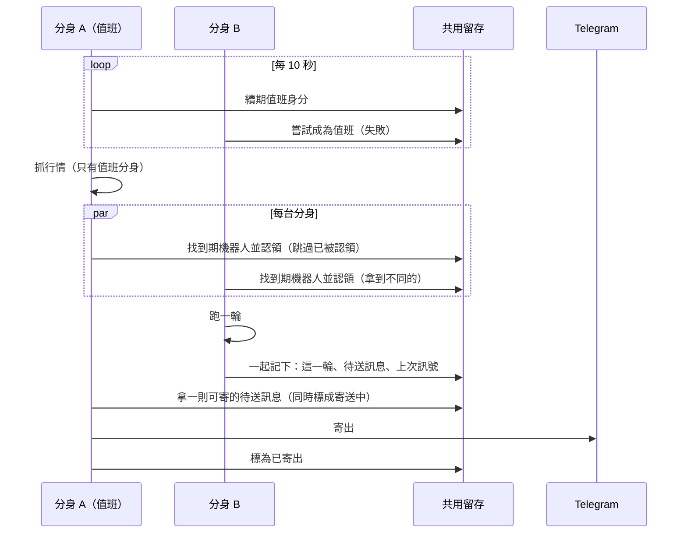

# Product Requirements Document (PRD) — 多分身運作下的背景工作分工與訊息只送一次

**Status:** Finalized
**Version:** v1.0
**Owner:** James Hsueh
**Stakeholders:** Engineering, Operations

---

## 1. Background & Goal (Why & Goal)

- **Problem Statement:**
  這套服務現在只能開一台。一旦同時開多台分身：
  1. 每一台都會各抓一份行情、各開一份台股固定跟盤，做白工也多打外部來源。
  2. 「同一台機器人同時只跑一輪」只記在單一台的記憶裡，兩台分身會同時跑同一台機器人，**使用者收到兩則一樣的訊號**。
  3. 現在是先送訊息、送完才記下這一輪；兩台都送了之後才發現撞在一起，已經來不及。
  4. 使用者按「立即跑一輪」的請求落在 B 分身，而 A 分身正好在排程跑同一台，一樣會撞。

  服務日後要提供給他人使用，用的人變多時必須能靠多開分身撐住；任何一台分身倒下或被換掉，都不能讓訊號漏掉或卡住。

- **Expected Outcome:**
  - 開 N 台分身時，全系統一份的背景工作**同一時間只有一台在做**，交接在 **30 秒內**完成（正常關機時立即完成）。
  - 策略機器人的每一輪**只被一台分身跑**；同一輪**至多一則訊息**被產生。
  - 每一則訊息**至少送達一次**；只有在「已寄到但來不及回報就倒下」這一種情況下會重複，且重複的訊息印著相同的輪次編號、可被辨認。
  - 只開一台分身時，使用者看到的行為與現在相同（唯一可見差異：輪次訊息多印輪次編號；訊息從產生到送達多出至多數秒）。

- **Out of Scope:**
  - 杜絕「已寄到但來不及回報」造成的重複。
  - 依分身數量自動分攤對外取資料的速率上限。
  - 自動下單（仍不生效）。
  - 部署設定檔本身（分身數量、關機寬限時間）；本切片只說明部署端需要提供什麼。
  - 讓使用者查看待送訊息清單或寄送狀態。

---

## 2. User Personas

- **Primary Role(s):**
  - **機器人擁有者**：收 Telegram 訊號的人。他不知道、也不該需要知道背後有幾台分身。
  - **營運者**：決定開幾台分身、何時汰換分身的人。
- **Usage Context:**
  - 機器人擁有者在手機上看 Telegram 通知，隨時可能在網頁上啟動、停止、刪除機器人或按「立即跑一輪」。
  - 營運者在部署環境上調整分身數量、滾動更新版本；更新時舊分身被關掉、新分身被開起來。

---

## 3. User Stories & Acceptance Criteria

### US-01 — 全系統一份的背景工作同一時間只有一台在做 [priority: P0]
**As a** 營運者, **I want** 抓行情這類工作只由一台值班分身負責、且值班分身倒下時別台自動接手, **so that** 多開分身不會做重複的工、也不會在換版時中斷行情。

```gherkin
Scenario: 沒有人值班時恰好一台成為值班分身
  Given 三台分身 A、B、C 都在運作
  And 目前沒有值班分身
  When 三台同時嘗試成為值班分身
  Then 恰好一台成為值班分身
  And 只有那一台在抓行情

Scenario: 值班分身持續續期時別台無法接手
  Given A 是值班分身並持續續期
  When B 與 C 嘗試成為值班分身
  Then B 與 C 都不是值班分身
  And A 仍是值班分身

Scenario: 接近租期尾聲時值班分身保守地認定自己已不在值班
  Given A 是值班分身
  And 值班租期 30 秒、保守提早 5 秒
  And A 最後一次成功續期在 26 秒前
  When A 判斷自己是否還在值班
  Then A 認定自己已不在值班
  And A 這一次不抓行情

Scenario: 保守提早量之內仍在值班
  Given A 是值班分身
  And 值班租期 30 秒、保守提早 5 秒
  And A 最後一次成功續期在 24 秒前
  When A 判斷自己是否還在值班
  Then A 仍在值班

Scenario: 值班分身倒下後租期到期由別台接手
  Given A 是值班分身
  And A 已停止續期超過 30 秒
  When B 嘗試成為值班分身
  Then B 成為值班分身
  And B 開始抓行情

Scenario: 值班分身正常關機時立刻交還
  Given A 是值班分身
  When A 正常關機並交還值班身分
  And B 下一次嘗試成為值班分身
  Then B 立刻成為值班分身，不必等租期到期

Scenario: 失去值班身分時放下台股固定跟盤
  Given A 曾是值班分身並正在固定跟盤觀察清單上的台股
  When A 下一次檢查時發現自己已不在值班
  Then A 不再跟盤任何台股
  And 新的值班分身在它下一次檢查時開始跟盤觀察清單上的台股

Scenario: 只有一台分身時行為與現在相同
  Given 只有一台分身在運作
  When 它開機
  Then 它成為值班分身
  And 它抓行情、補資料、固定跟盤的節奏與現在相同
```

### US-02 — 策略機器人的每一輪只由一台分身跑 [priority: P0]
**As a** 機器人擁有者, **I want** 我的機器人每一輪只被跑一次, **so that** 我不會因為背後開了好幾台分身而收到重複的訊號。

```gherkin
Scenario: 多台分身同時找到期機器人時各自認領不同的
  Given 機器人 X 與 Y 都已到期
  And 分身 A 與 B 同時去找到期的機器人
  When 兩台分身各自認領
  Then X 恰好被一台分身認領並跑一輪
  And Y 恰好被一台分身認領並跑一輪

Scenario: 已被認領且未逾期的機器人會被跳過
  Given 機器人 X 已被 A 認領且認領尚未到期
  When B 去找到期的機器人
  Then B 不認領 X

Scenario: 認領的分身倒下後認領到期由別台接手
  Given 機器人 X 已被 A 認領
  And A 倒下，X 的認領已到期
  When B 去找到期的機器人
  Then B 認領 X 並跑一輪

Scenario: 正在跑的機器人被手動要求再跑一輪時拒絕
  Given 機器人 X 正被 A 跑一輪
  When 擁有者對 X 按「立即跑一輪」，請求落在 B
  Then 請求被拒絕，並說「這台機器人正在跑一輪」

Scenario: 沒人在跑時手動跑一輪由接到請求的分身完成
  Given 機器人 X 沒有任何分身在跑
  When 擁有者對 X 按「立即跑一輪」，請求落在任何一台分身
  Then 那台分身認領 X 並跑完一輪
  And 擁有者看到這一輪的結果
```

### US-03 — 一輪至多一則訊息，且與那一輪的結果一起記下 [priority: P0]
**As a** 機器人擁有者, **I want** 一輪的結果與它要送給我的訊息要嘛一起成立、要嘛都沒發生, **so that** 我不會收到一則系統沒有記錄的訊號，也不會有記錄了卻永遠不送的訊號。

```gherkin
Scenario: 結論改變時一輪的紀錄、訊息與上次訊號一起成立
  Given 機器人 X 上一次送出的信號是「賣出」
  And X 這一輪的結論是「買入」
  When 這一輪被記下
  Then X 的執行紀錄多出這一輪，例如第 52 輪
  And X 多出一則第 52 輪「買入」的待送訊息
  And X 上一次送出的信號變成「買入」

Scenario: 結論沒變時只記下這一輪、不產生訊息
  Given 機器人 X 上一次送出的信號是「買入」
  And X 這一輪的結論是「買入」
  When 這一輪被記下
  Then X 的執行紀錄多出這一輪
  And X 沒有新的待送訊息

Scenario: 記下途中出錯時什麼都沒改變
  Given 機器人 X 這一輪的結論是「買入」，上一次送出的信號是「賣出」
  When 記下這一輪的途中出錯
  Then X 的執行紀錄沒有多出這一輪
  And X 沒有新的待送訊息
  And X 上一次送出的信號仍是「賣出」

Scenario: 同一輪被記第二次不會多出第二則訊息
  Given 機器人 X 的第 52 輪已經記下並產生一則待送訊息
  When 同一輪再被記一次
  Then X 仍只有一則第 52 輪的待送訊息

Scenario: 衝突或沒有結論時不產生訊息
  Given 機器人 X 這一輪的結論是「衝突」或「沒有結論」
  When 這一輪被記下
  Then X 沒有新的待送訊息
  And X 上一次送出的信號不變

Scenario: 一輪造成機器人停擺時停擺通知與這一輪一起成立
  Given 機器人 X 這一輪因為「它用的交易策略找不到了」而停擺
  When 這一輪被記下
  Then X 變成已停止，停擺原因「它用的交易策略找不到了」
  And X 多出一則「已停擺」的待送訊息

Scenario: 啟動與停止的通知也成為待送訊息
  Given 機器人 X 已停止
  When 擁有者啟動 X
  Then X 多出一則「已啟動」的待送訊息
```

### US-04 — 待送訊息被寄出，失敗時依性質重試或停下機器人 [priority: P0]
**As a** 機器人擁有者, **I want** 訊息在 Telegram 暫時出狀況時自動重寄、在設定壞掉時讓機器人停下並告訴我原因, **so that** 暫時的問題不會讓我漏掉訊號，永久的問題不會讓機器人假裝在跑。

```gherkin
Scenario: 待送訊息被寄出並印著輪次編號
  Given 一則第 52 輪「買入」的待送訊息
  When 它被寄出且 Telegram 接受
  Then 擁有者收到一則印著「Run 52」的買入訊息
  And 這則訊息標為已寄出，不會再被寄

Scenario: Telegram 暫時連不上時稍後再寄且越等越久
  Given 一則待送訊息
  When 寄送時連不上 Telegram
  Then 這則訊息不作廢
  And 它在一段等待後再被寄一次
  And 連續失敗時每次的等待比前一次長，至多 5 分鐘

Scenario: Telegram 要求放慢時照它說的等
  Given 一則待送訊息
  When 寄送時 Telegram 要求 7 秒後再試
  Then 這位擁有者的訊息至少等 7 秒才再寄

Scenario: 金鑰不被接受時作廢並停下機器人
  Given 機器人 X 執行中，有一則待送訊息
  When 寄送時 Telegram 表示金鑰不被接受
  Then 這則訊息作廢
  And X 變成已停止，停擺原因「機器人金鑰不被接受」

Scenario: 找不到聊天室時作廢並停下機器人
  Given 機器人 X 執行中，有一則待送訊息
  When 寄送時 Telegram 表示找不到這個聊天室
  Then 這則訊息作廢
  And X 變成已停止，停擺原因「找不到這個聊天室」

Scenario: 投遞設定已被移除時作廢並停下機器人
  Given 機器人 X 執行中，有一則待送訊息
  And 擁有者已移除 Telegram 投遞設定
  When 寄送這則訊息
  Then 這則訊息作廢
  And X 變成已停止，停擺原因「沒有 Telegram 投遞設定」

Scenario: 輪次訊息超過送達期限仍送不出去時作廢並忘記上次訊號
  Given 機器人 X 觸發間隔 5 分鐘，有一則第 52 輪「買入」的待送訊息
  And 這則訊息產生已超過 5 分鐘仍未寄出
  When 下一次寄送檢查
  Then 這則訊息作廢，不再寄
  And X 上一次送出的信號被清空
  And X 下一輪的結論不論是買入或賣出都會產生待送訊息

Scenario: 送達期限至少 5 分鐘
  Given 機器人 X 觸發間隔 1 分鐘，有一則輪次待送訊息
  And 這則訊息產生已 3 分鐘仍未寄出
  When 下一次寄送檢查
  Then 這則訊息仍會被寄，不作廢

Scenario: 機器人被刪掉後還沒寄出的訊息作廢
  Given 機器人 X 有一則還沒寄出的待送訊息
  When 擁有者刪除 X
  Then 這則訊息不會被寄出
  And 擁有者收不到它

Scenario: 機器人被停止後已產生的訊息仍會寄出
  Given 機器人 X 有一則還沒寄出的第 52 輪「買入」待送訊息
  When 擁有者停止 X
  Then 擁有者先收到第 52 輪「買入」
  And 再收到「已停止」

Scenario: 同一位擁有者的訊息依產生順序送達
  Given 擁有者有兩則待送訊息：第 52 輪「買入」先產生、「已停止」後產生
  And 第 52 輪「買入」第一次寄送時連不上 Telegram
  When 寄送持續進行
  Then 在第 52 輪「買入」寄出或作廢之前，「已停止」不會被寄
```

### US-05 — 寄到一半倒下的訊息會被重寄 [priority: P0]
**As a** 機器人擁有者, **I want** 一則訊息不會因為寄它的那台分身倒下而消失, **so that** 我寧可偶爾收到一則重複、也不漏掉任何訊號。

```gherkin
Scenario: 正常寄出只寄一次
  Given 分身 A 拿到一則待送訊息
  When A 寄出並回報已寄出
  Then 擁有者只收到這則訊息一次

Scenario: 寄送中逾時後由別台重寄
  Given 分身 A 拿到一則待送訊息後倒下，沒有回報結果
  And 已超過寄送逾時 2 分鐘
  When 分身 B 檢查待送訊息
  Then B 重寄這則訊息

Scenario: 寄送逾時前別台不碰
  Given 分身 A 拿到一則待送訊息，尚未超過寄送逾時
  When 分身 B 檢查待送訊息
  Then B 不寄這則訊息

Scenario: 已寄到卻來不及回報時刻意接受重複
  Given 分身 A 已把第 52 輪的訊息寄到 Telegram，但回報前倒下
  When 寄送逾時後 B 重寄
  Then 擁有者收到兩則都印著「Run 52」的相同訊息
```

### US-06 — 測試訊息維持當場送 [priority: P1]
**As a** 機器人擁有者, **I want** 按下送出測試訊息時當場知道通不通, **so that** 我設定完 Telegram 能立刻確認。

```gherkin
Scenario: 測試訊息當場送出並當場回報
  Given 擁有者已完成 Telegram 投遞設定
  When 他送出一段測試訊息
  Then 那段訊息當場送出
  And 他當場看到成功或四種投遞失敗原因之一
  And 不產生任何待送訊息
```

---

## 4. Business Flow & Logic

- **Flow Diagram:**



- **Core Business Rules:**
  - **值班身分**：同一時間至多一台分身持有；持有期限 **30 秒**；值班分身每 **10 秒**續期；分身自己判斷時以「最後一次成功續期 + 30 秒 − 5 秒」為準，過了就當作不在值班。正常關機時交還。沒有被給名字的分身自己產生一個不重複的名字。
  - **值班工作**：自動抓取 K 線（含啟動回補）、自動抓取合約 K 線、自動抓取資金費率結算、自動抓取持倉統計、更新合約交易規格、更新維持保證金分級、台股固定跟盤。每一輪開始前檢查一次值班身分，不在值班就整輪不做；台股固定跟盤在不值班時放下全部。
  - **輪次認領**：找到期機器人時同時認領；認領期限＝該輪自己的時限（觸發間隔與輪次時限上限取小者）＋記下結果所需時間。跑完並記下後認領即解除。手動「立即跑一輪」走同一條認領。認領只認「誰」與「到何時」，不改變機器人的觸發時刻規則。
  - **一起記下**：一輪的執行紀錄、這一輪的待送訊息（若要送）、上一次送出的信號、停擺原因與執行狀態（若這一輪造成停擺）、停擺通知（若有），**一起成立或一起不成立**。
  - **一輪至多一則訊息**：以「哪一台機器人 + 它這一輪的觸發時刻」辨認一輪，同一輪不會有第二則待送訊息。
  - **上一次送出的信號**：在「決定要送的那一刻」與這一輪一起記下。
  - **寄送順序**：同一位擁有者的訊息依產生順序寄出；前一則尚未寄出也未作廢時，後一則等待。不同擁有者之間互不等待。
  - **寄送檢查頻率**：每台分身每 **2 秒**檢查一次可寄的待送訊息。
  - **重試等待**：第一次失敗等 2 秒，之後每次加倍，封頂 5 分鐘；Telegram 指定的等待時間若更長，以它為準。
  - **寄送逾時**：一則被拿去寄的訊息 **2 分鐘**內沒有結果，就重新變成可寄。
  - **送達期限**：輪次訊息為該機器人的觸發間隔、但至少 **5 分鐘**；機器人自己的動靜為 **1 小時**。超過即作廢。輪次訊息作廢時，若那台機器人上一次送出的信號仍是這則訊息的信號，就清空它；機器人自己的動靜作廢時不影響信號。
  - **永久失敗**：金鑰不被接受、找不到這個聊天室、沒有 Telegram 投遞設定 → 該則作廢，並把那台機器人停下、留下對應停擺原因；機器人已停止時只作廢、不重複停下，也不再為此產生停擺通知（唯一的路已經壞了）。
  - **機器人已刪除**：它還沒寄出的待送訊息作廢。
  - **輪次編號**：每一則輪次訊息印出它的輪次編號（Run N）。
  - **保留期限**：已寄出與已作廢的待送訊息保留 **7 天**後清掉，在每次寄送檢查時順手修剪，不另開排程。

- **Edge Cases:**
  - **分身在一輪中途倒下**：那一輪沒有記下任何東西，認領到期後由別台重跑那一輪；使用者不會收到半輪的訊息。
  - **分身在記下之後、寄出之前倒下**：待送訊息還在，別台照常寄出。
  - **分身在寄到之後、回報之前倒下**：寄送逾時後重寄，使用者收到一則重複、輪次編號相同。
  - **共用留存暫時讀寫失敗**：值班續期失敗即視同沒續到，保守提早量之後自動停止值班工作；找到期機器人失敗即這次掃描不做、下一次再試；寄送檢查失敗即這次不寄、下一次再試。
  - **兩台分身時鐘略有差距**：值班與認領的到期以各分身自己的時鐘判斷；部署環境的時鐘同步誤差遠小於 5 秒的保守提早量，由它吸收。
  - **擁有者在訊息待送期間重設了 Telegram 投遞設定**：寄送時讀當下的設定，送到新的聊天室。

---

## 5. UI/UX Design & Interaction

- **Prototype Link:** N/A（無畫面改動）
- **Key Interactions:**
  - 輪次訊息多一行或一段標示輪次編號（Run N），位置與既有訊息格式一致、不改變開頭括號的辨識方式。
  - 「立即跑一輪」在其他分身正在跑時，回覆既有的「這台機器人正在跑一輪」。

---

## 6. Non-Functional Requirements

- **Performance:**
  - 訊息從一輪記下到被拿去寄，正常情況下 ≤ 3 秒。
  - 值班交接：倒下時 ≤ 30 秒；正常關機時 ≤ 10 秒（下一次續期）。
  - 開 N 台分身時，同時跑的機器人輪次上限隨分身數量線性增加。
- **Security:**
  - 待送訊息的內容與既有訊息相同，不含機器人金鑰；寄送時才以擁有者當下的投遞設定開鎖。
- **Compatibility:**
  - 只開一台分身時行為與現在相同（見 Expected Outcome）。
  - 部署端需提供：每台分身的名字（不提供時自動產生）、關機寬限時間不短於一輪的時限上限。
- **Analytics / Tracking:**
  - 留下紀錄：成為值班、失去值班、交還值班；輪次訊息作廢（含原因）；寄送中逾時重寄。

---

## 7. Dependencies & Risks

- **External Dependencies:** Telegram（每位擁有者各自的機器人，各自的速率限制）；共用留存（所有協調的唯一依據）。
- **Known Risks:**
  - **至少一次的重複**：Telegram 無法辨認重複，已寄到卻來不及回報時必定重複一次；以輪次編號緩解。
  - **共用留存成為單點**：它不可用時，值班、認領、寄送全部暫停（不會做錯事，但會延遲）。
  - **行為改變**：寄送暫時失敗不再讓下一輪重新判斷，而是由寄送自己重試直到送達期限；永久失敗造成的停擺改為寄送時才發現，比現在晚數秒。

---

## 8. Appendix

- Brief: `.sdd/2026-10-02-multi-replica-background-work/BRIEF.md`
- 相關切片：`2026-09-10-telegram-delivery`、`2026-09-16-strategy-bot`、`2026-09-24-contract-strategy-bot`、`2026-09-24-contract-live-follow`
