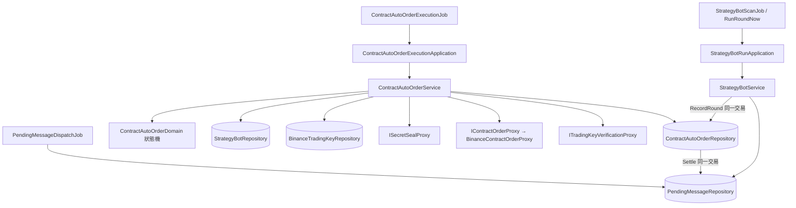

# 合約機器人自動下單 — Architecture Design

**Status:** Confirmed（autonomous run — decisions recorded below）
**Source PRD:** `.sdd/2026-10-04-contract-auto-order-execution/PRD.md`
**Tech context:** Go · Gin · GORM · PostgreSQL · Clean/Onion（`internal/{controller,application,domain,infrastructure}`）

---

## 1. Design Goal & Guiding Principle

- **In one sentence:**
  合約機器人說出新結論的那一輪，在**記下那一輪的同一個交易裡**排入一筆**自動下單委託**（`ContractAutoOrder`）；
  每一台 replica 上的背景工作領走委託、以擁有者的幣安交易金鑰**分步驟、可重入**地做完「平倉 → 開倉 → 掛止損止盈」，
  每一步的結果與機器人持倉在**同一個交易**裡寫回，最後送一則下單結果通知。

- **Guiding principle — 比照「待送訊息」（outbox）那一套，再加三個「結構上就辦不到」：**

  1. **排入與輪次同生共死。** 委託在 `StrategyBotService.RecordRound` 的交易裡寫入，條件以**鎖住的那一列機器人**判斷
     （合約、執行中、自動下單開著、這一輪有訊息）——不是以那一輪開始時讀到的 DTO 判斷，所以「已停止的機器人手動跑一輪」結構上排不進去。
  2. **重送不會變成重複下單，是因為每一步都先查再送。** 每一張送到幣安的單帶著由委託編號導出的**固定**客戶端編號
     （`gt-ao-<id>-close` / `-open` / `-sl` / `-tp`）。任一步驟開始前先以這個編號向幣安查詢；查到就沿用結果，查不到才送。
     所以 replica 中途死掉、等太久沒回應、claim 過期被別台接手，都只會「查到已成交」而不是「再成交一次」。
  3. **一步一寫回。** `ContractAutoOrderDomain` 是一個狀態機（平倉做完、開倉做完、保護做完、結束），
     每一步成功後由 `IContractAutoOrderRepository.RecordStep` 在一個交易內同時寫委託進度與機器人持倉，
     並以 claim 守住（只有持有者寫得進去）。下一次執行從進度接著做，不必重新推論做到哪。

- **介面以能力命名：** 合約下單是一個能力（`IContractOrderProxy`），幣安是它目前唯一的供應商（`BinanceContractOrderProxy`）。
  幣安那一側的拒絕以 `vo.ContractOrderAttemptVo` 的種類回來（nil error），與既有 `ITradingKeyVerificationProxy` 同一個慣例。

---

## 2. Change Scope

| Area | Action | What / Why |
| :--- | :--- | :--- |
| `entities.ContractAutoOrder` | **Add** | 一筆委託：機器人、擁有者、那一輪（`RoundDueAt`、`RunNumber`，與機器人組成唯一索引）、標的、目標方向、開倉數量（或不開倉原因）、機器人槓桿、停損停利距離、時限、狀態與 claim、各步驟進度（平倉成交量與均價、開倉成交量與均價、止損止盈價、是否掛上）、結果種類與原因、建立／結束時刻。`OnDelete:CASCADE` 跟著機器人 |
| `entities.StrategyBot` | **Modify** | 加**機器人持倉**四欄：`AutoOrderPositionDirection`、`AutoOrderPositionQuantity`、`AutoOrderStopLossClientID`、`AutoOrderTakeProfitClientID`；加 `ContractAutoOrders` 關聯（只為 cascade）。`ToDto()` 帶出持倉。`Save` / `UpdateRunState` 的欄位清單**不含**這四欄 |
| `dto.StrategyBotDto` | **Modify** | 加 `AutoOrderPosition *AutoOrderPositionDto`（合約機器人才有；空手時方向為空字串、數量 0） |
| `dto.StrategyBotRunRecordDto` | **Modify** | 加 `AutoOrder *ContractAutoOrderResultDto`（那一輪有委託才有） |
| `dto.StrategyBotRoundOutcomeDto` / `dto.StrategyBotRoundDto` | **Modify** | outcome 帶 `AutoOrderIntent`（目標方向、開倉數量或不開倉原因、槓桿、停損停利距離），由 `playRound` 從這一輪的建議部位算出 |
| `domains.ContractAutoOrderDomain` | **Add** | 委託的狀態機與所有規則（見 §3） |
| `domains.ContractAutoOrderIntentDomain` | **Add** | 從這一輪的結論、合約交易模式與建議部位，決定排入什麼意圖（目標方向、開多少、為什麼不開） |
| `domains.ContractAutoOrderMessageDomain` | **Add** | 下單結果通知的文字 |
| `domains.contract_auto_order_errors.go` | **Add** | 委託相關哨兵錯誤 |
| `domains.PendingMessageDomain` | **Modify** | 加 `NewAutoOrderPendingMessageDomain`（新種類 `autoOrder`，不佔輪次的唯一索引、1 小時時限、放棄時不忘記信號） |
| `vo.ContractOrder*Vo` | **Add** | 下單請求、下單嘗試結果、倉位、保護單請求、委託狀態、結果種類、失敗種類 |
| `IContractOrderProxy` | **Add** | 合約下單能力：讀持倉模式、讀倉位、設逐倉與槓桿、市價下單、查單、掛保護單、查保護單、撤保護單 |
| `IContractAutoOrderRepository` | **Add** | `Enqueue`、`FindDispatchCandidates`、`Claim`、`RecordStep`、`Reschedule`、`Settle`、`FindByBotRunNumbers` |
| `IStrategyBotRepository` | **Modify** | 加 `DisableAutoOrderByOwner(ctx, ownerID, marketDataKinds)`——金鑰在幣安失效時關掉對不上的開關 |
| `persistence.ContractAutoOrderRepository` | **Add** | GORM 實作；`RecordStep` / `Settle` 在一個交易內寫委託與機器人持倉（`Settle` 另排入結果通知、必要時關掉開關），全部以 claim 守住 |
| `persistence.StrategyBotRepository` | **Modify** | `DisableAutoOrderByOwner` |
| `persistence.SchemaMigrator` | **Modify** | 註冊 `&entities.ContractAutoOrder{}` |
| `exchange.BinanceContractOrderProxy` + `binance_contract_order_wire.go` | **Add** | 幣安 USDT 永續合約簽名請求；錯誤碼分類 |
| `service.StrategyBotService` | **Modify** | `RecordRound` 在同一交易排入委託；`ListRunRecords` 帶出每一輪的委託結果 |
| `service.ContractAutoOrderService` | **Add** | 一個公開用例 `ExecuteDueAutoOrders`：領委託、開金鑰、照狀態機呼叫 proxy、寫回 |
| `application.StrategyBotRunApplication` | **Modify** | `composeRoundMessage` 之後由 `ContractAutoOrderIntentDomain`（經 service）算出意圖放進 outcome |
| `application.ContractAutoOrderExecutionApplication` | **Add** | 背景工作的入口 |
| `job.ContractAutoOrderExecutionJob` | **Add** | 每個 replica 每 `AutoOrder.DispatchInterval` 跑一次（`repeatingRound`） |
| `config.AutoOrderConfig` | **Add** | `ContractApiBaseUrl`（預設 `https://fapi.binance.com`）、`RequestTimeout`（10s）、`DispatchInterval`（5s）、`ExecutionTimeout`（claim 90s）、`MaxConcurrentExecutions`（8） |
| `cmd/server/dependencies.go` | **Modify** | 組裝新 service / application / job |
| `postman/` | **Modify** | 機器人與執行紀錄的回應範例多出持倉與下單結果 |
| 現貨機器人、`BinanceTradingKeyService`、`TelegramDeliveryService` | **Not touched** | 現貨不在範圍；金鑰存取不變（解鎖在新 service 內）；通知走既有待送訊息 |
| 外掛（`go-trading-mcp`）、助手查詢 | **Not touched** | 使用者指定另案；外掛讀機器人／執行紀錄時自然多出新欄位 |
| 交易日誌 | **Not touched** | 自動記日誌是下一個切片 |

---

## 3. New Classes / Modules

| Name | Kind | Responsibility (purpose) | Collaborators | Satisfies (PRD scenario) |
| :--- | :--- | :--- | :--- | :--- |
| `entities.ContractAutoOrder` | Entity | 一筆委託的資料（含進度、claim、結果）；`ToResultDto()` | — | 例 26–30、36–37 |
| `domains.ContractAutoOrderIntentDomain` | Domain Model | 從一輪的結論決定排入什麼：目標方向（交給 `StrategyBotMarketDomain.TargetFor`）、開倉數量＝建議數量（沒有建議部位 → 「沒有部位規劃，不下單」；交易所不收 → 那個原因；沒有交易規格 → 「還沒有交易規格」） | `StrategyBotMarketDomain` | 例 7–9 |
| `domains.ContractAutoOrderDomain` | Domain Model | **狀態機**。`NextStep(botPosition)` 回答下一步是：檢查帳戶 → 平倉 → 開倉 → 保護 → 結束；`IsExpiredAt`（時限 2 分鐘只擋**尚未送出的市價單**）；`AfterClose / AfterOpen / AfterProtection(attempt)` 回答寫回什麼（新進度、新機器人持倉）；`SettlementFor(failure)` 回答結果種類、原因文字、要不要關開關（全部或只合約）；止損止盈價＝成交均價 ×（1 ∓ 距離），照價格跳動單位取整；平倉量＝min(機器人持倉, 幣安同方向倉位) | `vo.*` | 例 11–25、30、31–32 |
| `domains.ContractAutoOrderMessageDomain` | Domain Model | 通知文字：動作、成交量與均價、止損止盈、⚠️ 止損沒掛上、❌ 沒有下單：原因 | — | 例 1、15、20、22 |
| `IContractOrderProxy` / `BinanceContractOrderProxy` | Interface / Proxy | 幣安合約交易的每一個呼叫；錯誤碼 → `vo.ContractOrderFailureVo`（金鑰不被接受、餘額不足、交易所不收、帳戶設定不符、找不到、不確定、連不上）；不確定（逾時、5xx、-1007）一律回「不確定」，交給狀態機先查再送 | `http.Client`、`IClockProxy` | 例 10、24–25、27–28 |
| `IContractAutoOrderRepository` / `ContractAutoOrderRepository` | Interface / Repository | 委託的排隊與 claim（每台機器人只取最舊未結束的一筆 → 依序執行）、步驟寫回、結束（排入通知、必要時關開關） | `ambientTransactionDatabase` | 例 26、31–35 |
| `service.ContractAutoOrderService` | Domain Service | `ExecuteDueAutoOrders`：併發執行（有上限）；每筆：claim → 讀機器人/金鑰/規格 → 解鎖金鑰 → 依 `NextStep` 呼叫 proxy → 寫回；送單前再確認「機器人執行中、自動下單開、金鑰可交易合約、未逾時」；`-2015` 這類分不清的拒絕以既有 `ITradingKeyVerificationProxy` 再問一次，分出「金鑰不被接受」與「沒有合約權限」 | 上述 repository、`IStrategyBotRepository`、`IBinanceTradingKeyRepository`、`IContractTradingSymbolRepository`、`ISecretSealProxy`、`ITradingKeyVerificationProxy`、`IClockProxy` | 全部執行面例子 |
| `application.ContractAutoOrderExecutionApplication` | Application | 轉呼 service | service | — |
| `job.ContractAutoOrderExecutionJob` | Background job | 每 replica 定期執行 | application | 例 29 |

### 狀態機細節（`ContractAutoOrderDomain`）

```
委託（ready）
 └─ 第一次執行，什麼都還沒送：
      逾時 → 放棄「訊號已經過時」
      機器人不在／已停止／自動下單已關／金鑰不在或不可交易合約 → 放棄（各自原因）
      機器人持倉方向 == 目標 → 結束「已經持有X倉，不加倉」
      機器人持倉空手 且 目標空手 → 結束「沒有自動開出的倉位，不需要平倉」
      帳戶是雙向持倉 → 結束「請先改成單向持倉」
 ├─ 平倉（持倉方向 ≠ 目標，且平倉未做完）
      查 close 單 → 有：沿用
      沒有：撤這台的止損止盈（找不到不算失敗）→ 讀幣安同方向倉位
            → 0：記「幣安上已沒有這筆倉位」，持倉歸零（不送單）
            → 送前再檢查（逾時／開關）→ 只減倉市價單
      成交 → RecordStep（平倉進度 + 持倉歸零）
 ├─ 開倉（目標 ≠ 空手，且開倉未做完）
      沒有開倉數量 → 結束（若已平倉：「已平倉，但X沒開成：原因」）
      查 open 單 → 有：沿用
      沒有：送前再檢查 → 設逐倉（「不需改」算成功）→ 設槓桿（非整數槓桿：交易所不收）→ 市價開倉
      成交 → RecordStep（開倉進度 + 持倉＝目標方向、成交量；止損止盈價從成交均價算出）
 ├─ 保護（開倉已做完，且有設停損或停利距離，且保護未做完）
      各自查 sl / tp → 沒有就掛（以標記價格觸發、只減倉）
      掛上 → 記下客戶端編號到機器人持倉
      被拒 → 結束並標「⚠️ 止損沒掛上」
      不確定／連不上 → 重試，直到開倉成交後 5 分鐘，之後結束並標警告
 └─ 結束（Settle）：結果種類、原因、排入通知、必要時關開關
不確定／連不上（市價單）：Reschedule 5 秒後；下一次「先查再送」
```

---

## 4. Modified Components

| Component | Current role | Change needed |
| :--- | :--- | :--- |
| `StrategyBotService.RecordRound` | 一個交易寫機器人狀態、執行紀錄、輪次訊息 | 同一交易內：`storedBot` 是合約、執行中、自動下單開、outcome 有訊息且帶意圖 → `contractAutoOrderRepository.Enqueue(...)`（帶 `RunNumber`） |
| `StrategyBotService.ListRunRecords` | 讀執行紀錄 | 另讀這些輪次的委託，接到每一輪的 `AutoOrder` |
| `StrategyBotRunApplication.playRound` / `composeRoundMessage` | 算訊息與建議部位 | 合約機器人說出新結論時，經 `StrategyBotService.PlanAutoOrderIntent(round)` 算出意圖放進 outcome（只是資料；要不要排入由 `RecordRound` 依鎖住的列決定） |
| `StrategyBot.ToDto` | 讀機器人 | 合約機器人帶出 `AutoOrderPosition` |
| `PendingMessageDomain` | 輪次與生命週期訊息 | 新種類 `autoOrder` |
| `StrategyBotRepository` | 機器人存取 | `DisableAutoOrderByOwner`；`Save`、`UpdateRunState` 不碰持倉欄位（欄位清單已經是白名單，不需改） |

---

## 5. Component Relationships



---

## 6. Extensibility & Handoff Notes

- **Most likely next requirement:** 現貨機器人自動下單；自動成交的單記進交易日誌。
- **Where it lands:**
  - 現貨：另一個 `SpotAutoOrder` 實體／domain／proxy（`ISpotOrderProxy`）——現貨沒有槓桿、逐倉、保護單、只減倉，狀態機只有買與賣兩步；
    共用的是 `RecordRound` 排入點（依機器人行情種類選委託種類）、待送訊息、`DisableAutoOrderByOwner`。
    刻意**不**把合約狀態機抽象成「通用委託」：兩者的步驟與失敗種類不同，硬合會讓每一步都多一個 if。
  - 交易日誌：`ContractAutoOrderRepository.Settle` 的同一交易裡加一步「建立交易紀錄」——成交資料已經都在委託上。
- **How to add it:** 新增實體與 domain，`RecordRound` 的排入條件按行情種類分流；不改合約狀態機。
- **Patterns applied & why:** Outbox（與待送訊息同一套 claim / reschedule / settle）；冪等鍵（固定客戶端編號）；狀態機（可重入）。
- **Do not hardcode:** 幣安網址、等待上限、執行間隔、claim 長度、併發上限一律走設定；時限 2 分鐘與保護重試 5 分鐘是業務規則，放在 domain 常數。
- **Known debt / deferred:**
  - 手續費：市價單回應不含手續費，這一刀不另查成交明細，通知不寫手續費。
  - 機器人持倉不跟著幣安即時更新（保護單成交到下一次平倉之間不一致）。
  - 機器人在執行中途被刪除：委託跟著刪掉，若剛好開倉成交、保護單還沒掛，就不會掛——極端情況，通知也不會送。

---

## 7. Traceability

| PRD Scenario | Fulfilled by |
| :--- | :--- |
| 例 1 結論改變時開倉 | `RecordRound` 排入 + `ContractAutoOrderService` + 狀態機開倉 + 通知 |
| 例 2 結論沒變不下單 | 既有 `DecideRound`（沒有訊息就沒有意圖） |
| 例 3 自動下單關著 | `RecordRound` 以鎖住列的 `AutoOrderEnabled` 判斷 |
| 例 4 已停止的手動跑一輪 | `RecordRound` 以鎖住列的 `RunState` 判斷 |
| 例 5 執行中的手動跑一輪 | 同一條 `RecordRound` |
| 例 6 現貨不下單 | `RecordRound` 只對合約機器人排入 |
| 例 7 照建議數量與槓桿 | `ContractAutoOrderIntentDomain` + proxy 設逐倉／槓桿 |
| 例 8 沒有部位規劃 | `ContractAutoOrderIntentDomain` 不開倉原因 → 狀態機結束 |
| 例 9 交易所不收 | 同上（建議部位的 venue refusal） |
| 例 10 餘額不足 | proxy 分類 → `SettlementFor`（不關開關） |
| 例 11–12 只平機器人持倉、以幣安為上限 | 狀態機平倉量 |
| 例 13 沒有持倉不需平倉 | 狀態機首步 |
| 例 14 不加倉 | 狀態機首步 |
| 例 15 開多掛止損止盈 | 狀態機保護步驟 + 價格計算 |
| 例 16、18 平倉先撤單 | 狀態機平倉步驟 |
| 例 17 開空 | 狀態機開倉（目標空） |
| 例 19 反手 | 平倉 → 開倉兩步 |
| 例 20 反手開倉失敗 | `SettlementFor` 帶已平倉進度的措辭 |
| 例 21 止損已在幣安成交 | 幣安倉位 0 → 不送、撤剩下的單、持倉歸零 |
| 例 22 止損掛不上 | 保護步驟被拒 → 警告 |
| 例 23 不掛保護單 | 沒有距離就跳過保護 |
| 例 24 改不成逐倉 | proxy 分類「帳戶設定不符」 |
| 例 25 雙向持倉 | 首步讀持倉模式 |
| 例 26 多 replica 只送一次 | `Claim` 條件更新 + 每台機器人只取最舊一筆 |
| 例 27–28 先查再送 | 固定客戶端編號 + 狀態機每步先查 |
| 例 29–30 時限 | `IsExpiredAt` + `Reschedule` |
| 例 31–32 金鑰問題關開關 | `-2015` 再驗證分類 + `Settle` 內 `DisableAutoOrderByOwner` |
| 例 33–35 緊急煞車 | 送單前再檢查；`Settle` 不碰幣安；刪除 cascade |
| 例 36–37 執行紀錄 | `ListRunRecords` + `ContractAutoOrderResultDto` |
| 例 38 機器人持倉 | `StrategyBot.ToDto` |
| 例 39 外掛不能下單 | 不新增任何外掛可呼叫的寫入路由 |

---

## 8. Risks & Open Decisions

- **Risks / trade-offs:**
  - **幣安條件單端點**：幣安 USDT 永續合約自 2025-12 起把 `STOP_MARKET` / `TAKE_PROFIT_MARKET` 等條件單移到「演算法委託」端點（`/fapi/v1/algoOrder`，以 `clientAlgoId` 識別）。
    實作走這個端點；若幣安回應與預期不符，保護步驟會走「被拒 → ⚠️ 止損沒掛上」的路，**倉位仍在、使用者會被大聲告知**——失敗是安全的方向。上線前要以小額實測確認。
  - 市價單的成交價可能與參考價有差，止損止盈以實際成交均價起算。
  - claim 90 秒內一筆委託最多做約 8 個請求（每個 10 秒上限）；超過就由下一台接手，靠先查再送保證不重複。
- **Open decisions (for implementation):**
  - 非整數的機器人槓桿：幣安只收整數槓桿 → 以「交易所不收這一筆：幣安只接受整數槓桿」結束，不自行取整（取整會改變風險）。
  - 開倉數量只取建議部位的建議數量（已照數量步進取整）；沒有交易規格時建議部位沒有數量 → 不開倉。
