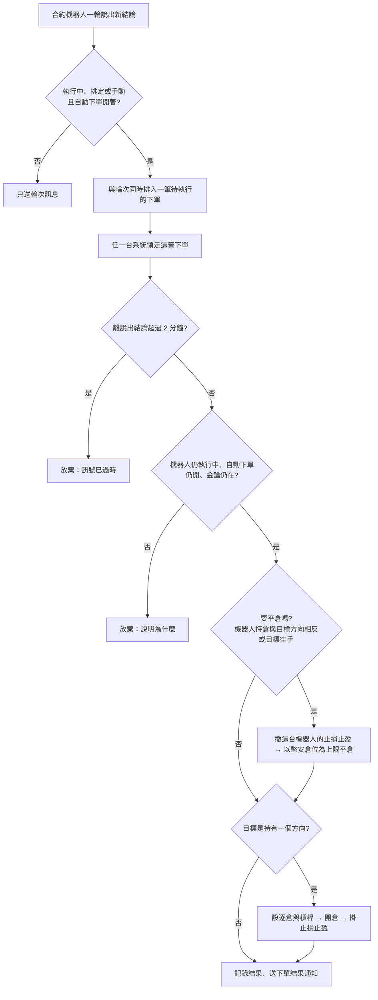

# Product Requirements Document (PRD)

**Feature:** 合約機器人自動下單
**Status:** Draft
**Version:** v1.0
**Owner:** James Hsueh
**Stakeholders:** Engineering

---

## 1. Background & Goal (Why & Goal)

- **Problem Statement:**
  合約機器人判出結論後只送 Telegram，使用者看到訊息再自己去幣安下單，中間通常隔了幾分鐘。
  短線策略的利潤往往就在那幾分鐘裡：2026-10-04 一筆 BTC 合約，重演裡用下一根開盤價進場小賺 0.04，
  實單晚三分鐘進場、貴了 64 點，變成小虧 0.02。上一個切片已經備好幣安交易金鑰與自動下單開關，但開關不生效。

- **Expected Outcome:** 可驗證的結果有八項：
  1. 自動下單開著、執行中的**合約機器人**，在說出新結論的那一輪，**用擁有者的幣安帳戶開倉或平倉**；現貨機器人照舊不下單。
  2. 開倉大小**照部位規劃的建議數量與機器人槓桿倍數**，保證金一律逐倉；沒有部位規劃或交易所不收時不開倉並說出原因。
  3. 平倉**只平機器人自己開出的那一份**（機器人持倉），以幣安當下的倉位為上限。
  4. 開倉後**立刻在幣安掛上止損與止盈**；掛不上時倉位保留並大聲警告。
  5. **同一張單絕不下兩次**——好幾台系統同時跑、或送出後不確定時都一樣。
  6. 說出結論後 **2 分鐘**內送不出去的單**放棄**，不用過時的訊號下單。
  7. 失敗**分得出種類**；金鑰不被接受或沒有合約權限時，**對不上的自動下單開關自動關掉**。
  8. **執行紀錄看得到下單結果，機器人看得到機器人持倉**，下單結果另送一則通知。

- **Out of Scope:**
  - 現貨機器人自動下單——下一個切片。
  - 自動成交的單自動記進交易日誌——下一個切片。
  - 移動止損、部分平倉、加倉、限價單、以掛單降低手續費。
  - 幣安以外的交易所、幣安測試環境、以幣計價的合約。
  - 跟著幣安即時通知更新機器人持倉。
  - 外掛（`go-trading-mcp`）說明文字的更新——另案。

---

## 2. User Personas

- **Primary Role(s):**
  - **使用者**——他那幾台合約機器人的**機器人擁有者**。他自己在幣安存了錢、自己決定哪一台打開自動下單。
  - **外掛**——代他操作交易服務的 AI 助理。只讀得到下單結果與機器人持倉，不能下單。
- **Usage Context:**
  使用者通常不在電腦前；機器人在背景每隔觸發間隔跑一輪。他在手機上收 Telegram，事後在瀏覽器裡看執行紀錄與機器人持倉，
  必要時把自動下單關掉（緊急煞車）。

---

## 3. User Stories & Acceptance Criteria

### US-01 — 合約機器人說出新結論時替我下單 [priority: P0]

**As a** 機器人擁有者，**I want** 執行中、開著自動下單的合約機器人在說出新結論的那一輪就替我在幣安下單，
**so that** 我不必自己看訊息、晚幾分鐘才進場。

```gherkin
Scenario: 結論改變時開倉（例 1）
  Given 一台只做多的合約機器人執行中、自動下單開著、擁有者的幣安交易金鑰可交易合約
  And 機器人沒有機器人持倉，上一次說出的結論是賣出
  When 這一輪的結論變成買入
  Then 擁有者收到這一輪的輪次訊息
  And 系統在幣安替他開一筆多倉
  And 擁有者另外收到一則下單結果，寫著「已做多」與成交數量、均價

Scenario: 結論沒變不下單（例 2）
  Given 同一台機器人上一次說出的結論已是買入
  When 這一輪的結論仍是買入
  Then 不送輪次訊息
  And 不對幣安下任何單

Scenario: 自動下單關著只送訊息（例 3）
  Given 一台合約機器人執行中、自動下單關著
  When 這一輪的結論由賣出變買入
  Then 擁有者收到輪次訊息
  And 不對幣安下任何單

Scenario: 已停止的機器人手動跑一輪不下單（例 4）
  Given 一台合約機器人已停止、自動下單開著
  When 擁有者手動按「立刻跑一輪」，結論為買入
  Then 擁有者收到輪次訊息
  And 不對幣安下任何單

Scenario: 執行中的機器人手動跑一輪照常下單（例 5）
  Given 一台合約機器人執行中、自動下單開著、沒有機器人持倉，上一次結論是賣出
  When 擁有者手動按「立刻跑一輪」，結論變成買入
  Then 系統在幣安替他開一筆多倉，與排定的輪次相同

Scenario: 現貨機器人一律不下單（例 6）
  Given 一台現貨機器人執行中、自動下單開著
  When 這一輪的結論由出場變買入
  Then 擁有者收到輪次訊息
  And 不對幣安下任何單
```

### US-02 — 開倉大小照部位規劃 [priority: P0]

**As a** 機器人擁有者，**I want** 開倉的數量與槓桿照我替這台機器人設的部位規劃，
**so that** 機器人押的錢與我在訊息裡看到的建議一致。

```gherkin
Scenario: 照建議數量與機器人槓桿開倉（例 7）
  Given 建議部位的建議數量為 0.002，機器人槓桿倍數為 3
  When 結論為做多
  Then 系統先把這個合約標的設成逐倉、槓桿 3 倍
  And 開多 0.002

Scenario: 沒有部位規劃不開倉（例 8）
  Given 這台機器人沒有部位規劃
  When 結論為做多
  Then 不對幣安下任何單
  And 下單結果寫著「沒有部位規劃，不下單」

Scenario: 交易所不收這一筆不開倉（例 9）
  Given 建議部位說交易所不收這一筆，原因是數量低於最小下單量
  When 結論為做多
  Then 不對幣安下任何單
  And 下單結果寫著「交易所不收這一筆」與那個原因

Scenario: 幣安說餘額不足（例 10）
  Given 擁有者的幣安合約帳戶可用保證金不足
  When 結論為做多
  Then 下單結果寫著「餘額不足」
  And 這台機器人的自動下單仍然開著
```

### US-03 — 只平機器人自己開出的部分 [priority: P0]

**As a** 機器人擁有者，**I want** 機器人平倉時只平它自己開的那一份，
**so that** 我自己在同一個標的上開的倉不會被它平掉。

```gherkin
Scenario: 只平機器人持倉（例 11）
  Given 只做多；機器人持倉為多 0.002
  And 擁有者自己在同一標的另有多倉 0.01（幣安上共 0.012）
  When 結論為賣出
  Then 系統平多 0.002
  And 幣安上剩下多 0.01
  And 機器人持倉變為空手

Scenario: 以幣安當下的倉位為上限（例 12）
  Given 機器人持倉為多 0.01，幣安上該標的多倉只剩 0.006
  When 結論為賣出
  Then 系統平多 0.006
  And 機器人持倉變為空手

Scenario: 沒有機器人持倉不需要平倉（例 13）
  Given 機器人持倉為空手
  When 結論為平多
  Then 不對幣安下任何單
  And 下單結果寫著「沒有自動開出的倉位，不需要平倉」，不算失敗

Scenario: 已有同方向持倉不加倉（例 14）
  Given 機器人持倉為多 0.002
  When 結論再次變成做多
  Then 不對幣安下任何單
  And 下單結果寫著「已經持有多倉，不加倉」
```

### US-04 — 合約動作照交易模式，開倉同時掛止損止盈 [priority: P0]

**As a** 機器人擁有者，**I want** 機器人照交易策略的合約交易模式開倉、平倉、反手，並在開倉時掛好止損止盈，
**so that** 機器人沒在看的時候我的倉位也有保護。

```gherkin
Scenario: 開多並掛止損止盈（例 15）
  Given 只做多；空手；部位規劃的停損距離 1.5%、停利距離 3%
  When 結論為買入，成交均價 85000
  Then 開多成交
  And 幣安上掛著止損單，觸發價 83725（成交均價往下 1.5%，照價格跳動單位取整）
  And 幣安上掛著止盈單，觸發價 87550（成交均價往上 3%）
  And 下單結果寫出這兩個價位

Scenario: 平多時先撤止損止盈（例 16）
  Given 只做多；機器人持倉為多 0.002，掛著止損與止盈
  When 結論為賣出
  Then 這台機器人掛著的止損與止盈被撤掉
  And 平多 0.002
  And 機器人持倉變為空手

Scenario: 只做空時賣出開空（例 17）
  Given 只做空；空手
  When 結論為賣出
  Then 開空成交

Scenario: 只做空時買入平空（例 18）
  Given 只做空；機器人持倉為空 0.002
  When 結論為買入
  Then 撤掉止損止盈，平空 0.002

Scenario: 多空反手（例 19）
  Given 多空反手；機器人持倉為多 0.002
  When 結論為賣出
  Then 撤掉止損止盈、平多 0.002
  And 再開空建議數量
  And 機器人持倉變為空的那一筆

Scenario: 反手時平倉成功、開倉失敗（例 20）
  Given 多空反手；機器人持倉為多
  When 結論為賣出，平多成交，開空被幣安以餘額不足拒絕
  Then 下單結果寫著「已平倉，但做空沒開成：餘額不足」
  And 機器人持倉為空手

Scenario: 止損已在幣安成交（例 21）
  Given 只做多；機器人持倉為多 0.002，但幣安上該標的已沒有多倉
  When 結論為賣出
  Then 不送平倉單
  And 剩下的止盈單被撤掉
  And 下單結果寫著「幣安上已沒有這筆倉位（可能已觸發止損或止盈）」
  And 機器人持倉變為空手

Scenario: 止損掛不上（例 22）
  Given 開多已成交
  When 止損單被幣安拒絕
  Then 倉位保留，機器人持倉記為多
  And 下單結果開頭寫著「⚠️ 止損沒有掛上，請立刻到幣安自己處理」

Scenario: 沒設停損停利距離就不掛（例 23）
  Given 部位規劃沒有停損距離也沒有停利距離
  When 結論為做多
  Then 開多成交
  And 幣安上沒有這台機器人的止損止盈單

Scenario: 改不成逐倉不開倉（例 24）
  Given 這個合約標的上已有一個全倉的倉位，幣安不讓改成逐倉
  When 結論為做多
  Then 不開倉
  And 下單結果寫著改不成逐倉的原因
  And 自動下單仍然開著

Scenario: 雙向持倉模式不下單（例 25）
  Given 擁有者的幣安合約帳戶是雙向持倉模式
  When 結論為做多
  Then 不對幣安下任何單
  And 下單結果寫著「請先在幣安把持倉模式改成單向持倉」
```

### US-05 — 同一張單絕不下兩次，過時的訊號不下 [priority: P0]

**As a** 機器人擁有者，**I want** 一張單只下一次，而且太晚的訊號不要下，
**so that** 我不會多開一倍的倉，也不會用過時的價格進場。

```gherkin
Scenario: 好幾台系統同時跑只送一次（例 26）
  Given 一張待送的單
  When 三台系統同時在跑
  Then 幣安上只出現一張帶著這張單編號的單

Scenario: 不確定時先查，已成交就不再送（例 27）
  Given 一張單送出後等太久沒有回應，而幣安實際上已成交
  When 系統重試
  Then 系統先以這張單的編號向幣安查詢
  And 查到已成交，不再送
  And 照查到的成交數量與均價記錄

Scenario: 不確定時先查，沒收到才再送（例 28）
  Given 一張單送出後等太久沒有回應，而幣安實際上沒有收到
  When 系統重試
  Then 系統先查，查不到這張單
  And 再送一次，編號不變

Scenario: 短暫連不上照常下單（例 29）
  Given 說出結論時連不上幣安
  When 1 分鐘後恢復
  Then 照常下單

Scenario: 超過 2 分鐘放棄（例 30）
  Given 說出結論時連不上幣安
  When 從說出結論起超過 2 分鐘仍送不出去
  Then 這張單放棄
  And 下單結果寫著「訊號已經過時，沒有下單」
  And 之後的輪次不補下這張單
```

### US-06 — 金鑰問題自動關掉對不上的開關 [priority: P0]

**As a** 機器人擁有者，**I want** 金鑰在幣安失效時對不上的自動下單自己關掉並告訴我，
**so that** 我不會以為機器人在替我下單，其實每一張都失敗。

```gherkin
Scenario: 金鑰不被接受（例 31）
  Given 擁有者在幣安刪了金鑰；他有兩台機器人開著自動下單
  When 其中一台下單被幣安說金鑰不被接受
  Then 兩台的自動下單都變成關閉
  And 下單結果寫著「幣安不接受你的交易金鑰，已關掉你所有機器人的自動下單，請重存金鑰」

Scenario: 金鑰沒有合約權限（例 32）
  Given 金鑰在幣安被拿掉合約交易權限；一台合約機器人、一台現貨機器人都開著自動下單
  When 合約那台下單被幣安說沒有權限
  Then 合約機器人的自動下單變成關閉
  And 現貨機器人的自動下單仍然開著
```

### US-07 — 緊急煞車 [priority: P0]

**As a** 機器人擁有者，**I want** 關掉自動下單、停止或刪除機器人時，還沒送出去的單一律不送，
**so that** 我按下去那一刻起就不會再有新單；但已經在幣安上的倉位留給我自己決定。

```gherkin
Scenario: 關掉後重試中的單不送（例 33）
  Given 一張單正在等待重試
  When 擁有者關掉那台機器人的自動下單
  Then 那張單不再送出
  And 下單結果寫著「自動下單已關閉，沒有下單」

Scenario: 關掉不平倉、不撤單（例 34）
  Given 機器人持倉為多 0.002，幣安上掛著它的止損與止盈
  When 擁有者關掉自動下單
  Then 幣安上的多倉與止損止盈單都還在
  And 機器人持倉仍記著多 0.002

Scenario: 停止或刪除後不送（例 35）
  Given 一張單還沒送出
  When 機器人被停止或刪除
  Then 那張單不送出
```

### US-08 — 看得到發生了什麼，外掛只能讀 [priority: P1]

**As a** 機器人擁有者，**I want** 在執行紀錄與機器人上看到下單結果與機器人持倉，
**so that** 事後對帳、知道機器人現在替我拿著什麼。

```gherkin
Scenario: 執行紀錄上看得到成交（例 36）
  Given 一輪開了多，成交 0.002、均價 85000、止損 83725、止盈 87550
  When 擁有者看那台機器人的執行紀錄
  Then 那一輪看得到「做多 0.002 @ 85000，止損 83725、止盈 87550」

Scenario: 執行紀錄上看得到沒下單的原因（例 37）
  Given 一輪因餘額不足沒下單
  When 擁有者看執行紀錄
  Then 那一輪看得到「餘額不足」

Scenario: 看得到機器人持倉（例 38）
  Given 機器人持倉為多 0.002
  When 擁有者在網頁上、或外掛查看這台機器人
  Then 看得到機器人持倉「多 0.002」

Scenario: 外掛不能下單（例 39）
  Given 外掛代擁有者操作
  When 外掛想下單、平倉或撤單
  Then 外掛沒有這件事可以做
```

---

## 4. Business Flow & Logic

- **Flow Diagram:**



- **Core Business Rules:**
  - **觸發**：只有**合約機器人**、**執行中**、**自動下單開著**、而且這一輪**說出新結論**時，才排入一筆下單。
    「執行中」指那一輪開始時機器人是執行中；已停止的機器人手動跑的那一輪不排入。
  - **排入與輪次同生共死**：下單與那一輪的紀錄、輪次訊息一起記下；那一輪沒記成，就沒有這筆下單。
  - **目標方向**：與訊息開頭的合約動作同一個來源——結論加上交易策略的合約交易模式，得到目標是**持有多**、**持有空**、或**空手**。
  - **要做的事 = 機器人持倉 → 目標方向**：
    | 機器人持倉 | 目標 | 要做的事 |
    |---|---|---|
    | 空手 | 多（或空） | 開多（或開空） |
    | 多（或空） | 同方向 | 不做事，「已經持有，不加倉」 |
    | 多（或空） | 空手 | 平倉 |
    | 多（或空） | 反方向 | 平倉，再開反方向 |
    | 空手 | 空手 | 不做事，「沒有自動開出的倉位，不需要平倉」 |
  - **開倉**：數量＝這一輪建議部位的建議數量；開倉前先把標的設成逐倉、槓桿設成機器人槓桿倍數；以市價成交。
    建議部位沒有（沒有部位規劃、讀不到參考價）或說交易所不收時，不開倉並照實說。
  - **平倉**：數量＝機器人持倉，但不超過幣安上該標的同方向倉位；以市價成交，**只減倉**，不會因數量多算而反向開倉。
    幣安上已沒有同方向倉位時不送單、照實說，機器人持倉歸零。
  - **止損止盈**：開倉成交後，以**成交均價**為起點，照部位規劃的停損距離、停利距離算出觸發價（做多止損在下、止盈在上；做空相反），
    照價格跳動單位取整；**以標記價格觸發**（與合約重演判強制平倉同一種價格，避免最新成交價瞬間插針就觸發）；
    觸發後以市價平掉這一筆，**只減倉**。只設了其中一個距離就只掛那一張。
  - **撤單**：平倉前撤掉**這台機器人自己掛的**止損止盈單（以它開倉時記下的那兩張為準）；撤不掉（例如已成交、已不存在）不算失敗。
  - **機器人持倉**：開倉成交後記下方向與**實際成交數量**；平倉成交後減去實際成交數量，減到零即空手。
  - **同一張單只送一次**：每一筆下單有系統給的編號，送到幣安時一併帶上；任一時刻只有一台系統領著它；
    送出後不確定結果時，下一次先以編號向幣安查詢，查到就照結果記錄、不再送，查不到才再送（編號不變）。
  - **時限**：從那一輪說出結論的時刻起算 **2 分鐘**。送單前檢查；過了即放棄，不在之後補下。系統約每 **10 秒**看一次待執行的下單。
  - **送單前再檢查一次**：機器人仍存在、仍執行中、自動下單仍開著、擁有者仍有可交易合約的金鑰——任一不成立即放棄並說明，不送。
  - **失敗分類與後果**：
    | 失敗 | 後果 |
    |---|---|
    | 金鑰不被接受 | 擁有者每一台自動下單開著的機器人改成關閉 |
    | 沒有合約交易權限 | 擁有者每一台合約機器人的自動下單改成關閉 |
    | 餘額不足 | 這一筆不下 |
    | 交易所不收這一筆 | 這一筆不下 |
    | 帳戶設定不符（雙向持倉、改不成逐倉、改不成槓桿） | 這一筆不下 |
    | 連不上幣安、等太久、幣安要求放慢 | 2 分鐘內重試，過了放棄 |
  - **下單結果通知**：每一筆下單結束（成交、部分成交後失敗、沒下、放棄）都另送一則給擁有者，格式：
    ```
    🤖【自動下單】<機器人名稱>
    <合約標的> 永續合約｜<動作：做多／做空／平多／平空／反手做多／反手做空>
    ✅ 成交 <數量> @ <均價>（手續費 <金額 幣別>）
    🛡 止損 <價位>｜止盈 <價位>
    ```
    沒下成時第二行之後改為 `❌ 沒有下單：<原因>`；止損沒掛上時開頭加 `⚠️ 止損沒有掛上，請立刻到幣安自己處理`。
  - **執行紀錄**：那一輪多帶下單結果：動作、成交數量、均價、手續費、止損價、止盈價、結果種類（成交／沒下單／放棄）與原因。
    下單在那一輪記下之後才執行，所以那一輪的下單結果一開始是「等待下單」，之後補上。

- **Decisions on the brief's open questions:**
  - **2 分鐘的起點**：那一輪說出結論的時刻（即那一輪的執行時刻）。重試約每 10 秒一次（跟著背景工作的掃描間隔）。
  - **通知措辭**：如上「下單結果通知」。
  - **止損止盈觸發價格**：標記價格。
  - **執行紀錄欄位**：如上「執行紀錄」。
  - **UL-MAP**：策略機器人「它只說話」改寫為「合約機器人開著自動下單時會下單」；自動下單「目前不生效」改寫為「合約機器人生效、現貨機器人仍不生效」；
    新增**機器人持倉**、**自動下單委託**、**下單結果**、**下單失敗原因**、**下單時限**。

- **Edge Cases:**
  - **系統在送出後、記下結果前重啟**：下一台領到這筆下單時先查詢，照查到的結果記錄（不重送）。
  - **兩輪結論接連改變**（例如買入後下一輪立刻賣出）：下單一筆一筆依序執行，後一筆等前一筆結束才開始，
    並以前一筆結束後的機器人持倉決定要做的事。
  - **幣安只成交一部分**：市價單通常全部成交；若只成交一部分，機器人持倉照實際成交數量記，下單結果照實寫。
  - **止損止盈已在幣安成交，之後結論變成同方向**：機器人持倉仍記著，系統不知道已平——會說「已經持有，不加倉」。
    下一次平倉時才會發現並歸零（見例 21）。這是不跟著即時通知的已知限制。
  - **擁有者在幣安上手動撤掉機器人的止損單**：平倉時撤不掉不算失敗，照常平倉。
  - **自動下單關掉後重新打開**：機器人持倉仍記著；下一次平倉照常平掉它。

---

## 5. UI/UX Design & Interaction

- **Prototype Link:** N/A（前端另有一份對應的 brief）
- **Key Interactions:**
  - 機器人詳細頁的自動下單開關旁說明：合約機器人「打開後會用你的幣安帳戶真的開倉、平倉，並掛止損止盈」；現貨機器人「現貨機器人目前還不會自動下單」。
  - 合約機器人詳細頁顯示**機器人持倉**：「空手」或「多 0.002」／「空 0.002」。
  - 執行紀錄每一輪顯示下單結果：等待下單、成交（數量、均價、止損止盈）、沒有下單（原因）、放棄（原因）；止損沒掛上要醒目。

---

## 6. Non-Functional Requirements

- **Performance:** 說出結論到送出下單，正常情況在**15 秒內**；任何情況下不超過 2 分鐘，超過即放棄。
- **Security:**
  - 下單只用擁有者自己的幣安交易金鑰；金鑰內容不出現在任何訊息、執行紀錄與日誌。
  - 外掛沒有任何寫入的能力。
- **Reliability:** 好幾台系統同時跑時，一筆下單只由一台執行；不確定結果時先查再送。
- **Compatibility:** 幣安以 USDT 計價的永續合約，帳戶須為單向持倉模式。
- **Analytics / Tracking:** 每一筆下單的結果留在執行紀錄上。

---

## 7. Dependencies & Risks

- **External Dependencies:** 幣安合約交易（下單、查單、撤單、設逐倉、設槓桿、查倉位、查持倉模式），需以擁有者金鑰簽名。
- **Known Risks:**
  - **這是真錢。** 程式錯誤會直接造成虧損。建議擁有者先以很小的部位資金試跑。
  - 幣安的錯誤說法可能改變；認不得的拒絕一律當成「幣安拒絕」照實轉告原文，不猜測是哪一種。
  - 機器人持倉不跟著幣安即時更新，止損止盈在幣安成交後到下一次平倉之間，機器人持倉與實際不一致（已在第 4 節說明處理方式）。
  - 系統時鐘與幣安差太多時幣安拒絕簽名請求——當作連不上幣安處理。

---

## 8. Appendix

- `.sdd/2026-10-04-contract-auto-order-execution/BRIEF.md`
- 金鑰、開關、可交易市場：`.sdd/2026-10-01-binance-auto-order-setup/`
- 建議部位、建議數量、機器人槓桿倍數：`.sdd/2026-09-24-contract-bot-position-precision/`、`.sdd/2026-09-24-contract-strategy-bot/`
- 多台系統同時跑、訊息排隊：`.sdd/2026-10-02-multi-replica-background-work/`
